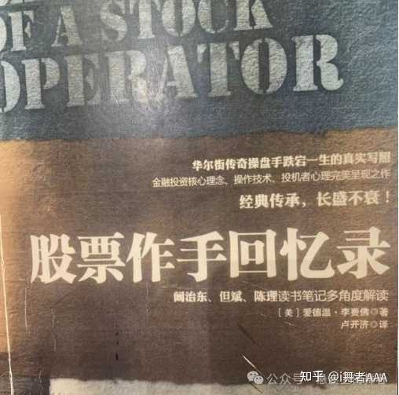
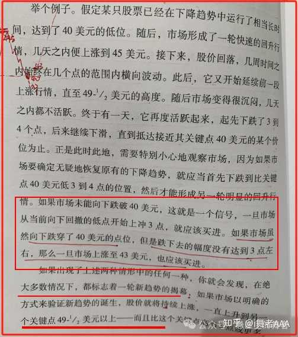
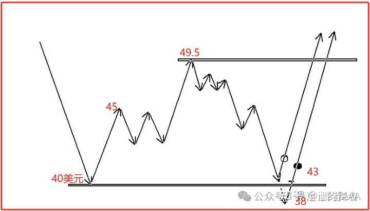
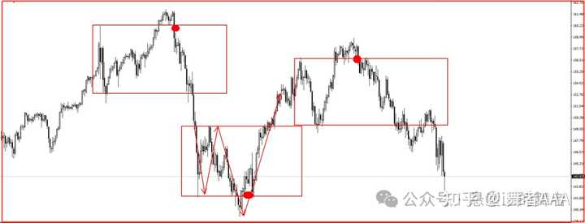
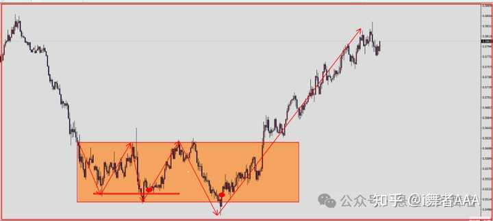
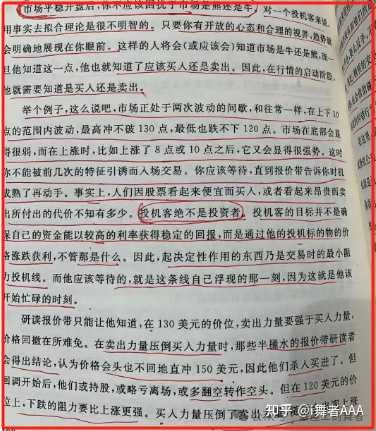
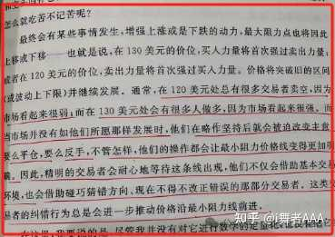
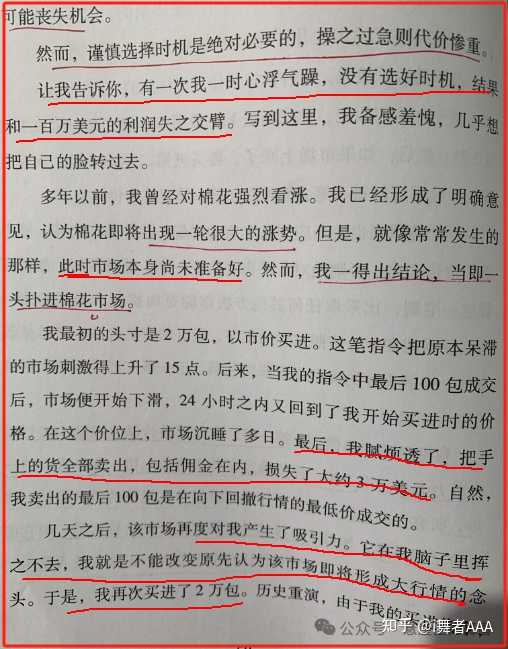
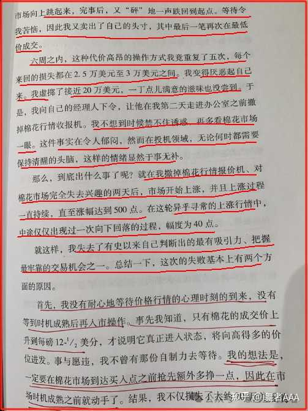

如何评价经典交易书《股票大作手回忆录》？ \- i舞者AAA 的回答

老书。

一转眼，交易外汇十几年了。

如果说，这些年，有哪一本交易类的书籍或者哪一个人对我的交易影响最为直接，最为深刻，我会毫不犹豫的推荐《股票作手回忆录》和杰西\.利弗莫尔。

利弗莫尔，一个十几岁的小男孩，经过多年的摸爬滚打，起起落落，终于成了“华尔街的传奇”。

1892年（清光绪十八年），那年利弗莫尔十五岁，通过交易赚到自己人生中的第一个1000美金，20岁就拥有了1万美金，这在当时几乎是天文数字。

1929年初，在华尔街的股灾中，利弗莫尔赚了一亿美金。

那一天，他成了市场之王。

尽管后来，他因为患上精神疾病，饮弹自尽，让这段神话充满了争议和缺憾。

但是他的交易方法，交易理念还有他对于市场，对于自己，对于人性的理解，在所有的交易类书籍里，都是永恒的经典，至今仍旧熠熠生辉。

很多人都读过这本书，奈何，情深缘浅，大部分人的研究都如走马观花，硬生生的把利弗莫尔读成了一个没有带着王冠死去的遗憾而后快。

至于杰西利弗莫尔给大家留下的那些宝贵的交易经验，交易宝典以及解决交易困惑的灵药，要么被阻断在认知的城墙之外，摔的稀碎，要么被个人的傲慢和偏见裹挟到精美的书架上，默默吃灰。相

时光在流逝，100年过去了，市场也在发生着巨大的变化，但是经典永不褪色。

在过100年，利弗莫尔，仍旧是交易之王。

alt="Image">

这些年，每隔一段时间，我都会翻翻股票作手回忆录。

读利弗莫尔，常读常新。

最开始，我学习他的方法，后来，学习他的理念，在后来学习他的思考方式。

最后，我学习他的整个一生。

他的成败，他的得失，他的勇气，他的弱点，气势恢宏，遥不可及而又近在咫尺，隔着100年的时空，我总能与他神交。

我知道，我这辈子也不会达到他那样的高度，但是不影响我对他的敬佩和崇拜，也不影响他像是一盏明灯，照亮我前行的路。

学习利弗莫尔的交易方法，让我懂得了技术分析，永远都不是画图，划线，那么简单，技术分析的终极目的，是通过图形读懂市场在做什么。

无论是股票作手回忆录，还是股票大作手操盘术，凡是涉及到交易技术方面的内容，都在反复提及，__关键点，耐心观察，股票行为，市场行为，价格行为__等等。

可以简单的理解关键点技术分析，__就是围绕着关键价位附近，去观察市场的行为或者说内幕主力资金的动作。__

而他在文中提及的那些交易案例，都是很好的诠释。

我个人的体会，利弗莫尔的交易方法可以总结为如下两种交易模式。

__诱多\-\-杀多\-\-走多，诱空\-\-逼空\-\-走空。__

alt="Image">

如果你按照这个思路去理解他的交易方法和逻辑，那么你的交易一定会更上一层楼。

就不会像刚开始读利弗莫尔，单纯的纠结于，他说的那些方法，现在早就失效了，他就是追高，现在一追高，就是高位被套等等。

还是那句话，100年了，市场已经变了，但是人没变。

我总结了股票作手回忆录里比较经典的这两个2个交易模式，也是我一直在用的交易模式，效果非常不错。

今天结合原文，展开分析一下，希望对大家的交易有所帮助。

__诱多\-\-杀多\-\-走多，诱空\-\-逼空\-\-走空。__

__我们先看下原文中他举的一个例子：__

alt="Image">

__然后我们按照文字的描述，大概可以画出如下的图形。图中的圆圈处为买入点。__

alt="Image">

__大家注意原文中的文字描述部分：行情持续下跌，突然从40美金大涨到45美金，普通的散户，习惯性追涨，可是未来行情又跌回到前低附近，甚至破掉前低。__

__散户被迫割肉。__

当行情破掉前低之后，突破交易者，会顺势而为，在这里进行做空，但是行情跌不多远，然后又拉回来，最后竟然破了49\.5美元这个高点。

我们都知道，利弗莫尔习惯性做突破，正如他自己说的“我总是习惯于在高位做多，在低位做空”。

但是为什么当行情跌破40美金的时候，没有做空，反而是建议买入呢？

__纵观他所有的交易案例，我们会发现，他并不是每一个突破都做。__

__而是在市场完成诱多\-\-杀多\-\-走多或者是诱空\-\-杀空\-\-走空这个动作之后，才进行突破交易。__

我理解，这就是他在文中反复所说的__股票（市场）行为__，也是现在我们常说的__价格行为__。

无论是在趋势行情中，还是在震荡行情中，这两种模式总是频繁出现，让普通交易者吃尽了苦头。

但是如果你读懂了这两个模式之后，就能反其道而行之，就能充分的利用市场来为自己获利。

__下面我们一起看两个实际交易中的例子。__

alt="Image">

__美日日线图__

上图是美日日线图，我们发现图中的红色方框的部分都是类似的模式，相信关注公众号时间长的朋友，应该都不陌生。

行情上涨，先急跌诱空，再突破高点杀空，然后再走空，或者是行情下跌，先急涨诱多，在跌破低点杀多，然后再走多。

通过这样的模式，把做空和做多的散户都杀死。

当多空都被扫出门的时候，利弗莫尔说的那个关键点，也就出现了，图中的红圈部分。

这个时候入场，进去就赚钱。

外盘500倍的杠杆，一旦抓住这样的一波行情，是非常惊人的。

alt="Image">

这张图是纽元一小时图，这个也是我们本周操作的一个品种。

纽元价格接近历史的低点附近，在小时图里发现了这样的模式，出现了关键点，直接做多，行情走的非常顺畅，目前行情仍旧在持续。

做外汇的兄弟，一点要多研究这个模式。

赚钱效率非常高。

__然后我们在一起看一下股票作手回忆录里面其他的例子。__

alt="Image">

在这个例子中，他讲的是一个区间震荡，也就是行情在120美金到130美金这样的一个区间进行震荡，最高没法突破130美金，最低又无法有效跌破120美金。

当行情，接近130美金的时候，市场看起来很强势，但是实际情况是，这里的卖方力量要强于买方力量。

可是散户不懂，只觉得大阳线上涨，这里应该买入，结果行情来回拉扯，跌回120美金附近。

当行情接近120美金附近的时候，市场又看起来很弱势，好像马上就要有一波暴跌一样，但是实际的情况是，这里的买方力量要强于卖方力量。

散户看不懂，在这里追空，结果行情来回拉扯，直接涨到130美金。

散户还是左右挨打。

散户在这个区间里反复做错，并且反复纠错的过程，会让价格的最小阻力线越来越明显。

直到有一天，行情突破130美金，然后开启一波气势恢宏的上涨行情。

由于之前散户因为害怕错过行情，提早入场，结果遭到了市场的反复蹂躏，失去了耐心。

最后当真的行情来的时候，散户要么不在关注了，要么子弹打光了。

__这个区间整理的模式，也是一种变相的诱多\-杀多\-走多，诱空\-杀空\-走空的模式，只不过是杀人的武器是时间，利用了散户没有耐心，急躁的弱点。__

包括利弗莫尔本人，也曾经多次掉进陷阱里。

所以他讲，__无论何时，只要耐心等待行情到了我所说的关键位置之后才入场，我的交易总能盈利__。

只不过随着市场变得越来越复杂，很多标准的图形，都不会在市场中出现了，导致很多人觉得现在的交易很难做。

那是因为，大部分人学习交易技术，只学了一个皮囊，没有学到灵魂。

alt="Image">

市场在变化，散户也在进步，图形的表现形式也在发生微妙的变化，之前洗盘，一个标准的矩形整理就完成了，但是现在不行了，现在需要一个大喇叭才行。

__但是万变不离其宗，无论图形怎么变，背后的意图是不会变的。__

也就是说，只要我们找到了这样的模式，也就是诱多\-杀多\-走多，诱空\-杀空\-走空的模式之后，那么你依然可以在市场中赚钱。

__换句话讲，无论图形是怎么扭扭捏捏，眉来眼去，最终的落脚点，就是要洗人。完成了这个动作，这就是一个信号，告诉你，兄弟，你该掏枪，准备战斗了。__

接下来，我们再一起看一个利弗莫尔操作失败的案例，加深一下印象。

alt="Image">

alt="Image">

这个案例，是利弗莫尔操作的棉花。

当时的棉花正处于，一个区间震荡中，他看好棉花上涨，提前买入进场，可是当他入场之后，行情就开始撕扯。

他买入，行情走高，当他停止买入，行情就开始下滑，最后被迫平仓，结果成交到回撤的最低价格。

棉花即将大涨的想法和看法挥之不去，过了些日子，他又再次买入，但是依然和之前一样，他自己又腻烦了，又把单子平掉。

这样来来回回折腾了几次，损失了20万美金，然后对棉花彻底失去兴趣，掐断了棉花的报价机。

结果两天后行情开始启动，飙涨了500点，错失了100万美金的利润。

是不是很熟悉的味道？

关于杰西利弗莫尔的这两种交易模式，我总结了几个非常常见的图形，也是我们实战群大部分兄弟一直在用的模式，效果非常不错。

我把众号上对应的技术文章放到文末，有兴趣的朋友，可以对应着今天的内容再去品品。

一定会有收获的。

__写在最后：__

__无论何时，只要耐心等待市场到达我所说的关键点之后才动手，我的交易总能获利。__

杰西利弗莫尔的关键点操作法，反复强调，一定要有耐心。

所以，工具是不是好的工具，能不能发挥出它的效用，还是要看使用工具的人，是不是具备相应的德与行。

交易技术，只是交易的一部分，切莫把技术当做是交易的全部。

一个人的自我修炼，自我成长，是每个交易者一生都逃不掉的课题。
