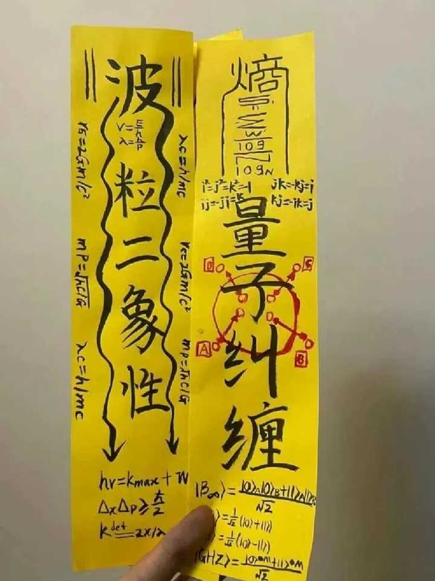

如果要在50\-100年内，锁死一个国家的科技树，有可能从哪些方面着手? \- 汤汤汤师爷 的回答

[源网页](https://www.zhihu.com/question/1963418359552022154/answer/2079617466720851730?share_code=R5e0yGqbk9s1&utm_psn=2080013473275298955)

__问题描述：__

如果以现在的地球科技文明。如果需要锁死一个国家（实力相等或者差一档）的科技树，可能从哪些方面采取措施？

高校内才用高压化的非升即走，100人只给3个编制，让一个国家30\-40岁最聪明能学且具有创造力的顶尖科研人才，承受最大的生活压力，在婚育的最佳年龄不敢婚育，降低这个国家高智商人才产出的比率。

压力继续向外传导，让其他有能力做科研的人才对科研道路望而却步；

内部环境则进一步被学阀把持，为了个人利益在一些错误的方向继续造假灌水浪费资源，甚至党同伐异，扼杀更有价值的科研课题。

alt="Image">

放个符辟邪。

内容效果不满意？[点此反馈](https://feedback.notebooksyncer.com/feedback/739ade1c_1788696026603?u=https%3A%2F%2Fwww.zhihu.com%2Fquestion%2F1963418359552022154%2Fanswer%2F2079617466720851730%3Fshare_code%3DR5e0yGqbk9s1%26utm_psn%3D2080013473275298955&s=onenote)
