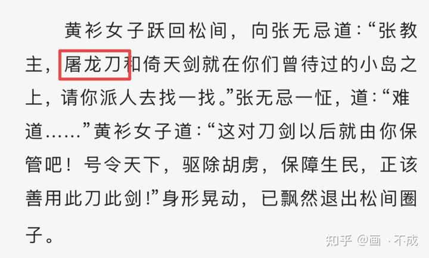

如果说屠龙刀犯了小龙女忌讳，是不是也犯了黄蓉的忌讳？ \- 画丶不成 的回答

在没有手机网络通讯的年代，一般人总是口头交流多比书面交流多，龙和蓉读音非常相似，不知道的听错的不会以为郭大侠要杀妻吗？

我无语啦、这问题下面咋这么多说古代讳名不讳姓的。

别说古代好不、就说神雕这本书。上原文：

alt="Image">

呶！看到没？龙女写杨过的姓“楊”字总会减笔一画、为啥总会减笔？为了避讳“欧阳锋”的“陽”。为啥避讳？因为这是她爹。繁体字杨过的杨字与欧阳锋的阳字右半边是一样的、因为林侍女知道她的身世、从小要求她减笔避讳、惯性使然就在写杨过的杨时也顺手写减笔了。不然她做师父为“尊”做“妻子”为平辈、你们告诉我她为啥“总是”要减笔避讳？

众所周知欧阳锋复姓「欧阳」、所以别提什么古代讳名不讳姓、在金庸的武侠小说宇宙里、就是连姓都讳。

再上个倚天原文：

![突 然 金 花 婆 婆 咳 嗽 一 声 ， 一 把 金 花 掷 出 ，
共 有 十 六 七 朵 ， 教 谢 逊 一 柄 屠 龙 刀 黏 得 了 东 边
的 黏 不 了 西 边 。 谢 逊 袍 袖 挥 动 ， 卷 去 七 八 朵 ，
另 有 八 朵 又 都 黏 在 屠 龙 刀 上 ， 喝 道 ： “ 韩 夫 人 ，
你 号 称 紫 衫 龙 王 ， 名 字 犯 了 此 刀 的 忌 讳 ， 若 再
恋 战 ， 于 君 不 不 了
金 花 婆 婆 打 个 寒 噤 ， 大 凡 学 武 之 人 ， 每 日
性 命 在 刀 囗 上 打 滚 ， 最 讲 究 囗 彩 忌 讳 ， 自 己
。 称 “ 龙 王 ” ， 此 刀 却 名 “ 屠 龙 " ， 委 实 大 大 不
少 ， 阴 恻 恻 的 笑 道 ： “ 说 不 定 倒 是 我 这 杀 狮 杖 先
杀 了 盲 眼 狮 子 。 ” 呼 的 一 杖 击 出 。 谢 逊 沉 肩 闪
避 ， 突 然 脚 下 一 个 踉 跄 ， “ 啊 ” 的 一 声 ， 这 一 杖 击
中 了 他 左 肩 ， 虽 然 力 道 已 卸 去 了 大 半 ， 但 仍 着
翹 手 @画 ． 不 砌
头 不 工 。 ](attachments/da343a80429fc2a6.jpg)

alt="Image">

看到没、倚天也写得很清楚了、连“号”都讳！哪来的“讳名不讳姓”？？？

至于你们说的蒙古皇帝为龙就更搞笑了、来、接着上倚天原文：

![俞 岱 岩 道 ： “ 当 年 神 雕 大 侠 杨 过 杀 死 蒙 古 皇
帝 蒙 哥 ， 大 大 为 我 汉 人 出 了 一 囗 恶 气 。 自 此 杨
大 侠 有 什 么 号 令 ， 天 下 英 雄 ' 莫 敢 不 从 ' 。 ' 龙 ' 便
是 蒙 古 皇 帝 ， ： 屠 龙 ' 便 是 杀 死 蒙 古 皇 帝 。 难 道 世
间 还 真 有 龙 么 ？ ”
那 老 者 冷 笑 道 ： “ 我 问 你 ， 当 年 杨 过 大 侠 使
什 么 兵 刃 ？ " 俞 岱 岩 一 怔 ， 道 ： “ 我 曾 听 师 父 说 ，
杨 大 侠 断 了 一 臂 ， 平 时 不 使 兵 刃 。 " 那 老 者 道 ．
“ 是 啊 ！ 杨 大 侠 怎 生 杀 死 蒙 古 皇 帝 的 ？ ” 俞 岱 岩
道 ： “ 他 投 掷 石 子 打 死 蒙 哥 ， 此 事 天 下 皆 知 。 " 那
老 者 大 是 得 意 ， 道 ： “ 杨 大 侠 平 时 不 用 兵 刃 ， 杀
蒙 古 皇 帝 用 的 又 是 石 子 ， 那 么 宝 刀 屠 龙 ， 四 字
从 何 说 起 ？ ”
这 一 下 问 得 俞 岱 岩 无 言 可 答 ， 隔 了 片 刻 ，
才 道 ： “ 那 多 半 是 武 林 中 说 得 顺 囗 而 已 ， 总 不 能
说 ' 石 头 屠 龙 ' 啊 ， 那 岂 不 难 听 ？ ” 那 老 者 冷 笑
道 ： “ 强 辞 夺 理 ， 强 辞 夺 理 ！ 我 再 问 你 灭 不 ](attachments/29c523dbb85579dc.jpg)

alt="Image">

呶！你们说蒙古皇帝是龙、金庸书里都直接写了你们“强词夺理”了。——顺便说一句、金庸写了俞岱岩说蒙古皇帝是龙是强词夺理后、就被作者写瘫痪了。（感觉作者对于理解不了他深意的人怨念真的挺大的）

再再说一句、对于历史上出现的王朝、蒙元跟满清是官方还未定义“正统”的王朝、这是我前一段吃洪清瓜吃到的。至于原因、就是既要保持民族的团结性但又不能否认少民的王朝统治相对于汉族来说并非完全正统。所以、在官方未定性少民统治王朝为“正统”的基础上、真龙天子这件事、仅指汉人王朝的皇帝。你蒙元皇帝算什么龙？

ps\.孙中山先生当年领导推翻满清、提出的口号就是“驱除鞑虏恢复中华”。然后你们现在说“鞑虏”是“真龙”？棺材板压不住了。多读读历史吧我求求你们了。

你也不要跟我说郭靖有降龙十八掌是对宋皇不恭。

首先、金庸写的降龙十八掌最早出现于《书剑恩仇录》当时叫“降龙十八手”、出自少林后来男主陈家洛因缘际会学了。跟前文原因一致——满清并非官方认定的“正统”、降龙并不犯讳。

其次、到写射雕时、把降龙十八手改名降龙十八掌、写为洪七公自创、是丐帮的武学、招式名称来自《周易》。

再然后写天龙时、因为时间线相悖、修书时候就将原本射雕里洪七公的“自创”给改掉了、变成了丐帮百年传承的武学。而且新修版明确写出、原本是降龙二十八掌、对应的是二十八星宿。后萧峰跟虚竹共同删改后变为降龙十八掌、虚竹学会后在萧峰身死后将这门武功传承给的丐帮。

而金庸武侠宇宙里、丐帮是抓蛇的、天龙八部、倚天屠龙记里都有描写、考虑到天龙虽然成书晚但按金庸宇宙时间线早于射雕三部曲、那就上个天龙原文：

alt="Image">

所以说什么郭靖会降龙十八掌是对宋朝皇帝不敬啥的、这武功设定的时候就完全没考虑皇帝的事儿好吧…不要强词夺理东拉西扯。

还有！从来都是后避前讳、没听说过前能避后讳的。按金庸宇宙时间线、降龙十八掌在天龙八部萧峰那里的时候就在丐帮传承百余年了、萧峰那会儿是北宋哲宗年间（大概是公元1085年左右）、往前推百余年那降龙十八掌出现的时候都到五代十国去了、宋朝有没有影子都两说、还避讳呢。（乐）

同样的、活死人墓里的断龙石、且不说那是人家王重阳修墓的时候就建好起好的名。人家建墓起名的时候也不知道你林朝英会霸占啊、射雕里王重阳早死了、他起名的时候更不可能知道后世还有人叫小龙女吧？

你爹给你起名也不会考虑他以后曾孙叫啥然后特意避讳吧？有点逻辑ok？

再再多贴一个鹿鼎记原文：

alt="Image">

鹿鼎记是金庸封笔之作了、这里面的跨书影射非常之多。无论是“屠龙刀”还是“小龙女”、还是“神龙岛”、都可以用韦小宝这句心理活动解释——因为嫌“蛇”字不好听、所以改称为“龙”。

嗷对了、我还有张倚天原文：

alt="Image">

来、告诉我、如果黄衫女是小龙女后人、按你们说的“为尊者讳”、她怎么直接就毫不在意的说“屠龙刀”？？？

给你们看看张无忌听到“屠狮英雄会”的反应：

alt="Image">

这还只是“义父”哦、义父丢了听到消息有“喜”、听到对方要“屠狮“为“惊”、惊后想到自己不能保护义父周全生“惭”、惭后想到义父受了折辱就越来越“怒”。这才是听到自己长辈要被“屠”的“为尊者讳”的反应好不好？？

掉回头来！关于避讳这件事、屠龙刀从始至终、金庸想表达的就是杨过跟小龙女撕破脸决裂了。无论是不是真杀了小龙女、这名字一起、基本上就是等同于死生不复相见了。还不懂的回初高中去重学几年语文的阅读理解。

至于题主…这么东拉西扯的不怕跟俞岱岩一样犯忌讳吗？（笑）
