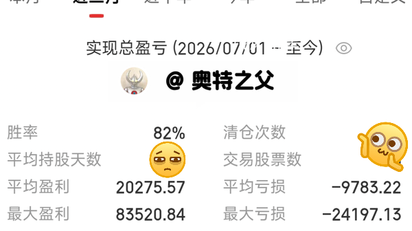
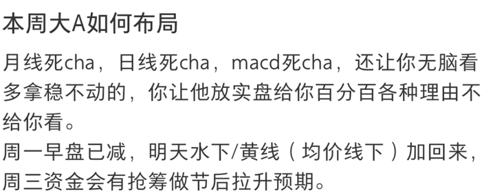

对2026年9月30日A股市场行情，大家有什么看法？ \- 奥特之父 的回答

我钓鱼不大喜欢去鱼塘，因为有朋友就是做这个的。

后来，鱼塘换了统一的名字:

__黑坑__

黑坑，钓鱼人都不愿意来了怎么办?

朋友A想了个办法，钓上来的必须交钱，但钓鱼不按小时收费了。钓上来的鱼比市面上贵一点。所以他使劲往鱼塘放鱼。

最后来的人钓到了鱼，又开心，鱼塘人满为患。

朋友B呢，走差异化经营，专门养肉食鱼，那种淡水鲳鱼，加州鲈鱼，淡水石斑，太阳鱼……然后收费贵一点。好在他自己有精算师的资格，所以他有的赚，钓友也算是络绎不绝。

朋友C就比较鸡贼了，他设置了回鱼机制，就是钓鱼多就可以回给老板，赚钱！但每个小时也不便宜，塘里的鱼呢，他每次放下去就赶快拍视频，钓上来自己回给自己，钓上来的鱼放回塘里，可想而知这个鱼口有多差。但就因为这个回鱼机制，还经常发那种放鱼后塘里鱼很多的视频，很多新手钓鱼佬就忍不住去他那边。

朋友H最不是东西，朋友c还往鱼塘里进点鱼，他那个塘，干脆直接从朋友c的鱼塘里，拿一点那种回锅鱼，回鱼视频也直接从朋友c那边盗。这样成本低到极致，来一个人都是赚。更恶心的是H还号称自己是高端鱼塘，外面县的有钱钓鱼佬都来他这钓，收费贼贵。其实那是以前了，外面县被骗了一次都再也不来了。

最后，我们市的大部分人都去朋友A那边钓鱼了，朋友H和C的鱼塘倒也不倒闭，毕竟他们的鱼塘所在的县对私家车出游卡得比较严格，那些钓友出不了县，只能被逼着去C和H的鱼塘钓鱼，还得往里投窝料养那些回锅滑鱼，专门吃窝料不上钩的。

好了，讲完钓鱼，看看我周一对本周三天的预判如何，今天个人减了点spd芯片概念，仓位回到了八成略多。昨天说的bbu今天走得不错。至于老乡别走的利好，效果不大，ai链甚至借利好直接出货。那些跟着三个月股神死拿科技的，这次一轮下来又是黄粱一梦纸面富贵一回，结果吃答辩。我这一轮ai方向除了周一这波短线吞了几厘米的绿，其他基本都是十五厘米以上，这个月的pogopin/功率半导体/覆铜板，以及现在持有的spd芯片都是。又双叒验证了我的判断:ai的机会在短线。

alt="Image">三月内已清仓部分，最大亏损bw存储，反正每笔都是盘前说，毕竟被某个黑子的一群狗盯着。

上图这里，还是多解释一下，盈利超六位数的我一般会留100股纪念，所以不显示在清仓股中。

alt="Image">发在xhs的，免费内容，一样清楚。

今天除了减仓一点spd芯片概念外，还加了某杭州本地工程机械，rsi只有10，我做的长线，就加了。

10月的主线任务，是保留健康仓位，下方等3750加子弹，今年下半年和明年，我是很看好红利老登的，不可能永远都是短线票高光，要是这样价值投资就是伪命题，我还是坚信会有估值修复。暂时我判断的机会在创新药/公路/小型工程机械。逻辑各不相同，但今天都有较明显的大资金进场迹象。提示风险则主要是银行板块，朋友们交流下来，最近不良率有点兜不住，信用卡倒卡的都少了，直接躺倒上征信算逑。

今天收红，那么节后第一天继续押红吧，知友重啤或绍兴本地黄酒，星友阳澄湖大闸蟹，记得同时点赞。
