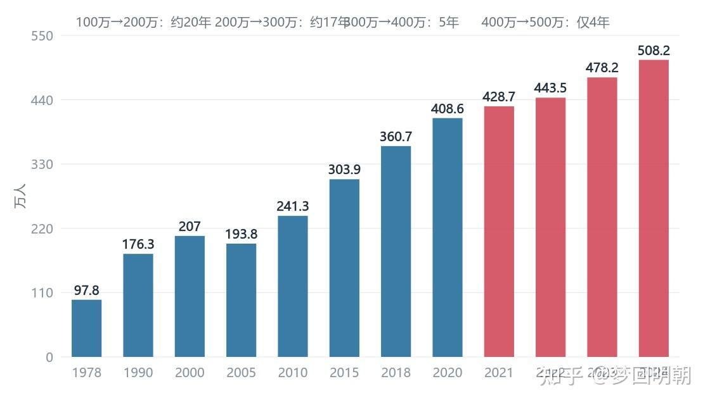
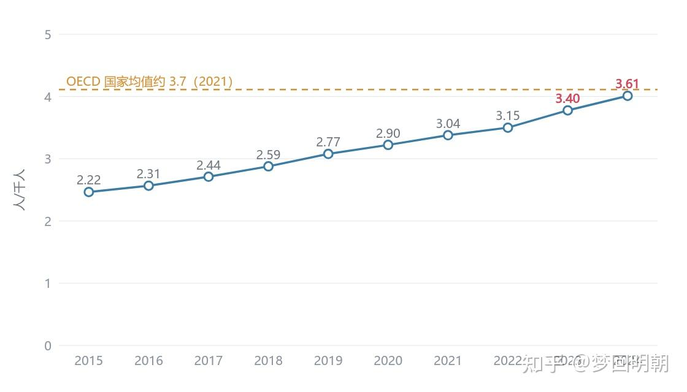
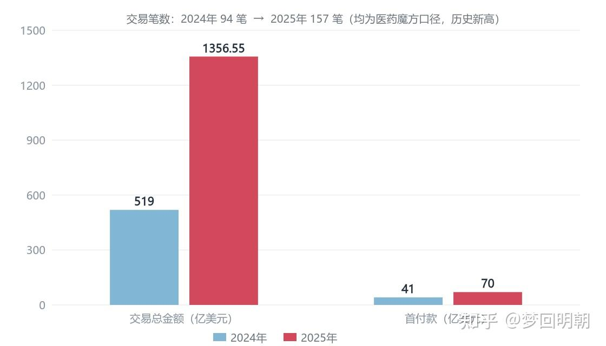
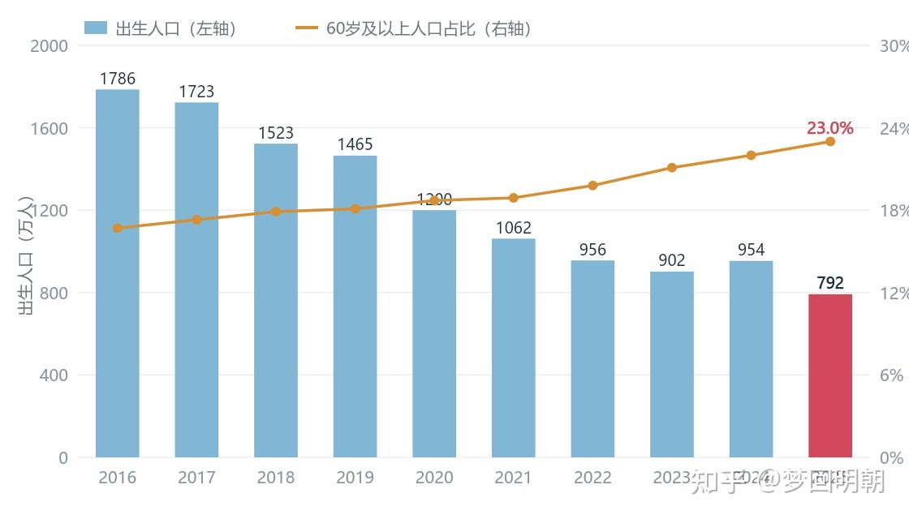

2021 年我离开医院的时候，写了一篇《对医院和医生的发展前景的思考》，给当时正在体制内读书和规培的师弟师妹们做参考。那篇文章的核心判断是：随着三明医改、集采、DRG/DIP 等政策不断落地，医院和医生的运行逻辑正在从效率优先转向公平优先，年轻时候非常辛苦、越老越吃香的医生成长曲线会发生变化，供给持续暴增之下普通医生会越来越难，机会不止在医院内，外面的世界也很大。

五年过去了。这五年恰好走完了一个完整的政策落地周期和一个产业资本周期：三明经验全国推广的时间表已经明确，DRG/DIP 完成了统筹地区全覆盖，药品集采进行到第十一批、高值耗材集采进行到第六批，医药领域反腐从集中整治转入常态化，生物医药一级市场则经历了一次完整的寒冬与回暖，创新药出海完成了从量变到质变。当年文中的多数判断，今天已经可以对照现实逐条打分；也有明显的误判，需要当面承认并修正——毕竟我自己就在那个被误判的行当里，亲身消化了这次误判的全部后果。

所以我把那篇文章重写一遍。结构上是三部分：先对 2021 年的七条判断逐条验证，再补充这五年才显性化的新变量，最后给出更新后的判断和建议。依然是写给师弟师妹的，依然请多批评指正。

__表 12021 年主要判断与五年后现实对照__

__2021 年的判断__

__2022—2026 年的现实__

__验证结果__

医院和医生的逻辑从效率优先转向公平优先

三明经验明确五年内全国推广；药品集采十一批、耗材集采六批；DRG/DIP 覆盖全部 393 个统筹地区；医药反腐常态化

应验，已成制度事实

医生供给暴增，竞争年龄段 3 年约 70 万人，一般医生越来越不值钱

执业（助理）医师四年净增 100 万至 508\.2 万人；每千人口 3\.61 人已接近 OECD 均值；三甲临床岗位录取率不足 15%，博士成为标配

应验且超预期

工作量与收入脱钩，提中下级、降中高级，且担心二次分配弄得不伦不类

年薪制推向全国；三明医生平均年薪从 5\.65 万元升至 19\.56 万元；多地公立医院降薪，部分医院保底不足

方向应验，过渡期阵痛如预期

县域医疗强化，大医院收入受影响

紧密型县域医共体全面推开；但率先出清的是民营医院，2025 年十年来首次负增长；公立医院亏损面扩大

方向对，路径比预想剧烈

晋升仍以论文课题为主，改革幅度不大

职称"破四唯"正式落地，但 2025 年国自然申请 43\.3 万项创新高，资助率 12\.29%、五年连降

应验（明松暗紧）

相信行业增长可持续，读完博士就业市场不会亏待你

2022—2024 年资本寒冬，药企裁员，博士求职同样艰难；2025 年融资回暖 46%，出海交易爆发

当年最大的误判，需修正

对照日美医改，医生束缚增多，但整个医疗产业链大发展

束缚如期兑现；产业链不是普涨而是剧变：内需市场集采出清，出海授权 1356 亿美元创新高

半应验，"发展"的定义需要重写

### 1\.1 「效率优先转向公平优先」：从预判变成制度现实

2021 年写旧文的时候，集采刚做到第五批，DRG/DIP 还叫试点，三明还只是「福建一个地级市的经验」。五年后回头看，这个判断已经不需要论证，因为它变成了制度事实：

- 药品集采走到第十一批。2025 年 10 月第十一批开标，55 个品种全部采购成功；规则明显精细化——设置「锚点价」防极端低价、引入「复活机制」、允许医疗机构 77% 的报量直接报到厂牌，官方口径从「唯低价」转向「稳临床、保质量、反内卷、防围标」。
- 高值耗材集采完成六批，覆盖 9 大类 142 种耗材，涉及心内、骨科、眼科、血管外科、耳鼻喉、泌尿外科等主要科室；冠脉支架降 93%、人工关节降 82%（2024 年接续采购再降 6%）、种植牙降 55% 后，第六批于 2026 年 1 月开标并首次引入锚点价。
- DRG/DIP 三年行动计划收官：393 个统筹地区全部开展（DRG 191 个、DIP 200 个），2\.0 版分组方案 2024 年 7 月发布、2025 年 1 月正式启用。医保从「付钱方」变成了「定价方\+分配方」。
- 三明经验明确五年内全国推广全覆盖。2025 年 11 月国新办发布会给出路径：开展高层次人才、专职科研人员等四类人员年薪制改革，优化内部绩效分配并重点保障儿科、产科、急诊、感染等紧缺专业。
- 2023 年 7 月十部门启动医药领域腐败集中整治，此后转入每年发布纠风工作要点的常态化机制，2025 年的要点已经用上「穿透式监管」「监管到人」这样的表述。
表 2 支付端改革工具箱：2021 年 vs 2026 年

__工具__

__2021 年状态__

__2026 年状态__

药品集采

第五批落地不久，仍在扩围

十一批收官，规则转向锚点价、复活机制、反内卷

耗材集采

冠脉支架、人工关节刚刚开始

六批 142 种，覆盖主要高值品类，降幅 55%—93%

DRG/DIP

101 个试点城市

393 个统筹地区全覆盖，2\.0 版分组启用

薪酬制度

三明一地经验

五年全国推广定调，四类人员年薪制启动

行业治理

专项治理为主

集中整治后转常态化，穿透式监管

创新支付

基本医保单一通道

商保创新药目录首版落地，外商独资医院九地试点

对个人的含义：支付逻辑已经从「多做项目多收入」变成「病种打包、结余留用、年薪核算」。这不是某一项政策，而是一整套相互咬合的制度 —— 它们在五年内全部落地，这个速度是 2021 年的我低估的。
1\.2 医生供给：比当年算的还要多
旧文里我按医师资格考试通过人数估算，自己竞争年龄段（3 年内）大约有 70 万医生，判断「内卷越来越严重，一般医生越来越不值钱」。五年后的官方数据比我的估算更直接：
2020 年末全国执业（助理）医师 408 万人，2024 年末达到 508\.2 万人 —— 四年净增 100 万，比「300 万到 400 万」的 5 年还要快。全国卫生技术人员总数达到 1302 万。每千人口执业（助理）医师 3\.61 人，已经接近 OECD 国家约 3\.7 人的平均水平。换句话说，从总量看，中国医生短缺的叙事正在走向终结，矛盾正在从「总量不足」转向「结构错配」。

__图 1 全国执业（助理）医师数量（1978—2024）__ 数据来源：国家卫生健康委历年统计公报。1978 年 97\.8 万，2024 年 508\.2 万；最近两个「一百万」分别只用 5 年和 4 年。

__图 2 每千人口执业（助理）医师数（2015—2024）__ 数据来源：国家卫生健康委历年统计公报；OECD 均值约 3\.7（OECD Health Statistics，2021）。
供给加速撞上需求重构，结果就是就业市场的直接验证：对全国 28 所医学院就业报告的分析显示，2023 届毕业生平均投递 35 份以上简历，三甲医院临床岗位录取率不足 15%，而基层医疗机构却招不到人；北京、上海头部三甲的临床招聘已经是博士起步，连某著名高校八年制博士都出现过求职困难去参加社培的案例；到 2025 年秋招，广东某医学院校的临床硕士里已有 52% 主动放弃三甲 offer、签约一二线城市社区卫生服务中心。当年说「一般医生越来越不值钱」，五年后的更准确表述是：博士学历在就业市场里已经从「溢价项」变成了「门槛项」。
顺带更新旧文里的一个数字：规培学员的年收入，各地主流在 7—10 万元区间（含国家和省级补助）。用五到八年高等教育加三年规培的投入，换一个 30 岁前后的这个起薪，这笔账每个人都要自己算一遍。
1\.3 收入逻辑：「越老越吃香」的均值回归已经开始
旧文判断：工作量与收入脱钩，蛋糕总量不变的情况下适当提升中下级待遇、降低中高级待遇，医生的成长收入逻辑发生变化；但同时担心中下级医生没有二次分配的话语权，改革可能弄得两头不满意。五年后的验证：
脱钩的方向确实落地了。三明本地，二级以上公立医院医生平均年薪从 2011 年的 5\.65 万元增加到 2023 年的 19\.56 万元，最高年薪可达 58 万元，「541」分配结构（医生 50%、护理药剂 40%、行政后勤 10%）配合 11 次共上万个项目的医疗服务价格调整，证明了「腾笼换鸟\+阳光年薪」在技术上是跑得通的。三明样本本身是成立的。
但全国的转型阵痛也如当年所料。2023 年以来，多地公立医院降薪成为公开讨论的话题（2025 年 11 月经济观察报《医生坦白局：是的，我们降薪了》），部分医院拖欠绩效；薪酬政策文件需要专门强调「重点保障儿科、产科、急诊、感染」，恰恰说明这些科室在现行分配里失血最重。年薪制的目标年薪需要地方财政和医保基金兜底，财力不同的地区改革节奏差异极大；在兜底不足的地区，年薪制实际执行成了「封顶不保底」——中高级医生的收入被压缩，而年轻医生被承诺的提升没有足额兑现。这就是当年担心的「两头不满意」，它在部分地区是真实发生的。
还有一层 2021 年没有充分展开的：反腐把灰色补偿机制整体拆除，本质上是给所有层级的名义收入做了一次重置。被砍掉的主要是中高级医生依赖的那部分，所以这一群体体感落差最大；年轻医生相对受益，但绝对水平仍低。「公平优先」在收入结构上开始显影，只是离「体面的阳光薪酬」这个制度承诺，多数地区还有距离。
1\.4 县域与大医院：方向对了，但先倒下的是民营医院
旧文判断：着重发展县域医疗、实现大病不出省，国家级大医院收入会受影响，因为疑难杂症并不挣钱。五年验证下来，方向是对的，但路径比预想的剧烈：
紧密型县域医共体建设全面推开，县级医院能力提升确实在分流常见病。但真正率先出清的不是国家级大医院，而是民营医院：2024 年末全国民营医院 26956 家（是公立医院 11754 家的 2\.3 倍，诊疗量却只有公立的五分之一）；2025 年民营医院数量出现十年来首次负增长，净减约 1000 家；截至 2025 年 6 月，年内已有 1247 家民营医院终止运营，平均每天关停近 7 家，关停率从 2023 年的 7\.2% 升至 2024 年的 19\.6%。以医保为主要客群的民营医院模式，在支付改革下最先崩塌。
公立医院自身也在过紧日子：2020 年绩效监测显示 43\.5% 的三级公立医院亏损，政府办医院负债率在 45% 上下，此前十几年的基建扩张周期基本结束。国家级大医院的「收入影响」没有以断崖形式出现，而是以增速换挡加结构重组（特需、国际部、研究型病房）的形式慢慢显现——头部医院的虹吸效应依旧，2024 年全国总诊疗人次还在增长 8\.6%。
一个新的认识是：分级诊疗真正的分配效果，不是「大医院让利给县医院」，而是支付改革把全行业的利润表都改写了。药品耗材从利润中心变成成本中心之后，所有医院都要重新学一遍怎么挣钱——这件事对民营医院是生存题，对公立医院是运营题。
1\.5 晋升与科研：明规则松了，锦标赛更卷了
旧文判断：论文和课题仍会是晋升的主要标准，因为最容易量化；临床型研究生先天不足，往上走的代价非常大。五年验证：明规则确实改了——2021 年人社部等部门《关于深化卫生专业技术人员职称制度改革的指导意见》破除唯论文、唯学历、唯奖项、唯帽子，实行代表作制度、分层分类评价，基层不再做科研硬性要求，北京等地 2023 年起落地。
但锦标赛反而更卷了。2024 年国家自然科学基金集中接收申请 38\.45 万项，同比增长 26\.36%；2025 年达到 43\.34 万项再创新高，整体资助率降到 12\.29%、五年连降；医学科学部以 11\.37 万项占全委近三成，是最大的申请板块。职称评审「破四唯」之后，大型三甲医院的内部竞争反而向基金集中——因为「代表作」的评价权仍在科室和医院手里，而国自然是唯一全省全国通用、无需人际解释的硬通货。王辰院士 2023 年公开呼吁把临床型和科研型医生的职业路径分开，说明这个结构性矛盾已经到了必须由顶层共识来回答的阶段。
对个人的含义其实比 2021 年更清晰了：如果你不是真爱科研，在 43 万人里卷 12% 的资助率，这笔投入的性价比每年都在变差。而「临床与科研路径分离」如果真的落地，医院里会出现两类医生——少数走科研教学轨道，多数走纯临床轨道。纯临床轨道的天花板和薪酬怎么定，正是年薪制要回答的问题，也是未来五年值得盯住的改革细节。
1\.6 当年最大的误判：「读完博士，就业市场不会亏待你」
旧文原文：「如果我们不是一定要当专家、教授，而且相信中国生物医药的行业增长是可以持续的，就踏踏实实读完博士，就业市场不会亏待你。」（2021 年）
必须承认，这是 2021 年那篇文章在时点上最错的判断。荒诞的是，写完这句话的我，恰好在那一年转行进入医疗投资，随后亲身经历了这句话被现实证伪的全过程：
2021 年正是上一轮 biotech 泡沫的顶点。之后 2022—2024 年，医疗健康一级市场融资连续三年下滑：2023 年融资总额约 797 亿元、同比下降约 38%；2024 年不同口径在 513—840 亿元之间继续探底。Biotech 裁员、砍管线、账上现金撑不过一年的故事成为行业日常；投资机构冻结招聘。「就业市场不会亏待你」在这三年里不成立——药企裁员潮里博士同样难找工作，而医院这边，博士也不过是三甲的入场券。两头堵。
直到 2025 年才出现结构性回暖：全年医疗健康一级市场融资约 1227 亿元，同比增长约 46%，但融资事件数下降 7\.5%——典型的「量缩价涨」，钱向头部标的集中；2026 年一季度延续回暖（354\.6 亿元，事件数同比增长 16\.5%）。而真正爆发的是出海：创新药对外授权（license\-out）2024 年总金额 519 亿美元、94 笔；2025 年达到 1356\.55 亿美元、157 笔，首付款 70 亿美元，占全球交易总额约 49%，全面超过同期创新药的股权融资——BD 已经取代 IPO，成为中国 biotech 的核心回血渠道。

__图 3 中国创新药对外授权（license\-out）交易：2024 vs 2025__ 数据来源：医药魔方 NextPharma。2025 年总金额、首付款、交易笔数均创历史新高。
这个误判教会我的，比所有应验的判断都多，值得原样写下来给后来人：

- 「行业长期增长」和「个人就业体验」之间隔着一整个资本周期。博士毕业那年的行业相位（beta），对起薪和头三年路径的影响可能大于个人能力（alpha）。讽刺的是，在「择时」这件事上，医生职业反而是全市场最平滑的——编制、年资、缓慢但确定的上升曲线，本质是一份低波动资产。
- 修正后的表述是：中国生物医药的增长是真的，但增长的主战场已经切换——从「国内市场规模」切换到「全球价值兑现」（出海授权、器械全球化、NewCo 模式）和「技术收敛」（AI 制药、手术机器人、脑机接口）。在新范式里，博士学历依然值钱，但值钱的原因变了：不再是行业扩招的普惠红利，而是全球定价的技术稀缺性。2025 年器械融资的反弹几乎全部集中在硬科技主线，就是证明。
- 所以更准确的建议是：读完博士，还要选对产业链的位置和周期相位。学历只是入场券，入场之后拼的是对产业结构的理解。
二、这五年才显性化的新变量
以下五件事，在 2021 年的文章里或者没有写，或者只是背景噪音，但五年后它们已经成了理解这个行业的核心变量。
2\.1 人口拐点：需求端的结构性重构
2025 年出生人口 792 万，首次跌破 800 万，不及 2016 年高峰（1786 万）的一半，总和生育率降到 1 附近；总人口连续第四年负增长。另一头，60 岁及以上人口 2024 年突破 3 亿（占 22\.0%），2025 年达到 3\.23 亿（23\.0%），预计 2030 年接近 4 亿、占比约 29%。一进一出，医疗需求的地基在十年维度上被重排。

__图 4 出生人口与 60 岁及以上人口占比（2016—2025）__ 数据来源：国家统计局历年统计公报。柱为出生人口（万人，左轴），线为 60 岁及以上人口占比（右轴）。
对医疗的直接映射已经发生：产科关停潮自 2022 年蔓延，多地产科床位使用率不足 30%，国家卫健委专门发文要求不得随意关停产科；儿科和妇幼体系整体收缩；而老年医学、康复、护理、安宁疗护、肿瘤、慢病管理的需求确定性扩张。对支付的含义更根本：缴费人群相对缩小、支出人群持续扩大——2024 年居民医保基金收入 1\.12 万亿元，基金的长期平衡压力，正是集采、DRG、年薪制这一整套改革的总底层逻辑。换句话说，2021 年我说「蛋糕总量不变」还乐观了：增量几乎全部来自老龄化，而老龄化同时还在推高做蛋糕的成本。
2\.2 医疗反腐常态化：灰色补偿机制的拆除
2023 年 7 月，十个部门联合启动为期一年的全国医药领域腐败问题集中整治，大量学术会议延期、院长书记被查；2024 年起转入常态化——每年发布《纠正医药购销领域和医疗服务中不正之风工作要点》，2025 年的版本强化「穿透式监管」「监管到人」。这件事对医生职业的含义比多数人想的深：它不只是「抓院长」，而是把运行了二十年的灰色补偿机制整体拆除。过去医生名义薪酬与实际贡献之间的缺口，相当一部分靠这套机制填平；拆除之后，要么阳光薪酬补位（年薪制），要么人才流向体制外——现在两件事都在发生。对想转行去企业的医生，这也是重要背景：企业的能力需求已经从销售驱动转向医学部、市场准入、政府事务和循证营销，合规成本内化成了常态成本。
2\.3 公立医院：从扩张周期进入存量出清周期
全国医院总数 2024 年末为 38710 家，公立 11754 家早已进入平台期，民营 26956 家在 2025 年掉头向下。公立医院这边，43\.5% 的三级医院亏损（2020 年监测）、政府办医院负债率约 45%、基建扩张周期结束、多地降薪——「国考」（三级公立医院绩效考核）和 DRG 把医院管理推进了运营时代：病案、医保办、运营管理岗在医院内部的地位肉眼可见地上升。这对年轻人是一个容易被忽略的机会提示：公立体系内部，临床之外的运营、数据、管理路径正在打开，这类岗位五年前几乎不存在。
2\.4 AI：从概念变成医院基础设施
这是 2021 年那篇文章完全没有预见的。2025 年初以来，超过一百家医院完成 DeepSeek 本地化部署，其中约 90 家是三级医院；北京大学第三医院等多家实现了多模式联合部署，《医疗机构部署 DeepSeek 专家共识》这类文件的出现，说明它已从技术尝鲜进入制度化落地阶段。行业调研显示，超过 80% 的医生已在临床中使用 AI 工具，医院 IT 预算中 AI 占比正从 5% 向 20% 跃升；2026 年医学影像 AI 市场规模预计 168 亿元。
我的判断是：AI 对医生职业的冲击不是「替代医生」，而是「重定价医生的技能组合」——记忆性知识（指南条目、鉴别诊断清单、影像初筛）在快速贬值；操作技能（手术、介入、内镜）、复杂决策（多病共存、不确定性下的权衡）、沟通共情和组织 MDT 的能力在升值。影像科、病理科会是第一批被重定价的科室，操作密集型外科最晚。对个人的推论很简单：无论体制内外，「会用 AI 的医生」和「不会用的」之间的效率差，会先体现在工作量上，再体现在价值分配上。
2\.5 出海与支付多元化：体制外期权开始出现
产业端的变化前面写过：出海授权 2025 年 1356 亿美元创历史新高；器械端在集采倒逼国产替代（脊柱集采后外资份额从 59% 降到 20%）之后，龙头集体转向全球化。更值得注意的是支付端的结构性增量开始出现：2025 年 6 月《支持创新药高质量发展的若干措施》十六条出台；2025 年 12 月首版商保创新药目录落地（19 种药品，含 CAR\-T），基本医保之外的第二支付通道开始搭建。办医端也在开放：2024 年 9 月九地外商独资医院试点，天津鹏瑞利（首家三级综合，2025 年 2 月开业）、上海德达（2025 年 3 月）相继落地，多点执业备案为头部医生提供了合规的体制外执业通道。
这对医生的意义需要放慢一点理解：中国医生的薪酬第一次开始有了「体制外参照系」。规模还小，但方向重要——顶级医生的时间开始被市场直接定价（多点执业、外资医院、商业保险体系、飞刀），这个趋势与年薪制的「体制内定价」会长期并存、互相牵制。对年轻医生，这意味着二十年后你这一代医生的薪酬形成机制，会和你的老师完全不同。
三、更新后的判断：未来五到十年
3\.1 医院端：数量见顶，运营为王，AI 原生

- 总量见顶、存量整合。全国医院数量大概率进入平台期甚至下行通道，民营出清预计还要持续两三年；公立体系内部的兼并重组、集团化（城市医疗集团、县域医共体）是主旋律。
- 职能三层化。国家级和省级头部医院转向疑难重症\+研究型医院模式，科研权重反而上升；县级医院承接常见病多发病；基层做慢病与健康管理。三层的资源逻辑和分配逻辑将彻底分开，「在一个平台吃一辈子」的假设失效。
- 运营为王。DRG 常态化下，医院竞争力的公式变成：病种结构 × 成本控制 × 数据能力。医院管理层的背景会加速多元化（临床\+运营\+数据），医院内部的岗位价值随之重排。
- AI 原生。从信息化到 AI 化，十年内 AI 辅助诊断、病历生成、质控会成为医院的基础设施，就像今天的 HIS 和 PACS。谁先完成工作流重构，谁拿到下一个十年的效率红利。

### 3\.2 医生端：「越老越吃香」不会消失，但会分化

「越老越吃香」这个 2021 年被我认为会整体动摇的命题，五年后看需要拆成两个版本。技术壁垒版——手术、介入、内镜等操作密集型专业，经验溢价会保留甚至增强，因为机器在可见的周期内替代不了手，且操作能力供给刚性；知识服务版——以诊断和开方为主的专业，年龄溢价会被 AI 和同质化的医师供给持续侵蚀。选科室，本质上是在选自己未来二十年的护城河类型。

薪酬上，名义薪酬的阳光化、均值化是十年尺度的趋势：年轻医生相对收益改善，顶尖医生名义收入下移、但开始获得体制外补偿通道（多点执业、外资医院、商保体系）。职业安全感的来源会从「体制身份」转向「可迁移的能力组合」：临床判断 × 操作技能 × 数据与 AI 素养 × 患者信任（个人品牌）。最后，供给端迟早迎来再平衡——医学院校招生仍在高位，但就业出口已经多元化下沉，预计五年内会看到部分专业报名热度和分数线的回落信号。

### 3\.3 写给师弟师妹的 2026 版建议

__表 3 三条职业路径的期望值重估__

__路径__

__2021 年的期望值__

__2026 年的更新__

__关键变量__

体制内普通临床

稳定，但回报下行

名义薪酬均值化、阳光化；下沉基层和县级成为主流出口之一

年薪制落地质量、科室选择

体制内专家路线

竞争激烈，但顶端回报高

期望值显著下修：非升即走\+基金锦标赛，资助率五年连降至 12%

科研真实兴趣、平台与师承资源

转行产业（药械、投资）

高增长、机会大

高波动、强周期；出海与 AI 是结构性机会，门槛比 2021 年高得多

入场时点、即战力、英语

自由执业与高端医疗

概念大于现实

期权开始真实出现（外商独资医院、商保、多点执业备案），但只属于头部

个人品牌、稀缺技术

展开成五条具体的：

1. 选科室就是选象限。优先「老龄化受益 × 技术壁垒」双高的象限：肿瘤、麻醉、精神、康复、老年医学、操作密集的外科亚专科；警惕「供给扩张快 × AI 易替代 × 需求收缩」三重叠加的方向，比如部分影像方向和产科——产科医生没错，是需求没了，这类结构性风险不因个人优秀而豁免。
2. 专家路线的期望值要重置。非升即走加上 12% 的基金资助率，应该把它当成一次创业来计算期望值，而不是当成晋升的默认路径。除非你真心热爱科研——真爱的话，43 万申请人里你就是少数不怕卷的人。
3. 想离开体制，先看清产业周期，再盘点自己的即战力。现在处于回暖的早段，窗口在打开，但企业要的已经是即战力：医学部、临床运营、市场准入、BD；投资机构要的是产业判断加资源落地，医学学历只是入场券。医生背景的市场定价 = 临床洞察 × 行业网络 × 商业技能，第一项人人都有的，定价的是后两项。
4. 无论走哪条路，三项投资都值得：英语（出海时代的硬通货）、数据与 AI 工具能力（做指挥 AI 的医生，而不是和 AI 比记忆）、可展示的专业输出（病例库、教学内容、个人品牌）。它们是对冲体制周期的个人期权，成本低，行权日不确定，但一定会来。
5. 最后一条与 2021 年相同，但今天说更有底气：不必挤独木桥。医疗健康是未来二十年确定性最高的行业之一——老龄化是唯一确定的人口趋势——但确定性属于行业，不属于任何单一雇主。把自己当作一家公司来经营，医院只是你的第一个客户。

## 结语

2021 年旧文的最后一句话是：「调整赛道去有更好发展前景的赛道会更好。」五年后，我想把这句话修得更诚实一点：没有一直更好的赛道，只有处在不同周期相位上的赛道。医院提供的是低波动、慢增值的类债券职业；产业提供的是高波动、高弹性、需要择时的类股权职业。选择的关键不是哪个更好，而是你能否承受对应的风险，并且在你选的那条路上，把自己的稀缺性真实地经营出来。

五年前我写「机会不止在医院内，外面的世界也很大」。今天补上后半句：外面的世界也很大，外面的世界也有周期。愿我们都有选的勇气，也有扛住所选的能力。与各位师弟师妹共勉。

## 附：主要数据与政策来源

1. 国家卫生健康委：《2024 年我国卫生健康事业发展统计公报》（2025 年 12 月）及历年统计公报；
2. 国务院新闻办：推广三明医改经验、深化以公益性为导向的公立医院改革发布会（2025 年 11 月）；
3. 国家医保局：DRG/DIP 支付方式改革三年行动计划及 2\.0 版分组方案（2024 年 7 月）；第十一批国家组织药品集采开标通报（2025 年 10 月）；第六批国家组织高值医用耗材集采（2026 年 1 月）；《2024 年全国医疗保障事业发展统计公报》；首版商保创新药目录（2025 年 12 月）；
4. 国家卫生健康委等十部门：全国医药领域腐败问题集中整治（2023 年 7 月）及历年纠风工作要点；
5. 国家统计局：历年国民经济和社会发展统计公报（出生人口、老龄化数据）；
6. 医药魔方 NextPharma：2025 年中国创新药 BD 交易统计（1356\.55 亿美元、157 笔、首付款 70 亿美元）；中国医疗健康一级市场投融资年报（2025 年约 1227 亿元）；
7. 动脉网、摩熵医药、睿兽分析：2022—2024 年医疗健康一级市场融资统计（口径存在差异，文中已注明区间）；
8. 人力资源社会保障部等：《关于深化卫生专业技术人员职称制度改革的指导意见》（2021 年）；国家自然科学基金委员会：2024—2025 年项目申请与资助数据；
9. 商务部、国家卫生健康委、国家药监局：医疗领域扩大开放试点（外商独资医院，2024 年 9 月）；天津鹏瑞利医院、上海德达医院落地公开报道（2025 年）；
10. 行业媒体与学术文献：产科关停潮与分娩量变化报道（生命时报、观察者网等）；AI 医疗落地数据引自艾瑞《2026 年中国医疗大模型行业研究报告》及新华网等公开报道。
