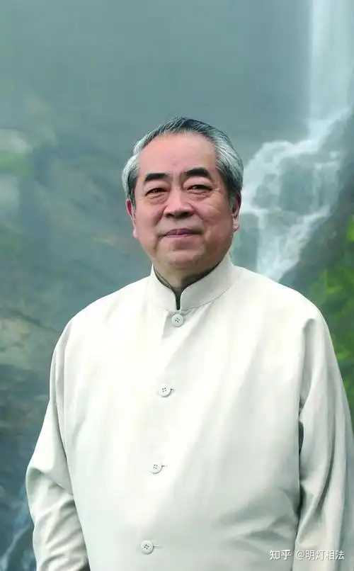

从面相说的话，“老来风流是寿征”，肾强寿命强。有些老头一把年纪了，还想娶老婆，还想找女人。这种人大概率是长寿的，比如范曾，杨振宁，蔡澜，何鸿燊等等。你们可以留意一下身边的老年人，看看是不是我说的这样。

耳朵比较大，人中深长，眼睛有神，颧骨颧柄高，奴仆骨有力，手腕骨小腿骨稍粗一些，这种都是容易长寿的特征。

并不是因为喝酒和抽烟，就一定短寿，适当抽烟喝酒，是没问题的。有很多长寿老人也抽烟喝酒的。

长寿基因和短寿基因一样会遗传，有些人祖辈上长寿的多，自己长寿的概率也大。如果祖辈上短命的多，自己也有断寿的概率。

寿命长短跟居住地（风水），饮食习惯都有关系，有的地方长寿老人多，有的地方平均寿命则达不到国家平均水平。

有很多统计结果认为，经常吃豆腐，葡萄干的的地区，人均寿命长。

对于我们职业算命的来说，“生死有命，富贵在天”。面相学其实也是一种统计学，拥有极高的概率性。

那么什么样的人，容易短命呢？我们从科学与玄学一起讲起。

手腕骨脚腕骨太细，形神枯燥，眼睛昏暗，颧骨颧柄过低，五官极其不协调，人中短浅，下巴退缩，眼睛露白，连眉严重。这些都是容易短寿的特征。

过度劳累，过度饮酒抽烟，经常无保护措施找女人（染病），食量过大，经常睡眠不足，自我制造压力等等。

alt="Image">
