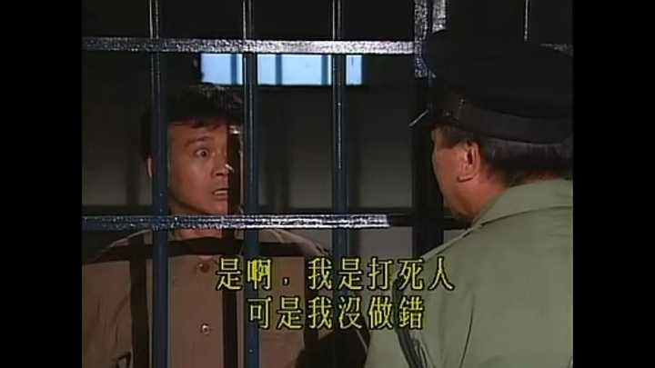

小红书的价值观是什么？ \- 知乎用户 的回答

小红书的四有新人：有结果 有洞察 有信任 有格局 具体怎么解释？ 我记得每一条都有具体的解释

丁蟹。

__平台算法致力于把每一个人培养成丁蟹。__

丁蟹是谁？

港片《大时代》里面的一个经典角色，在剧里面，丁蟹实实在在伤害了别人，但在他自己的逻辑闭环里，永远觉得自己是好人、是受害者、是讲道义的一方。

香港先行服，现在很多现象都能在上世纪90年代的港片找到影子。

alt="Image">

在电视剧里面的丁蟹：

1. 我确实打死了人（方进新），但是，我有苦衷。我只是想让他长眠，不被人欺负。
2. 虽然我杀了人，但是，我浪子回头金不换。恳请法官阁下判我无罪。
3. 方进新死了14年，我痛苦了14年，我也后悔，如果时光可以倒流，我就不打他的头。你知道吗？他死了，再惨也有限。他舒舒服服长眠地下14年，没人欺负他，我这14年受尽人间痛苦折磨。最惨的人其实是我。
4. 股市崩盘之后，带着四个儿子上天台，是世道、是方展博害我们，是命运不公，不是我把儿子拖入绝境。
5. 我爱你，我做的一切都是爱你的表现，你抗拒你离开，就是你不懂珍惜我的情义。

我打你=我为你好

你反抗=你不知好歹

你讲道理=你在狡辩

他把自己人生中所有的不如意，都看成是天道的不公和他人的亏欠，又因为自己是被亏欠的一方，那么所有的非分所得，都可以看成合理的补偿。

__在他们的世界观里面，自己永远是受害者，全世界都亏欠了他们，即使不劳而获，非分所得，也是合理的补偿。__

客观规则被弱化，主观的难处和委屈成为叙事核心，痛苦的感受优先于客观事实。

我见过小红书一个帖子。

当事人预约美甲，还是什么的，迟到一小时，店家拒绝接待，预约作废。当事人发帖吐槽店家不近人情，评论区提醒是她自己迟到违约，她辩解：“我确实迟到了，但那天路上突发状况，我也不想的，店家一点都不肯体谅人。

经典的“高考400分，不知道接下来怎么办”。

成绩出来只有四百多分，我知道分数不高，很多人看到第一反应就是我没好好学。
可是你们不知道我这一年有多煎熬。卷子本身就很难，考题很偏，考场状态也很差，考前家里事情一堆，心态早就崩了。
我每天熬夜刷题，压力大到经常失眠，不是我不想考高分，是很多客观因素推着我走到现在。
不要一看到低分就指责我不努力，你们只看到这个难看的数字，看不到我这一年承受的痛苦和内耗。
如果环境好一点、题目正常一点，我根本不会考成这样，变成现在这个样子不是我一个人的问题。

通篇不是在分析高考400分的打算，而是来找安慰，希望网友安慰鼓励一下她。

骗她，没关系的，即使你高考400分，未来依然光明。

__小红书大量类似的叙事，看多了，很容易形成丁蟹那种思维惯性。丁蟹最恐怖的地方，不在于撒谎，而是发自内心相信自己是正义的，我才是受害者。__

经典话术：

1、诬告。

我知道证据不足，但我当时真的很难受、我很害怕，我不是故意要冤枉他。他后面被网友网暴，不关我事，而且，大量路人攻击我，我也是受害者。

我没有编造，只是凭我当时的感受说了出来，谁也不能预判事情会闹这么大。

就算最后证明不是他的问题，但我当初那种恐惧是实打实的，我不该被全盘否定。

我只是说出我的感受，是网友自己冲上去讨伐他，网暴不是我能控制的。

2、吵架。

我之所以这么说，是因为他先惹我、他态度不好，把我逼成这样的。我本来脾气很好，全是他的问题。

如果他好好跟我沟通，我根本不会情绪失控，是他的冷漠和挑衅点燃一切。

我只是反击而已，我不反击，受委屈的就只有我一个人。

3、避雷商家。

我承认我没有仔细看规则，但商家的表述很容易让人误会，换谁都会踩坑。

东西本身不算大问题，但他的态度让我很难受，我发出来避雷没有错。

我只是分享我的真实感受，至于大家怎么评论商家，我管不了。

4、感情纠纷。

我只是放不下，我没有恶意，是他太绝情，一点情面都不留。

我付出了那么多真心，最后落得这个下场，我只是不甘心。

我只是想把话说清楚，是他一直回避沟通，逼得我只能公开说。

这些话术在小红书流量生态里极易爆，算法会持续推送，反复强化一个认知：__只要自己感到委屈，就天然占据道德高地，我就是正义的一方。__

蟹，非常形象。

看起来横行霸道，外壳坚硬，内部柔软。正好对应丁蟹的行为霸道，且有非常强大的自我保护外壳，而内心又是怯懦的。

生活中遇到丁蟹，不要试图说服他、不要进入他的逻辑闭环，不要跟他辩论谁对谁错。他的自洽逻辑很难被讲道理打破。

一旦你共情他的痛苦，在他的逻辑闭环里，不会解读成“你体谅我的处境”，而是解读成 “你也认同我，我没错，我所有行为都是合理的”。

__所谓的丁蟹报恩，家破人亡。__

对付丁蟹，记住一点，让他明确：你和他不是一伙的，你不认可他，不会无条件包容他。

越冷漠越好，最好当丁蟹的仇人，不要试图 “拯救他”。

他反而会怕你，见到你绕着路走。

小红书用户的核心心理预期：__很多人来这里是找情绪安慰、找同类，不是专门来看别人多厉害。__

博主平时发精致生活、自律日常（NPD供给，积累颜值和粉丝基础）。一旦发生纠纷，放出委屈故事，切换受害者叙事（丁蟹）。

等于同时拥有颜值滤镜 \+ 受害者共情 buff，这种帖子最容易爆。

电视剧里面的丁蟹，编剧为了戏剧效果，都是大白话，小孩子也能看懂丁蟹这个人，丁蟹的戏剧形象更无脑，更直白。

小红书那群丁蟹们更有文化，更懂得包装自己，形成了一套完整的理论，为自己辩护。从来不会承认自己是丁蟹。

现在AI很发达，同样的剧情，短剧会拍成男版、女版。

比如，

版本1：女主重病，男方提分手，男方很快交新女朋友，并结婚生子。

版本2：男主重病，女方提分手，女方很快交新男朋友，并结婚生子。

正常人：法律上恋人没有法定扶养义务，分手本身不违法。但从道义上来说，在对方重病脆弱的时候抽身离开，非常冷酷，会受到道德层面的非议。不管是谁，在伴侣重病时抛弃，都容易被人觉得薄情，这一点不分男女。

精致丁蟹：生病本就是女性最脆弱的阶段，他在女方重病的时候抽身，本质是功利化的选择，只愿意索取伴侣的价值，不愿意承担风险。不要拿恋爱自由、法律没义务这种冷冰冰的话洗白，人要有基本的良心。

同一批人，换到版本2：男主重病，女方分手迅速再婚，立刻换一套话术。

恋爱本来就不是捆绑，没有人必须为另一个人的病痛买单。她有选择自己人生的权利，没必要一辈子困在巨大的经济压力里。道德绑架别人牺牲，本身就是一种苛责。

同一个行为，仅仅更换当事人性别，评价框架就翻转。
