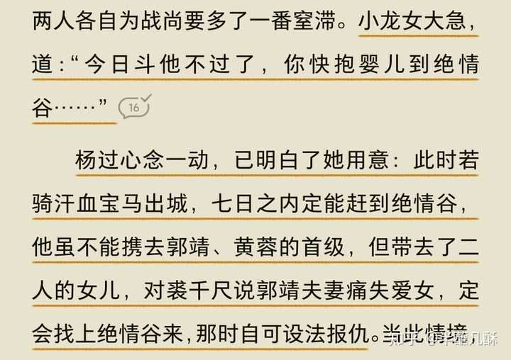
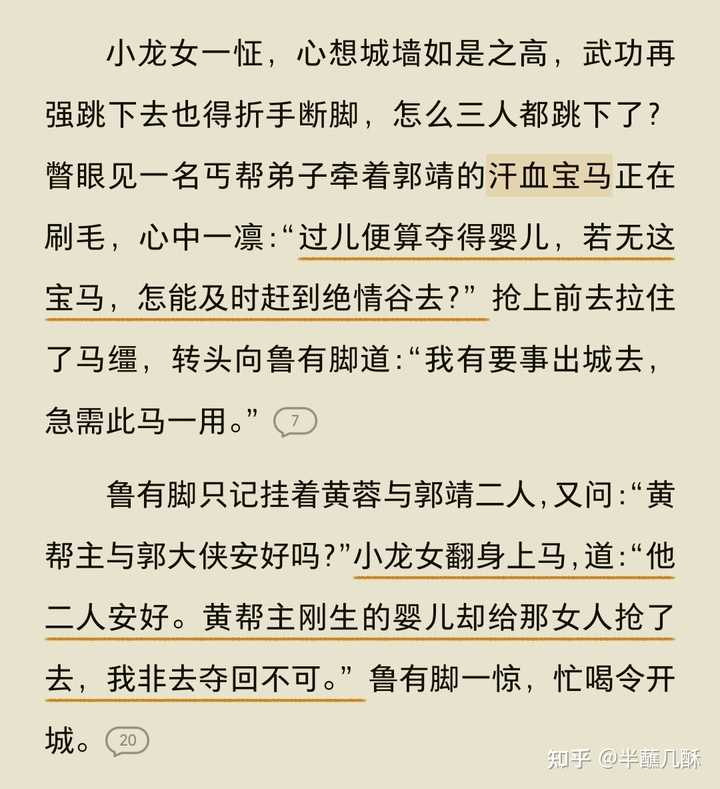

小龙女到底是不是蛇女？她的行为逻辑是不是很诡异？ \- 半蘸几酥 的回答

周伯通甚至说她和黄蓉一样聪明，感觉她不是一个冰清玉洁的人。

__本文仅引用明朝冯梦龙《警世通言》中第二十八卷:白娘子永镇雷峰塔，与任何影视剧中任何角色无关。__

看到有同好提到金庸有从《白娘子永镇雷峰塔》中吸取灵感创作《神雕侠侣》，今天有时间特地看完了，不算长，大家可以自己搜搜看。故事非常有趣，冯梦龙笔法辛辣讽刺的同时不失幽默，看得我一直笑。不知金庸是否也学习了冯梦龙的文风。

首先毫无疑问，杨龙对应许白。（我说的“对应”并非1:1照搬，而是有部分相似之处）

与传统影视剧形象不同的是，许仙并不叫许仙，而是许宣，白娘子也不叫白素贞，和小龙女一样只有姓没有名字。白娘子没有温柔善良的悲情人设，多次偷盗财物连累许宣，带有妖怪害人的底色；许宣不是深情爱人，害怕妖怪，主动找法海收了白娘子；更没有儿子许仕林祭塔救母（生殖隔离也是一个问题）；为爱对抗全世界水漫金山的剧情也并不存在，__真正的剧情是:许宣为色所迷，醒悟后他逃她追，他们都插翅难飞……__诶，熟悉的感觉来了。

许宣是一个寄居姐姐姐夫家的药铺伙计，在西湖边与白娘子因伞结缘。白娘子白衣孝髻，和小龙女一样不戴首饰只插着荆钗，穿白衣。

许宣看时，是一个妇人，头戴孝头髻，乌云畔插着些素钗梳，穿一领白绢衫儿，下穿一条细麻布裙。

白娘子自称是个寡妇，这让我想到

【杨过连连摇手，道：“我问你，可有见到一个穿白衫子的美貌姑娘，从此间过去么？”店伴沉吟道：“__穿白衣，嗯，这位姑娘可是戴孝？家中死了人不是？__”】（老金骂人真脏🤣）

alt="Image">百度给的形象，挡住许宣，我说这是小龙女也没意见吧

白娘子主动求爱，许宣也很乐意却苦于没钱置办，白娘子“善解人意”地掏出五十两银子，取出一锭给许宣，回到家被姐夫一眼认出这是官府丢失的银子，因害怕包庇罪，只好大义灭亲地举报了许宣。

许宣被捕后，白娘子脚底抹油溜走了，只剩倒霉蛋许宣灰溜溜地去苏州劳改。

__这波栽赃陷害简直完美对照断臂局。爱偷东西的白娘子变成了爱偷婴的小龙女__。在杨过明确拒绝用婴儿换解药的情况下，小龙女坚定地偷走婴儿塞给杨过，又当着郭芙的面坐实了杨过偷婴换药的事。

alt="Image">

然后自己再装好人骗马，把自己摘的干干净净，跟白娘子一样“毫不知情”。

alt="Image">说的跟李莫愁从产房中抢走孩子似的，人贩子脸皮够厚的

风头一过，白娘子又厚着脸皮找到许宣，把锅都甩给“亡夫”，说都是“亡夫”偷的，自己不知情。许宣也是色迷心窍，这么明显的杀猪盘都看不出来。然后与白娘子结为夫妻。

【白娘子放出迷人声态，颠鸾倒凤，百媚千娇，喜得许宣如遇神仙，只恨相见之晚。正好欢娱，__不觉金鸡三唱，东方渐白__。正是：欢娱嫌夜短，寂寞恨更长。】

神雕中也有一对干到天亮，咳咳不多说了……

婚后许宣也曾怀疑白娘子，用符镇压未遂。这让我想起杨过早年屠龙未遂，找有獐兔猎人出没的地方练不能被打扰的玉女心经啦，“不小心”弹个花枝啦～😜

白娘子又给许宣穿上锦衣华服去逛街，当场被官兵认出是官府失窃的金银细软。而白娘子再次溜得无影无踪，倒霉的许宣二进宫，前往镇江劳改。

（这两段龙女味太重了，偷窃栽赃陷害完杨过，剩杨过一个人倒霉，自己溜得比谁都快）

__重情重义白娘子，色即是空许小乙。__

风头一过，白娘子又双叒叕腆着脸找到许宣，把锅再次甩给“亡夫”，说都是“亡夫”偷的衣服，自己并不知情。（又不谙世事了😓）

一模一样的杀猪盘，您猜怎么着，许宣又双叒叕跳进去了，原因也很简单，就是色，我服了这个没出息的。

【许宣道：“那日我回来寻你，如何不见了？主人都说你同青青来寺前看我，因何又在此间？”白娘子道：“我到寺前，听得说你被捉了去，教青青打听不着，只道你脱身走了。怕来捉我，教青青连忙讨了一只船，到建康府娘舅家去。昨日才到这里。我也道连累你两场官事，也有何面目见你！你怪我也无用了，情意相投，做了夫妻，如今好端端，难道走开了？__我与你情似泰山，恩同东海，誓同生死。__可看日常夫妻之面，取我到下处，和你百年谐老，却不是好！”】

神雕中杨龙也表面上是恩同东海，细嚼起来全是仇，你坑我我坑你。【小龙女道：“过儿，__我要永永远远记着你的恩情。”__】

誓同生死就更搞笑了，杨过都说了几百次要为姑姑死，然后肥嘟嘟的活到大结局。

【杨过道：“你什么话都听，就这一句不听。好姑姑，__我跟你死活都在一起。你死我也一起死\!”】__

后来许宣的老板调戏白娘子，白娘子回家告状，许宣太孬，让白娘子忍忍。

许宣是孬，杨过是无情，【“__那天我义父欧阳锋授我武功，将你点倒，我可并没和你亲热啊。__”】是谁都行，反正不是我杨过😌

有一日许宣去上香，正当法海寻找许仙之际，白娘子开着摩托艇就要接走许仙，一看见法海又吓得屁滚尿流翻船水遁了。

这下许仙彻底老实了，逃回了杭州。好不容易回到家，却发现白娘子老早就蹲在他家守株待兔了。

【李募事见了许宣，焦躁道：“你好生欺负人，我两遭写书教你投托人，你在李员外家娶了老小，不直得寄封书来教我知道，直恁的无仁无义！”__许宣说：“我不曾娶妻小。”__姐夫道：“见今两日前，__有一个妇人，带着一个丫鬟，道是你的妻子。说你七月初七日去金山寺烧香，不见回来，那里不寻到。直到如今，打听得你回杭州，同丫鬟先到这里，等你两日了。”__教人叫出那妇人和丫鬟，见了许宣。许宣看见，果是白娘子、青青。__许宣见了，目睁口呆，吃了一惊。】__

想必许宣只觉此刻人生已臻极美之境，过去的生涯尽是白活，而未来的时光也大可不必再过🤣

大胜关1:1复刻了，小龙女精准定位郭家，果然蹲到杨过，又大喇叭把旷世绝恋绑死了。许宣是想赖赖不掉，杨过是跳进黄河洗不清。

绝望的许宣下跪求放过，白娘子圆睁怪眼，道:【若听我言语，喜喜欢欢，万事皆休。__若生外心，教你满城皆为血水，人人手攀洪浪，脚踏浑波，皆死于非命】__

我最厌恶的谈恋爱要天下人陪葬的剧情出现了。

许宣找到民间捕蛇人，捕蛇人拍着胸脯保证抓不到不收钱，可当白娘子真的现出原形时，又吓得仓皇逃窜【只恨爹娘少生两脚】🤣

愤怒的白娘子再次表示要水漫金山。【只见白娘子叫许宣到房中，道：“你好大胆，又叫甚么捉蛇的来！你若和我好意，佛眼相看；__若不好时，带累一城百姓受苦，都死于非命！”】__

绝望的许宣寻法海不见，决定跳湖，千钧一发之际被法海拦下。最后法海在许宣的帮助下收服蛇妖，镇压在雷峰塔下。【西湖水干，江湖不起，雷峰塔倒，白蛇出世。】许宣最后出家。

白娘子和小龙女相似之处在于，白娘子想水漫金山，小龙女想襄助蒙古人破坏家国，__她们都是为一己私欲伤害群众，都有恶心，却因为能力不足或时机不成熟，而没有办成恶事，只伤害了个别人，__最终被天道惩罚，一个被镇压在塔下，一个关在崖底坐牢。

白娘子永镇雷峰塔的主旨在于【“奉劝世人休爱色，爱色之人被色迷。心正自然邪不扰，身端怎有恶来欺。__但看许宣因爱色，带累官司惹是非。不是老僧来救护，白蛇吞了不留些。”】__

金庸也曾说过【武侠小说并不单是让读者在阅读时做“白日梦”而沉缅在伟大成功的幻想之中，而希望读者们在幻想之时，__想像自己是个好人，要努力做各种各样的好事，想像自己要爱国家、爱社会、帮助别人得到幸福，由于做了好事、作出积极贡献，得到所爱之人的欣赏和倾心。】__

许宣又是吃官司又是担惊受怕，同为受害人，读者却不会像同情杨过一样同情许宣，正是因为他俩本质的区别:许宣为色所迷，杨过抗住诱惑。杨过面对诱惑坚守本心，依照郭芙的理想，最终成为狷介的狂生【狷介有洁身自好的意思】守住底线才有幸福的资格，没有底线的人得不到大众的欣赏。

alt="Image">

今天的分享结束，我还有一个疑问❓

【许宣半醉，抬头一看，两眼相观，正是白娘子。许宣怒从心上起，恶向胆边生，无明火焰腾腾高起三千丈，掩纳不住，便骂道：“你这贼贱妖精！连累得我好苦，吃了两场官事！”恨小非君子，无毒不丈夫。__正是：踏破铁鞋无觅处，得来全不费工夫。】__

【杨过长吟道：“有缘千里来相会，无缘对面不相逢！”这两句话一个个字远远的传送出去。那僧人正走在山腰之间，立时停步，回头说道：“有劳高人指点迷津。”__杨过吟道：“踏破铁鞋无觅处，得来全不费功夫。”】__

这个应该是一处对照，但是我没有想明白杨过为什么要说这句话，难道是宣告屠龙？神雕结局我第一次读的时候就读不进去，一到打机锋我就看不明白，懂得朋友可以留在评论区。

……………………………………………………
