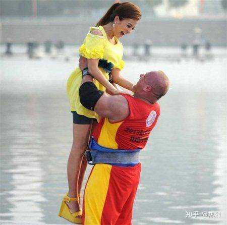
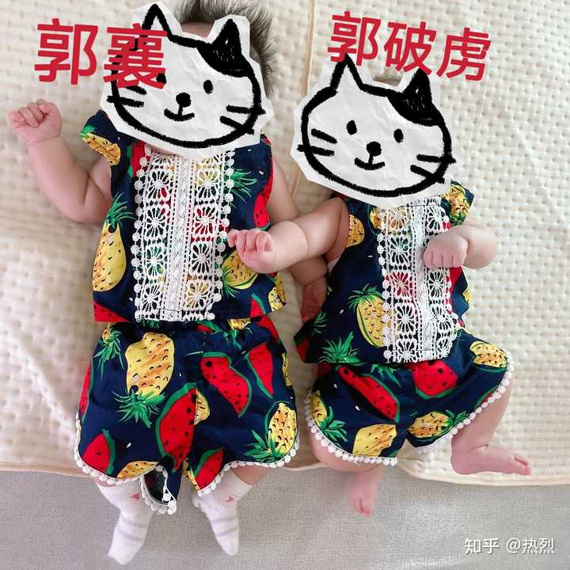

小龙女的孩子是谁的？ \- 热烈 的回答

举步入内，一瞥眼间，不由得全身一震，只见屋中陈设简陋，但洁净异常，堂上只一桌一几，此外更无别物，桌几放置的方位他却熟悉之极，竟与古墓石室中的桌椅一模一…

小龙女有没有在谷底生下公孙止的孩子先放一边

__那个郭襄一定是周伯通和小龙女的，而且她大概和年轻时候的周伯通长的一般无二。__

以下为详解（真的很长很详细）

首先黄老邪说“真像”的时候，指的一定不是郭襄像冯衡。因为郭襄就不可能像冯衡。

郭芙长的像黄蓉，郭破虏长的像郭靖，只有这个郭襄既不像爹也不像妈。

而且根据梅超风的话，黄蓉一两岁的时候就已经极像冯衡了

梅超风说：“我跪下来拜倒，痛哭失声。忽然之间，看见灵堂旁边有个一两岁大的小女孩儿，坐在椅子上向着我直笑，__这女孩儿真像师母__，定是她的女儿，难道她是难产死的么？”

而郭襄不像黄蓉是老生常谈的事，我就不在赘述。

那么黄老邪说郭襄真像的时候就不可能指的是冯衡，这直接导致一部分人认为黄老邪只是没话找话，在这纯客气。

黄药师拉着她手，细细瞧她脸庞，黯然道：“真像，真像。”黄蓉知他又想起了亡妻，说郭襄生得像她外婆年轻之时，怕勾起他心事，__并不接口。__

但实际上黄老邪没必要，他又不是客人，他是黄蓉的亲爹，没什么好客气的，所以郭襄一定像一个他见过，但黄蓉郭靖甚至绝大部分人没见过的人！

而黄蓉当时沉默不语大概就是因为当时的场合不好直接问，只能默默思考这个人有可能是谁！

我一开始以为黄蓉不接黄药师的话，是因为冯衡本身长的像梅超风，而郭襄隔代遗传＋基因排列组合之后更像梅超风，所以黄蓉在听到黄药师说真像的时候才懒得搭理黄药师。也是我原本认为郭黄二人不喜郭襄的原因：__长得像仇人，秉性像老爹。__

但仔细想想不可能，因为梅超风长相是艳丽挂的，郭襄一个文秀女子根本不可能和梅超风像。

烛光闪烁之下，见梅超风容颜俏丽如昔，她本来肤色略见黝黑，但近年来昼伏夜出，多居荒山野岭，肌肤转白，双颊上还搽了一些花瓣汁液，似乎涂了胭脂一般。当年在桃花岛之时，__梅超风容色艳丽__，性格温柔。

但她又不可能是小龙女和甄志丙的孩子，因为甄志丙（尹志平）少年时挺帅的，以小龙女和甄志丙的颜值，不可能只生出一个文秀少女。

一转身，明暗易位，只见对手原来是个少年，__长眉俊目，容貌秀雅__，约莫十七八岁年纪，只听他低声道：“功夫不错，不枉了江南六侠十年教诲。”

直到我想起瑛姑第一次见郭襄的场景。

杨过跟她求灵狐，但__瑛姑在郭襄什么都没做什么都没说的情况下，突然要求郭襄陪她十年。__

那白发老妇眼珠骨溜溜一转，说道：“老妇人孤居泥塘，无亲无友，全仗这对灵狐为伴。你要拿去，那也可以，__你便把这小姑娘留下，陪伴老妇人十年。”__

这点要求乍一看有点合理，但其实非常奇怪，因为瑛姑本身是厌人的，她不需要别人陪，她只需要周伯通陪！

瑛姑走到窗口，气聚丹田，长声叫道：“__我素来不见外人，到我黑沼来的有死无生__，裘帮主，请你见谅。”

她这么厌人，当年却在遇到黄蓉以后要求黄蓉陪她一年。是因为她莫名其妙的喜欢黄蓉吗?当然不是，她是为了学奇门术数好去桃花岛找周伯通。

她做的一切都只是为了见周伯通。

瑛姑冷冷的道：“__假若你师妹不死，她须在一月之内，重回此处，和我相聚一年。__”郭靖奇道：“那干什么啊？”瑛姑厉声道：“干什么跟你有什么相干？我只问她肯不肯？”黄蓉接口道：“你要我授你奇门术数，这有何难？我答允便是。”

后面瑛姑更是直言，她给黄蓉指路只是为了她自己，说白了她还是为了见周伯通。

“你不必谢我，我也不受你谢。你二人跟我无亲无故，我干么要救她？就算沾亲有故，也犯不着费这么大精神！咱们话说在先，我救她性命是为了我自己。哼，人不为己，天诛地灭。”

黄蓉的奇门术数能帮她见周伯通，她就要留黄蓉一年学奇门术数

但是后面黄蓉告诉她周伯通早已离岛以后，瑛姑既不学奇门术数了，也不要求黄蓉陪她一年了

黄蓉又道：“我爹爹自知不该迁怒旁人，早将老顽童放了……”瑛姑惊喜交集，说道：“那就不用我去救他啦？”黄蓉微笑道：“倘若我爹爹不肯放人，你又救得了老顽童吗？”瑛姑默然。

黄蓉笑吟吟的道：“老顽童最肯听我的话，我说什么他从来不会驳回。__你若想见他，这就跟我下山。我为你们撮合良缘，就算是我报答你的救命之恩如何？”这番话只把瑛姑听得双颊晕红，怦然心动。__

自打知道周伯通不在桃花岛以后，她也不在乎黄蓉的死活了，也不在乎黄蓉陪不陪她了，唬了黄蓉一手，奔着一灯就去了。

黄蓉道：“我瞧你还是好好回去罢。”瑛姑冷冷的道：“除非你挡得住我。”黄蓉道：“好，既是定要比划，我只得舍命陪君子。你闯得过去，我决不再挡。倘若闯不过呢？”瑛姑道：“__以后我永不再上此山。要你陪我一年之约，也作罢论。__”黄蓉拍手道：“妙极，跟你在一起虽然挺有趣，但在烂泥塘里住上一年，也真难熬。”

哪知瑛姑竟不回手，大踏步向前，只听格格格一连串响声过去，数十根竹签全给她踏断，径入后院去了。黄蓉一怔，立时醒悟：“上了她当！她换竹签时手上使劲，暗中将签条都捏断了。”只因好胜心盛，于这一着竟没料到，不由得大是懊恼。

在解决一灯事件之后，瑛姑自己就走了，即便她赢了黄蓉，也没要黄蓉陪她，而是继续一个人在黑沼思念周伯通。

__这代表瑛姑只在意能让她见到周伯通的人，其他人她是完全不在意的__

当年的黄蓉展露了奇门术数以后瑛姑才想留她一年，结果到了郭襄这里，光往那儿一站瑛姑就要留她十年！

这代表瑛姑看见她的时候就确定__，只要郭襄留在黑沼，周伯通一定会来黑沼！__

__所以郭襄长的可能极像年轻时候的周伯通 ！__

__尤其是周伯通确实是郭襄请到的！__

不然以瑛姑的脾气，她不可能留外人

后面更是连着两次激问郭襄她的父母是谁

只听郭襄笑道：“这地方都是烂泥枯柴，有什么好玩？我才不爱在这儿呢。你若嫌寂寞无聊，便请到我家去，住十年也好，二十年也好，我爹爹妈妈定对老前辈款以上宾之礼，岂不是好？”那老妇脸一沉，怒道：“__你爹妈是什么东西__，便请得到我？”

转头向那老妇道：“前辈对这小妹妹垂赐青目，原是她难得的机缘，但她未得父母允可，自己未便作主……”那老妇厉声道：“__她父母是谁？你是她什么人？__”

注意：瑛姑从头到尾没好奇过带着面具只有一只手臂的杨过是谁，求灵狐的是杨过，主动跟瑛姑交流的是杨过，但瑛姑言语间只盯着郭襄。

一开始瑛姑非要郭襄留下十年，但在得知郭襄父母是无名无姓的乡下人之后，马上就让这两个人滚出黑沼。

那老妇冷笑道：“说话乱拍马屁，又有何用？你们如此追逐击打我的灵狐，是尊重前辈之道么？__快快给我滚了出去，永远休得再来滋扰！”__

后面被杨过缠的没法了，更是提出直接就把灵狐给他，让他赶紧走，一整个就是嫌弃他俩烦。

她定了定神，向杨过冷然道：“__灵狐便给你，老婆子算服了你，快快给我走罢。__”说着抓住灵狐头颈，便要向杨过掷来。

直接一个两极反转。

更有趣的是周伯通见到郭襄以后的行为

他抓着郭襄脊背举起来转了三圈

周伯通并不生气，呵呵笑道：“小姑娘胡说八道！”__突然伸出双手，抓住她背脊和后腰，高举半空，打了三个圈子，轻轻向上一抛，又接住了轻轻放落在地。__

这个举动是十分奇怪的，因为他不是这样举着转三圈

alt="Image">

他是这样举着郭襄转三圈

alt="Image">

这个举动奇怪到杨过即便只剩一只手了，也在刚离开百花谷以后，把郭襄原样举起来转三圈。

如果这样举着转圈是表达喜欢的话，最起码金轮会这么举着郭襄玩。

杨过大喜，情不自禁抱起她身子，__就学周伯通那样，轻轻转三个圈子，将她向上抛出，接住放落。__

而这个奇怪的动作唯一能联系后文的东西就是能观察后脑勺

也就是著名的

周伯通走到瑛姑身前，大声道：“__瑛姑，咱们所生的孩儿，头顶心是一个旋儿呢，还是两个旋儿？__”

周伯通拍手大喜，叫道：“好，__那像我__，真是个聪明娃儿。”

跟着叹了口气，摇头道：“可惜死了！”

这就很奇怪，瑛姑和他的孩子早死了，周伯通一早就知道了，他有什么好大喜的，而且头顶有两个旋跟聪明不聪明更是毫无关系，大喜之后又有什么好叹气的。

无非就是喜的和叹的不是同一个孩子！

喜的是郭襄真是他的孩子，也真的像他，也真的聪明，叹的是瑛姑的孩子也可惜了，或者说是周伯通为了安抚瑛姑，捂住瑛姑的嘴。

他说的不可能是小龙女在谷底生的那个孩子，那个就算生了也早死了，不至于过了十六年才想起来问有几个旋。

让我们再回到杨过郭襄找周伯通的那部分

__简直是郭襄让周伯通干嘛周伯通就干嘛__

郭襄要周伯通绑一只手，他就绑一只手。

郭襄一怔，向杨过望了一眼，寻思：“原来他这手臂是给女人砍断的。不知那恶女人是谁？怎地如此狠心？”随即说道：“那倒不用。你只须将一只手缚在腰带之中，大家独臂对独臂，不就公平了？”
周伯通觉得这样比武倒也好玩，当年在桃花岛上，便曾和黄药师如此打过，于是右臂往腰带中一插，向杨过道：“这要教你败而无怨。”

__当郭襄和周伯通说话之际，杨过在旁听着，始终不插一言。__

郭襄要听瑛姑的事，周伯通一个提起瑛姑就跳脚的人，说讲就讲了

说道：“__好，我把少年时的胡涂事跟你说了，你可不许笑话。__”郭襄说道：“谁笑话你了？”拉着他的手，亲亲热热的挨在他身旁，道：“你就当作说旁人的事，要不然就当是说个故事。待会儿，我也说一件我做过的坏事给你听。”周伯通瞧着她文秀的小脸，笑道：“你也做过坏事么？”

杨过又是比武，又是讲理，又是用一灯的安全骗他，后面连黯然销魂掌都愿意教他了，软硬皆施的求周伯通见瑛姑一面，周伯通都死活不去。

然而郭襄只在临走前随口留了一句

郭襄行出数步，回头向周伯通道：“周老前辈，我大哥哥这般思念他的夫人，你的瑛姑自亦这般思念于你。你始终不肯和她相见，于心何忍？”周伯通一惊，脸色大变。

周伯通扭头就追出来了，说还是见瑛姑一面吧，我认为他会转变这么快，一个是因为郭襄的要求，另一个大概也是想起来，那个死去的孩子一定是他亲生的，正好问问瑛姑那孩子头顶几个旋，好进一步确认郭襄的身世。

忽听得身后有人大呼：“杨兄弟，等我一等！”听声音正是周伯通。杨过大喜，回过身来，只见周伯通如飞赶至，叫道：“杨兄弟，我想过啦，你快带我去见瑛姑。”郭襄喜道：“那才是呢，你不知人家想得你多苦。”周伯通道：“你们走后，我想着杨兄弟的话，越想越牵肚挂肠。倘若不去见她，以后的日子别想再睡得着，__这句话非要亲口问她个清楚不可__。”

更有趣的是，仅仅在知道那孩子头顶有两个旋以后，周伯通就突然要一灯和瑛姑搬到百花谷

太奇怪了，难道周伯通这么多年不见瑛姑是因为不知道那孩子头顶长了两个旋吗?

这更像是把这两个知道周伯通年轻时候长什么样，也清楚了郭襄身世的人看住！

周伯通突然插口道：“段皇爷，瑛姑，你们一齐到我百花谷去，我指挥蜜蜂给你们瞧瞧，我又新学了一套掌法，一共一十七招，嘿嘿，了不起，了不起。杨兄弟，你治好了你朋友之后，和你小妹子也都来玩玩。”

后面郭襄遇险的时候更是，周伯通为了郭襄简直不要命了

他跟陆无双的伤明明都重的不行了

。见陆无双腰间中枪，周伯通背中三箭，须眉头发给火烧了大半，两人受伤不轻。程英、黄蓉、瑛姑也均受箭伤，好在所伤非当要害。__一灯和黄药师均深通医道，看了周陆二人的伤势之后，都愁眉不展，半晌说不出话来。__

周伯通居然还硬撑着上战场，襄阳战事这么多年他没想过家国大义，郭靖在襄阳打了那么多年的仗也没见他漏过一次面，郭襄一出事，他命都不要了就往战场上冲。

最后救人的场景更滑稽

“郭襄”遇险，亲爹亲妈亲外公放弃她，杨过小龙女拼死来救也就算了，我全当是金庸为了凸显男女主的厉害

黄药师、郭靖、黄蓉正自领兵回救襄阳，突见杨过、小龙女和神雕斜刺杀出，冲上了高台，无不精神大振。

可为什么重伤的周伯通也在高台下拼死保郭襄呢?

尤其是最后这一段，更奇怪

__书名叫《神雕侠侣》，可最后一场大战，居然是杨过独自打金轮，他身边既没有侣，也没有雕。__

__而此时两人一雕的战斗组合是周伯通，小龙女和那只雕儿__

小龙女和神雕在台下守护，和周伯通合力驱赶蒙古射手，使他们不能向郭襄放箭。

一向不喜外人从未见过长大版郭襄更是完全不知晓何为家国大义的最不爱管闲事在悬崖底下呆了十六年语言能力都退化的小龙女，和只见过郭襄一次数年来从未想起过家国大义和他义弟郭靖的身受重伤的周伯通，居然带着大雕拼死保郭襄。

郭襄的亲爹亲妈亲外公反而扭头就走。

还有杨过差点被金轮干死的时候，是谁试图救他呢?

是小龙女吗?

是丑雕吗?

不

是郭靖黄蓉！

他在高台上空手搏击、肩腿受伤的情景，郭靖等也都望见了，但相距过远，如何能插翅飞上相助？黄蓉心念一动，抢过耶律齐手中长剑，抛给郭靖，叫道：“射上去给过儿！”

这些场景太奇怪了

__拼死保郭襄的是周伯通小龙女__

__想办法保杨过的是郭靖黄蓉__

__带着大雕并肩作战的是周伯通小龙女__

__在战场上玩对拜的是杨过郭芙。__

后面更奇怪，明明周伯通拼死救的是郭靖的女儿，郭靖却在这件事之后称呼他为周老爷子，直接就断了兄弟关系，而周伯通居然也喝口酒闭嘴不言。

郭靖又道：“蒙古虽然退兵，或者又再来攻，请各位在襄阳稍作休息，瞧明敌军动向，以免上了恶当。__周老爷子__等几位伤势未曾痊可，也须休息养伤。待到确知敌军退兵，我想赴华山祭扫洪恩师之墓。”周伯通听义弟郭靖乱了称呼，他口中刚喝了一大口酒，也就不加更正。

然而当年二人结拜之时，周伯通和郭靖明明互相许诺过：__称呼是万万弄错不得的__

郭靖忧形于色，说道：“__弟子也这样想……__”眉头深锁，便想出去寻找。
周伯通脸一板，厉声道：“你说什么？”郭靖知道说错了话，忙道：“做兄弟的一时失言，大哥不要介意。”周伯通笑道：“__这称呼是万万弄错不得的__。倘若你我假扮戏文，那么你叫我娘子也好，妈妈也好，女儿也好，更错不得一点。”__郭靖连声称是__。

有些过芙党总是认为郭靖为了杨过才和他撇清关系，但恕我直言，在郭靖这儿，他亲爹杨康来都没周伯通重要

周伯通那可是郭靖自己认的义兄，不是杨康那种被上一代裹挟着认下的义弟（原著里郭靖对杨康也真的一般，我也不知道怎么磕起来靖康的。磕的是杨康qj秦南琴郭靖没报复吗?）

周伯通当年教他空明拳，左右手互博，九阴真经，更是间接助他赢得桃花岛择婿比试，还和他一起共斗欧阳锋……

按道理来说，郭靖绝对不会仅仅为了一个杨过就和周伯通直接断绝关系的。

尤其是在周伯通拼死救了他的“襄儿”以后。

唯一的理由就只能是这场大战以后连郭靖都看出来了这个“襄儿”是周伯通的孩子，而他和蓉儿的襄儿早就被这对天真无邪的男女给换了，只有这件事的严重程度才足以让郭靖在连解释都不需要的情况下直接跟周伯通断绝关系。

更绝得是在倚天屠龙记里，峨眉派的那些后人

不知道桃花岛的位置，一丁点桃花岛的功夫都没有传承，跟丐帮也没有任何往来

主收女弟子，并且要求每个女弟子都点守宫砂，外界都以为这是个冰清玉洁的门派，可该门派掌门却反复要求弟子靠色诱男人达成目的。

__这老郭襄传承的既不是桃花岛的文化，也不是密教的文化，她传承的分明是古墓文化。__

我之前以为郭襄是四十岁的时候才知道杨过早和郭芙在一起了所以破防

但屠龙刀用的是杨过的剑这件事，包括屠龙倚天这对名字，已经足够让郭襄意识到杨过一早就在襄阳了。郭襄在当时没有破防，就更不会在以后破防。

那么四十岁足以让郭襄破防到建一个完全不许传承郭黄文化的峨眉派的事情，只有一件

那就是她发现她真实的身世了，甚至在她意识到小龙女才是她亲妈的时候，她误以为杨过是她爸！

因为在她的视角，小龙女只和杨过有一腿！

同时她也意识到屠龙二字代表的不是杨过屠龙，因为名字是黄蓉取的，屠龙二字代表的是靖蓉屠龙！

靖蓉能放过郭襄，毕竟她有一半周伯通的血脉，也确实养了她十几年，但他们却绝对不会放过小龙女，真正的郭襄找不回来，小龙女是必死的。

小龙女的死亡时间就在郭襄离开襄阳前不久，以郭襄的尿性，她应该在杨过前一秒离开的时候，后一秒就追出去，这点参考郭襄被掳事件

但郭襄居然硬生生的在襄阳呆了三年，更合理的情况是，黄蓉在杨过的配合下秘密的在古墓里审问小龙女真正郭襄的踪迹，审问期间把郭襄留在襄阳，既是辖制小龙女周伯通的人质又防备这个假郭襄察觉到什么坏了大事，结果审问三年都一无所获，襄阳战事又吃紧，所以黄蓉直接用杨过的玄铁剑亲手杀了小龙女，小龙女死后才放郭襄出去，而郭襄遇见的古墓侍女并不是杨过郭芙的人，而是黄蓉留下的人，这也完美解释了四十年不喜外人的小龙女和从不需要别人伺候的杨过怎么突然就在古墓养起了侍女。

那么郭襄四十岁时知道的真相就是：

__她追着爱了很多年的男人是她亲爹，把她养大的爹妈杀了她的亲妈，她的亲爹又娶了她最讨厌的养姐。__

更让她恨郭家的是，她已经大张旗鼓的以杨过追求者的身份追了二十年了，却没有人愿意告诉她真相，所以她不能认祖归宗，她不能担下女追父的名声，就只能一辈子顶着郭家二女儿的名字，因为憎恨郭家，所以她不理丐帮，更不愿传承桃花岛的功夫，建个峨眉也要承古墓的衣钵。

除此之外，我认为郭襄发现自己身世的契机是：

她本来在到处游历，可是在四十岁的时候，遇到了真正的郭襄，那个和郭芙一样，别人只要看一眼就知道她的母亲是黄蓉的真正的郭襄

然后她才大彻大悟，建了个尼姑庵却只收处女，嘴上喊抗元，实际上却追着抗元的明教杀。

这样才是合理的。

补：__倚天剑和指环是怎么到郭襄手里的呢__

线索就在朱武连环庄，朱家武家明明是抗元主力，却能用像郭襄一样用本名在元朝生活，同时在边境建立一个富丽堂皇的朱武连环庄。杀了那么多蒙古人的前朝主将，在元朝边界用本名作威作福，这完全不对。

那么就只有一个可能了：

就是当初靖蓉临终前是托了朱三弟和武修文二人把倚天剑和铁指环都带给在古墓的杨过郭芙

可这二人，朱三弟本就和郭襄更要好，朱子柳更是早干过金钗赠幼女之事

武修文又嫉恨杨过，拿着倚天剑给过芙得不到任何好处，于是此二人商议之下便拿着倚天剑和铁指环去投奔受金轮弟子庇护的郭襄了

而大小武作为郭靖唯二的弟子，刀剑计划根本不可能瞒他们，而朱三弟和武修文这俩人靠着倚天剑和刀剑秘密给自己在元朝换了个金碧辉煌的朱武连环庄

而证据就在倚天屠龙记中，峨眉不理血亲丐帮，却和远在昆仑的朱武连环庄来往密切

张无忌一看之下，这一惊更加非同小可，原来那六人他无一不识，左边是__武青婴、武烈__、卫璧，右边是何太冲、班淑娴夫妇，最右边是个中年女子，面目依稀相识，却是峨嵋派的__丁敏君__。

还有武三通明明是朱子柳的师兄，怎么着都该是武家主事，可这个庄子却倒反天罡，让朱家主事

还有明明大小武在神雕一直没分开过，到了倚天里，小武却和朱家混在一起了，大武销声匿迹，这些都不对

只有武敦儒早逝，或者他在最后关头和小武产生了分歧，他选择告知杨过郭芙相关事宜，所以他无法在元朝留下姓名。

而武修文选择跟朱家一起带着倚天剑投靠郭襄，所以他能带着武修文的名字在元朝生活。

同时武家在神雕时期和郭襄没有密切的交集，朱家那时却和郭襄联系紧密，所以即便武家是师兄朱家是师弟，到了元朝地界，郭襄麾下，反而是武家要被朱家压一头。

如果仅仅是因为历史上大理皇室归顺的原因，绝不可能出现朱在武上这件事，更不可能出现归顺以后大武小武分开老死不相往来的情况，因为即便归顺了，师兄弟的顺序是不会变的，亲兄弟的感情也是不会变的。

只有朱家带着武修文一脉投奔郭襄才能解释这一切。

只有这样才合理。

再补，__关于郭襄早被掉包的证据__

郭襄刚生出来是这样的，白嫩娇小

alt="Image">

而后来黄蓉见到的“郭襄”是这样的

alt="Image">

这孩子刚出生就被三个人轮着抢，被来回扔，被浓烟熏，给李莫愁当盾牌，先是被饿的嗷嗷哭，然后不知道是哭厥过去了，还是被李莫愁掐的一点都哭不出来。

alt="Image">

在经历了这些之后

郭襄居然在二十多天的时间里，迅速的从白嫩娇小变成又肥又壮，__比在郭府不经历任何波折的原本就壮健肥硕的郭破虏长的还肥。__

__（以下图片来自网络，侵删）__

大概就是，杨过的视角下郭破虏和他抱过的郭襄的体型差是这样的

alt="Image">

而黄蓉找到“郭襄”后 ，两个孩子的体型差是这样的

alt="Image">

让我们在退一步，我们当郭襄生出来的时候和郭破虏一样大，我们让郭破虏刚生出来的时候跟郭襄一样娇小可爱

alt="Image">

然后郭破虏在郭府吃母乳，风吹不着雨晒不着，郭襄一生下来就被人抢走，连个正经屋子都没住过，一口母乳没喝上过。

结果二十多天以后，二人的体型差能是这样?！?！

alt="Image">

豹子奶能有这个功效的话，整个武林谁家养孩子还喝人奶啊，都喝豹子奶好了！

所以后来找回去的郭襄，一定比郭破虏大，那孩子不是李莫愁生的就是小龙女生的。

李莫愁又有守宫砂

所以只能是杨过下终南山之后小龙女独自在古墓里生了个孩子。

那孩子大概在甄志丙之前就怀上了，因为根据欧阳锋事件，小龙女大晚上出去干什么杨过是完全不知道的

后面小龙女要嫁人的时候，周伯通死活不让嫁，大闹绝情谷也不许二人成婚

alt="Image">

alt="Image">

当年四十多岁的周伯通遇见四十多岁的黄老邪娶刚满二十岁的冯衡时，周伯通什么想法都没有，还乖巧的叫人家冯衡黄家嫂子

alt="Image">

等他七八十岁以后，遇见四十多岁的公孙止娶二十二三岁的小龙女时，他大闹绝情谷还要追着公孙止骂他老夫娶少妻。

我的妈呀在老还能比他周伯通老吗

他一个能j兄弟妻的人，这时候突然在乎起老夫少妻了?

只有他在意小龙女，这些事情才能说通。

补：杨过什么时候到襄阳城的

跟圣火令被丐帮抢走的时间重合，有点忙，忙完更新
