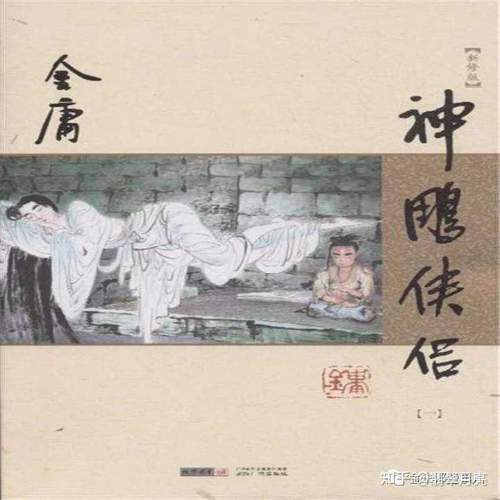

小龙女这个人完全细思极恐，金庸真是把她当正面女主来写的吗？ \- 翡翠月亮 的回答

今天是2024年2月19日。补充一下今天的热搜新闻哈：

![20 ： 27
< 返 回 （@丿 教 育 局 回 应 女 教 师 被 一
中 国 新 闻 周 刊 喜 可 》
+ 关 注
中 国
hibl
O [ 顶 ] 24 一 2 一 1915 ： 24 中 国 新 闻 一 已 编 辑
〖 # 学 校 通 报 女 教 师 出 轨 高 中 生 # ： 停 职 〗 2 月 19 日 ，
上 海 币 第 二 中 学 通 报 ： 近 日 ， 网 传 我 校 “ 一 女 教 师
与 学 生 存 在 不 正 当 师 生 关 系 ” 。 学 校 高 度 重 视 ， 立
即 会 同 相 关 部 门 开 展 调 查 ， 并 已 第 一 时 间 对 涉 事 教
师 予 以 停 职 。 后 续 ， 将 根 据 调 查 结 果 依 法 依 规 严 肃
处 理 。 # 律 师 解 读 网 传 女 教 师 出 轨 学 生 # # 已 暂 停 被
举 报 出 轨 学 生 女 教 师 工 作 #
情 况 通 报
近 日 ， 网 传 我 校 “ 一 女 教 师 与 学 生
存 在 不 正 当 师 生 关 系 ” 。 学 校 高 度 重 视 ，
立 即 会 同 相 关 部 门 开 展 调 查 ， 并 己 第 一
时 间 对 涉 事 教 师 予 以 停 职 。 后 续 ， 将 根
据 调 查 结 果 依 法 依 规 严 肃 处 理 。
市 二 中 学
2024 年 2 月 19 日
凸 赞
囝 转 发
评 论 ](attachments/0262ecc64089d256.jpg)

alt="Image">

如果你只看过各版《神雕侠侣》电视剧，还是不要来看这个回答了。实际上几乎所有版本的电视剧都对小龙女这个角色进行不同程度的美化。本回答是基于原著小说的情节进行的。

有兴趣的去搜一下2021年6月1号教育部发布的《未成年人学校保护规定》，看一下第三章第二十四条的规定。这个法规代表的不仅是我国，而且是当前全世界现代文明法制社会对涉及到未成年人的师生恋的共同一致的看法：那就是绝对禁止！强烈谴责！！（之所以扯这个，是因为评论区某龙吹蹦跶着要代表主流价值观 ，我也不知道她说的主流价值观指啥子）

以下为原回答：

很明显，不是。实际上，她是造成杨过一生悲剧的根源之一。

师生恋，在古往今来、古今中外都是不道德的，尤其是成年教师对心智未成熟的未成年学生主动勾引更是遭人诟病。原著中的小龙女，的确在二十岁的成年的年纪对刚满十六岁、尚未成年、还处于懵懂状态的杨过主动勾引，并诱导他发下了誓言。再加上杨过本身性格偏激叛逆，今后一生都陷在这个誓言的桎梏中，最终又回到了他并不喜欢的黑暗抑郁的古墓。

alt="Image">

alt="Image">

（神雕新修版封面和金庸人物纪念邮票都表明，小龙女和杨过是一种上位者与下位者的关系，甚至杨过还是儿童的模样。在古墓这样一种幽闭的环境里，小龙女是绝对的主导者，杨过则难以反抗。）

【她此时已年过二十，突遭危难，却有一个少年男子甘心为她而死，自不免激动真情，有如堤防溃决，诸般念头纷至沓来。

她坐在床上运了一会功，但觉浮躁无已，当下在室中走来走去，却越走越是郁闷，当下脚步加快，奔跑起来。杨过见她双颊潮红，神情激动，自与她相识以来从未见她如此，不禁大是骇异。小龙女奔了一阵，重又坐到床上，向杨过望去，但见他脸上满是关切之情，心中忽然一动：“反正我就要死了，他也要死了。咱们还分甚么师徒姑侄？若是他来抱我，我决不会推开，便让他紧紧的抱着我。”

杨过见她眼波流动，胸口不住起伏喘气，只道她伤势又发，急道：“姑姑，你怎么啦？”小龙女柔声道：“过儿，你过来。”杨过依言走到床边，小龙女握住他手，轻轻在自己脸上抚摸，低声道：“过儿，你喜不喜欢我？”

杨过只感她脸上烫热如火，心中大急，颤声道：“你胸口好痛么？”小龙女微笑道：“不，我心里舒服得很。过儿，我快死啦，你跟我说，你是不是真的很喜欢我？”杨过道：“当然啦，这世上就只你是我的亲人。”小龙女道：“要是另外有个女子，也像我这样待你，你会不会也待她好？”杨过道：“谁待我好，我也待她好。”他此言一出，突觉小龙女握着他的手颤了几颤，登时变得冰冷，抬起头来，见她本来晕红娇艳的俏脸忽又回复了一向的苍白。】

看吧，号称“不谙世事”的小龙女其实是懂得“姑侄师徒”的名份的。然而，她令人感到可怕的地方在于，披着不谙世事的外衣，毫无负担地做着突破道德底线的事情。所以主动勾引徒弟没什么，毫无顾忌地与“徒弟”在野外肆意交欢没什么，拿婴儿换解药没什么，答应他人求婚又随意悔婚没什么，杀郭靖黄蓉、投靠蒙古人也没什么。练玉女心经的时候她知道男女有别，大胜关之后就要与杨过公然睡一个屋；她教训郝大通的时候，言之凿凿地宣称“欺侮幼儿老妇，算什么英雄”，转脸就抱黄蓉刚出生的女儿换解药（要知道黄蓉此时正在生郭破虏，毫无反抗能力，抢夺一个正在分娩的产妇的孩子正常有良知的人都做不出来）；赵志敬不守信用，把杨龙果体练功的事情抖落出来，她憎恶赵志敬奸邪背信，转脸就在绝情谷对公孙止许婚再悔婚。总而言之，这世间的任何道德和法律对她无效。有利于她的时候，她就遵守；不利于她的时候，她就摒弃。

再补充一点，小龙女被侵犯的时候，竟然会毫不犹豫地认定是杨过做的，从而又惊又喜地主动迎合，原因仅仅是因为她爱恋杨过，而侵犯她的那个男人又没有胡子！

不说这可笑的逻辑，单单是她认定杨过会对她做这种事情，就足以说明小龙女毫无道德底线！这分明是在告诉所有人，在她看来，杨过就是能做的出这种卑鄙的事情，仿佛他们师徒从来没有朝夕相处过数年，而杨过对她的毕恭毕敬完全不存在——而且她很喜欢他这样对待她。

站在杨过的角度想一想，被自己最敬爱的、愿意拿生命维护其名誉的师父扣上QJ犯的帽子，会是怎样的一种欲哭无泪的体验？

还有就是古墓派要一个男人为自己而死的执念。小龙女明里暗里都非常希望杨过为自己而死。绝情谷里看到杨过被公孙止布下的渔网阵困住陷入危险之中时，她是没有任何担忧和慌张的，反而嘴角浮现了笑容，而且心里打定主意等杨过先死她再死，并且创造出“同死之乐”这么一个怪异的词来。

杨过后来的确是愿意为她而死。但是没有小龙女的长期渲染与洗脑，杨过是不会走到这一步的。要记得古墓里小龙女重伤时要杀杨过，那个时候的杨过可是有非常强烈的求生欲望。

让另一个人为自己而死，从来不是真正的爱，这只是一种极端而疯狂的占有欲。就像《房思琪的初恋乐园》里描述的那样，李国华会因为有女学生为自己自杀而得意洋洋。这种最终极的占有，让李国华陶醉，让他的自我膨胀到最大。

杨过是她的徒弟。在小龙女这里，他除了学习武功之外，或多或少会受到她人生观和价值观的侵染。所以前期的杨过是自私狭隘、充满邪气的。既不关心天下苍生，更要为了一己之私投靠蒙古人、刺杀郭靖。

《神雕侠侣》里，郭靖说过这么一句话，“为国为民，侠之大者。”

黄蓉说过这么一句话，“为人不讲‘侠义’二字，练武有何用处？活在世上又有何用处？”

武侠小说归根到底脱离不了一个“侠”字。杨过前半生在小龙女那里获得的言传身教，恰恰与这个“侠”字没有半点关系，反而背离甚远。国难当头之际，他想到的是，“（杀了郭靖黄蓉，换了解药）此后我和姑姑隐居古墓，享尽人间清福，管他这天下是大宋的还是蒙古的？”

看看，这是不是小龙女一贯的主张？

后来的杨过改邪归正了。在十六年里，他成长为行侠仗义、受人敬仰的神雕侠。而这一切恰恰发生在小龙女不在他身边的时候，他的思想价值观逐渐往郭靖和黄蓉的方向靠拢。

神雕侠侣中，不断出现蛇与雕两种动物。杨过遇到神雕与蛇相争时，他的选择是助雕杀蛇，实际上是表明他的价值取向抛弃了小龙女代表的价值观，选择了郭靖代表的价值观。小龙女的名字就是蛇的意思，郭靖不用说了，射雕英雄传的主角，为国为民的大侠。

试问，如果小龙女一直陪伴在杨过身边，他还会成为神雕侠吗？显然不会。他会早早地被小龙女带回古墓隐居起来当活死人。

更明显的情节是，襄阳大捷后，郭靖拉着杨过接受满城百姓的欢呼，杨过后悔了！

【二人携手入城，但听得军民夹道欢呼，声若轰雷。杨过忽然想起：“二十余年之前，郭伯伯也这般携着我的手，送我上终南山重阳宫去投师学艺。他对我一片至诚，从没半分差异。可是我狂妄胡闹，叛师反教，闯下了多大的祸事！倘若我终于误入歧路，那有今天和他携手入城的一日？”想到此处，不由得汗流浃背，暗自心惊。】

功成名就的杨过，真心感激郭靖的教导，视当年“叛师反教”为“祸事”，而叛师反教是他得以遇到小龙女并拜小龙女为师的唯一途径。他此时的后悔，足以证明他认为与小龙女相遇，并不是一件令他发自内心感到庆幸和愉悦的事情，反而有一种不堪回首的味道。

玉女心经有“敌意渐增”的设定。神雕中出现“斩毒龙，反空明”的说辞。还有屠龙刀的命名。杨过的玄铁剑打造成屠龙刀，用了这样一个凶险万分的名字，十分耐人寻味。

然而，说一千道一万，小龙女又的确是杨过最珍视的亲人、尊长和妻子。她在他走投无路的时候收留了他，传授他武艺。这样的深恩大德，需要他一生予以回报，所以即使暗自后悔与小龙女相遇，他也永远不会背叛她。或许正是杨龙间命运的拉扯，才让这部小说更加耐看吧！
