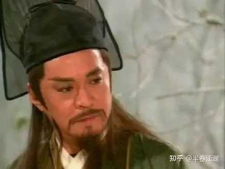
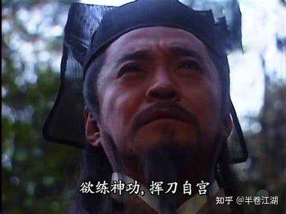

岳不群苦练气功几十年，为何看起来还是武功平平的样子？ \- 半卷江湖 的回答

岳不群苦练华山气宗至高内功心法紫霞神功几十年，但武功似乎也就那样。先不说左冷禅、任我行此类一流高手，岳不群前期简直就是被他们手拿把掐。药王庙之战，岳不…

很多人一直有个误会。

以为岳不群练了几十年紫霞神功，结果武功还是那样，是因为他“天赋不行”。

其实恰恰相反。

岳不群最大的问题，不是武功差。

是他根本就没打算当“高手”。

你回头仔细看《笑傲江湖》会发现一件特别诡异的事：

整本书里，真正天天琢磨“怎么变强”的人，基本都活得不像人。

左冷禅在练寒冰真气。
林平之练辟邪剑谱。
任我行练吸星大法。
东方不败直接把自己练成了另一个物种。

但岳不群不一样。

他前半辈子最在乎的东西，从来不是武功。

是“体面”。

这人特别像现实里那种什么人？

一个快破产的小公司老板。

公司没钱。
员工不行。
行业被大企业挤压。
自己天天焦虑得睡不着。

但每天出门——西装必须笔挺。

你觉得他真不知道自己快撑不住了吗？

他知道。

但他不能承认。

华山派当时什么情况？

说难听点，就剩个空壳。

原著里写得很明白，剑气之争以后，华山元气大伤，高手几乎死绝。到了岳不群这一代，整个门派已经衰成“五岳垫底”。

注意这个词。

“五岳剑派”。

听着很牛。

实际上呢？

恒山一群尼姑。
衡山莫大天天拉二胡。
泰山内部内斗。
华山穷得只剩面子。

整个五岳，本质上是一帮没落地方势力抱团取暖。

左冷禅为什么一定要并派？

很多人以为他是野心家。

不。

他是五岳里唯一一个看明白现实的人。

不整合资源，大家迟早一起死。

岳不群的问题就在这。

他根本不是个纯武林人士。

他是个“门派CEO”。

他每天琢磨的东西，和乔峰、风清扬这种人根本不是一个维度。

乔峰想的是：
怎么打。

岳不群想的是：
怎么活。

差别巨大。

所以你会发现岳不群特别喜欢干一件事：

“演。”

江湖人送外号“君子剑”。

alt="Image">

你仔细品品。

真正的高手，谁靠外号里的“人设”活着？

任我行不需要。
风清扬不需要。
东方不败更不需要。

只有弱者才特别在意“社会评价”。

因为实力不够的人，才需要道德包装。

这就像现实里一个人天天强调自己“靠谱”“老实”“讲义气”——你最好小心点。

真正有底气的人，不怎么解释自己。

岳不群练紫霞神功几十年，为什么看着没那么强？

因为他根本没法像左冷禅那样纯粹。

左冷禅是“职业武痴”。

岳不群是“中年掌门”。

他要养门派。
要经营名声。
要平衡五岳关系。
要培养弟子。
还得维持“正派领袖”形象。

这种人，内力练得再久，也练不成纯粹的杀人机器。

说白了：

岳不群不是练武的。

他是搞行政的。

你别笑。

原著里很多细节都说明这一点。

比如令狐冲闯祸之后，岳不群第一反应经常不是“怎么解决”。

而是：

“江湖上怎么看华山派？”

他特别在乎“名”。

甚至到了病态程度。

这也是为什么他后面一定会练辟邪剑谱。

很多人说岳不群黑化。

其实不是。

他只是终于发现：

“体面撑不住了。”

最扎心的一点来了。

岳不群前半生，其实特别像很多普通中年男人。

年轻时候觉得：

我慢慢熬。
慢慢练。
慢慢做人。

总会出头。

结果四十多岁一抬头。

发现时代根本不给你慢慢来的机会。

左冷禅已经要吞并你了。
任我行这种怪物随时复出。
徒弟开始不受控制。
老婆都未必完全信你。

这时候岳不群突然发现：

自己苦练几十年的“正统道路”，根本赢不了。

于是他崩了。

很多人觉得岳不群练辟邪剑谱，是因为贪。

其实更准确地说：

是绝望。

alt="Image">

因为他终于意识到：

按正常规则玩，自己这辈子都不可能翻盘。

这一刻特别像什么？

特别像现实里那些原本规规矩矩的人，中年以后突然开始变得极端。

以前瞧不起搞关系的。
后来自己开始求人。

以前看不上投机。
后来自己All in风险项目。

不是因为他们突然坏了。

是因为他们发现：

老老实实，真的会输。

所以岳不群最可怕的地方，从来不是“伪君子”。

而是：

他原本真想当个君子。

只是这个江湖，最后把他逼成了岳不群。
