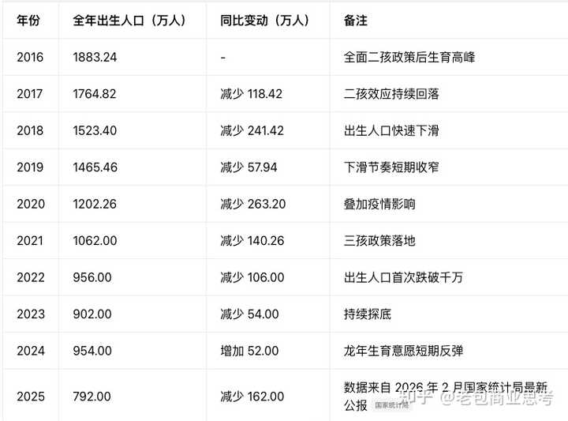
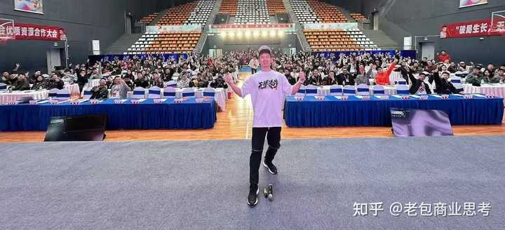

巴菲特为什么不减持可口可乐，反而减持比亚迪？ \- 老包商业思考 的回答

科技股和食品股有可比性吗，比亚迪如日中天，市场前景稳定盈利可口差远了

你会发现，不管是巴菲特还是查理芒格，都有一个很重要的投资理念，就是坚决不碰“苦生意”，那究竟该怎么样判断一门生意到底是不是苦生意？我认为有 5 个评估维度

首先第一个：复购

判断商业模式有一个很重要的因素，就是看它是越做越轻松还是越做越累，这中间很多人不知道怎么判断

有一个很简单的方法，你就看他产品的复购频次够不够高，如果一门生意没有复购，那它大概率会越干越累，我给你举个例子，比如你是一家卖车的公司，对于消费者来说，买一辆车很可能要使用 5—8 年都不会再次购买下一辆，那本质，你就只能不断做销售和营销的工作，今天拉来 10 个客户，交付完成，明天还得再拉 10 个，一天也不敢停下来，一旦前端需求量越来越少，那你的赚钱能力，必然会跟着下降

（就比如：几年前出生人口一年 1800多万，现在降了近乎 50%，等过了 10 年，20 年，这群孩子有用车需求了，在那个时间节点去看，假设有 100 家车企卖车，过去是 100 家抢 2000 万的客户总量，20 年后，100 家抢 1000 万的客户总量，更可怕的是，过去一年出生 1800 多万人，车企的工厂、4S 店、团队全是按年销 2000 多万辆的规模建的；等现在年出生人口降到 700\-900 万，20 年后首购需求直接砍半，重资产的产能、门店退潮的速度，远远赶不上需求下滑的速度 —— 这不止是 100 家抢 2000 万变抢 1000 万这么简单，是大量商家最后连汤都喝不到。你觉得这是“苦生意”还是“好生意”？）

alt="Image">

第二点：利润增加成本需不需要跟着同比增加

现金流不是评判好生意的关键指标，自由现金流才是！

就比如，对于一家房产公司来说，它开发了一个楼盘，一套房子卖出去 200 万，300 万，听起来卖房子很赚钱，但你换一个角度来思考

这 1000 户卖完了，他的收入是不是也就跟着停止了，这时候想要增加收入，他是不是需要再花钱去买地皮，然后找建筑团队去建造，今天赚的钱，很大部分还要二次投入

我就给你换一个简单好理解的角度：比如前几年你投资了 50 万开了一家火锅店，经营得非常好，每年能获得 100 万利润，这个就是上限了。你要想再赚钱，就要再去开一家火锅店，但是问题就在这儿，下一家店能赚钱不能你还不知道，但是你必须得要真金白银，先把那 50 万开店的成本扔出来，如果决策失误，开出来没人买单，或者位置没选对，客流很差，前面老店辛辛苦苦干一整年赚的钱，可能直接打了水漂，连个响都听不见。

这种生意的本质就是无限循环：你想多赚钱，就要多投钱，赚的钱永远都在路上，还要面临很多未知风险

第三点：看需求是萎缩还是在增长

决定一家公司未来能不能持续赚钱，很关键的因素就是看它所在这个行业的需求是不是长期存在，什么叫长期存在？非常简单，吃喝玩乐，衣食住行！这些行业从古至今几千年，需求一直没有消失！

但比如换成一家装修公司，你的需求很大一部分建立在，未来买房的人是多还是少？买房的人多，装修需求就多，你的生意才能好。

再比如换成一家养车店，你的需求很大一部分建立在，未来买新能源车的人是多了还是少了？如果买燃油车的用户越来越少，那你的机油保养业务要卖给谁？

你看巴菲特为什么喜欢可口可乐和喜诗糖果这样的公司？先不说他需不需要去计算未来的估值和投资回报，他只需要知道，10 年后人们还是会喝可乐，10 年后人们还是会吃糖果就可以了！

第四点：商业模式严重依赖“人”或者“不可控变量”的生意

比如设计公司、商业咨询公司，你整个业务的交付，全压在一个顶尖设计师、一个资深咨询师身上。客户冲的是这个人的能力、名气买单，根本不是冲你公司的牌子。一旦这个核心人员离职、出去单干，老客户能跟着走一大半，
你想扩张、想多接业务，就得再找第二个、第三个同水平的牛人，再比如影视行业，他的核心就是靠爆款剧本，一部戏爆了能吃一整年，连着压错三部剧本，很可能资金链就断裂了。

你会发现，好的商业模式都会想办法把人放在整个生意里相对不重要的位置，最典型的就是茅台，管理层换了一批又一批，但只要它的酒摆在那，谁来卖，都能卖出去

上面我提到这四条，其实就是我现在看生意的一个入门筛选关

然后我之所以不提像巴菲特、查理·芒格经常说的差异化呀，护城河这种，是因为我发现很多人学习网上的价值投资这些知识去看生意，总是习惯本末倒置，很多人背了一肚子专业名词，拿到一个项目，上来就分析有没有护城河、市场规模大不大，讲得头头是道，偏偏跳过了最根上的问题： 这门生意有没有稳定复购？赚的钱能不能真金白银揣进兜里？需求是越来越多还是越来越少？换一个人来经营它还能不能赚钱？

其他的所有维度，都是这四关过了以后，你才需要考虑的问题，如果生意从根上就是烂的，其他因素修饰得再漂亮也是泡影

以上仅代表我个人创业和投资 12 年对生意的理解（不构成任何投资建议）

alt="Image">我是老包，只讲长期有用的商业底层逻辑，点个关注，咱慢慢聊
