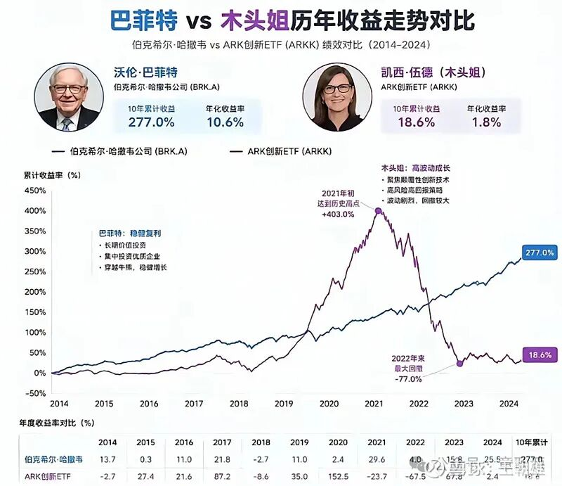

巴菲特和木头姐，这张十年净值图想告诉我们什么？

公众号名称：雪球

作者名称：

发布时间：2026\-10\-0621:00

风险提示：本文所提到的观点仅代表个人的意见，所涉及标的不作推荐，据此买卖，风险自负。

作者：王朝雄

来源：雪球

巴菲特和木头姐，这张十年净值图想告诉我们什么？

两个名字，两种风格，十年的答卷。

沃伦·巴菲特，伯克希尔·哈撒韦，十年累计收益277%，年化10\.6%。

凯西·伍德，人称“木头姐”，ARK创新ETF，十年累计收益18\.6%，年化1\.8%。

同一片市场，同一个十年。一个年化十个点，一个年化不到两个点。差距，不是一倍两倍，是五六倍。

__01 __

## 快的人，最终输给了慢的人

可如果你只看中途，故事完全是另一个版本。

2020年，木头姐的ARK暴涨152\.5%。2021年初，累计收益冲到403%——那是什么概念？你投100块，一年多变成500块。那时她被誉为“女版巴菲特”，无数人排队把钱交给她。

而巴菲特那一年在干什么？伯克希尔2020年只涨了2\.4%，跑输大盘一大截。网络上到处是嘲笑：巴菲特老了，巴菲特看不懂科技，巴菲特被时代抛弃了。

后来的事，你大概猜到了。

2022年，加息来临，成长泡沫破裂，ARK单年暴跌67\.5%，最大回撤77%。100块，从403块的高点，跌回不到100块。木头姐的十年累计收益，最后定格在18\.6%。十年，几乎白干。

而伯克希尔，2022年只跌了4%。十年里，只有2018年出现过一次小幅下跌，其余年份全部为正。没有一年惊艳，但十年加起来，是277%。

一个曾经赚过403%的基金，十年后输给了一个“只涨10%”的股票。__快的人，最终输给了慢的人。__

写到这里，我想你可能会得出一个结论：所以还是要价值投资，不要碰成长股。

先别急着下结论。

这个结论听起来很爽，但它经不起推敲。巴菲特不是没看错过科技股，木头姐2023年也反弹过67\.8%。如果你在2014年重仓伯克希尔，你同样要忍受2015年只涨0\.3%、2020年跑输一切的寂寞。任何一种风格，都有它难熬的时刻。你让巴菲特去拿十年ARK，他大概率拿不住；你让木头姐去拿十年伯克希尔，她大概率也嫌太慢。况且，如果再往后看两年，会发现木头姐的业绩又迎来了明显反弹，大幅度跑赢了巴菲特。

所以，这张图真正想告诉你的，可能不是“买谁不买谁”，而是另一件事。

你有没有想过，为什么木头姐的ARK在2020年能吸引那么多资金？因为那时它涨得最快。为什么2022年又那么多人割肉离场？因为它跌得最狠。

__追着最快的东西跑，和追着最惨的东西逃，其实是同一种人。__

而巴菲特最厉害的地方，不是他选股有多神，而是他十年里几乎没有一年让持有人崩溃。他的策略，和他的持有人的承受力，是匹配的。这本身就是一种能力——不是赚钱的能力，是“让人拿得住”的能力。放到自己身上，就是“让自己拿得住”的能力。

这让我想起投资里最常被忽略的一句话：__赚钱的方式有很多种，关键是你拿的是哪一种钱，你是什么样的人。__

同样的策略，用不同的钱、不同的人去执行，结果是完全不同的。有人用闲钱拿十年，有人用要买房的钱拿三个月，有人用借来的钱拿一个月——同一个巴菲特，同一个木头姐，结局天壤之别。

那张图里，真正残酷的不是两条曲线的终点，而是它们之间的落差。如果你在2021年初、ARK最风光的时候买入，接下来要面对的是77%的回撤——你可能等不到它反弹的那一天，就在半路割肉了。

这才是大多数人真正的问题：他们不是选错了标的，而是选错了自己承受不起的波动。

最近这一年，AI浪潮又起，到处是“十倍股”“新木头姐”的故事。我无意评判任何风格，只想请你问自己三个问题：

第一，如果一笔投资跌了77%，你睡得着吗？

第二，你买它的钱，是三年不用的闲钱，还是明年就要用的钱？

第三，你是在研究这门生意，还是在追逐一个涨得最快的名字？

这三个问题，比选股技巧都重要。

因为投资到最后，比的不是谁跑得快，而是谁活得久。快的人，可能需要承受一路常人难以熬过的跌宕起伏；慢的人，只要方向是对的，十年后也可能已经走了很远。

但真正难的，不是理解这个道理，而是做到。

__02 __

## 为什么最难的是"拿住"

你想想游戏是怎么设计的。短线交易的每一次操作，都有即时反馈，买完涨了，爽，卖完跌了，也爽，因为证明你看对了。这种爽是实时的，像刷短视频，每一分钟都有奖励。

而拿着不动是什么体验。什么体验都没有。一个月，一个季度，甚至一两年，账户就是趴着，中间还夹着几次像样的回撤，专治各种不服。

聪明人受不了这个。脑子快的人，手更快。他们能看见十个机会，就想十个都抓，结果每一次换仓，都是把正在滚的雪球摔到地上重新滚。摔十次，复利就清零十次。

你去看那些真正靠投资把时间变成朋友的人，性格上都有个共同点，能忍住不做点什么。这个忍，跟智商没关系，甚至智商越高越难做到，因为你能给自己的每个动作都编出一个像样的理由。

巴菲特在这一点上占了个便宜，他住奥马哈，不在纽约。离华尔街越远，屏幕上的机会就越少，雪球反而滚得越顺。他自己讲过，投资成绩跟智商关系不大，一旦你的智商超过125，多出来的部分都拿去交税了，剩下全看性子。 这话有他的道理。性子这东西，恰好是复利真正要考的那门课。

## \-END\-

