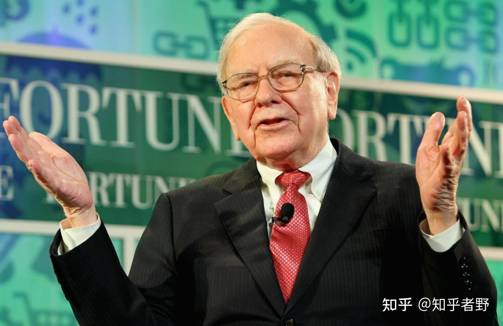

巴菲特手里攥着四千亿，一分钱不花。他在等什么？

四千亿美元。
以现金、国债、短债的形式，堆在伯克希尔的最新账目上。相当于人民币26760亿，超过了山西省去年全年GDP。
巴菲特的现金，还在涨。

想想之前，AI行情一片火热，无数人经历了“春风得意”的阶段。从韩国全民杠杆，到后来一地鸡毛。从国内科技翻倍，到高山站岗、老登崛起。那些说“巴菲特老了”“股神踏空了”“不买AI就是等死”的人。如今早已“先死了”。事实证明。不管多厉害的人，只要是人，终将为自己的贪婪付出代价。但传奇股神巴菲特，作为95岁的老先生，似乎早已超脱人性，觉悟成仙。

2026年一季度，伯克希尔做了两件事：
第一，现金储备冲到3973亿美元。历史最高。
第二，阿贝尔接手后，持仓从42只骤降到29只。清仓16只。包括Visa、万事达、联合健康。
这不是乱砍。是在“风声水起”时收紧了拳头。
与此同时，他把谷歌买成了第三大重仓股。一季度加仓谷歌\-A超过200%，二季度再增45%，合计市值377亿美元。
一手攥着近四千亿现金，一手在加息周期里高位加仓__。__
__巴菲特在股东大会上说了一句话话。他说，现在的股市，像“一座附带赌场的教堂”。人们来祈祷。但祈祷完，转身就上了赌桌。那个赌场，就是我们的账户。__

我记得韩国“全民最后疯狂”的那几天，我关掉交易软件，给我老婆发了条微信：“我想清仓。”她回了一个问号。我没解释。因为没法解释。在所有人都上头的时候，清醒也会被解释成愚昧。那天晚上我睡不着。翻来覆去想的不是AI泡沫会不会破裂。而是巴菲特那句话——“当前缺乏理想的投资环境，主因在于市场估值过高且标的稀缺。”他不是不买。他是买不到够便宜的东西。我们不是不想卖。我们是舍不得那个“万一涨回来”的幻想。

二季度，他们又增持谷歌。增持达美航空44%，持仓市值53\.69亿。增持住宅建筑商莱纳建筑近30%。增持梅西百货141%。新建仓霍顿房屋。科技、航空、房地产。三条线，都在赌一件事：利率见顶后的需求释放。航空赌出行、地产赌降息后购房回暖、谷歌赌AI的现金流。他不是在防守，他是在换阵地。从银行撤出来。连续两个季度减持美国银行。为什么？因为加息周期里，银行的息差逻辑变了。长端收益率居高不下，10年期美债4\.93%，30年期5\.28%，近20年新高。银行持有的债券在贬值。加息对银行，不是利好。

所以，我们的视角要切换了：
巴菲特的仓位，不是“看空”或“看多”。他是一张路线图。他用四千亿现金告诉你：现在不着急。他用加仓的方向告诉你：等价格到位了，我买什么。所以真相是——巴菲特的四千亿，不是“不敢买”。是利率太高了。高到连他都觉得，拿着短期国债吃利息，比买股票划算。通俗讲，利率高的时候，现金是有价格的。当量级发生了质变，哪怕只有1%的利息，也够很多人奋斗终生。

伯克希尔在加息周期里，把现金当成了资产。而我们大多数人，把现金当成了“没赚到钱”。

二季度伯克希尔回购了约45亿美元自己的股票。他在买自己。因为他觉得，当下投资自己，比投资市场上大多数东西有用。

“巴菲特在等。我也在等。区别是——”
“他等的是价格。我等的是机会。但至少，我们都在等。等一个不会来的降息。等一笔舍不得割的仓位。等一个“万一涨回来”的幻想。

我们都在等。但巴菲特告诉我们：等的时候，手里得攥着东西。”
