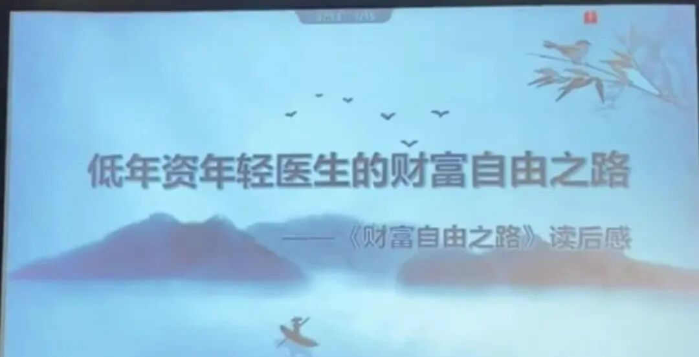

弃医，才是低年资医生的财富自由之路

公众号名称：丁酉霜降

作者名称：红墙外人

发布时间：2026\-09\-0118:34

众所周知啊，弃医，才是低年资医生的财富自由之路

因为出租时间的人永远买不起自己的时间；

低年资医生从实习的第一天起。医疗系统就只教过你一种赚钱模式，那就是用时间来换钱；

但工资从来不是支付的工具，它只是一个维持系统统治的工具；

它是医院买你别饿死，但也别辞职，能够继续干活的保底价格；

想财富自由，靠出卖时间完全没戏；

\-\-

我们应该见过很多医生博主在工作几年以后就辞职的案例了；

他们做医生的时间其实还没有做博主的时间长，低年资医生干了几年，就提桶跑路；

因为当医生，已经严重影响了他们财富自由之路；

当你发现做医生以外，你还可以有其它选择的时候，就会惊讶地发现脚下这条路实在太差了

弃医，才是低年资医生的财富自由之路

\-\-

《纳瓦尔宝典》里面写到；

财富是你睡觉的时候，还在替你赚钱的东西；

这个东西，叫做资产；

医生每天出卖自己的时间，像个挑水的工人，挑一天就喝一天，手停口停；

而资产是水管，修好管道之后，不用挑水，张嘴就能喝到水；

自媒体的风口已经吹了很久，直到如今仍然有大量的机会，你的社交账号，就是那跟水管，不断的产出内容，纳瓦尔最经典的一句话，把你自己产品化，这，才是低年资医生的财富自由之路。

\-\-

有一个叫 Dan Koe 的美国创作者，向公众传递了一个“一人公司”的思路，就非常适合低年资医生；

一人公司的核心理念是：“先别急着辞职，用工资养着自己，业余时间把一个人活成一家公司”

其实核心就是一件事情，把卖时间的事换成攒资产。

路径是先做内容，攒下受众；有了受众，攒下信任；有了信任，再谈产品。

产品可以是咨询、是课程、是社群，但地基永远是信任。

内容怎么做，就是把你的能力、你的特长，变成可以重复卖、规模化交付的产品。

这一点，医学院，从来不会教你。

核心就三个步骤：学习、构建、分享。

比如你会写作，就把经验、技巧总结成免费和收费内容；

你是皮肤科、整形美容专业的，你就把美容、化妆、护肤内容做成视频教程；

把你擅长的事情，产品化，再用互联网杠杆去放大；

那些辞职的医生博主们，都是研究生期间误打误撞开始做博主，总结归纳自己的观点，公开对外输出自己的见解，并且得到观众的评论与反馈，不断迭代自己的思考和产出的内容，收获粉丝，同时变现自己的流量。

\-\-

你学医多年，老师教你怎么救人，但从来没人教你怎么救自己。

低年资的这些年，你可以只攒下工龄，也可以同时攒下资产。

同样的夜班，有人上完只剩黑眼圈，有人上完多了一条选题。五年之后，这两拨人会活成完全不同的物种。

但是不要冲动辞职，因为你目前的主业仍然是你创业的种子资金。对我们医生来说，主业还多了两重价值，临床是你源源不断的选题库，白大褂是你花钱都买不来的背书。

\-\-

纳瓦尔说，人生所有的回报，财富、关系、知识，全部都来自于复利。所以我们要去玩一个长期游戏，也跟长期的人去玩；

在医院内，你的价值由职称、年资，还由别人屁股底下的那个位置决定；

而在体系之外，你的价值只有你攒下的资产决定；

熬年资是在别人的楼里爬楼，而攒资产是在给自己的楼打地基；

你爬的再高楼也是医院的，但地基是打在自己的名下，我们没赶上建高楼、宴宾客的好时候，那就为自己建一栋楼，建一个持续供水的管道吧。

我希望有一天你还在临床，是因为热爱，而不是因为不敢走。

\-\-

最搞笑的一点就是，要讲这个课的老师，人都没有来到会场，自己都跑路了。

我想这个老师的亲身所作所为，就是对这个讲课主题的一次，无比直观的演示了吧。

最高级的财富不是钱，是自由，是对自己时间的所有权。

关注我，就能学到更多知识。
