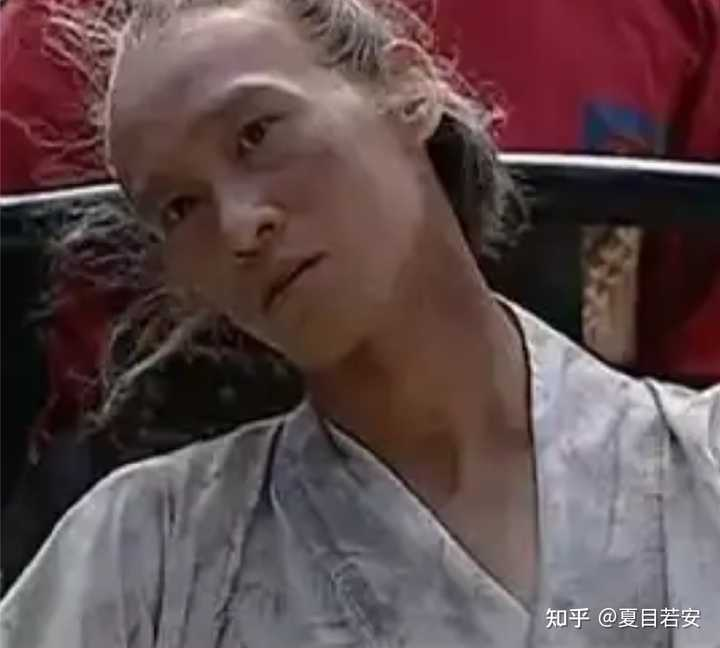
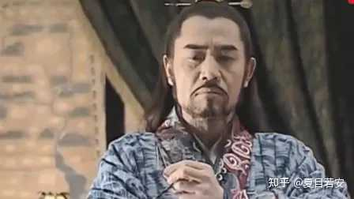
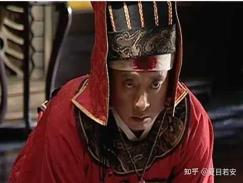

__问题描述：__

如题

你看嘉靖怎么对吕芳和陈洪就知道领导栽培你和利用你是什么样了。

《大明王朝1566》吕芳两次被嘉靖贬去南京守皇陵。

第一次是张居正提出“改稻为桑”增加国库收入，老百姓也能挣到钱。

这件事被严嵩截胡，交给严世蕃手下的人去干。

严党联合富商沈一石想低价购买百姓的田地，从中牟利。

浙江一把手胡宗宪看出严党的阴谋，一再劝严世蕃派去的高翰文不要随意签字。

国库空虚，改稻为桑迟迟无法推进。

嘉靖王朝已经把六年后的税收收完了。再这样下去，只能丢给嘉靖子孙一个空壳子王朝。

改稻为桑迫在眉睫，可一把手胡宗宪不配合，派去的高翰文不签字，严世蕃情急之下想了个水淹浙江的昏招。

浙江被淹后推出了司礼监的李玄。胡宗宪心腹马宁远以及倒霉的两个知县定罪（ 张知良、常伯熙）。

本以为案件有人背黑锅到此就结束了。

可嘉靖想利用胡宗宪倒严。胡宗宪“宁可不做名臣也不能做小人”拒绝了嘉靖。

于是，嘉靖对胡宗宪不满，准备拉胡宗宪下马。

alt="Image">

但胡宗宪毕竟是一品大员，又从未贪污，且在抗倭上起了非常大的作用。

__想整治胡宗宪也得有个名头吧？__

于是，嘉靖授意二次去浙江的杨金水，将被封的沈一石家产卖给胡宗宪老乡拉胡宗宪下水。

这事后来要不是海瑞掺和一脚，还真让嘉靖把事办成了。

海瑞想保胡宗宪，他就去查浙江九县被淹的事情。本来已经结案的事情，最后又牵扯出没头脑和不高兴（郑泌昌、何有才）以及宫里。

__嘉靖作为皇帝是不能有污点的，这个锅最多只能司礼监去背。__

于是，事情牵扯到司礼监，杨金水装疯。

alt="Image">

但海瑞咬着不放，__一个疯了的杨金水没办法抗住这个雷。__司礼监一把手肯定要帮着抗雷的。

这个时候，嘉靖以吕芳私会严嵩、徐阶为由将吕芳派去南京监修皇陵。

__看似贬了吕芳，实际上是将吕芳从浑水中捞出来。__

吕芳被派去南京，这就有了“二祖宗”陈洪暂代司礼监掌印太监一事。

__嘉靖真心对吕芳好，却拿陈洪当刀使。__

我们看嘉靖后续对陈洪，也可以看出嘉靖是真不拿陈洪当人。

吕芳去了南京之后，嘉靖闭关半个月，__这半个月三派人的所有奏疏都压在陈洪那。__

嘉靖让陈洪去跟严党和清流派周旋，自己安坐钓鱼台。

alt="Image">

后浙江事情没牵扯到吕芳，__风波过去之后，嘉靖又将吕芳调回来做掌印太监__。

吕芳调回来之后，嘉靖也没冷着陈洪，反而派了很多事情给陈洪干。

让陈洪产生一种错觉－－__皇上最依赖、看重的人是我。__

就比如嘉靖要带走裕王府的冯保。

他知道世子（未来的万历皇帝） 和冯保冯大伴感情深厚。比家人都亲，于是吕芳要去宣旨，嘉靖说：

“你别去了，叫陈洪去。”

陈洪这一去不仅得罪了未来的皇帝裕王，还有未未来的皇帝万历以及未来的太后李侧妃。

alt="Image">

__嘉靖知道自己身子骨不行了，脏活、得罪人的活都交给陈洪干。__

__我们再来说说吕芳第二次被贬南京。__

__吕芳第二次被贬南京还是因为海瑞。__

胡宗宪打完胜仗，浙江的桑树也种下之后，海瑞萌生了退出官场的念头。

恰逢这时海瑞看到他手下的官兵欺负百姓，于是他决定继续当官。

他没去朝廷安排的好地方，却要去严嵩老家。向严党宣战。

严嵩的人将他派到了一个非常穷且苦的小县城（离严嵩老家还有点距离）。

海瑞在严嵩老家扎根几年，干出了业绩，严嵩倒台后，海瑞被调到了京城。

进京之后，海瑞第一件事就是去找__嘉靖的茬，向这腐败的朝廷开刀。__

alt="Image">

海瑞来到严嵩倒台前提词的店铺\-\-六x居。

海瑞问老板生意为什么差，老板不敢说叫海瑞赶紧走。

可海瑞不仅不走，还给六必居重新定义了，他写了一张纸丢给老板。

六必居有锦衣卫把守。海瑞写完字锦衣卫就跟着海瑞了，同时海瑞的字也被送到宫里去了。

嘉靖看着海瑞的字非常恼火。

可海瑞是儿子裕王的提拔的人，不管海瑞承不承认，在外人眼里海瑞都是裕王的人。

嘉靖叫让将字送到裕王府，并问吕芳：

“裕王是不是对朕不满？”

吕芳心里生了退意。他没和从前那样理智中立的发言，他反而帮裕王说话了。

__嘉靖意识到吕芳想退了__，后面很多活都交给陈洪去干了。

后来吕芳成功着陆。

陈洪也因为带走冯保得罪了未来帝王一家。

陈洪成了司礼监掌印太监，__他以为自己权力滔天，却不知嘉靖一直拿他当挡箭牌__。

嘉靖45年冬，雪天，嘉靖的道场终于修好了。

道场修好之后，嘉靖喝了李时珍开的药和黄大伴黄锦一起去看道场，顺便偷偷看一下被陈洪带走的冯保。

黄锦见一个太监对着冯保，又打又骂，想要站出来训斥那个太监，被嘉靖拦住了。

嘉靖告诉黄锦：“道场修好了，朕也准备退位了。朕以后就在道场里清修了。你不要跟陈洪硬碰硬，你不是他的对手。”

__嘉靖又跟黄锦解释，严嵩倒台之后，脏活，得罪人的活，总有人要去干__。

嘉靖准备退位了，所以让吕芳去南京。看似是贬，实际上是让吕芳安养晚年。

嘉靖告诉黄锦，以后在陈洪面前要低调些，顺着陈洪些。等他退了，他就没办法保护黄锦了。

嘉靖还告诉黄锦：“能杀死陈洪的只有冯保一人。”

他估计将冯保从裕王府调走 ，就是让陈洪去得罪冯保。

嘉靖跟黄锦说——__我用陈洪是因为他是把好刀，他够锋利，够狠，他好用__。

脏活得罪人的活，总有人要去干，__吕芳不干，你也别干。将来新帝登基你才能跟吕芳一样得善终__。

alt="Image">

说完电视剧，我们来说说怎么判断一个领导是不是真心对你好。

你看嘉靖对吕芳、黄锦和陈洪就知道了：

__1\. 利益分配：看“功劳”归谁， “黑锅”谁背__

· 真栽培 \(嘉靖对吕芳\)： __领导会像嘉靖护吕芳一样，在风暴来临前把你“调离现场”。你犯的错，他轻轻放下；你立的功，他帮你放大__。

· 假利用 \(陈洪\)： __领导会把最得罪人的活派给你，美其名曰“锻炼”。__你只是他手中那把“脏刀”，利益归他，风险归你。

就像嘉靖让陈洪去带走冯保，得罪了两代未来的皇帝，而陈洪还以为这是“信任”。

__2\. 任务性质：看是“背锅挨骂”，还是“建功立业”__

· 真栽培： __交给你的任务，通常是容易出彩、能积累资源、能让你在高层面前露脸的。__即使任务有挑战，他也会给你匹配相应的支持。

· 假利用： 交给你的任务，往往是“地平线以下”的——__比如去处理烂摊子、去传达坏消息、去做违反规则或得罪所有人的“脏活__”。

__得罪人的活嘉靖都叫陈洪去干__。比如叫陈洪去带走冯保，叫陈洪去打锦衣卫朱七、齐大柱、十二板子。叫陈洪去跟李清源等文官斗……

功在嘉靖，过在陈洪。

__3\. 成长路径：看是“长期规划”，还是“短期消耗”__

· 真栽培： __领导会给你容错空间，允许你在非关键事务上犯错并成长。他会帮你规划一个清晰的、有上升通道的路径__。

就像我之前的文章说到的，吕芳在冯保犯错之后，将冯保派到裕王府，并进行深夜谈话，告诉他“为官三思”。

他教导冯保要好好伺候小世子，并且在裕王王府低调反思。

后来冯保获得了裕王妃的信任以及世子的依赖，__也为后来冯保成为万历王朝第一大太监奠定了基础__。

可以说，没有吕芳的教导和谋划，就没有未来的冯大伴。具体内容看下面这篇文章👇👇👇

[如何判断一个领导值不值得跟随？](https://www.zhihu.com/question/655760443/answer/2030254432684856310)

· 假利用： __领导只关心你当下能帮他解决什么问题。你一旦失去利用价值，__他会立刻把你“置换”掉。你的能力没有被系统性培养，只是在被反复“压榨”。

就像嘉靖坏事找陈洪，好事找吕芳。

__4\. 私下态度：看是“坦诚交底”，还是“画饼充饥”__

· 真栽培： __私下里，领导会给你必要的提醒和点拨，甚至会告诉你一些“背景信息”和“雷区”，帮你规避风险。他骂你，往往是针对具体做事方法，而不是否定你这个人。__

嘉靖告诉黄锦，他要退位了，叫他不要跟陈洪斗。“你斗比过他”。这种关键信息坦诚，就是拿你当自己人。

吕芳人前处罚了冯保，人后将冯保派去照顾未来皇储，就是真栽培。

· 假利用： __私下里，领导只会不断强调“我多看重你”、“年轻人要多吃苦”、“下次一定提拔你”。好事却从未想到你。__

夏目若安总结：

· 真栽培，是__让你“做事”，更让你“做人__”——愿意用他的资源为你的成长“买单”。

· 假利用，是只让你“干活”，不让你“活好”——他把你当工具，__只在意你的即时产出，你的风险、成本和未来，都不在他考虑范围内。__

要分辨这两者，最核心的试金石就是： __当出现真正的危机或利益需要取舍时，他是选择牺牲你来保全他自己和项目，还是选择保全你？__

就像嘉靖宁可让陈洪去得罪全天下，也要护吕芳周全。这就是“栽培”和“利用”的本质区别。

职场上，__把你当陈洪是常态，把你当吕芳是幸运__。

千里马常有，而伯乐不常有。
