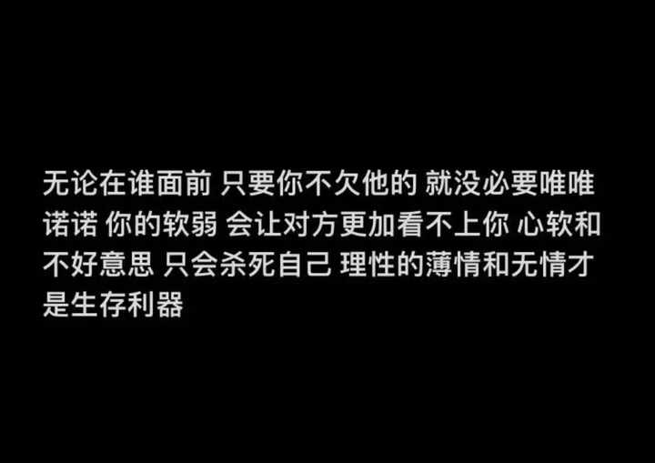

悟透了什么道理之后让你的人生越来越顺了？ \- 北鸢bei 的回答

alt="ZhiHu logo">

[关注](https://www.zhihu.com/signin?next=%2Ffollow)

[推荐](https://www.zhihu.com/signin?next=%2F)

[热榜](https://www.zhihu.com/signin?next=%2Fhot)

[专栏](https://www.zhihu.com/signin?next=%2Fcolumn-square)

[圈子](https://www.zhihu.com/signin?next=%2Fring-feeds)

[AI Works](https://www.zhihu.com/project-square)

[Beta](https://www.zhihu.com/project-square)

[故事](https://www.zhihu.com/fiore/h5/vip-web)

[直答](https://zhida.zhihu.com/)

切换模式

[哲学](http://www.zhihu.com/topic/19551646)

[成长](http://www.zhihu.com/topic/19554943)

[人生哲学](http://www.zhihu.com/topic/19605894)

[人生感悟](http://www.zhihu.com/topic/19657625)

[人生思考](http://www.zhihu.com/topic/19792088)

## 悟透了什么道理之后让你的人生越来越顺了？

关注者

__544__

被浏览

__110,213__

登录后你可以

不限量看优质回答私信答主深度交流精彩内容一键收藏

[查看全部 211 个回答](http://question/3269055313)

我获得快乐的秘诀就是不能细想。

alt="Image">

[发布于2024\-11\-1116:14](http://www.zhihu.com/question/3269055313/answer/28559305546)・

江苏

[查看全部 211 个回答](http://question/3269055313)
