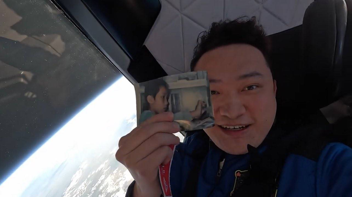

我们应该向孙宇晨学习什么？ \- 马超 的回答

孙宇晨在《这世界既残酷也温柔》里，写过他的一个高中同学。

27岁，学校是父母选的，单位是父母安排的，跟谁结婚是由父母决定的。同学在电话里说，自己活得很痛苦。孙宇晨写道： "电话那头的他声音很疲惫，透着无奈。在我看来，虽然已经27岁了，但他仍然是个孩子。他从没有自己选择过、决定过。当决定留在惠州的那一刻开始，他就注定了受制于人。"接着，他抛出了自己思想里最核心的一句话： "一个人的成年不在于年龄有多大，而在于第一次做出主观的选择，并愿意承受这个选择所带来的代价。人要学会主动选择并承担责任，即使失败了，也是高贵的。"

这就是“孙学”的起点。

孙割说孙学的本质，是赢。无论你在哪里，无论你处于什么时代，无论你出生在什么家庭，都要努力成为赢家。这句话听起来甚至有点俗，但如果你真的把孙宇晨过去十年的经历放在一起看，会发现“赢”背后其实藏着一套非常完整的生存逻辑。孙学可能不是教你怎么成为孙宇晨，而是在教一个普通人，如何在一个不确定的世界里，尽可能增加自己赢的概率。

“孙学”并非一门严谨的学术理论，而是一套极端生存实用主义。它的核心教义包括：极度看空旧资产，全面拥抱高流动性的数字资产；利用一切手段获取注意力，并将注意力转化为金融溢价；以成败论英雄，财富是洗刷一切争议的终极洗涤剂。《这世界既残酷也温柔》的翻红，是年轻一代在变局中寻找希望的投射。

“孙学”的火爆，不仅是孙宇晨个人的胜利，更是时代精神变迁的镜像。

过去三十年，社会的成功路径是线性的：好好读书、考个好大学、进大厂或考公、买房结婚、阶层跃升。然而这一路径近年来遭遇了系统性挑战。研究生扩招导致学历通胀，名校毕业不再是高薪保证；互联网大厂裁员，“35岁危机”成为悬在每个人头顶的达摩克利斯之剑；买了房的年轻人发现，不仅没有财富自由，背负巨额负债的同时还面临着房产贬值的压力。按部就班的“长期主义”显得苍白无力。年轻人渴望“逆袭”，渴望非线性的、爆发式的成功。“孙学”恰恰提供了一个非线性的范本：不靠拼爹，不靠熬资历，而是靠认知、靠风口、靠敢赌。更深层的变化是价值观与现实的背离。传统商业伦理讲究“君子爱财，取之有道”。但现实中，年轻人看到的是老实人吃亏，投机者发财。

在所有关于“孙学”的讨论中，最容易被忽略的一点是：他的方法论可以被模仿，他的叙事可以被复制，但那种在绝境中依然不崩盘的精神结构，几乎无法被移植。创立 TRON 后，挑战接踵而至：监管政策突变、行业周期性崩盘、项目质疑和长期舆论围剿，他没有沉默消失，反而在社交平台上更新每日进展，哪怕只有寥寥数语。还有，谁还记得他在夜里更新的火币入职日记？他无非是把所有压力都压进身体里，再反向炼成让自己更锋利的动力。

连江湖中传说的“绯闻女友”曾颖，自诩孙学首席弟子，都这样评价他：“和他在一起的那段时间，我从未见过他有哪怕一秒钟的情绪失控……那时我喜欢他的，是那种几乎偏执式的‘永不屈服的意志力’，以及在绝境里仍能爆发出的强大生命力。”

孙学，其实是一种极端清醒的现实主义：

世界之所以残酷，是因为它不为任何人的情绪负责；

世界之所以温柔，是因为它仍然奖励那些清楚规则、愿意承担后果的人。

真心希望，那些一直拿孙宇晨开玩笑的人，有一天能认真听他完整地讨论一个问题，看看他如何拆解现实、为长期下注。

你不一定要喜欢他，但你很难否认，他是一个在严肃思考的人。

孙宇晨的书名，来自他对这个时代的判断。冯仑在推荐序里替他做了概括： "这世界是残酷的，因为它只看结果，即使一个人再努力，也只能被廉价的自我感动蒙蔽双眼；这世界又是温柔的，因为这个飞速发展的互联网时代承认每一个人的价值，给了每一个人自由的、独立的、不被他人束缚的实现梦想的机会。"

孙宇晨自己说得更直接。他区分了“存量”和“增量”： "这个时代是一个注重增量，而不注重存量的时代，换句话说，时代更看重你将带来什么，而不是你曾经拥有什么。"

在这一套逻辑里，你现在的处境，无论好坏，都不重要

"这个时代既残酷，也温柔。残酷的是，成就与光荣一旦发生，就没有任何价值了；温柔的是，失败与困难一旦出现，也变得无足轻重。手里有一千万现金和欠着一千万的债，本质不影响任何事情。"

"__影响你内心深处的东西，并不是你是千万富翁还是'千万负翁'，父母是飞黄腾达还是病重在床。重要的是你要回到内心深处，问问自己想做什么？能做什么？__"

孙宇晨曾经把自己的整套价值观，浓缩成一段宣言：

"我坚信自我的力量，我永远都不会为他人而活，也从不要求他人为我而活。"

"我相信奋斗的力量，相信靠个人奋斗获得成功、突破阶层板结，是这个世界上最体面、最值得骄傲的事情。"

"我相信财富的力量，财富自由是实现人格自由独立的先决条件，财富是改变世界最善良的力量。改变世界，从赚到一分钱开始。"

"我倡导30岁前，不买房不买车不结婚，共享经济，将绝大多数的时间、金钱、精力都投入到自我提升、个人成长、灵魂自由中。"

"我坚信，这些在我们这代人中是稀缺、少数派的观念，将在十年、二十年后，最终成为中国绝大多数人的主流生活观念。"

"我也坚信，我们将随着观念持续成长，渐渐成为一个拥有自由人格、能独立思考、勇于承担责任、在重大历史变革中可以被依靠的人。"

"我们可以自信地说，当历史的洪流袭来时，卷走了所有人，但它卷不走我。"

alt="Image">
