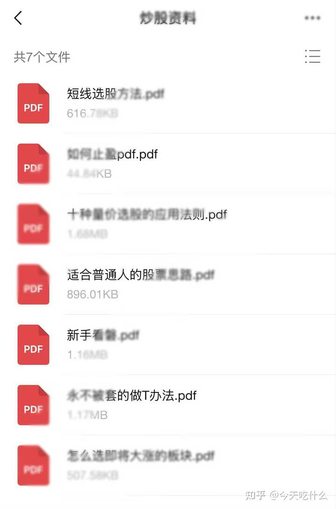
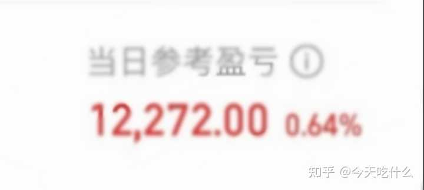

我很好奇你们炒股是怎么学的？ \- 今天吃什么 的回答

1\.永远半仓

不要一次性满仓操作，预留可用资金应对波动。上涨不会踏空焦虑，遇到回调也有钱补仓摊薄成本，最大化控制持仓风险

2\.只买1支

资金体量不大时，不要同时持仓多只个股。分散持仓容易顾此失彼，集中精力研究一只，减少意外踩雷概率

3\.只盯3\-5支

自选股不要塞满几十只股票。长期重点跟踪3～5只强势标的，熟悉股性，避免漫无目的选股、盲目出手

4\.不碰ST股

ST股票存在退市风险，利空来袭时极易连续跌停，流动性枯竭很难卖出，普通投资者尽量回避

5\.没机会就空仓

空仓不是踏空，不操作就不会产生亏损。市场行情混乱、没有确定性机会时，耐心观望远优于强行交易被套

6\.只做右侧上涨

拒绝盲目左侧抄底。不要预判底部进场，等待趋势企稳、行情走出上涨信号后再考虑入场，降低抄底持续亏损风险

7\.短线快进快出

短线交易核心是落袋为安，达到预期收益不要贪心长时间持有。短线行情切换极快，贪心很容易由盈利转为亏损

8\.10点后操作

早盘开盘半小时资金波动剧烈，诱多、诱空十分常见。等待盘面情绪稳定，方向明朗之后，再进行买卖决策

9\.暴跌时选股

大跌行情中静下心筛选优质标的，逆向思考。坚决不跟风高位追涨，追涨往往买在短期情绪最高点

10\.亏5%割肉

提前设置止损标准，小额亏损不及时离场，一旦行情走坏，亏损会持续放大，形成深度套牢

11\.盈10%减半仓

达到目标收益先兑现一半利润，把收益牢牢锁定。剩余仓位可以顺势博弈更高行情，进可攻退可守

12\.节前减仓

长假期间外围市场、政策容易出现突发消息。降低持仓仓位，规避假期未知的黑天鹅风险

13\.不融资加杠杆

杠杆会放大盈亏，一旦行情反向运行，亏损会加速扩大，极端行情下甚至有账户清零风险，普通人远离融资

14\.不碰无量票

长期成交量低迷的个股流动性差。想要卖出的时候很难成交，股价小幅抛压就容易出现大跌，属于资金冷门陷阱

15\.看量辨主力

学会结合成交量判断资金意图:缩量震荡大多属于洗盘阶段，高位持续放量，大概率是主力借机出货

16\.只跟板块龙头

同一赛道内，板块龙头股资金关注度最高，上涨弹性更强。一轮行情里，龙头往往拥有更大的上涨空间

17\.淡看消息面

不要单纯依靠利好、利空新闻买卖。很多公开消息存在滞后性，市场经常出现利好落地下跌、利空落地上涨的情况

18一年1次主升浪

大级别上涨行情并不频繁，不用幻想每天都有赚钱机会。耐心等待主线主升行情，减少日常无效频繁交易

alt="Image">

alt="Image">
