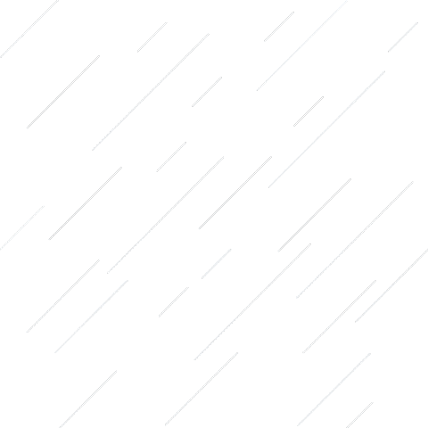
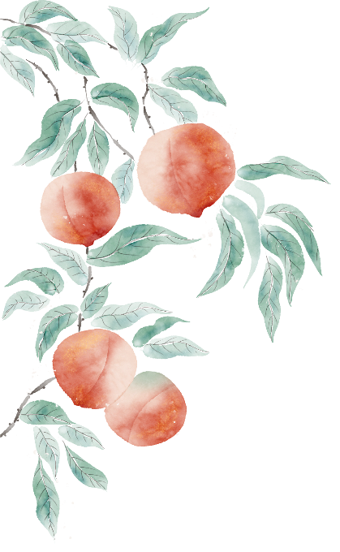

我的经方之路第一百四十期——无锡任卉医生的经方故事

公众号名称：经方医学工作室

作者名称：任卉

发布时间：2026\-09\-2314:15

__我的经方之路__

__第__

__140__

__期__

__无锡市中医医院皮肤科__

任卉

__经方故事__

从学校毕业后，我成为了一名皮肤科医生。读书时需要经常跟随老师抄方，带教老师的处方，无论是基本方还是加减用药，常常难明其理。带教老师又没有太多的时间解释，到毕业时头脑中对于开方用药都是很困惑的。进入临床后，凭借着学来的几张处方，应付门诊是没有问题的，临床也有效，但是加减比较困惑。自己的内心，有很多疑问，中医药有没有效？自己开的方子有没有效？那时的我，一直没有寻找到中医的门径。

幸运的是，医院引进了很多专家，刚参加工作的我，就加入了龙砂学会，并于2016年4月拜师黄煌老师。每一次黄煌教授来无锡门诊，只要不影响门诊工作，我都尽量跟诊学习。我读黄煌先生的书，听老师授课，观摩先生带教门诊，那时的我还没有意识到经方的可贵性，只是感受到黄煌老师高洁的品质，因为老师不保守，愿意讲解用药思路以及个人经验，学习之后我感觉不难，能懂，可操作。

对于经方的认可，源自我的一次尝试。我的第一个经方病人，至今都令我印象深刻。患者是因面部一小片红斑伴瘙痒来就诊的，常规用药是口服抗组胺药联合外用药膏。患者无意提到口腔溃疡病史，且每月发作一次。抱着试试的心态。我开具了黏膜修复剂甘草泻心汤。1年之后患者找到我，告之当年中药一剂痊愈，口腔溃疡发作次数也减少。今日因为皮损复发而来复诊。

慢慢的，我开始在临床尝试经方治疗。我在临床遵循黄煌经方的思路，经方药味简洁，费用不高，患者的依从性明显变好。但是我还没有将经方运用自如，有些患者因为疗效一般而去了专家主任那里。但是，我依然相信经方在临证中是有效的，甚至是有惊奇的疗效，只是我还不会用。当然，成功的喜悦还是很多的。

记得用小柴胡汤治疗青春期女孩痤疮，家长满意疗效，继续配药的。

用半张防风通圣散让闭经半年的湿疹患者月经复来，瘙痒缓解，要求积极治疗的。

用大黄蛰虫丸治疗慢性荨麻疹，患者皮损缓解，舌及唇色明显缓解，介绍其他患者来复诊的。

用温胆汤和半夏厚朴汤治疗湿疹，较传统治疗方法消退皮损更快，患者夸奖我肯钻研的。

用温胆汤和真武汤、桂枝茯苓丸治疗老年湿疹，皮损消退1年后未复发。

用小建中汤治疗小儿血管炎，患者顺利激素减量的。

经方能解除病患的痛苦，也带给我无以言表的满足。我对经方的信仰，也变的更加的坚定。能遇到经方，遇到恩师，今生何其有幸。

医学有局限，无论是传统医学还是现代医学，面对复杂的疾病，能认识清楚，完全治愈的疾病还是少数，中医不是万能的，经方也有他的局限。恩师常说：读经典，跟名师，勤临床。我一直都记着。我需要不断学习，尽量用己所能，服务更多人。

__验案分享__

__01__

__五苓散加减治疗湿疹__

任某，男，64岁。

__初诊：2024年9月20日__

__主诉：__躯干部瘙痒2月。患者近2月来躯干部反复瘙痒。就诊时腰部对称红色斑疹。晨起口苦，口中异味。有口腔溃疡，反酸。胃纳一般，大便尚调，入睡难易醒。舌红苔白腻。查体：腹软。有甲状腺结节、脂肪肝、高脂血症、高血压病史。有大量饮酒史，无吸烟史。

__西医诊断：__过敏性皮炎。

__证型：__湿热内蕴。

__处 方__

生白术20g，茯苓20g，泽泻20g，猪苓20g，桂枝15g，甘草20g。7剂。

__二诊：2024年9月30日__

瘙痒缓解，原皮损色淡。入睡难易醒仍有，睡眠质量有所提高，口中异味减轻，排便有力，咽痛改善，新发口腔溃疡较前变浅，疼痛度减轻。原方加茵陈20g。

__三诊：2024年10月14日__

腰部皮疹消退，无瘙痒。无口腔溃疡。自觉舌苔明显好转，舌红，苔薄白腻。原方续服。患者仍在随访中。

__按语__

患者体型中等，腹部膨隆，营养状况较好，北方人，喜饮白酒。口苦，口中异味，反酸说明患者存在消化道症状。脂肪肝、高脂血症提示患者存在代谢类疾病。舌红苔白腻提示体内痰湿较重。笔者以代谢类疾病和大量饮酒史为抓手，投以五苓散，不仅皮损消退，消化道症状减轻，舌苔也明显改善。酒助湿热，口苦提示肝胆郁热，加用茵陈取其清热利湿之义。因口腔溃疡反复发作，加甘草。五苓散加茵陈也是黄教授常用的加减方法。

五苓散是一张利水方，传统的通阳化气、健脾利水方。现代研究提示能保肝、降脂、抑制乙醇性脂肪肝形成。患者没有饮停胃肠的振水音，没有明显的口渴、小便不利、腹泻、肢体浮肿等水蓄于体内的表现。但是醉酒史和代谢障碍疾病也是使用五苓散的指征。笔者在临床工作中，根据患者的病情，常选用五苓散治疗伴随代谢疾病的患者，尤其是脂肪肝患者，体型肥胖者，效果较好。

__02__

__柴胡加龙骨牡蛎汤治疗瘙痒症__

张某，女，48岁。

__初诊：2024年9月21日__

__主诉：__臀部瘙痒2周。患者臀部瘙痒，无明显皮疹。胃纳可。大便通畅。存在睡眠障碍，心烦易醒，醒后需要2\-3小时再入睡。平素口苦矢气多，疲劳感较重。舌红苔薄脉弦。查体：腹软，余无特殊。无系统疾病。身高160cm，体重70kg。

__诊断：__瘙痒症。

__证型：__肝郁化火。

方选柴胡加龙骨牡蛎汤。

__处 方__

柴胡15g，姜半夏10g，党参10g，黄芩10g，茯苓10g，桂枝10g，生龙骨10g，生牡蛎10g，熟大黄10g，干姜5g，大枣15g。7剂。

__复诊：2024年10月11日__

臀部瘙痒减轻，睡眠改善，无入睡难易醒情况，口苦减轻，大便通畅。予原方10剂续服。

__按语__

患者存在体型壮实，长脸，疲倦貌，话语不多，川字眉，睡眠障碍的临床表现。从患者体貌特征长脸胸大肚儿凸来看，考虑柴胡人，口苦症状提示少阳病症，亦是佐证。结合睡眠障碍，笔者考虑柴胡龙牡汤。该患者腹诊无腹力偏强，两胁下按之无明显抵抗感，也没有大便干结难解的症状，但是患者的睡眠症状较为突出。

柴胡龙牡汤是一张很好的情志病方，传统的和解安神方，现代研究提示能抗抑郁、改善焦虑情绪、镇静、安眠等，尤其适合神经系统疾病。笔者大胆尝试后，睡眠症状改善非常明显，无大便稀溏，皮肤症状也随之改善。

总结

笔者运用经方从方证的角度选方用药的几率大，参考人的体质特点，作为选方的佐证。从人的角度选方用药还需要训练。黄煌教授一直强调，有是证用是方，原方最好用，原方最有效，加减有法度。笔者在临证时，谨遵老师教诲，不轻易加减，唯恐破坏了方义。笔者感悟经方疗效确切，毋庸置疑，今后还将在经方的学习之路上继续努力。

免责声明

•本公众号所载医案，均为个人经验总结或文献摘录，旨在交流学习，分享中医知识，传播健康理念。不能替代执业医师的当面诊断和治疗建议。请勿将内容作为自行诊断或用药的依据。

•请读者知晓并同意，如有任何健康问题，应及时前往正规医疗机构就诊，咨询专业医师意见，切勿依照本文自行诊断耽误病情。

•本公众号及运营者不对任何个人或团体因依赖本文内容而遭受的损失承担责任。

黄煌经方医学工作室

地址：南京市鼓楼区凤凰西街208号

电话：025\-86538120

