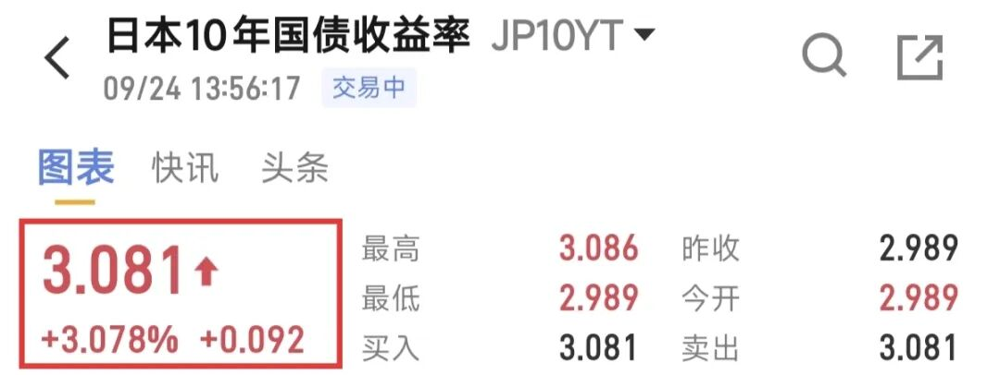
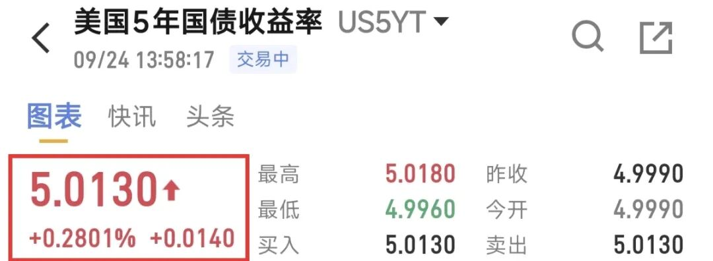
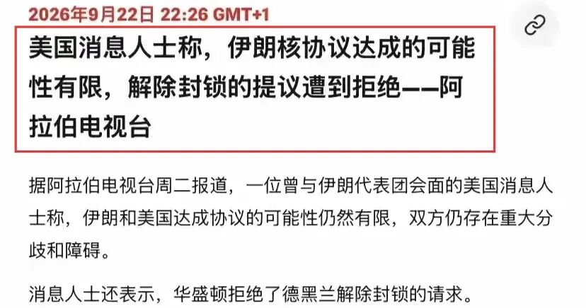
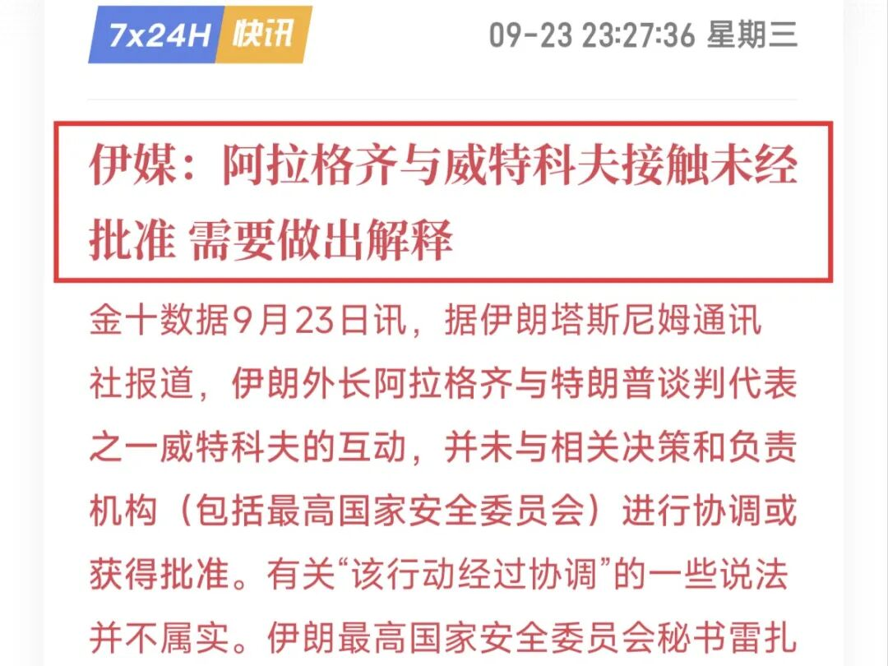
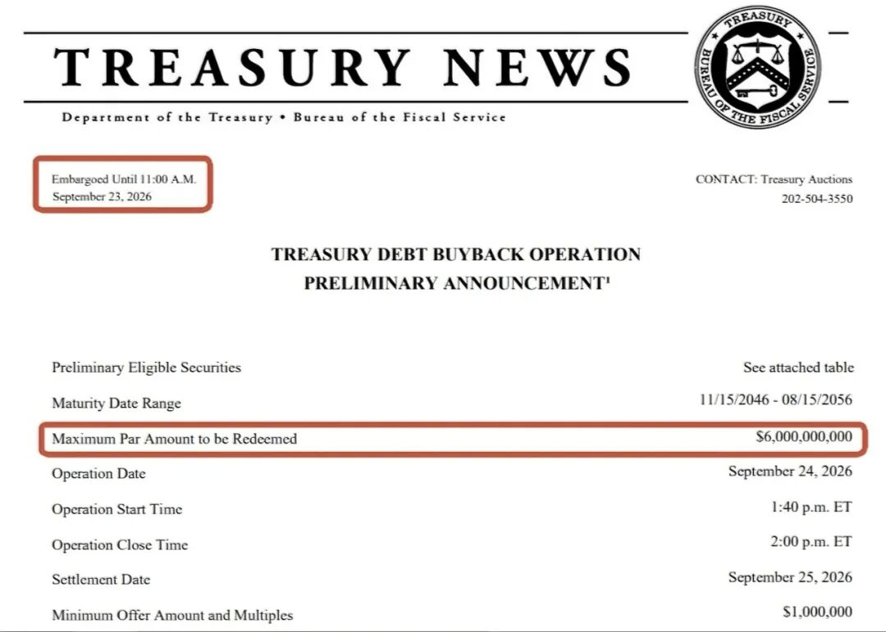

拉响警报！全球债务危机！！

公众号名称：淘沙博士

作者名称：淘沙博士

发布时间：2026\-09\-2415:03

麻烦了，全球债市又被干碎了，美债、日债全完犊子。

10y日债收益率，飙升至3\.08%，创1996年以来新高；5y日债突破2\.36%，创历史新高。

__恐慌直接引发了熔断__，大阪交易所不得不暂停长债期货交易。

说实话，国债熔断还真不常见，美债30年来只发生过一回，在2020年。

但这已经是日债30年来的第三次了，头两回发生于2022年，日央行退出YCC时。

另外一边，美债也没好到哪去。

5y美债收益率突破5%！创2006年以来新高。

注意：这是5y美债，属于__中期债券__，可不是10y、30y哪种超长期国债。

10y美债收益率达到5\.13%，30y突破5\.41%，均创2007年以来新高。

甚至连2y这种短债，收益率都摸到4\.95%，逼近5%大关。

这意味着利率期货市场，再一次对美联储和财政部，__投下了不信任票__。

市场不认为5%的10年期美债，可以对通胀形成震慑作用，于是开始交易6%的新中枢。

不，6%的无风险利率，那股票还怎么玩？

一边是6%的稳定回报，另一边是期望10%、但也有可能亏钱的股票，换作是你，你选哪个？

小资金赌赌无所谓，但对大资金而言，想都不用想，直接梭6%完事。

10万块的6%，一年只有6000，基本没啥卵用；1个亿的6%，每年稳定挣600万，而且躺着就行，那还要啥自行车？

所以美联储本月第一次加息，对美元和股市没啥影响，纳指甚至还创了新高，因为市场不认为会连续加息。

但昨晚美元涨超101，美股普跌，反映的正是__美债利率上移这一预期__。

那为什么市场突然又认为要连续加息了？

直接原因有三点：

1\. 美伊谈崩，美国不接受伊朗提出的条件，油价再次冲高，通胀韧性走强。

甚至连伊朗内部，都出现了矛盾。

伊朗国安委最高秘书雷扎伊表示：阿拉格奇与维特科夫在纽约的接触，__未经最高层授权__，阿拉格奇需要做出解释。

看样子，伊朗内部的情况非常复杂。

2\. 贝森特本月长债回购规模，只有60亿美元，再次低于市场预期的100亿美元，说明财政部有心无力，嘴炮大于实际行动。

3\. 多国为保汇率，不得不抛售美债。

之前主要是日本，__现在连印度都加入了__，甚至不排除印尼，美债的抛压越来越大。

另外随着日元再度逼近160关口，日本央行可能又要干预，贝森特坐庄日元失败。

但本质原因，还是日本经济停滞，无法通过多收税、做大资产规模等方式，来偿还超额利息，只能借新还旧，从而进入死亡螺旋。

美国这边的情况，要略好一些。

但高通胀导致美联储必须加息，强美元又迫使多国抛美债、保汇率，美债收益率走高，再次倒逼加息预期。

贝森特无奈，只能通过多举债来拉饥荒，也没好到哪去。

总之，中东的问题不解决，油价下不来，财政纪律不恢复，__那全球债市就好不了__：利率越来越高，肯定会对股市造成负面影响。

所以今天大A走成这个样子，实属正常。

一方面昨晚美股下跌，另一方面今天又缩量了1100多亿，仅成交1\.67万亿。

外围跌，缩量，那怎么可能涨呢？

还是控制好仓位，收拾下心情，准备过节吧。

在这个阖家团圆的时刻，都暂时忘掉股票的烦恼，享受家人陪伴的温情。

祝大家中秋节快乐，节后回来股票长虹！

全文完。
