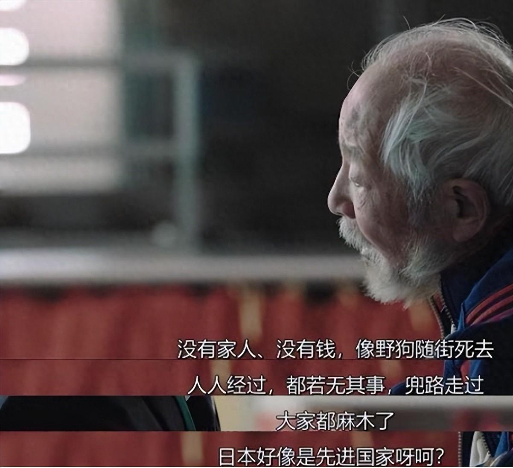

日本医疗黑色十年：从医疗费亡国到医生跑路，一个全民皆输的循环

[源网页](https://zhuanlan.zhihu.com/p/2079240731240281258?share_code=OgVAvn1wyDis&utm_psn=2079823704373178696)

上世纪90年代到2000年代初，日本经历了一段被称为“医疗黑色十年”的时期。
这段历史之所以值得今天的我们重新审视，是因为当时日本面临的几乎所有困境——老龄化加速、医保支出暴涨、财政压力巨大、医患关系紧张、医生负荷过载——在当下都能找到高度相似的镜像。

历史不会简单重复，但理解日本当年是如何一步步走进那个死胡同、又是如何走出来的，也许能帮我们少走一些弯路。

要理解日本医疗的崩塌，得先从它的辉煌说起。
上世纪70年代是日本医疗的黄金年代。经济高速增长，财政充裕，日本在医疗上花钱毫不手软。1973年，日本实施“70岁以上老人免费医疗”，全民医保覆盖范围不断扩大。“一县一医大”政策在全国铺开，医学院持续扩招，医生数量稳步增长。

那时候的日本医生，是社会地位高、收入体面、受人尊敬的职业。患者对医生普遍信任，医疗体系运转顺畅，日本的人均预期寿命一路冲到世界前列。
但繁荣之下，隐患已经埋下。
进入80年代，日本人口增速放缓，日本做出了一个影响深远的误判：他们认为未来医生会过剩。于是从1982年开始，大幅削减医学院招生名额，计划到1995年减少10%。

这个判断的致命缺陷在于：它只盯着总人口数量，忽略了老龄化带来的“医疗需求乘数效应”。65岁以上老人的人均医疗消耗是年轻人的4到5倍，老年人口每增加100万，对医疗资源的消耗远不是简单的线性增长。
更不巧的是，就在日本削减医生培养的同一时期，老龄化开始加速。1990年，日本65岁以上人口占比突破12%，正式进入深度老龄化社会。老年患者数量井喷式增长，5年间65岁以上病患数从不到200万暴涨至360万。

一边是医生培养被踩了刹车，一边是医疗需求踩了油门。供需错配的种子，就这样在黄金时代末期种下了。
真正的转折点，是泡沫经济的破裂。
90年代初，日本经济泡沫破灭，财政收入骤降，但医保支出却因为老龄化而持续攀升。1992年日本医疗财政支出约22万亿日元，到1995年就突破了27万亿，三年多了近5万亿。
“医疗费亡国论”开始在日本盛行。按照当时的老龄化速度推算，有人警告日本财政将在十五年内因医保支出而破产。

在巨大的财政压力下，日本选择了一条看起来最直接的路——控费。而且是极端控费。
第一刀砍向药品。1991年，厚生省出台政策：所有药品价格每两年强制下调一次，不考虑成本和研发投入。整个90年代，日本药品价格平均下降了45%，仅药品降价一项就为医保节省了超过15万亿日元。
代价是整个制药行业的大溃败。日本药企从1700多家减少到500家左右，处方药企业从570家锐减到170家。行业平均利润率降到6%以下，研发投入几乎停滞。

更严重的是质量滑坡。为了压缩成本，一些企业开始使用劣质原料。药物不良反应报告数量从1990年的2032起飙升到2002年的16478起，增长了整整8倍。
1996年爆发的“绿十字事件”成为压垮行业声誉的最后一根稻草。绿十字公司为了降低成本，长期使用未经病毒灭活处理的血液制品，导致超过1400人感染HIV，其中648人死亡。这起“平成艾滋药害事件”至今仍是日本医药史上最沉重的一页。

第二刀砍向医院。厚生省推出按病种定额支付制度（类似DRG），超支部分由医院自行承担。在老龄化严重的日本，老年患者往往多病共存，很难在定额内完成治疗。四分之三以上的医院陷入亏损。
为了活下去，医院只能把压力转嫁给一线医生。医生的考核标准从“医术和患者满意度”变成了“能不能用最低的成本把病人打发走”。一些坚持合理诊疗的医生，反而因为超支受到处罚。
控费的前五年，就有1\.1万名医生从公立医疗体系辞职。

如果只是钱的问题，也许还能扛。但真正摧毁日本医疗体系的，是三重压力的叠加：__超负荷工作 \+ 医患信任崩塌 \+ 刑事追责风暴。__
__先看工作强度。日本四成公立医院医生每周工作超过80小时，远超“过劳死危险线”。规培医生处境更惨，很多人没有工资、没有社保，甚至需要自费打零工维持生活。1998年的“森大仁猝死事件”震动了整个社会——一名26岁的研修医生在连续高强度工作后倒下，人们才意识到所谓的“医生培养”，某种程度上是在用人命堆。__

再看医患关系。1997年开始，日本医患纠纷数量暴涨。到2000年，全国医患纠纷超过3000起，而5年前还不到300起，5年翻了10倍。
经济下行期，社会戾气加重，医生成了情绪的出口。媒体不断渲染医生是“人生胜利组”、“高薪不负责任”，公众对医疗行业的敌意越来越浓。1998年到2003年被称为日本的“医疗严惩化”时期，刑事起诉的医生数量超过了此前40年的总和。

1999年是关键的转折点。横滨市立大学附属医院的换错手术事件和东京都立广尾医院的消毒液误注事件，彻底改变了日本医疗事故的叙事方式。医疗事故不再是医院内部的问题，而是变成了社会事件、法律事件、媒体事件。
这本身不是坏事。
患者权利意识觉醒、医院加强安全管理、建立事故报告制度，这些都是医疗体系现代化的必经之路。问题在于，安全体系的建设速度，远远跟不上追责的力度。

2002年青户医院事件，三名泌尿科医生因腹腔镜手术中患者死亡被同时逮捕，这是日本首次因医疗事故同时逮捕三名医生。2004年，日本最高法院对广尾医院案作出终审判决，明确医生对“异常死亡”负有通报义务——也就是说，患者在医院死亡，医生必须报警，不报警就是犯罪，哪怕报警可能导致自己被定罪。

医生们开始意识到，他们面对的不再只是“能不能救活患者”的职业挑战，而是“患者死了自己会不会坐牢”的生存风险。
2006年的大野病院事件成了压垮心理防线的最后一根稻草。福岛县立大野医院，一名29岁孕妇因产科最凶险的并发症——胎盘植入——在剖宫产中死亡。主刀医生加藤克彦被警方逮捕，罪名是业务过失致死和违反医师法通报义务。

这个案件之所以震动日本医学界，是因为胎盘植入本身就是致死率极高的并发症，医生的处理存在明显的专业判断空间。如果连这样的病例都要追究刑事责任，那产科几乎没人敢做了。
后果很快显现。产科、儿科、急诊这些高风险科室的医生大规模流失。全国8127家医院中，有634家倒闭，其中70%是妇产科和儿科医院。1994年埼玉县的一名产妇深夜临产，被14家医院先后拒收，最终不幸身亡——这样的“产妇转院死亡”事件，在之后的几年里反复上演。

2003年，日本医生离职潮达到顶峰，医生缺口高达13万人。留下的医生人人自危，防御性医疗开始泛滥：高风险手术不做，复杂病情不收，疑难病例一律推诿，所有诊疗能保守就保守。
一个曾经以优质医疗著称的国家，在短短十年间，走进了“医生不敢看病、百姓看不上病”的死胡同。

回头看日本医疗黑色十年的逻辑链，其实非常清晰：
第一步，老龄化加速 \+ 财政紧张 → 医保承压。
老年病人越来越多，政府钱袋子越来越空，控费成了唯一选项。
第二步，极端控费 → 医疗质量下滑。

药价砍到底，医院定额支付，医生超负荷工作。药品质量下降、服务质量下降、人才流失。
第三步，质量下滑 \+ 公众权利意识觉醒 → 医患矛盾激化。
患者觉得花了钱没得到好服务，媒体推波助澜，社会情绪被点燃。
第四步，刑事追责加码 → 医生自我保护。
风险高的科室没人去，风险高的手术没人做，能转走的病人绝不留下。防御性医疗成为行业常态。

__第五步，防御性医疗 → 医疗质量进一步下滑。__
__该治的不敢治，该收的不敢收，老百姓看病更难了，医患矛盾更尖锐了。__
__这是一个完美的恶性循环：每一环都在加剧下一环，每一步都看似合理，合在一起却是一场全民皆输的悲剧。__

最讽刺的是，最初的目标是“控费”，走了一圈下来，费用并没有真正降下来——过度检查、反复转诊、病程延长、并发症增加，反而让整体医疗支出在波动中继续上涨。
省下来的那点药费和床位费，最终以另一种方式还了回去，还搭上了医患信任和医疗质量。
日本医疗体系的触底反弹，大概从2004年开始。

标志性的一步是新临床研修制度的实施。本意是打破大学医局对医生培养的垄断，让年轻医生可以自由选择研修医院。虽然短期内加剧了地方医院的医生短缺，但从长远看，它承认了规培医生的劳动者身份——必须发工资、必须有劳动保障，从制度上终结了“无偿研修”的黑暗历史。
紧接着是一系列系统性纠偏：

__一是承认医生不足，扩招医学院。__
__日本推翻了80年代“医生过剩”的判断，开始逐步增加医学招生名额。虽然医生培养周期长、见效慢，但至少方向纠正了。__
__二是重建医疗安全体系。__
__2001年成立医疗安全推进室，2002年要求所有医院建立医疗安全管理指针和事故报告制度，2003年要求设置医疗安全管理者。医疗事故从“追责优先”转向“安全优先”，鼓励医院主动上报不良事件而不是隐瞒。__

__三是调整医保支付方式。__
__从单纯的定额控费，转向更精细化的支付方式，承认老年多病共存的现实，避免医院因为收治复杂病人而亏本。__
__四是推出长期护理保险。__

2000年日本开始实施介护保险，把老年人的长期照护需求从医疗体系中剥离出来，减轻了医院的压力，也让失能老人得到更专业的照护。这一步尤其关键——很多“压床”的老年患者，其实需要的不是医疗而是护理，把他们转到护理体系，医院才能腾出手来治病。
五是改善医生执业环境。

对医疗事故的刑事追诉逐渐回归理性，不再把所有不良结局都归咎于医生过错。司法实践中开始引入“医疗水准”判断标准，尊重专业判断空间。
这个过程不是一蹴而就的。从2003年的谷底到日本医疗体系真正恢复元气，又花了将近十年。有些创伤至今没有完全愈合——比如产科和儿科的医生短缺，在日本部分地区至今仍是问题。

日本的这段历史之所以值得今天的国人认真读，是因为我们面前摆着几乎一模一样的命题：__老龄化加速、医保基金承压、控费成为主线、医患关系紧张、医生负荷过载。__

很多信号已经出现。
医保方面，退休人员医疗支出超过在职人员、抚养比持续下滑、基金收支“剪刀差”扩大，这些和日本90年代的轨迹高度相似。控费方面，药品集采、DRG付费、医保飞行检查，这些政策本身有其必要性，但力度和节奏如果把握不好，会不会也走向“为了控费而控费”的极端？

医患关系方面，伤医事件时有发生，网络上对医生的苛责声浪不绝于耳。“只要病人没治好就是医生的错”这种结果论思维，和日本当年的社会心态如出一辙。
更值得警惕的是防御性医疗的苗头。现在很多人去医院都有一个共同感受：医生越来越“谨慎”了。能做检查绝不凭经验判断，能转院绝不留院，能保守治疗绝不冒险。患者觉得医生不负责任，医生觉得我不这样做哪天出了事担不起——这个死结，日本当年结结实实地打过。

__医疗最残酷的规律就是：当全社会习惯极致压成本、舆论习惯性苛责医生、追责只看结果不看过程，最先跑路的一定是骨干良医，最后崩塌的一定是全民医疗体系。__
__这不是危言耸听，这是日本用十年时间、几千家医院倒闭、上万名医生离职换来的血泪教训。__
__日本黑色十年最深刻的教训，不是“不该控费”，而是控费不能以牺牲医疗质量和医生尊严为代价__。医疗是一个高度依赖人的行业，把医生逼走了、逼怕了，省下来的那点钱，最终会以更高昂的代价还回来。

医保要可持续，医疗质量要保障，医生要得到尊重——这三者不是非此即彼的零和博弈，而是必须同时实现的目标。偏废任何一端，系统都会失衡。
日本花了十年走进黑洞，又花了十年才慢慢爬出来。而这个教训，毫无疑问是深刻的。

内容效果不满意？[点此反馈](https://feedback.notebooksyncer.com/feedback/858c6001_1788648646780?u=https%3A%2F%2Fzhuanlan.zhihu.com%2Fp%2F2079240731240281258%3Fshare_code%3DOgVAvn1wyDis%26utm_psn%3D2079823704373178696&s=onenote)
