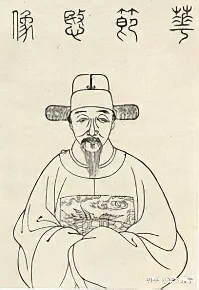
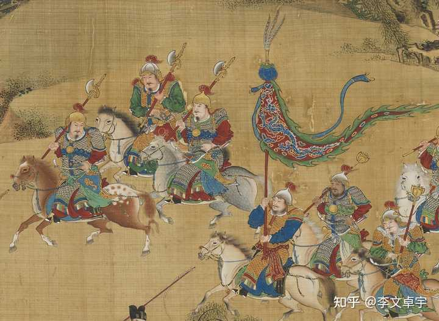

明末财政陷入困难的根本原因是什么？ \- 李文卓宇 的回答

为什么16世纪到17世纪的大明政府会陷入财政困难，这是由什么造成的？

崇祯五年的深秋，大明帝国的首席财务官、户部尚书毕自严，在自己的公案前熬白了最后几根头发。

alt="Image">

他面前摆着的是一笔无论如何也算不平的账。

在正史的记载里，毕自严是个非常无趣的人。

他不搞党争，不爱清谈，每天的日常就是在一堆枯燥的赋税黄册、边饷报表中拨算盘，在那个满朝文武都在用理学经典互相攻击、比拼谁的道德更纯粹的年代，毕自严就像个异类。

他只认数字。

当时的大明朝，其实已经是个随时会散架的破车。

辽东前线在打仗，西北流寇在造反，到处都在要钱，崇祯皇帝每天在深宫里急得跳蹦子，动不动就下发措辞严厉的圣旨，逼着户部变出银子来。

为了抠出钱，毕自严把帝国财政精细化到了令人发指的程度，史料上说他是算无遗策，连边疆驿站里一匹马每天吃几把黑豆，他都要折算成银两，列入考成。

他靠着这种精打细算，硬是给崇祯续了五年的命。

但就在这一年，毕自严翻车了。

不是因为贪污，而是因为他做了一笔假账。

起因是一个叫华允诚的监察御史闲着没事去查账，发现兵部和户部在核算山东前线军饷时，有几万两银子的亏空对不上。

alt="Image">

华允诚立刻像闻到血腥味的鬣狗，上疏弹劾。

案子查到最后的真相让人哭笑不得，这笔钱并没有落入哪个贪官的口袋。

真实的情况是：前线断粮了，负责运粮的官员为了救急，擅自挪用了一笔本该发往别处的库银买粮。

按照大明律，挪用公款是死罪，毕自严知道前线将领的难处，为了保住这个干实事的官员，他在账面上做了手脚，把这笔窟窿平了过去。

结果，事情败露，崇祯皇帝勃然大怒，认为自己最信任的理财大臣居然也欺君罔上。

毕自严被剥夺官职，扔进了诏狱。

我之前看毕自严传的时候，总觉得这个故事是不是有点太刻意了。

一个经手过上千万两白银、给国家省下无数钱财的宰辅级高官，最后因为替下属掩盖几万两的救命粮款而下狱，这似乎太有戏剧性了。

所以我顺着这几万两银子研究了一下，就这样，我在这寻找的过程中发现了一个规律。

我们来做一道数学题。

假设，现在辽东前线的士兵快饿死了，崇祯皇帝下令，向江南的老百姓征收一万石大米，运到前线去。

老百姓交了一万石米，欠债还钱，纳税当差，自古皆然。

那么，前线的士兵能吃到多少？

很多人说，因为是各级贪官污吏层层克扣，等到了前线，可能只剩下一半，所以明朝亡于腐败。

但事情的真相远比单纯的贪污要残酷得多。

江南的米要运到辽东，走水路，要经过大运河。

粮食装船，要雇纤夫、水手，这些人要吃饭。

到了北方，水路不通了，要改成陆路，一万石米，需要成百上千辆大车，需要几千匹骡马和几千个民夫。

重点来了，这骡马和民夫在路上走，每天都要消耗粮食。

从山东或者直隶把粮食运到辽东锦州前线，在十七世纪的交通条件下，大概需要走一两个月。

明代有一个叫徐光启的人，就是那个引进番薯、跟传教士翻译《几何原本》的人。

他也算过这笔账，他得出的结论是：在陆地运输中，如果距离超过一千里，那么为了运送这一石米，路上的民夫和骡马，要把这一石米全部吃光。

也就是说，运达率是零。

这叫物流损耗，它不以皇帝的意志为转移，也不受道德水平的约束。

那么，为了保证前线能收到一万石米，江南的老百姓到底需要交多少？

答案是：可能需要交三万石，甚至四万石。

多出来的那两三万石，全都在漫长的运输线上，被车夫、骡马、押运的士兵消耗掉了。

这时候，如果你是毕自严，你会怎么想？

这账根本就算不平，你如果如实向崇祯报告：陛下，为了给前线送一万石米，我们需要向百姓征收四万石。

崇祯会觉得你是个傻子，或者是个巨贪，他会立刻把你剁了。

如果你只向百姓征收一万石，那么等粮食到了前线，可能只剩下两千石。

士兵吃不饱就会哗变，比如后来著名的吴桥兵变，起因不就是孔有德的部队在冰天雪地里挨冻受饿，最后因为一只鸡而造反的吗？

为了解决这个死局，明朝的官员们发明了一种办法：折色。

既然运粮食损耗太大，那我们让江南老百姓别交米了，交银子。

银子好拿，轻便，我们把银子运到前线，让前线的将领自己去买粮食。

alt="Image">

这听起来很聪明，但现实很快就给了大明朝一记响亮的耳光。

当几百万两被称为辽饷的白银被强行从江南抽调，源源不断地运往辽东的时候，辽东发生了一件奇妙的事情。

通货膨胀。

辽东本来就不产多少粮食，加上连年打仗，田地荒芜。

现在突然涌入巨量的白银，市场上的粮食总量却没有增加，结果是什么？

粮价飞涨。

据《崇祯长编》记载，崇祯初年关外的米价有时候能涨到五六两银子一石，是内地的十几倍。

士兵手里拿着朝廷发给他的几两碎银子去市场上买粮，发现连半个月的口粮都买不到，他拿着银子，看着空空的米缸心里会怎么想？

他会觉得朝廷抛弃了他。

于是，士兵哗变或者投降后金。

这时候，崇祯在干什么呢？

他在紫禁城里穿着打补丁的衣服，彻夜不眠地批阅奏章。

他看着前线不断传来的败报，看着各地呈上来的灾情，他的愤怒难以遏制。

他不明白自己这么勤政，这么节俭，为什么天下会变成这个样子？

他得出的结论和大多数人一样：是因为官员太贪，是因为大臣不忠。

于是他开始杀人，他杀了督师袁崇焕，杀了无数个尚书、总督、巡抚。

他用最高强度的道德大棒和严刑峻法，逼着文官集团去给他变出钱粮。

其实，读史读到这一段的时候，我经常会有一种窒息感。

你仿佛看着一个溺水的人，在水里拼命挣扎，他的每一个动作都无比正确且用力，但他越挣扎，下沉得就越快。

崇祯不明白一个道理，很多写历史的人也不明白。

在这个世界上，皇权可以说一不二，道德可以指鹿为马，历史可以任人打扮，哪怕是生死，有时候都可以用钱权来交易。

但是，唯有一件事，是任何权力、任何道德、任何威吓都无法改变的。

那就是物质的质量守恒和最基础的算术逻辑。

这，或许就是这个世界上唯一绝对公平的东西。

一加一就是等于二。你无论怎么下圣旨，一加一也不可能等于三。

一头骡马走一天就是要吃五斤草料，你就算把《四书五经》念上天，它少吃一两也会走不动道。

气候变冷（明末小冰河期），地里打不出粮食，天下总的能量输入锐减。而你要维持一个庞大帝国的官僚系统，还要在几千里的防线上维持几十万军队，你的能量输出需求却在急剧增加。

一边是收入断崖式下跌，一边是支出呈指数级上升。

这种物理层面和数学层面的崩溃是无解的。

但可悲的是，古代的政治逻辑，从来不承认“物质限制”这种东西。

在传统的儒家叙事里，只要皇帝是尧舜，大臣是忠臣，天下就应该太平。如果天下不太平，那一定是谁的道德出了问题。

崇祯坚信这一点，满朝文武也习惯了用这一套来互相攻击。

所以，当毕自严这种真正懂业务、懂算术、知道大明朝的家底根本无法支撑这场双线战争的人，试图用一些技术手段在账本上闪转腾挪，试图给这个破烂机器多上一点润滑油的时候，他必然会被那个讲究绝对道德正确的系统给绞杀。

华允诚弹劾毕自严，用的是什么理由？

大坏祖宗成法，大丧朝廷威福。

全是虚无缥缈的大词，全是对忠诚和道德的拷问。

没有人在乎前线那几万两银子的窟窿是怎么来的，也没有人在乎那批擅自挪用的粮款救了多少条人命。

他们只在乎，你的行为是不是符合圣贤的教诲，是不是折损了皇帝的面子。

毕自严入狱了。

在他之后，大明朝换了一茬又一茬的户部尚书。

但再也没有人能像他那样，把那本千疮百孔的账本勉强维持下去了。

大家开始破罐子破摔。

既然算账没用，那就摊派吧。

辽饷不够，加练饷，练饷不够，加剿饷。

最后，摊派到了李自成和张献忠那些连树皮都吃不上的老乡头上。

轰隆一声，大明朝倒了。

明朝灭亡两百多年后，曾国藩在日记里写过一段很通透的话：天下事，在局外呐喊议论，总是无益。必须躬身入局，挺膺负责，乃有成事之可冀。

什么叫躬身入局？

就是当你真正坐到毕自严那个位置上，面对着那些冰冷的数字时，你才会明白，用道德来解释历史，是多么幼稚的一件事。

制度的腐败、人性的贪婪，当然是帝国的催命符。

但真正扣动扳机的，永远是那些被强权刻意忽视的一粒米的重量，一匹马的胃口，和一本永远也算不平的账。

公元1644年，李自成打进北京城。崇祯在煤山上吊之前，写下了那句著名的遗言：皆诸臣误朕。

到死，他都觉得是别人的道德配不上他的伟大。

如果毕自严当时还在世（他在崇祯十一年已病逝于家中），听到皇帝这句话，估计连反驳的力气都不会有了。

他可能只会默默地在心里再打一次算盘，算一算当年那几万两填不上的窟窿，然后无奈地叹一口气。

皇帝不懂，但他懂。

这天下，哪有什么忠奸善恶的宿命。
