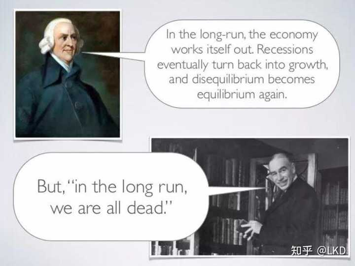

最被低估的经济学名著是哪一本？ \- LKD 的回答

《小岛经济学（鱼，美元和经济的故事）》这本书可以说是以小见大，见微知著的经典读物，很多所谓的专家其实对本领域的基本概念都缺乏最常识的理解，而这本书，能从最基本的概念出发，一步步解释，推导，把经济学里基本的概念串联起来，给出生动的解释，演绎，推测，真正做到了深入浅出，高屋建瓴；

书不厚，文章脉络也不复杂：故事设定一个小岛上只有三个人，每个人工作捕鱼一天正好完成生活所需，这时候岛上没有储蓄，没有信贷，没有任何经济活动。突然其中一个人饿了两天时间制作了一个渔网（提高生产力），该人的生产力翻倍，有了剩余的鱼，这时候他可以选择储存起来（储蓄），也可以借给其他人（信贷），其他人借到鱼之后，可以选择休息，吃鱼（消费），也可以选择制作渔网，从而让自己也能提高捕鱼效率（投资），经济活动就在这生产力提高之后，在每个人储蓄，消费，贷款，投资的选择中，出现和发展了；因为生产力的提高，人们不需要每天捕鱼，有了更多的时间从事别的运动，比如冲浪等（第三产业），同时每天剩余的鱼需要存储，购买其他产品用鱼来交换并不方便，于是出现了鱼的存储中心（银行）和鱼券（货币）；岛上人口增多之后，人们需要保障自己的生命权财产权，于是（政府）出现了；也开始和其他周边小岛进行交换，于是有了国际贸易，外汇；

__在我看来，这本书最重要的提醒是：财富增长必须有真实的能力作为支撑。货币能够帮助我们组织生产，却不能替代生产本身。__

小岛上的鱼券可以增加，但如果捕鱼能力没有改善，鱼的数量不会因此增加。相反，渔网让人们可以用更少的时间获得同样的食物，或者用同样的时间获得更多的食物。这才是生产力提高的意义。发展的成果既可以体现为更多的产品，也可以体现为更多的闲暇，以及更丰富的生活选择。

书中关于利率的解释也很有启发。在小岛的简化模型里，可供借出的鱼较少，借贷成本便会上升，促使人们更加谨慎地投资；储备较多时，借贷成本下降，更多投资可能变得可行。利率由此承担着协调当前消费与未来生产的作用。资金有成本，投资者就必须认真回答：这张渔网能多捕多少鱼，是否值得动用这些资源？

如果贷款支持了更有效率的渔网，未来产出就可能增加；如果它只是让人们反复炒卖既有渔网，价格上涨就未必代表捕鱼能力提高。同样，账面上被称为“投资”的支出，也可能流向重复建设和无人需要的项目。__投资的多少不能保证投资的质量，资产价格的上涨也不能证明财富创造。__

如果政府与银行能够尊重经济运行的基本规律，依据真实的市场信号作出决策，小岛经济就更有可能实现稳健、可持续的发展。比如银行吸收储蓄，然后进行贷款，贷款其实是向社会注入投资资金，银行就在这利差中间获取利润。按照市场规律，如果银行储蓄不足，那为了吸收储蓄，需要提高利率，自然贷款利率也会相应提高，这时候借贷的成本就高，传递的信号就是此时经济不适合投资和高杠杆；人们就会减少借贷，信贷规模减少，投资减少，更多的钱会存入银行；由此，储蓄会慢慢变多，当储蓄充足时，银行会下调利率，贷款利率也会下调，这时候传递的市场信号是储蓄充足，经济健康，借贷便宜，鼓励投资；由此循环；如果投资的资源用在了提升生产力的活动上，那一下轮经济会得到更大的增长；如果资源发生了错配，用在了低效的经济活动上或者是无谓的消费掉，那生产力没有提高，资源已经浪费，经济会发生衰退；衰退并不是坏事，而是把错配的资源调整回来，把泡沫戳破挤掉，重新建立新的起点；这也是作者关于经济是如何发展的观点：经济发展是建立在资源有效配置，生产力水平提高的基础上，生产力的提高，使得产品价格下降，人们享受到经济发展的好处，生活水平也在提高——所以生产才是经济发展的关键！这和现在主流的经济学观点相反，也是作者通篇批判的对象：凯恩斯主义者们认为储蓄阻碍了货币循环，对发展不利，消费才是经济增长的因素；

关于“消费才是经济增长的因素”也有自己的逻辑链：工厂生产出的产品，如果没有消费，那产品就会积压，产品价格就会下降，产品价格下降导致利润下降，企业被迫削减开支，裁员，消费进一步萎缩，陷入负循环\.\.\. 这也是为什么，凯恩斯主义者这么推崇消费，这么害怕产品价格下降；至此真正的观点冲突出现了：作者（奥地利学派，主张自由市场经济，代表任务哈耶克）鼓励储蓄，价格下降不应该干预；而凯恩斯主义者们（绝大多数资本主义国家，主张政府干预经济），认为价格下降会导致衰退，主张刺激经济，主张消费；

而现在绝大多数国家都奉行凯恩斯主义，当经济遇冷时，就用量化宽松的手段，注入新的货币，发行更多的债券给经济升温，让物价一直上涨，一直鼓励消费，从而让经济保持活力；但是量化宽松本身是借债，是向未来的国人借钱，总有一天要还或者付出其他代价；作者用了大量篇幅写量化宽松带来的严重后果，结合02\-04年的互联网泡沫和08年次贷危机，写的非常具体生动；但为什么那么多国家在面对危机时还是选择了这种做法呢？因为世界上的经济问题从来不只是经济这么简单，天要下雨，娘要嫁人，总统要连任，失业率要降低，资本要扩张，选民要见的着的利益，这一切都决定了问题并不单纯，政府也会短视；按照作者的观点，如果储蓄高涨，消费减少，物价下跌，说明人们相信当前市场并不适合投资，货币的购买力其实在升值，之前投资的资源发生了错配，市场需要调节，当在一定的时间内，市场调节完毕，烂的项目会死掉，出清，好的项目会酝酿，出现，这时候储蓄增长开始变低，投资变多，经济在经过调整后迎来增长；奥地利学派爱说“in the long run\.\.\.”, 但凯恩斯主义者们的更爱说：in the long run ,we all dead; 或许奥地利学派是理想的，正确的，资源错配，经济过热，就应该戳破泡沫，经历衰退，让市场调整，让资源找到更有效利用的地方，只不过，没有一个统治者能忍受这段并不固定的时间；

alt="Image">

因此，对于奥地利学派的观点和凯恩斯主义的观点，我个人觉得，无论是鼓励生产还是消费，都不是最主要的，最主要的是在这轮经济周期里，资源有没有得到有效的配置，社会生产力有没有切实提高；作者一直唱衰美国，多年的量化宽松和财政举债让美国政府债台高筑，房地产畸形发展，但是美国一直是经济和科技最强的国家，不能只看到他的量化宽松，要看到他在量化宽松的过程中有没有提高生产力；从08年至今，美国经历了次贷危机，经历了多轮的量化宽松，多场局部热战，房地产市场一直被人诟病，但是也是在这段时间，美国引领了互联网的大发展，我们见证了亚马逊，谷歌，微软，因特尔成为世界级公司，近几年，特斯拉，英伟达，open AI，anstropic ，Xspace,引领了新能源汽车，AI，宇宙航天的探索，可以说这几十年生产力大幅提高的创新都发生在美国，这也是我觉得美国依然保持竞争力和活力的根本；所以关键不是该消费还是储蓄，而是我们在对应的政策下能不能提高和发展生产力；黑猫，白猫，能抓老鼠就是好猫；我们改革开放的总设计师就一阵见血的指出：社会主义的本质，是解放生产力，发展生产力；发展才是硬道理；

摘抄一下读到时觉得眼前一亮，醍醐灌顶的句子：

1\.努力使有限的资源（每种资源都是有限的）产生最大的效益以尽可能满足人类的需求，这就是经济这一概念最简单的定义；工具，资本以及创新是实现这一目标的关键；

2\.经济增长的原因：找到生产人类所需物品更好的方式；

3\.私人资本主义可以促使那些将个人利益作为唯一动机的人帮助他人提高生活水平，这是最有意义的；

4\.富人致富的原因（至少开始时）是他们为他人提供了有价值的东西‘

5\.只有当我们生产出额外的食物时，我们才有时间做其他事情

6\.储蓄创造了资本，而资本是生产扩大成为可能；

7\.利用可用的最优资本工作；

8\.员工只要工作就有报酬，而企业主想要得到回报则只能等到企业盈利，他们的收益是对承担风险的回报，也是对成功整合稀有资源的回报。对利润的不懈追求对提供了产品创新，企业发展与经济增长；

9\.起决定作用的不是消费而是生产；不需要劝说人们消费，因为人类的需求永远得不到满足，如果人们不想要某样东西，一定是有理由的，要么是产品不够好，要么是买不起；无论什么理由，推迟购买或者把要花的钱存起来，都是出于理性的考虑，而且对整个社会都有好处；

10\.提供就业岗位并非经济的目的，经济的目的是不断提高生产力；

11\.美国的低利率很大程度上是由于国外的高储蓄造成的，很多经济学家并没有意识到这一点；要记住，想要借贷，就必须先储蓄；所幸，对美国来说，全球经济使得借与存的关系不受国境的限制；

12\.量化宽松的真正面目：它是延长经济衰退的方法，不是促进经济复兴的良方；

13\.通货膨胀不过是把财富从以某种货币储蓄的人手里转移到以同种货币负债的人手里；如果遇到恶行通货膨胀，存款会变得一文不值，而负债会一笔勾销；

14\.到目前为止，美元的储备货币地位一直是美国手中的王牌。也就是说，哪怕基本面再差，世界各国还是会接受美元。然而，一旦失去储备货币地位，美元的下场就会和其他已经崩溃的货币一样；

15\. 正文最后一句话：“还有谁知道怎么制作渔网吗？我想我们应该自己捕鱼了”
