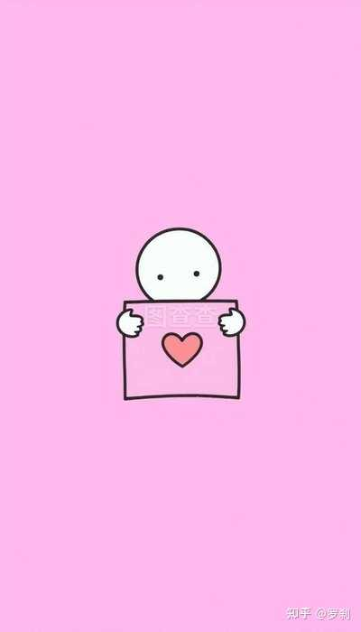

有哪些识人之术？ \- 罗刹 的回答

__* 1、头发多的人是劳碌名，心眼小。*__

__* 2、眉毛长的人身体虚弱，多病。*__

__* 3、女人额头上有斑迹者，家庭多有不幸。*__

__* 4、额头宽的人聪明，开朗。*__

__* 5、三个头涡的人非大人物便是恶人。*__

__* 6、牙齿孔隙大的人爱撒谎。*__

__* 7、大脚勤，小脚懒。*__

__* 8、好哭的孩子健康。*__

__* 9、女人肤色白有良缘。*__

__* 10、眼角多纹，眉重的人多情。*__

__* 11、眉毛和眼睛间有痣的人多淫。*__

__* 12、耳朵大耳厚的人有福气。*__

__* 13、嘴唇厚者不善辞令，嘴唇薄者多嘴、*__

__* 14、昂首走路的人开朗，低头走路的人好色。心计多。*__

__* 15、嘴小的人细心，嘴大的人吃四方，性欲强。*__

![斝훚鄕우@多쭇] ](attachments/08d08e7d063a70eb.jpg)

alt="Image">

__古代观眼识人术__

1、醉眼 酒色破财相。

2、睡眼 贪贱孤苦相。

3、惊眼 胆弱夭折相。

4、病眼 体弱多疾病。

5、淫眼 奸邪淫色相。

6、丹凤眼 智慧聪明。

7、龙眼 忠心耿耿 可信任。

8、虎眼 威严英武 大蒋之才 感情丰富 艺术人才。

9、马眼 平庸 志不高。

10、鹿眼 性急 富有感情。

11、猴眼 机敏 多疑淫 为人忠厚 讲义气 欲强。

12、鱼眼 愚笨 短命之人。

13、鼠眼 灵活好动 盗窃之流。

14、羊眼 奸诈心恶。

15、鸡眼 性急如斗 多毒 多淫 孤僻无人缘。

16、眼神 眼神不强的无判断力；眼睛有光的聪明；偷视的奸狡、贪淫；眼光上视的骄傲，目中无人；眼光下视的多疑、拘谨；眼神不定的心不安份，非偷即骗。

alt="Image">

__古代观鼻识人术__

中国故相曾称：“鼻者画之山，不高则不灵。鼻通于气，以察神志之躁静，心胆之强弱，

1、鼻高而不对称则凶。

2、鼻塌而鼻尖肥，是劳碌名，难成事。

3、狮子鼻属政治家、外交家型，不论男女精力充沛，好动、活泼，进取心强。

4、伏犀鼻艺术家型的鼻子直长，细而凸出，这种人大都内向，性情平和、温柔，不走极端，暧美、富有理想，富有艺术天份。

5、折欠鼻型，鼻子尖往上翻，是鲫鱼嘴型，固执。这种人多爱嫖，赌次，问东问西。

6、鹰勾鼻，笔尖向下留勾，这种人贪梦，自私自利，为人奸诈狡猾。

__古代观口唇识人术__

古人云：“喜怒哀乐，有动于中，必形于外。”

1、唇厚的人，富贵长寿之相。过于厚的人其肉欲旺盛。

2、唇厚的人，好辨，机伶，外刚内怯，是薄情人。

3、长唇的人，竞争心强，重事实，能力强。

4、短唇的人，富于想向，缺乏果断，犹豫不决，嘴里存不住话。

5、唇两端上翘的人，乐观、进取、幽默。

6、唇两端下垂的人，忧郁、悲观、易怒、

7、樱桃口，属女性口，爱美，温柔多情。

8、方口属男性口，能力强，重实际，好享受。

9、吹火口，能力弱，缺乏果断力，一生孤苦。

10、覆船口，这种人奸猾，贪心不足。

11、仰日口，这种人乐观，不平凡，常能一鸣惊人。

12、口能开大合小与脸对称最宜“口阔容拳，出蒋入相“口如露齿，有事难遮。

__古代观脸型识人术__

1、三角脸的人，想象力丰富，欠实际能力，浪漫型，想多做少，防心较多。

2、正方脸的人，聪明而有行动力，品格高尚，心胸宽阔，充满精力，有外交本领，幽默感强。

3、长方脸的人，活动性强，缺乏扎实性，人际关系差，不体谅人，如果女性则性格开朗，不安分与男人争强。

4、圆脸型的人，宽宏大量，为人忠厚，心慈手软，不害人亦不防人，与谁都过得去。

5、宽广无型脸的人，耐力强，感情脆弱，能替别人着想，容易被他人左右，上当受骗。

6、尖下巴的人现实派，成功与失败对等，易受异性爱慕。

7、宽下巴的人头脑聪明，野心大，长于谋略为达目的不择手段。

__从接触表现识人术__

1、见面打招呼时，直视对方的眼睛，其欲意是立于对方更优越的位置，总认为自己比对方好。
2、见面打招呼时，逃避对方的眼光，是有自卑感，性格腼腆，为人处事谨慎小心。
3、见面打招呼的方式千篇一律，是自我防卫型，这种人一般来说言行不一。
4、一坐下就翘二郎腿的人，是比较得意，是不拘小节大大噜噜的人。
5、说话爱用“我认为”的人属自我显示型，有傲气，自命不凡。
6、对话时遥视远处的人，是不关心你的话题，正在算计自己的事，这种人通常自私。
7、对话时眼睛忽东忽西的人，心里不自然，心中有小算盘或感到自卑。
8、与异性对话，有意避开视线的人，是太在乎对方，追求异性的欲望强烈。
9、对方眼神似乎不悄一顾时，是对方对你的话题抱有兴趣，但羞于对答。

民间秘诀

阴木加临酉丑蛇，生居六月暗咨嗟；为官得禄难长久，纵有文章不足夸。

乙巳乙酉并乙丑，八月生人必短寿；四柱若见火伤官，伤官失职定然有。

阴火相临巳酉丑，生居丑月寿难长；更兼名利多成败，破败荒淫不可当。

丁巳丁酉并丁丑，八月生人人不久，前程名利两区区，更忌饮酒与交友。

阴上逢蛇难与牛，名为福德号貌貅；秀气火来侵克破，须教名利一时休。

己巳己酉及己丑，福德秀气造化有；大怕四柱火相侵，纵有功名不长久。

阴金合局主前程，造化清奇大有情；四柱火来侵克破，须知名利两无成。

西方金气坐阴柔，不怕休时不怕囚，鬼杀生时方发福，功名随步上瀛洲。

癸巳癸酉月临风，百务迟廷作事空；名利生成难有望，始知人在五行中。

癸巳癸酉及癸丑，四月生人人不久；功名成败在晚年，最忌贫淫并饮酒。

一．破──打破东西，就有破的预兆。

举例：在酒楼内与朋友茶聚，两人在协商事情，正在犹疑不决是否要付诸实行时，忽然听到邻桌传来打破杯碟的声音，就表示正在协商的事情之中有「破象」。卦象的提示：假如付诸行动，会有负面现象。 虽然打破东西预兆「破」，但亦要留意起卦的时间，假如出现於所属生肖对应的「六合」时间，就不算「破象」了。 各生肖对应的六合时辰： 猴：巳时 鸡：辰时 狗：卯时 猪：寅时 鼠：丑时 牛：子时 虎：亥时 兔：戌时 龙：酉时 蛇：申时 马：未时 羊：午时 另一方面，假如听到的是开心的笑声或掌声的话，就是正面的卦象，是吉兆卦象，提示此事是可以进行。

二．应──电话响 举例：你刚决定了要做一件事情，这时电话响起，就必需要接听，以应数；假如电话响而不接，没有应数，事情就可能会失败或告吹。

三．助──救护车、警车响号 举例：当你在忧虑一件事情时，忽然远处传来救护车、警车声响，千万不要误以为是破象，其实是吉兆卦象，原因是有外应声音相助，提示「有救，有贵人相助」。 救护车、警车是赶往救人，就是有救，有救就是有贵人。

四．吵──吵架声 举例：当你在决定事情的时候，听到附近有人在吵架，就是负面卦象，预兆「不吉」，决定了要做的事情，就不做为妙。

五．阻──喝水时抢喉 举例：当你喝水时抢喉，卦象预兆「有阻碍」，但有阻碍亦并非百分百坏事，可能是事情有少许阻滞，故必需加倍小心和努力。

六．耗──看见老鼠、蟑螂（??） 举例：当你在想一些有关金钱的事情时，忽然看见老鼠走过，就是预兆「破财」，投资、投机项目不会成功。 原来老鼠有个别称是「耗子」。「耗」有损耗的意思。但假如事情跟金钱无关，则提示所做的事，会徒劳无功的。

七．漏──掉了物件 举例：当你拿?的东西掉到地上，必需要马上拾起，否则代表「自动放弃」。掉了物件在地上，是预兆了事情在中途会有少许障碍，有很多困难要解决和处理，但最後亦会成功。 但要注意的是，假如拾起後的东西再次掉到地上的话，即提示这件事情无法成功。

八．跌──吃饭时掉了筷子 举例：吃饭时，其中一只筷子无故掉到地上，表示凡事不能操之过急，要三思而行，并且慢慢处理，甚至需要「重新检讨」整件事情。

九．空──取物时器血 空空如也 举例：当你想抽烟时，烟包内没有香烟；打火机打不起火；执笔写字时铅字笔没有墨水，或铅笔没有铅芯，都是应「空」，代表「假象」，提示要小心被骗，不要被事情外表吸引，有「金玉其外，败絮其中」之象。

十．断──物件折断 举例：预兆与人合作做事不会成功，必需重新开始。 口卦 有时候，我们会听到别人在打破东西後马上补充说：「落地开花，富贵荣华」。千万不要少看这句「老套」、「八卦」的说话，其实它是应了「梅花易数」里面的「口卦」，化解了不祥的预兆，又或者将不吉的情度减轻。 因此，日常我们应该要多说些吉利、正面的说话，例如将「衰」说成「不好」；别人赞美你说：「气色不错啊！」就应该回答：「谢谢，承你贵言。」不要否定别人称赞的说话。 紧记：口卦亦代表咀咒，千万不要胡乱说一些不吉利的说话，否则就成了不吉利的咒语。 所以闲时，都应该说些吉利的说话。
断卦中的外应如何提取 、小孩：代表是非官司，小人暗伤。 2、官员：代表贵人是非可解决。 3、男人：代表事情公正解决。 4、女人：代表难解难分，缠绵不决。 5、三个女人：代表奸诈，有灾受骗。 6、笑声：官司是非轻松解决。 7、哭声：官司是非牵扯不清，难断难了。 8、吵闹声：官司是非临身临门。 9、吉利语言：无是无非，有也易化解。 10、诅咒语言：是非临身。 11、电话铃声：有是非官司信息征兆。 12、门打开：如测已有官司可化解，否则代表可解决，如测是否会有官司是非，则代表是非之门已经打开。 13、门关上：如测已有官司有化解否则代表不可调停，如测是否会有官司是非则代表没有官司是非临门临身。 14、洒了水：破财因官非失理。 15、摔碎器物：破财免官非。 16、坐破椅子（碰倒桌椅）：官非升级。 17、摇卦时铜钱掉地：破财失理。 18、眼中进砂子（或其它）：官方不公，受屈辱冤情。 19、撕破纸张：官非不了了之。 20、紧急的刹车声：赶快主动停止官非，否则有大灾。 21、成片的鸣号声：官非越闹影响越大。 22、雷声：官非有虚惊。 23、暴雨：官非破财。 24、狂风：官非失理受辱。 25、出现乞丐：无处说理。 26、有人找人：官非若要平息，必须投靠他人。 27、有人送还钱物：官非得理有财。 28、有人索债（物）：官非失理破财。 29、有穿行业制服的人出现：有人主持公道。 30、突然停电：官非理难明，事难清。 31、撞车：官非牵缠他人，事情越来越大。

《搜易补》“录应真经”

1、三要诀： 欲知玄妙，须运三要。耳之于听，寂闻其音。 目之于视，详察其形。心之于思，澄虚感悟。 融会妙用，可通鬼神。
2、天文应 云开见日，事必争辉。烟雾遮月，物当失色。 彩虹瑰丽，好景难长。丹霞绚烂，繁荣不久。 霜蒙秋草，挽四乏力。露滋靡苗，转危为安。 细雨沾衣，恩光流泽。清风拂面，怡情攸游。 雨过天睛，难关已度。风止浪静，险途已平。 流星败落，震雷虚惊，飓尘风险，沱澍艰辛。
3、地理应 层峦叠嶂，业必艰屯。深峡悬崖，事有隔阻。 康庄大道，显达适意。崎岖小径，曲折辛劳。 茂林之下，心力俱盛。枯木之弯，相貌皆衰。 石坚始得。沙散难成。泉流事通。土积事滞。
4、来人应 逢人之来，为事之应。荣宦显官，宜见其贵。 富商大贾，可问乎财。青岁壮汉，旺盛之象。 暮令朽人，衰落之忧。三女三男（二男三女），争居其位。 一僧一道，独处之端。偶猎夫到，得野外财。 忽渔翁来，获水之利。逢娠妇者，事萌于内。 遇盲人者，虑根乎心。
5、诸身应 掉头不就，摇手莫为，动足将行，交臂有失，屈 指阻滞，虚气困忧，背身闪赚，露舌论非。停步 后望，平庸之客。阔行仰视，非凡之辈。举手 搁额。必有欣庆。试目喷啶，定生悲哀。正冠 纳履，谨慎从事。搔首掸垢，困厄忧心。偶而 攘臂，争夺乃得。忽然曲膝，屈卑以求。
6、人事应 童子授书，避忌词讼。主翁答仆，提防 责罚。凡遇题写，宜文从事。若见赌 博，忌险争财。论经史者，谋为虚说。 奏歌舞者，事必悠扬。抱贵器者，非凡 之用。负大木者，不小之才。动升斗 者，斟量而效。拿剪尺者，裁度以成。 锁门箱者，途阻事滞。解系结者，厄除 怨消。补器皿者，终究不坚。裁衣服 者，破损方成。涤壶觞者，恐有饮食。 持斧锯者，防有伤害。磨刀斧者，迟钝 可得。铸铜镜者，磨练始明。放风筝 者，仕途通达。买猪蹄者，金榜题名。 咀嚼防责。卒嚣忌讼。童泣子忧。笑 悦事亨。
7、诸物应 车马登途，负载以往。一舟楫在水，接引而来。 抛石落河，音信杳然。煮茧抽丝，事务繁冗。 窗户糊纸，终易破落。窑缸植秀，必难成材。 冠冕落地，败落之兆。刀斧破木，损财之忧。 妆花刻果，终非结实。画影描形，徒负虚名。 纬绎将成，宜求官职。笔砚俱在，可问文书。 偶倾盖者，恐退权位。忽提柄者，防有持挟。 8、花木应 芳雅芝兰，物之祥瑞。碧翠松柏，寿之遐。外应断事书籍历来见之甚少，一般只见过“梅花易数”中提到的“玄黄克应歌”，近取诸身， 远取诸物之类。下面，是本人的一本家传易书上的一段歌诀，今特奉献给大家。 相信见过此歌的朋友不占多数！共同分享吧！也请诸位易友把自己珍藏的秘诀贴出来分享，大家共同提高！ 占断先须看神将 森罗万象细推寻 眼前见物分凶吉 耳内闻声辨浅深 竹下犬行应喜笑 人依木畔事须休 见桃可说人逃走 遇李当云得理宜 事成当反锄翻地 破而复合剪衣时 虚声恐怖闻雷震 深计思维看弈棋 乐事雨丝同桂木 破机一石又逢皮 坐卧立分迟与速 圆缺兴衰判合离 带花带酒忧还退 遇酒遇盐事可悲 鸟鹊鸣时分善恶 云渥指处说高低 男抱女孩新燕喜 女人抱子叶熊罴 阳人抱着阳人看 必有争喧早晚期 若是女人抱是女 断他奸巧惹官非 丝麻孝服应须见 跛足前行事有疑 丹青画轴宜求祷 钟鼓弦音信必移 鱼雁必知来远信 脍腑当忧骨肉亏 砚水干枯谋不顺 笔头脱落事无成 墨断定知田土散 纸破须防不正人 犬吠一声防哭泣 鼠来又忌贼相侵 赤朱写字红光动 叶上书文有怨盟 忽听鸡鸣真可喜 人惊梦觉事通灵 马嘶必有行人至 猫过须防毒害人 船上不宜书火字 楼头宜忌有官刑 有时喜笑歌呼语 类聚占之课有灵 注: 外应断事不需要那么多的程式，人世间的万事万物，都会在断课、断卦、问事的时候在你不知不觉中反应给你，只是你没有捕捉到而已。上面这个歌诀对初学外应断事的朋友很有帮助，体会其中的含义，然后发展自己丰富的想象空间，你就会发现，好多事是根本不用起卦、起课判断的。因为，大自然已经给了你回应。只要你及时地捕捉周围的万事万物的信息，大胆地断事，你会发现，大自然真是神奇得很！它把一切早就告诉了你！这叫做“善易者不占”。虽然到这个境界不是一件易事，但只要坚持，就会有收获！

出生年的重量：
1941：6钱 1942：8钱 1943：7钱 1944：5钱 1945：1两5
1946：6钱 1947：1两61948：1两51949：7两 1950：9钱
1951：1两21952：1两 1953：7钱 1954：1两51955：6钱
1956：5钱 1957：1两41958：1两41959：9钱 1960：7钱
1961：7钱 1962：9钱 1963：1两21964：8钱 1965：7钱
1966：1两31967：5钱 1968：1两41969：5钱 1970：9钱
1971：1两71972：5钱 1973：7钱 1974：1两21975：8钱
1976：8钱 1977：6钱 1978：1两91979：6钱 1980：8钱
1981：1两61982：1两 1983：7钱 1984：1两21985：9钱
1986：6钱 1987：7钱 1988：1两21989：5钱 1990：9钱
1991：8钱 1992：7钱 1993：8钱 1994：1两51995：9钱
1996：1两61997：8钱 1998：8钱 1999：1两92000：1两2
2001：6钱 2002：8钱 2003：7钱 2004：5钱 2005：1两5
2006：6钱 2007：1两62008：1两5

出生月的重量：
一月：6钱 二月：7钱 三月：1两8 四月：9钱
五月：5钱 六月：1两6 七月：9钱 八月：1两5
九月：1两8 十月：8钱 十一月：9钱 十二月：5钱

出生日的重量：
初一：五钱 初二：一两 初三：八钱 初四：一两五 初五：一两六
初六：一两五 初七：八钱 初八：一两六 初九：八钱 初十：一两六
十一：九钱 十二：一两七 十三：八钱 十四：一两七 十五：一两
十六：八钱 十七：九钱 十八：一两八 十九：五钱 二十：一两五
廿一：一两 廿二：九钱 廿三：八钱 廿四：九钱 廿五：一两五
廿六：一两八 廿七：七钱 廿八：八钱 廿九：一两六 三十：六钱

出生时辰的重量：

子时（23\-1点）：一两六 丑时（1\-3点）：六钱

寅时（3\-5点）：七钱 卯时（5\-7点）：一两

辰时（7\-9点）：九钱 巳时（9\-11点）：一两六
午时（11\-13点）：一两 未时（13\-15点）：八钱
申时（15\-17点）：八钱 酉时（17\-19点）：九钱
戌时（19\-21点）：六钱 亥时（21\-23点）：六钱

批注诗：

2两1：短命非业谓大凶，平生灾难事重重，凶祸频临限逆境，终世困苦事不成

2两2：身寒骨冷苦伶仃，此命推来行乞人，劳劳碌碌无度日，中年打拱过平生

2两3：此命推来骨轻轻，求谋做事事难成，妻儿兄弟应难许，别处他乡作散人

2两4：此命推来福禄无，门庭困苦总难荣，六亲骨肉皆无靠，流到他乡作老人

2两5：此命推来祖业微，门庭营度似希奇，六亲骨肉如水炭，一世勤劳自把持

2两6：平生一路苦中求，独自营谋事不休，离祖出门宜早计，晚来衣禄自无忧

2两7：一生做事少商量，难靠祖宗作主张，独马单枪空作去，早年晚岁总无长

2两8：一生作事似飘蓬，祖宗产业在梦中，若不过房并改姓，也当移徒二三通

2两9：初年运限未曾亨，纵有功名在后成，须过四旬方可上，移居改姓使为良

3两：劳劳碌碌苦中求，东走西奔何日休，若能终身勤与俭，老来稍可免忧愁

3两1：忙忙碌碌苦中求，何日云开见日头，难得祖基家可立，中年衣食渐无忧

3两2：初年运错事难谋，渐有财源如水流，到的中年衣食旺，那时名利一齐来

3两3：早年做事事难成，百计徒劳枉费心，半世自如流水去，后来运到始得金

3两4：此命福气果如何，僧道门中衣禄多，离祖出家方得妙，终朝拜佛念弥陀

3两5：生平福量不周全，祖业根基觉少传，营事生涯宜守旧，时来衣食胜从前

3两6：不须劳碌过平生，独自成家福不轻，早有福星常照命，任君行去百般成

3两7：此命般般事不成，弟兄少力自孤成，虽然祖业须微有，来的明时去的暗

3两8：一生骨肉最清高，早入学门姓名标，待看年将三十六，蓝衣脱去换红袍

3两9：此命少年运不通，劳劳做事尽皆空，苦心竭力成家计，到得那时在梦中

4两：平生衣禄是绵长，件件心中自主张，前面风霜都受过，从来必定享安泰

4两1：此命推来事不同，为人能干异凡庸，中年还有逍遥福，不比前年云未通

4两2：得宽怀处且宽怀，何用双眉总不开，若使中年命运济，那时名利一齐来

4两3：为人心性最聪明，做事轩昂近贵人，衣禄一生天数定，不须劳碌是丰亨

4两4：来事由天莫苦求，须知福禄胜前途，当年财帛难如意，晚景欣然便不忧

4两5：福中取贵格求真，明敏才华志自伸，福禄寿全家道吉，桂兰毓秀晚荣臻

4两6：东西南北尽皆通，出姓移名更觉隆，衣禄无亏天数定，中年晚景一般同

4两7：此命推来旺末年，妻荣子贵自怡然，平生原有滔滔福，可有财源如水流

4两8：幼年运道未曾享，苦是蹉跎再不兴，兄弟六亲皆无靠，一身事业晚年成

4两9：此命推来福不轻，自立自成显门庭，从来富贵人亲近，使婢差奴过一生

5两：为利为名终日劳，中年福禄也多遭，老来是有财星照，不比前番目下高

5两1：一世荣华事事通，不须劳碌自亨通，兄弟叔侄皆如意，家业成时福禄宏

5两2：一世亨通事事能，不须劳思自然能，宗施欣然心皆好，家业丰亨自称心

5两3：此格推来气象真，兴家发达在其中，一生福禄安排定，却是人间一富翁

5两4：此命推来厚且清，诗书满腹看功成，丰衣足食自然稳，正是人间有福人

5两5：走马扬鞭争名利，少年做事废筹论，一朝福禄源源至，富贵荣华显六亲

5两6：此格推来礼仪通，一生福禄用无穷，甜酸苦辣皆尝过，财源滚滚稳且丰

5两7：福禄盈盈万事全，一生荣耀显双亲，名扬威震人钦敬，处世逍遥似遇春

5两8：平生福禄自然来，名利兼全福禄偕，雁塔提名为贵客，紫袍金带走金鞋

5两9：细推此格妙且清，必定才高礼仪通，甲第之中应有分，扬鞭走马显威荣

6两：一朝金榜快提名，显祖荣宗立大功，衣食定然原欲足，田园财帛更丰盈

6两1：不做朝中金榜客，定为世上一财翁，聪明天赋经书熟，名显高克自是荣

6两2：此名生来福不穷，读书必定显亲荣，紫衣金带为卿相，富贵荣华皆可同

6两3：命主为官福禄长，得来富贵定非常，名题金塔传金榜，定中高科天下扬

6两4：此格权威不可当，紫袍金带坐高堂，荣华富贵谁能及，积玉堆金满储仓

6两5：细推此命福不轻，安国安邦极品人，文绣雕梁政富贵，威声照耀四方闻

6两6：此格人间一福人，堆金积玉满堂春，从来富贵由天定，正笏垂绅谒圣君

6两7：此名生来福自宏，田园家业最高隆，平生衣禄丰盈足，一世荣华万事通

6两8：富贵由天莫苦求，万金家计不须谋，十年不比前番事，祖业根基水上舟

6两9：君是人间衣禄星，一生福贵众人钦，纵然福禄由天定，安享荣华过一生

7两： 此命推来福不轻，不须愁虑苦劳心，一生天定衣与禄，富贵荣华过一生

7两1：此名生来大不同，公侯卿相在其中，一生自有逍遥福，富贵荣华极品隆

7两2：此格世界罕有生，十代积善产此人，天上紫微来照命，统治万民乐太平

注： 10钱是1两
