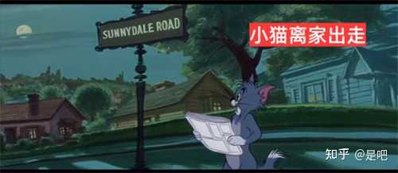
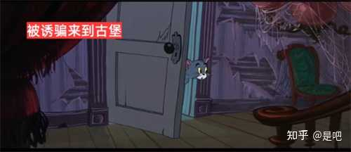
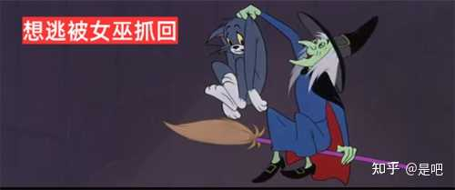
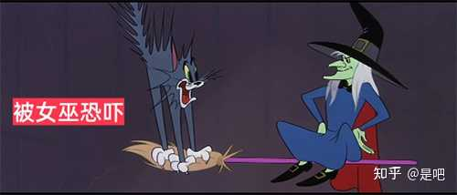
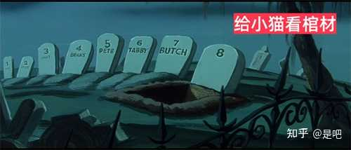

__问题描述：__

我没有看过书，但是电视剧里杨过是一个不喜欢那种死水般生活的人呀，还是因为16年的等待让他成熟了？为什么小龙女为了杨过不能出古墓呢？

看了这集猫和老鼠，你就看懂了杨过真实的古墓生活

二更：简单补充一下对应的神雕情节（想了解更多细节可以看其他答主的完整解析哦）

alt="Image">杨过在全真教打晕鹿清笃

alt="Image">杨过误以为打死鹿清笃后出逃

alt="Image">杨过被小龙女和孙婆婆的“柔网势”所骗，叛出全真教

alt="Image">古墓可不像古堡还有窗户通风哦

alt="Image">杨过想逃，迷路未果，被小龙女揪耳朵逮住

alt="Image">小龙女冷冷的道：“我死之前，自然先杀了你（杨过）。”

alt="Image">小龙女：”这里还少一口石棺，因为我师父料不到你（杨过）会来。”

alt="Image">把杨过关在古墓一个多时辰，自己捉了3只麻雀，应该是捉麻雀吧。。

alt="Image">小龙女不先教内功心法，就逼迫杨过睡寒玉床，下床就挨打

alt="Image">在大胜关英雄会上大放异彩先后打败金轮等人，芙妹你还让我做管家那桌吗

alt="Image">

二更：女巫的手段怎么比得了女鬼呢，后续是小猫已经从噩梦中醒来了，而杨过的噩梦还在继续。大胜关逼婚，栽赃偷婴，坑害断臂……小龙女会放过杨过吗，nonono她只会像蛇一样紧紧缠上来（参考评论区某些古墓阴兵），等麻雀重归天空之际，再一招夭矫空碧把麻雀打回原地。可以说杨过半生的苦难绝大部分是小龙女造成的，杨过只有斩毒龙返空明，才能从小麻雀成长为神雕侠。

[编辑于2026\-06\-1517:34](http://www.zhihu.com/question/20944884/answer/2045076204168941646)・

福建
