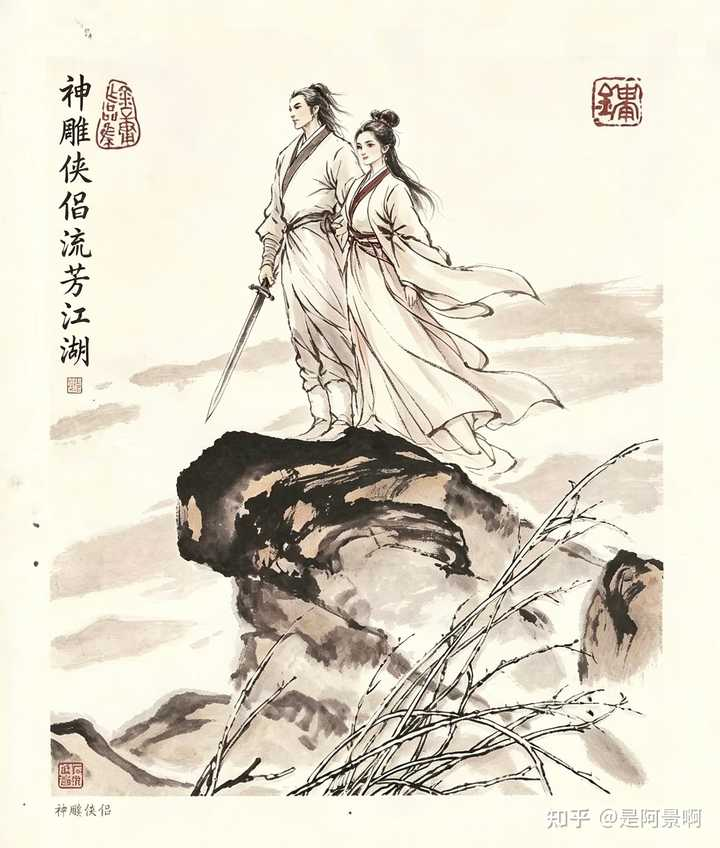

杨过为什么要跳下去殉情？ \- 是阿景啊 的回答

杨过神雕全书的状态基本上都是嬉笑怒骂演随手就来，哄得一众高手、红颜后宫团无不对他释放善意、爱意，甚至为他丧失性命。

然后书中又给他安排了三次不顾生死的暴走，前因后果都非常非常有意思，作者其实写的很明了：

__第一次暴走__：初见郭芙，小叫化提了只偷来的大公鸡在旁窥伺半天，眼见郭芙要被李莫愁掳走，贼忒嘻嘻地跑了出来，打断了李莫愁施法，后来才中了冰魄银针，遇到欧阳锋和靖蓉，此时小叫化情绪正常，跟一群成年江湖顶尖高手玩得有来有回，也没见吃亏。

然后第一次暴走来了：郭芙招招手让他去摘花编花冠，杨过二话不说准备去了，结果被耿直稚龄芙嫌弃手黑，瞬间破防不顾身中剧毒：【郭芙瞥见他手掌漆黑，便道：“你手这么脏，身上还要脏，我不跟你玩。你摘的花儿也给你弄臭啦。”__那少年冷然道：“谁爱跟你玩了？”大踏步便走。__】

__连欧阳锋说的中毒后【这毒质与众不同，你如用力奔跑，那只有发作得更快】也不管了了，靖蓉喊他给他解毒也顾不上了，要死要活开启暴走模式，被靖蓉拦住还要给郭靖当老子；__

__第二次暴走__：杨过穿着蒙古人的衣服，戴着面具，__被双雕红马的大小姐轻飘飘的一个眼神激得开始那段众名吟唱__：你爹爹、你妈妈、你外公…__然后暴走鳌太线，要死要活变成野人一个多月。__

后来把自己哄好了，下山直奔郭家而去，结果半路遇到郭芙没认出他，和大小武说说笑笑，又酸又气，饭也吃不下了，__不像绝情谷，姑姑正跟人洞房花烛夜，杨过怒吃四个无酵大馒头，谁见都夸胃口好！__

__第三次暴走__：十六年之后，杨过这个古墓阴湿鬼从郭芙出了襄阳城就开始跟踪她一起溜溜哒哒去了山西，郭芙去了全真教送英雄帖。

这时杨过遇到煞神鬼，实在无事可干，管了人家娶小妾的闲事，知道郭芙要回襄阳，__也顾不上跟他们茬架了，匆匆忙忙和他们约到距山西一千多里路的倒马坪，因为风陵渡口发布会要在那里召开，风陵渡口距倒马坪不过三十里路。__

然后在万寿山庄听到郭芙的声音：【只见杨过双眼精光闪烁，神情特异】，才有了后来对着一个差点要死的史孟捷的名句：【“檄天之幸，史五哥的伤势还不甚重。这女子行事向来莽撞，我这条右臂，便是给她一剑斩去的。”】

至于杨过什么时候认出郭襄，作者其实留下了线索【那闪电般的眼光扫过她脸时略一停留，似乎微感奇怪。 郭襄心口一阵发热，不由自主地晕生双颊】，__一生爱表演的装过早就知道她是郭襄，故意带走她让郭芙主动送上门来，找到万寿山庄，跟杨过断臂后带走郭襄是一个写法。__

再然后杨过跟踪郭芙到羊太傅庙，听见郭芙对耶律齐又夸又赞，__醋精上线，__耗尽毕生积蓄（这积蓄也包括人脉）送了三件大礼到英雄大会上，让耶律齐的高光时刻瞬间平平无奇！【__从此事也能看出耶律齐的政治素养__】

此时郭芙想的是【好哇！杨过这厮恨我斩他的手臂，故意削我面子来着】，杨过也的确如她所言，不过杨过认为削的是耶律齐面子，在郭芙眼里却是夫妻一体削的也是自己的面子。

所以后来杨过醉打金枝也好，弹指神通救了她也好，郭芙通通理也不理，__过神又又又破防了、疯癫了，身形微晃，开始暴走模式。__

__作者为了掩盖跳崖真相，让黄药师追上杨过，告知了没有南海神尼之事，让杨过明面上名正言顺的开始自暴自弃自毁模式__。

直到连平时过年过节纸都不给烧一张的杨康都搬出来用了用，才不情不愿去了绝情谷，见十六年之约，无人理会，一夜白头，直到听见有人来了，才__表演了一把深情人设，扑通跳进水里（杨过是知道跳下去死不了的）；__

等到听见有人来时表演了一把深情人设，扑通跳进水里。

__等跳崖后通过郭襄开了郭芙解读器__，知道郭芙当年对他并非无意，双手微颤出现幻肢，准备上去直奔襄阳，此时他已经想好了耶律齐的一百零一种死法。

__无奈作者让白雕表演了一把真的殉情__，戳破杨过殉情假象，也回应了十六年前杨过那句【我若要寻死，自会悄悄的自求了断，难道会在这儿跟你们拉拉扯扯，效那愚夫愚妇所为么？】

至此，让他发现活着的小龙女，大惊之下立刻开始暗戳戳屠龙，破小龙女十二少，逗得她纵声大笑。带她直接从崖底直奔襄阳战场，直接当小龙女耶律齐都是死人，开大喇叭调戏郭芙。

__这就是为什么杨过要跳崖作者掩藏在字里行间的真相。__

Ps：也真的只有郭芙的脑电波，才能在某些时候同频杨过，他们两的脑回路有时候旁人真的都理解不来：

比如：杨过弄完郭芙的剑，将断臂之仇和郭芙一笔勾销，报复靖蓉抱走郭襄【郭伯伯、郭伯母这个小女儿，我总是不还他们了，也算报了我这断臂之仇。他们这时心中的难过懊丧，只怕尤胜于我】

奇就奇在郭芙也这样认为：【她想自己斩断了杨过一臂，杨过却弄曲了她的长剑，算来可说已经扯平】

比如：杨过和郭芙都认为他们自小一起长大，这话杨过以往是在心里说，神雕结尾明说过：【芙妹，咱俩一起长大，虽然常闹别扭】

郭芙是和杨过在古墓吵架【你幼时孤苦伶仃，我爹妈如何待你？若非收养你在桃花岛上，养你成人】后来风陵渡口也说过类似的话。

这才有了三月桃花岛，一生竹马情的梗！比如：郭芙【姓杨的岂肯做赔本之事？】杨过果然花了两千两银子又倒赚了两千两；

比如：断臂后杨过几次舍命救郭芙，郭芙认为他是施惠逞能。而杨过除了是因为他真的喜欢郭芙才舍命相救外，确实也有施惠之意，妄图让郭芙再也忘不了他，让郭家原谅他叛国、试图暗杀郭靖、害死冯默风、让黄蓉火中产子、让郭靖生死一线的那些破事。

__所以郭芙杨过真的很有cp感，金书最圆满的是靖蓉，最好磕的是过芙！__

alt="Image">
