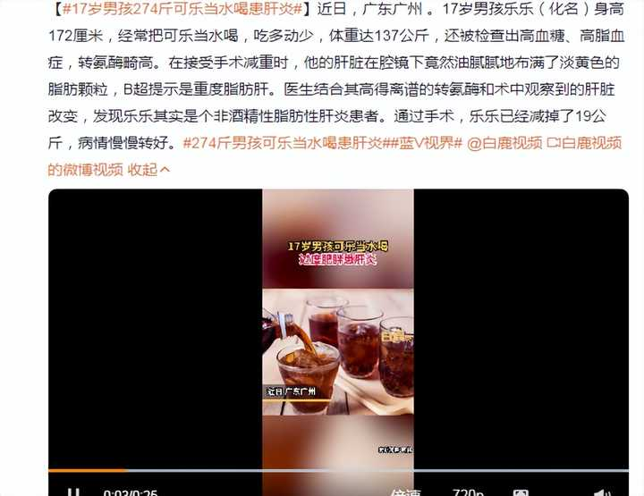
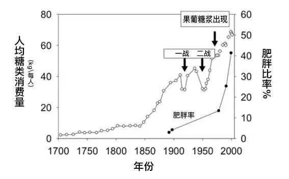
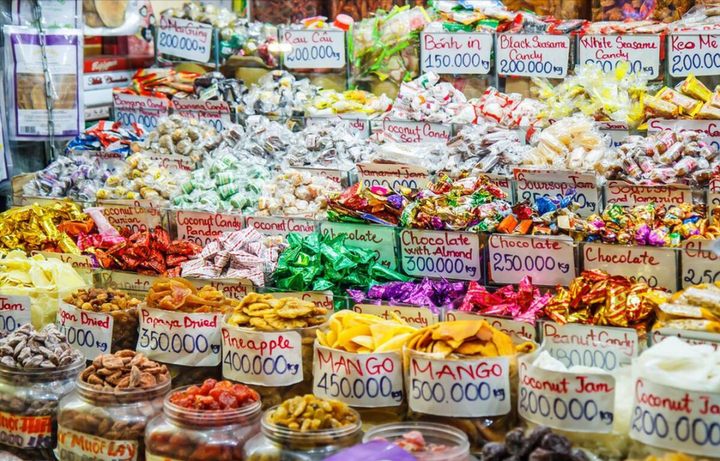
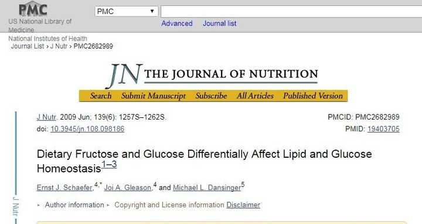
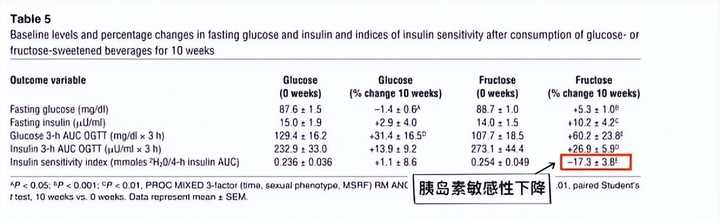
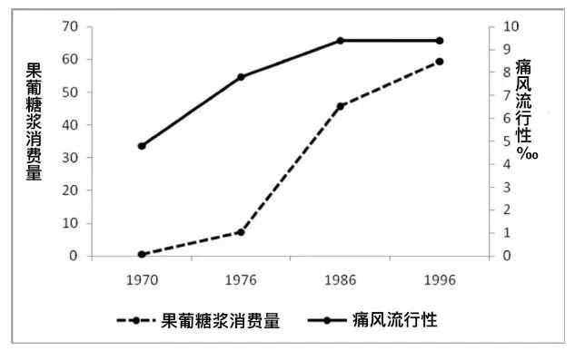
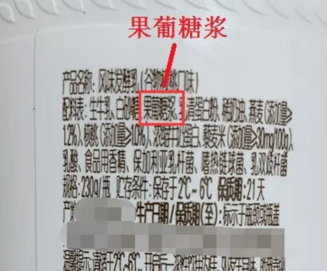

果葡糖浆比白砂糖更不健康吗？ \- Dr\.X 的回答

前几天，看到一个惊人的新闻。

广东广州，一个17岁的男孩，男孩年纪轻轻就得了一身病，__高血糖、高脂血症、重度脂肪肝、非酒精性脂肪性肝炎\.\.\.__

alt="Image">

这么小的年纪为何会被这些盯上？原来，这和他的生活习惯有着很大关系，男孩从小就喜欢喝饮料，将饮料当水喝，平时又不喜欢运动，这才导致了如今的情况。

在男孩的不良习惯中，最危险的就是“将饮料当水喝”。就在我们觉得饮料好喝的同时，却很少有人意识到现在__绝大部分饮料都添加了果葡糖浆作为甜味剂__。

__*01*__

果葡糖浆，乍一看这个名字，给人的感觉就类似于维生素和钙等元素，让人觉得健康、无害。殊不知，果葡糖浆被称为第三大健康杀手，诸多研究证实，果葡糖浆的__危害已经超过了糖和酒精__。

果葡糖浆是一种通过酶解法从玉米淀粉中获得的甜味剂，因为既有葡萄糖又有果糖，所以取名为果葡糖浆。

果葡糖浆诞生于1970年，因为其__成本低、甜度高、易发酵、保质期长、好上色__等优点，所以陆续被各种食品争相使用。

也是从果葡糖浆诞生之日起，它让美国人的健康发生了天翻地覆的变化。比如肥胖率，就从13%增长到了40%；痛风发病率从3%增长到9%；糖尿病发病率更是从1958年的不到1%增长到了2015年的7\.4%。

alt="Image">

于是，有人将果葡糖浆形容为继反式脂肪酸之后，__食品工业界危害人类的第二个“伟大发明”。__

果葡糖浆的“伟大之处”不仅在于它给人类健康带来深重隐患，更在于它早已渗透到食品界的方方面面。

比如蛋糕、面包等糕点；葡萄酒、黄酒、香槟酒和苹果酒等酒类；碳酸饮料、果汁、冰淇淋、酸牛奶等各类饮料冷食；药酒等各类保健食品；各种糖果；蜜饯、果脯和水果罐头等，都能找到果葡糖浆的身影。

alt="Image">

__*02*__

几十年里，果葡糖浆一直引发学术界的激烈讨论，关于果葡糖浆对健康造成负面影响的各类研究报告层出不穷，但主要还是集中在以下几个方面。

①脂肪肝

肝脏作为唯一能代谢果葡糖浆的器官，约有20%的葡萄糖也是在肝脏中代谢的。如果同时摄入果葡糖浆和葡萄糖，大部分果葡糖浆就会变成脂肪储存起来，进而增加脂肪肝的风险。

《Dietary Fructose and Glucose Differentially Affect Lipid and Glucose Homeostasis》研究显示，相比于不喝饮料的人，那些每天喝一杯含果葡糖浆饮料的人，患非酒精性脂肪肝的风险要高出__55%__。

alt="Image">

②糖尿病

在脂肪肝形成后，尤其是伴随着病情的不断加重，人体的血脂代谢就会出现异常。这时就会诱发胰岛素抵抗，因此罹患糖尿病，特别是2型糖尿病的风险就会大大增加。

2009年，美国研究人员就证实了这一说法，研究显示在各项指标均相同的情况下，果葡糖浆比白砂糖更容易引发胰岛素抵抗。

alt="Image">

③痛风

美国波士顿大学附属医院曾做过一项相关实验，这项研究涉及4\.6万名受试者，跨度长达12年。

结果显示，每周喝5\-6次含果葡糖浆饮料的人，罹患痛风的概率要比不喝的人高出29%；每天至少喝2次含果葡糖浆饮料的人，这个概率则__上升到85%__。

alt="Image">

这是因为果葡糖浆是在肝脏内代谢的，代谢过程中果葡糖浆会让肝脏一直消耗腺苷三磷酸，并形成大量的AMP。AMP在经过脱氨酶形成次黄嘌呤苷酸，随后慢慢转化成次黄嘌呤和黄嘌呤，最终分解成尿酸。与此同时，果葡糖浆还会抑制肾脏排泄尿酸。

__*03*__

需要特别提醒的是，有些东西虽然吃起来没有很明显的甜味，但这并不代表这些食物中就没有果葡糖浆。因为我们每个人的唾液淀粉酶是不同的，因此对于甜味的感知度上也存在很大差异。

说得直白点，就是我们想要__通过是否有甜味来判断有没有添加果葡糖浆是不靠谱的。__在生活中想要避免摄入过多果葡糖浆，我们不妨从以下几点入手。

①看配方表

我们在选购食物时，尽量留意配料表，正规的商品都会标明配方，同时也会标明是否含有果葡糖浆。

虽然有些商品写着无糖，但我们也不能大意，因为有些无糖商品可能只是没有蔗糖或者果葡糖浆，但可能有__阿斯巴甜、甜蜜素和安赛蜜__等甜味剂，过量摄入对身体依然有害。

alt="Image">

②买奶茶时尽量少糖

果葡糖浆有个很重要的用途，就是用于奶茶等调制饮品。所以我们平时买奶茶时，尽量选择少糖，当然奶茶最好还是少喝点。

③多吃天然食品

如果真的很喜欢吃甜食或者喝饮料，建议最好多吃水果和鲜榨果汁等天然食品。水果等天然食品中虽然也含有果糖，但是果糖含量要比饮料和奶茶等低很多。

就以100g水果为例，其果糖含量大概1\-5g；而100毫升的可乐，其糖含量已经超过了10g。

最后我想说，大家平时一定要加强相关知识，虽然很多人说自己平时不怎么吃糖。但大家不知道的是，在最近30年里，我国的摄糖量已经上升了整整5倍，很多人都是在不知情的情况下摄入了隐形糖。

__虽然我们不断在科普，但奈何科普的速度永远赶不上商人们“创新”的速度。__这些年里，各种糖不断诞生，除了果葡糖浆，还有葡萄糖浆、麦芽糖、甜蜜素等等\.\.\.而这些，都需要我们自己去辨别。
