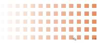

浅谈原油与黄金

[源网页](https://mp.weixin.qq.com/s?__biz=MjM5MzcwMjgzMQ==&mid=2247502868&idx=1&sn=743fbd0033ef00e0bb12540c6042ca95&chksm=a720803bc4640261ea42c1f10d71a2aa365def70131146744a6c5ab6503f92e14adfeb18e941&mpshare=1&scene=1&srcid=09056sxZD9RzMLJp5lb3oUj4&sharer_shareinfo=70c24d94ad5215205826a0588904d922&sharer_shareinfo_first=70c24d94ad5215205826a0588904d922#rd)

公众号名称：李大霄

作者名称：李大霄

发布时间：2026\-09\-0513:53

__《大霄说》第二千一百三十四期。__

我们来聊一聊油价的问题。根据ICE欧洲期货交易所的数据，截至9月1日当周，基金经理持有的布伦特原油多头头寸增加37837手，达到261435手，创下逾三个月以来最高水平。美国商品期货交易委员会CFTC的数据显示，原油净多头押注攀升至6月份以来的高点。市场担忧霍尔木兹海峡可能遭遇长期扰动，对冲基金对布油的看涨程度升至5月份以来最高。

更为关键的是，柴油等成品油涨势更为猛烈。中东与乌克兰冲突同时发酵，进一步挤压原油与燃料供应。柴油净多头押注已经升至3月份以来的最高水平，美国零售柴油价格周四创下每加仑5\.85美元的历史新高。汽油净多头押注飙升89263手，创下去年12月以来新高，当前汽油价格处在9月份历史高位附近。

原油、柴油、汽油多头头寸纷纷走高，将会对下周公布的CPI数据产生一定影响，也会推高美国9月及后续阶段的加息概率。我的判断是可能在推高美国汽油、柴油价格，以此扰动通胀数据，进而影响美联储加息节奏，最终作用于11月3日的关键进程，这是完整的逻辑链条。

另外值得思考，当前对美联储的施压，无论力度还是效果，似乎都不及鲍威尔时代，这一点需要认真评估，也就是说美联储当下的独立性与话语权值得关注。

接下来聊另一个重要话题：多国为何开始将黄金移出美国，这也是我一直担忧的现象。过去，美国是全球黄金储存中心，不少国家自愿将黄金存放至美国。但这批托管黄金没有审计机制，没有年审报告，也没有律所出具的核实文件，无法确认黄金实际存放的数量，仅仅对外公布照片，照片对应的黄金吨位很难核实。

9月初国际黄金市场剧烈波动，荷兰央行对外公布一项已经推进数月的黄金储备调整计划。今年3月至8月，荷兰重新调配约86吨黄金。调整完成后，存放在纽约的黄金占本国总储备比例由31\.3%下降至18\.5%；存放在伦敦的占比由18\.1%提升至32\.1%，伦敦一跃成为荷兰最大的海外黄金托管地。荷兰央行给出的理由十分明确，分散风险，确保发生严重危机时，黄金可以快速投入市场。

拉长时间来看，近几年，从法国、德国，到波兰、塞尔维亚，越来越多欧洲国家开始重新思考一个过去没有深究的问题：国家重要储备资产究竟应当存放在哪里？继续放在美国吗？万一出现不认账的情况怎么办？万一金库里面只有照片呢？当然这只是假设，不少美国影视作品也有类似设想，担心金库遭遇被盗等风险。荷兰这86吨黄金，也并非动用飞机运回本国，而是在纽约市场卖出，再在伦敦市场买回完成调仓。

为什么我们要在香港设立黄金仓储并将规模扩容十倍，这是一项意义重大的决策。目前伦敦与纽约合计占据全球储备黄金份额的53%；上海与香港的实物黄金需求占比28%，投资需求占43%。上海已经成长为全球黄金交易第三极，日均交易量占全球16%。

我认为上海与香港的地位十分关键。虽然还有其他黄金交易区域，但上海、香港的黄金中心地位正在快速抬升。我们不能把全部资金、全部黄金都存放于美国。上海与香港黄金地位提升，有利于全球资产做风险均衡配置，这有着十分重要的意义。

再看纽约金库的黄金存量。德国早在2013年就启动大规模黄金回运计划，2013年至2017年，从美国运回300吨黄金，目前德国依旧有1236吨黄金存放在纽约，占其黄金总储备的37%，国内要求进一步撤回黄金的呼声越来越高。

法国也已经醒悟，2025年7月至2026年1月，分批次处置长期存放在纽约的129吨黄金，同样不一定是实物运回国，可以在纽约卖出，在欧洲完成买入。如今法国2437吨黄金全部留存本土，这可能才是稳妥的做法。

为什么这一趋势在2022年之后骤然加速？源于一次金融制裁，有国家的大量海外储备遭到冻结，这件事让很多国家幡然醒悟——存放在美国的资产，法律上归属本国，但真正冲突发生之后，情况就会发生变化。

过去美国之所以成为黄金托管地，是因为别处战火不断，唯独他们本土相对安全，当时大家公认纽约最安全。现在情况已经改变，资产存在被没收的可能性。随着越来越多国家觉醒，陆续调回本国黄金储备，美国长年累积下来的信誉，正在一点点消耗殆尽。

当然这个过程是渐进式的，不会在一朝一夕崩塌。信誉是一点点建立起来的，崩塌同样是缓慢发生。我们必须认清这个现实，“资产全部放在美国就绝对安全”的固有认知，会随着各国的觉醒回归客观。

今天主要和大家分享油价与黄金两大话题。周末愉快。（2026年9月5日\)

📹 视频内容（上图为封面），请前往原文观看：[在公众号原文中观看](https://mp.weixin.qq.com/s?__biz=MjM5MzcwMjgzMQ==&mid=2247502868&idx=1&sn=743fbd0033ef00e0bb12540c6042ca95&chksm=a720803bc4640261ea42c1f10d71a2aa365def70131146744a6c5ab6503f92e14adfeb18e941&mpshare=1&scene=1&srcid=09056sxZD9RzMLJp5lb3oUj4&sharer_shareinfo=70c24d94ad5215205826a0588904d922&sharer_shareinfo_first=70c24d94ad5215205826a0588904d922#rd)

声明：理财有风险，投资需谨慎，个人观点仅供参考，不构成投资建议，操作风险自担。

__《李大霄投资战略（第三版）》已经出版上线，三十年投资心得，讲透价值投资，判断投资趋势。点击下方链接购买：__

__声明__

长期接到粉丝的求证仿冒者的身份的要求，还有上了仿冒者的当后来真身处投诉，皆因大量仿冒者以各种变身各种手段添加粉丝微信，进行各种各样的诈骗活动。在此特别声明真李大霄绝对不会主动添加任何粉丝的微信，也不会通过任何方式邀请大家加群、加好友，更不会主动推荐股票或进行任何投资相关的诱导行为，请大家务必提高警惕。要先学会分辨真伪，再进股市。既然知道真身，为何还要不断地求证假身、相信假身、上当后来真身处投诉？
股票市场风云变幻，在做出投资决策之前，不要轻信任何未经证实的推荐和承诺，建议大家通过阅读类似《李大霄投资战略》第三版的书籍学习股票知识，按照投资五年级步骤，完全毕业之后才能购买股票，不宜跳级投资。未能分辨真伪者不宜投资。

## 商务合作微信号：lidaxiao111

## 联系邮箱：chinalidaxiao@126\.com

内容效果不满意？[点此反馈](https://feedback.notebooksyncer.com/feedback/4a2ab932_1788591080976?u=https%3A%2F%2Fmp.weixin.qq.com%2Fs%3F__biz%3DMjM5MzcwMjgzMQ%3D%3D%26mid%3D2247502868%26idx%3D1%26sn%3D743fbd0033ef00e0bb12540c6042ca95%26chksm%3Da720803bc4640261ea42c1f10d71a2aa365def70131146744a6c5ab6503f92e14adfeb18e941%26mpshare%3D1%26scene%3D1%26srcid%3D09056sxZD9RzMLJp5lb3oUj4%26sharer_shareinfo%3D70c24d94ad5215205826a0588904d922%26sharer_shareinfo_first%3D70c24d94ad5215205826a0588904d922%23rd&s=onenote)
