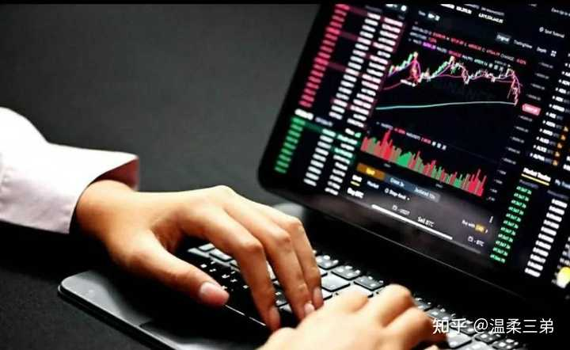
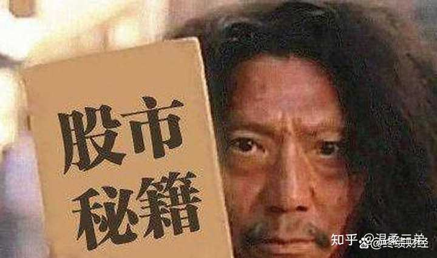
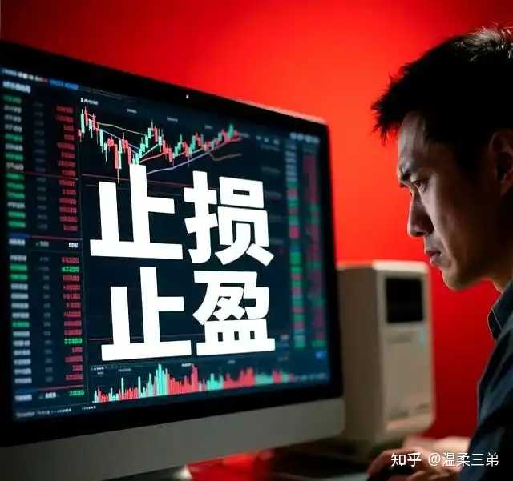

__问题描述：__

可能方方面面都有关系，甚至运气也算吧？

知识和心态对于炒股来说都非常重要，缺一不可。

具体是知识最重要还是心态最重要？我觉得要分阶段，在开始阶段，前四五年吧，知识重要，系统学习股票知识后，对股市有深入了解，才能为以后赚钱打下坚实基础。

有了知识和基础，再有好的心态，能克服贪婪与恐惧，才能在股市赚大钱。

alt="Image">

在开始的前几年，要认认真真学习炒股知识，并能熟练应用所学知识，做到理论与实际应用相结合，慢慢积累经验，做到集腋成裘，聚沙成塔。

如果没有丰富的知识储备，就不可能有后面的进步与提高，更不可能战胜市场。

如果只有丰富的知识，没有良好的心态，不可能持续赚钱，不可能有稳定的盈利模式。

知识和心态是缺一不可的，也是相辅相成的。

一个股民连基本的K线、均线、指标都不知道怎么回事，更不懂得把三者有机结合起来，那就是典型的韭菜，还是刚发芽的嫩韭菜。

alt="Image">

老股民都知道，在熊市任何技术指标都失去效果，起不到任何参考作用，甚至不用考虑K线均线等指标，只闭着眼睛卖就对了，空仓等待就是良策。

在牛市，K线、均线等技术指标才有效果，有实战的指导意义。

无论熊市还是牛市，心态都非常重要，牛市就耐心持有，中途不要老想着调仓换股，最后都会得到丰厚的回报。

熊市就耐心等待，直到出现历史大底，政府推出各种利好消息，希望股市上涨，闭着眼睛买就行了，要满仓买。

之所以大部分散户不能跑赢大盘，不能稳定赚钱，就是没有良好的心态。

alt="Image">

股票知识可以学，都懂K线、均线、指标意义，但是心态不对，就是亏损，赚不到钱，该买的时候不敢买，该卖的时候舍不得卖，克服不了人性的弱点，克服不了性格的缺陷。

如果不具备良好的心态，在熊市亏大钱，在在牛市赚小钱，这是大部分散户的真实写照。

所以知识和心态都很重要，但不同的阶段有不同的侧重点。

alt="Image">

开始阶段知识重要，三五年以后心态重要，十年八年之后性格重要，能在股市赚大钱靠的是心态和性格。
