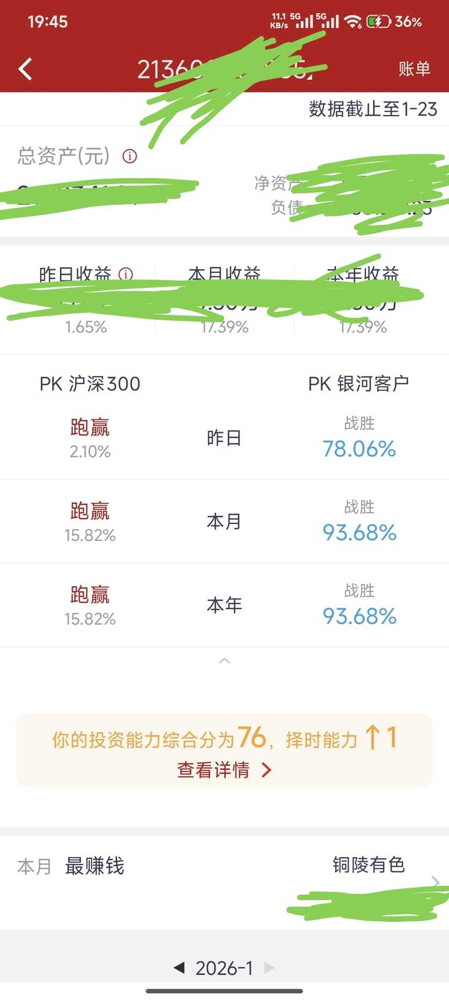

炒股这么多年，你最大感悟是什么？ \- 股民小y 的回答

炒股多少年？因为什么事情有感悟？

1，要花费99％时间选票，1％时间操作，坚持价值投资。

2，涨了要卖，拒绝追高，卖飞了无所谓，别再一棵树上吊死。没有只涨不跌的票，也没有只跌不涨的票。

3，不要看评论区，会放大你的贪婪/恐慌情绪

4，新人别逛论坛，大部分人的思维都是错的，而你也没有判断对错的能力，你跟着他们能学到什么？

5，没有做波段的能力，就多看少动

6，不要想着一夜暴富，要细水长流，欲速则不达

7，最好不要买etf和基金，没有选票的能力，就别来股市。

后续补充。

本人本月17\.39％，居然才跑赢93\.68％股民

去年收益106％，打败了98％。

绝大部分买卖的操作都会发文章。

alt="Image">

以下为推荐的股票汇总

太懒了，很久没更新了。。。。。
