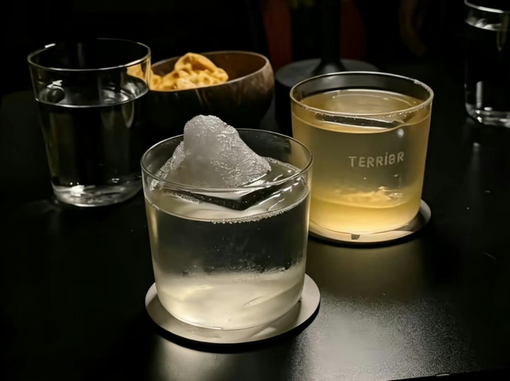

1\.

__对大多数底层男人来说，性资源是奢侈品。__

对于底层男人，性资源总是遥不可及，最快的捷径就是放下尊严，摒弃道德约束，成为"人渣"。

这种机会往往都会引火烧身，因为你根本就没能力去驾驭。

但是，在上流人士眼中，性不过是一种手段，用于操控与交换资源。

2\.

__不要上赶着任何人，人近则贱，情疏则贵。__

成年人最高级的清醒，是读懂人性，守住距离。

3\.

__记住：人喜欢报仇。__

因为报仇有快感，人不喜欢报恩，因为报恩是负担。

4\.

__人允许一个陌生人的发迹，却不能容忍一身边人的晋升。__

因为同一层次的人之间存在着对比、利益的冲突，而与陌生人不存在这方面的问题。

5\.

__贫穷，会夺取人的人性。__

家徒四壁的时候，看什么都是偏激的。一旦口袋里的钱多了，看什么都顺眼了，人也变得宽容了，人淡如菊的气质，就出来了。

6\.

什么事情在没有做出成绩之前，或者在你没有干出来之前，你可千万别拿出来说。

你说这个事肯定崩，记住了，不管你信不信这个邪，他就是现实。

7\.

"良知"这个东西有就是有，没有就是没有，你是永远唤不起别人的良知的，在没有的情况下。

8\.

__永远不要让跟你接触的任何人，免费从你这里得到任何东西。__

__这个是人性，越是免费的东西越不被珍惜。__

为什么会上演东郭先生和狼以及农夫和蛇的故事，你是东郭先生还是农夫，你是不是觉得不让对方付出就叫善良，我告诉你，吃不透人性的人，最后都会踩很多坑。

9\.

钱包和镜子能回答，生活中绝大多数的，为什么和凭什么。

所以没事多挣钱，钱能解决百分之99的问题，剩下百分之1的问题会用更多的钱来解决。

10\.

底层生活一定不能太有素养，不能太好说话，要活得像把刀，在底层越礼貌，越得不到尊重，越有教养的越被欺负。

__一定不要害怕得罪别人，该翻脸的时候就得翻脸。__

我们翻脸的目的不是因为我们想制造冲突，而是我们想让对方知道我们不是没有底线的。

如果我们的善良和我们的忍让，得不到对方应有的尊重，那么为了解决这样的关系，最直接的方式就是翻脸。

alt="Image">

11\.

__别高估关系，别低估人性，大多数亲近，都带点实用目的。__

如果有一天你发现，大家都对你客气了，是因为大家的素质提高了，而是：因为你变强了。

12\.

__搞钱，多想想怎么搞钱，它可比你任何人都靠谱，比任何事都重要。__

不要太相信任何人，只有钱才会对你完全忠诚。真遇到事，存款是你最值得信赖的后盾。

迷茫的时候，低谷的时候，不知道做什么的时候，去学习＋赚钱，其他的事情你做了都有可能后悔，这两个绝对不会辜负你。

13\.

网上那些感人肺腑的视频，往往评论区一片同情，但当他开始带货赚钱的时候，评论区就多了很多讽刺和挖苦。

14\.

抱着交易的本质，去接触人和事，结局都不会太差，而用陪伴唠嗑堆砌出来的感情，一旦涉及利益，就会分崩离析。

15\.

熟人眼里容不了牛人，自己的成功只配自己当秘密守，哪怕是亲人最好也不要泄密，因为一高兴，就把你给捅出去了。

16\.

女人拉黑删除，都是使性子闹脾气，真正的离开其实都是客客气气的。

17\.

__当你老了，躺在病床上你就会明白： __

__这辈子最亲的不是血脉，而是你手握的财力与实力。__

如果你的实力与财力雄厚，子女倒是希望你能长寿健康；如果你只是个身无分文的，常年兜尿不湿并嗷嗷作痛的，不用子女，身边的那个人都盼着你早点归西。

__人敬的从来不是你这个人，而是你手里的权、兜里的钱、身后的势。__

18\.

帮亲戚无论是介绍工作也好，介绍对象也罢。不要持100％的态度去，一定先把丑话说在前头，等他同意之后再去帮，不然你就等着被黑吧！

alt="Image">

19\.

人性都是幕强的，当你强大时，你不爱说话就是深沉，你的坏脾气，也是个性，你的没大没小那就是随和，而当你弱小的时候，你不爱说话就是呆板你的坏脾气，就是情商低，你没大没小的就是没教养。

人们嘴上虽然都是同情弱者，在暗地里都会悄悄跟随强者，因为狼注定是要吃羊的。

20\.

谁禁止你优秀，谁就是坏人，远离他们，他们没有品尝过美好人生的滋味，也不许你品尝。

21\.

__就算是最亲密的人之间，也要有边界感。__

不冒犯、不窥探、不干涉，适用于任何感情。

22\.

当你放下面子赚钱的时候，说明你已经懂事了；当你用钱赚回面子的时候，说明你已经成功了；当你用面子可以赚钱的时候，说明你已经是人物了。

当你还停留在那里喝酒、吹牛，啥也不懂还装懂，只爱所谓的面子的时候，说明你这辈子也就这样了。

23\.

人性是不患寡而患不均， 不怕大家一起穷，就怕你突然富起来，所以要闷生发大财。

2026年听过最多的一句话就是：__远离熟人，闷声发财。__

24\.

__今年感悟很深的一段话是：__

其实每个人细究起来都很有意思，只是人很少有被仔细看见的机会，以至于被仔细看见这件事，有点近似于爱。

25\.

变强的核心：

持续做事，持续更新目标、持续解决问题，持续复盘迭代，在一次次「做到」的过程中沉淀内核和能力。

不要把太多枷锁套在自己身上，不要让自己的思考比实践多。

26\.

当你接触的越多，就会发现真正高情商的人，不是八面玲珑能说会道，而是在与人交往的过程中尽量不去激发别人人性中的嫉妒羡慕和恨。

越是厉害的人越谦虚越越懂得尊重别人，并且能照顾别人的感受。

哪怕是向下兼容，他们会在关系中做到收放自如，拥有对自己对她人关系的掌控感，可以拉近也可以推远，这种能力是来自于骨子里的优秀，是对自己、对他人、对人性。有足够的认知有极强的同理心懂得换位思考。

27\.

__人心是最不能直视的东西。__

这个世界上，多是半人半鬼，靠近了，谁都没法看。

别高估了自己，也别低估了人性。万丈深渊尚有底，惟有人心不可测。

世上有两种东西不能直视：

__一是太阳，二是人心。__

28\.

__同事间，不要什么话都讲。__

尤其是好事、坏事不能讲。要讲就讲你知我知的事情，比方说天气、新闻、美食等等。

特别是升职加薪自己不要提一嘴，哪怕是公司公布的，也要说感谢公司给机会以及同事们的信任。

__千万不能在同事面前说领导的坏话！__

因为你永远不知道那些表面装的和你很好的同事，背地里会不会给你捅娄子，管住自己的嘴巴，做好自己的本职工作，就能少惹麻烦。

29\.

别指望低谷时有人拉你一把，不落井下石，已经算是好人。

30\.

__少言为贵，沉默是金。__

任何时候尽最大可能避免聊自己的私事，管住自己的嘴巴，交浅不言深，是对自己最基本的保护。

现实反复证明，你掏心掏肺讲出自己的软肋，一转头就可能变成公开的谈资。

有句话叫："不可与言而与之言，失言。"跟不该深谈的人倾诉真心话，反而会害了自己。

alt="Image">

大家好，我是 [@王小妖](https://www.zhihu.com/people/e7eb040f9f3740cc5a35eef381c42fd7) ，感谢大家的喜欢和支持❤️，我会继续给大家带来更多优质的内容，喜欢的别忘了点赞收藏➕关注哟～

图文：源于网络整理，侵删
