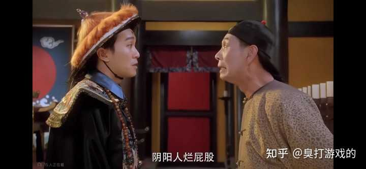
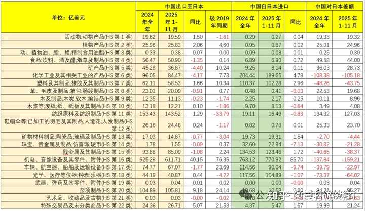
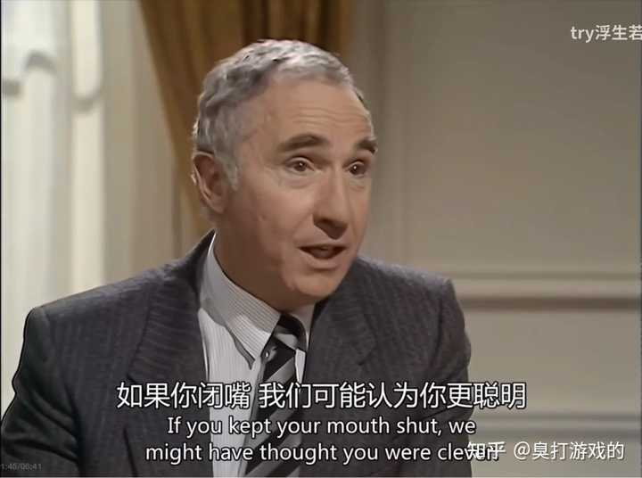

美方称中美「贸易休战」延长至明年 1 月，这对世界局势有何影响？ \- 臭打游戏的 的回答

__问题描述：__

9月24日，外交部发言人郭嘉昆主持例行记者会。 路透社记者提问，美国财长贝森特表示，中美两国已同意将“贸易休战”协议延长至明年1月10日，中方还没有发…

老嫂子贝森特之前参加我方财长会议，中方敦促美方不要玩火自焚。

结果“玩火自焚”被翻译成的hell fire （地狱之火） ，在美国文化里这句话是跟骂同性恋不得好死差不多的意思。

巧了，贝森特就是基佬，这老嫂子回国的时候好一顿委屈，东大骂我是

alt="Image">

__牢美，每当我想多给你些尊重时，你便出资干预外贸……………__

__老美所谓的“贸易休战”实际上就是无限期停战。__

__因为打不动了。__

但实际上在对外贸易这个事上老中是真的很努力的想买东西了…

老中的进口包括但不限于：集成电路、半导体制造设备、航空器及零部件、医疗器械、精密仪器、工业母机、关键矿产、原油、天然气、大豆、肉类、乳制品、高端化妆品、奢侈品、优质农产品……

总量大的抓质量，质量好的走总量。

几乎把能买的全都买完了，凡是愿意向东大出口矿产、木材、粮食的国家全部都买了个遍。各种易储存的战略物资，可以说被中国全包揽了。

还能保持这么大的顺差，单纯是因为实在没什么可买的了…

这不老美就马上着手减少对日本的贸易逆差了吗🤗

alt="Image">

根据美国农业部统计，22年有孩子家庭中17%\(大概1340w孩子\)面临食物不安全\(缺乏足够食物以维持健康积极生活，无法负担足够数量营养食品\)，全国有4420w人生活在食物不安全家庭中\(不包括无家可归者\)。

22年10月，28%的美国有孩家庭报告说孩子因负担不起食物而挨饿。在13州里这个数字超过了30%，密歇根州最高，有43%。

22年有78w名儿童经历了超低的食物不安全程度\(包括没有食物\)。在加州、路易斯安那、爱荷华、肯塔基州，至少20%的18\-24岁青年在上周没有足够的食物\(统计时间为22年10\-11月\)。

中国数据，19年中小学生营养不良率8\.5%，6\-22岁学生营养不良率10\.2%\(更新的我找不到\)。营养不良是指饮食不均衡导致的营养素缺乏、过剩，比如超重肥胖和消瘦、发育迟缓、缺乏维生素导致疾病………

老中不刻意追求贸易顺差，甚至是为了保护老美，截止2025年：

农业产量6\.95亿吨，全球占比25%。

肉类产量9641万吨，全球占比25%。

蔬菜产量7\.91亿吨，全球占比50%。

水果产量3\.1亿吨，全球占比32%。

发电量9456\.4TWh，全球占比31\.6%，发电量增量607\.7TWh，占全球增量的82\.5%。

工业用电量6000TWh，全球占比接近50%。

制造业产值全球占比35%，按照购买力计算全球占比接近45%，制造业增加值全球占比29%。

煤炭产量47\.1亿吨，全球占比50%。

钢铁产量10\.19亿吨，全球占比54%。

二氧化锰35万吨，全球占比70%。

铬盐产量40万吨，全球占比40%。

水泥产量20亿吨，全球占比50%。

碳纤维产量12万吨，全球占比47\.7%。

石墨产量85万吨，全球占比65\.38%。

塑料产量1\.28亿吨，全球占比32%。

铝产量4166万吨，全球占比58\.9%。

铜产量1299万吨，全球占比47%。

铅产量756万吨，全球占比51\.5%。

锌产量715万吨，全球占比51\.5%。

镍产量113万吨，全球占比34%。

锡产量21万吨，全球占比55%。

锑产量4万吨，全球占比48%。

硅产量570万吨，全球占比80\.2%。

镁产量136万吨，全球占比83\.4%。

笔尖钢30亿颗（前工业明珠），全球占比86\.6%。

海绵钛产量22万吨，全球占比68%。

钒产量16\.2万吨，全球占比68%。

碳酸锂产量37\.9万吨，全球占比63%。

钴产量14\.4万吨，全球占比76%。

稀土冶炼分离产量24\.38万吨，全球占比90%。

化肥产量5700万吨，全球占比30%。

硝化棉产量10万吨，全球占比50%。

氮肥产量3000万吨，全球占比33%。

纤维加工总量6000万吨，全球占比50%。

化纤产量6872万吨，全球占比64%。

电池产量940GWh，全球占比70%。

重卡产销量101万辆，全球占比44%。

汽车产销量3100万辆，全球占比32%，其中新能源汽车全球占比64%。

造船完工量4332万吨，全球占比50\.2%，新接订单量7120万吨，全球占比66\.66%，手持订单量13939万吨，全球占比55%

日用陶瓷全球产量占比70%，陈设艺术瓷产量全球占比65%，卫生陶瓷全球产量占比50%，建筑陶瓷产量全球占比64%。

人工宝石产量全球占比70%。

龙门吊市场份额全球占比82%。

盾构机市场份额全球占比70%。

挖掘机市场份额全球占比62%

叉车市场份额全球占比55%。

工程机械市场份额全球占比33%。

工业机器人装机量全球占比50%。

高铁里程超过4\.5万公里全球占比66\.3%。

城市轨道里程2100公里全球占比48\.6%

高速公路里程18\.4万公里全球占比46%。

大宗原料药产量全球占比40%。

医疗器械市场份额全球占比27%。

光伏产业市场份额全球占比80%。

自行车市场份额全球占比60%。

电动自行车5520万辆，全球占比81\.9%。

电动三轮车市场份额全球占比90%。

民用无人机市场份额全球占比70%。

冰箱市场份额全球占比50%。

洗衣机市场份额全球占比50%。

空调市场份额全球占比80%。

电视机市场份额全球占比57%。

空气炸锅市场份额全球占比67%。

电磁炉市场份额全球占比50%。

微波炉市场份额全球占比80%。

电饭煲市场份额全球占比70%。

吸尘器市场份额全球占比90%。

灯泡市场份额全球占比40%。

小家电市场份额全球占比50%。

家电整体市场份额全球占比60%。

家电专利申请量全球占比67\.3%。

家具市场份额全球占比50%。

纺织业市场份额全球占比50%。

液晶显示屏市场份额全球占比70%。

OLED面板市场份额全球占比45%。

PCB市场份额全球占比50%。

变压器市场份额全球占比35\.07%。

便携式DVD播放器市场份额全球占比50%。

耳机市场份额全球占比90%。

玩具市场份额全球占比75%。

新能源汽车1664万辆，全球占比70% 。

锂电池1755\.6GW，全球占比80% 。

太阳能电池832GW，全球占比90%。

工业机器人41\.2万台，全球占比超50%。

高铁营业里程5\.04万公里，全球占比70% 。

地铁等城市轨道交通里程1\.1万公里，全球占比40% 。

5G基站483\.8万个，全球占比60%\-70% 。

港口货物吞吐量183\.4亿吨，全球占比50%。

老美现在应该做的是防止老中彻底完成“__贸易垄断”（而且是被动的），__现在说不允许老中有贸易逆差会不会有点可笑了？

alt="Image">
