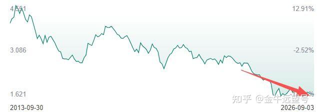
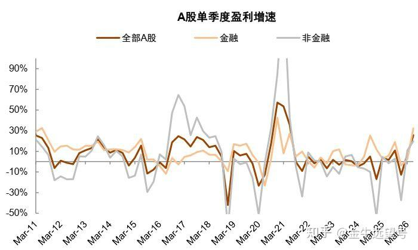
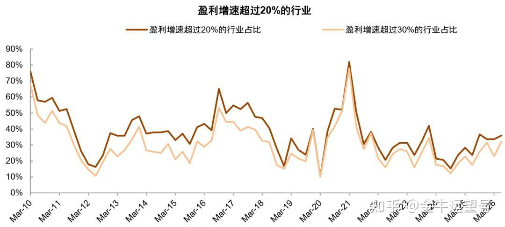

股市出现了重大变化

[源网页](https://zhuanlan.zhihu.com/p/2078950791151466159?share_code=pwNKUkQjEwcD&utm_psn=2079687241832592674)

先说一下，格指达到2了。

之前提过，格指是巴菲特导师格雷厄姆发明的，我对其做了改造，使其适用于国内股市。

详细介绍见相关文章☞等一波下跌！

__按照格雷厄姆的定义，格指达到2就表示股市出现了一定的机会。__

但现在股市还有 3950 点，为什么格指就已经到 2 了呢，原因有两点：

__第一，国内债券收益率大幅下降。__

10年期国债收益率在1\.68%左右，达到了历史性低位。

而历史最低是1\.65%。换言之，国债收益率即将破历史记录。

国债收益率低，也就意味着市面上各种债券的收益率都来到了低位。这对于股市而言，是显著有利的。

毕竟股市的价值是比较出来的。就好像如果房子还是以每年10%的速度涨价，那很多人也看不上股市，但现在房子阴跌，股市的投资价值会大幅凸显。

__第二，A股今年二季度的盈利增速大幅上升。__

下图是A股包括金融和非金融的单季度盈利增速。你会发现今年2季度A股的盈利增速出现了大幅提升。

__全A股二季度利润增速超过了15%。__

__就这个利润增速，和历史上几次牛市是相呼应的。__比如2017年的供给侧牛市、2020年白马蓝筹牛市，利润增速也都超过了15%。

但这部分朋友可能会有疑惑。像二季度消费股的利润是下滑的。为什么A股利润还能大幅增长呢？

原因很简单，我们可以拆解一下。

消费里利润下滑最严重的就是白酒了。白酒二季度利润从去年的267亿下降到今年的210亿。

要说减少，那确实是大幅减少了20%。但看绝对值，也就减少了50亿而已。

如果看消费整体，由于猪肉股从去年的盈利转为今年的大幅亏损，导致整体利润下降了200多亿。

而__今年二季度，仅半导体利润就增长了410亿，覆盖了消费板块利润的全部减少。__

在半导体之外，电子、券商、有色今年二季度的利润增长在80%～120%，平均100%。

在这些强势行业的带动下，A 股利润自然大幅增长了，整体估值随之下降。

那你就想嘛，股市利润大幅上涨，估值降低，与此同时债券的收益率大幅下降，那么股市的投资机会是不是会明显上升？

这也是为什么格指达到了2以上。

__但这里还有一个问题，那就是本轮牛市利润增长的行业是很少的。__

历史上各季度盈利增速超过 20% 以及超过 30% 的行业占比，如下图所示

__本轮牛市，盈利增速超过20%的行业占比35%，远低于历次牛市。__

这个数字，2010年小牛市是70%\+，2017年红利蓝筹牛市是50%\+，2020年牛市是80%。

换言之，历史上的牛市大部分是普牛，也就是大部分行业都出现了利润的高速增长，从而带来整体利润的增长，最终带来了指数的大幅上涨。

__而这次牛市是极端的窄牛，只有极个别行业出现了利润的高速增长，从而带来整体利润的增长。依靠这些行业的股价上涨，最终带来了指数的上涨。__

这也是为什么很多投资者说自己本轮牛市没赚到钱，也是因为很多行业确实没咋涨。

而更大的问题在于，这些利润高速增长的行业股价也下跌了：

比如有色，高点出现在今年1月份；比如电子半导体，高点出现在今年6月份；再比如券商，就没有高点🐶

而那些利润增速不佳的行业，比如消费，那就更别提了，一直在阴跌也意味着他们有反转的可能性，存在上涨的潜力。

那么这种情况下，我觉得不应该过于悲观。

另外，我们还有一个观察指标，就是投资机会。目前还在 B\+，还差一点就到 A\-了，要是到了，我会提醒大家。

文章纯原创，还望能点赞、点爱心、分享支持。你的支持是我更新最大的动力。

内容效果不满意？[点此反馈](https://feedback.notebooksyncer.com/feedback/87a1a024_1788616111993?u=https%3A%2F%2Fzhuanlan.zhihu.com%2Fp%2F2078950791151466159%3Fshare_code%3DpwNKUkQjEwcD%26utm_psn%3D2079687241832592674&s=onenote)
