诗鬼李贺究竟鬼在哪里？ \- 伊阅 的回答

儿子问我，为什么李白是诗仙，李贺却是诗鬼？

我说，仙，是凡人学不来的。

正如我前面写的兵仙韩信，他的军事杰作，就算是后人用沙盘推演，也很难成功。

诗仙李白亦是如此，就算你穿越到盛唐，也不敢正面面对李白。

但说到诗鬼，我不禁背后一阵阴凉，九年义务教育，让我知道诗鬼就是李贺，但我却不清楚，李贺为什么就是诗鬼？

为了解答儿子心中的疑惑，从小就怕鬼的我，竟然开始查阅起关于李贺的资料。

我接触到李贺的第一首诗，是《雁门太守行》，当读完第一句“黑云压城城欲摧”，我脑海中就浮现一幅画面，是那种山雨欲来、乌云密布，狂风肆虐、近在咫尺的压迫感。

这种压迫感，只有父母混合双打时才会出现，而李贺只用了7个字。

当我了解到李贺的一生，我终于明白，后人为什么称他是“诗鬼”。

李贺的诗作中，出现血、泣、鬼、死、魂、幽等字的频率相当高，阴冷的字眼，让人毛骨悚然。

尤其是一句“唯见月寒日暖，来煎人寿”，这个“煎”字，没个几十年抑郁症的人还真写不出来。

究竟是怎样的经历，让只有二十七载人生的李贺，写出这样的诗？

__01__

贞元七年（公元791年），李贺出生于河南福昌（今河南洛阳宜阳县）。

父亲李晋肃以“贺”为名，字“长吉”，由此看来，李晋肃希望李贺长命百岁、一生吉祥。

只可惜事与愿违。

历史上，但凡能名留青史的人物，都是非常特殊的。

李贺也是如此，4岁都还不会开口说话，急的母亲郑氏日夜为他祈祷。

直到有一回看见母亲受伤，李贺才急的吐出两个字。

确定儿子会说话后，夫妇两悬着的心终于落地了。

虽然会说话，但是话特别少，李晋肃便说这孩子性格孤傲，要多与人交往，于是办了个私塾，这样既能学习还有小伙伴。

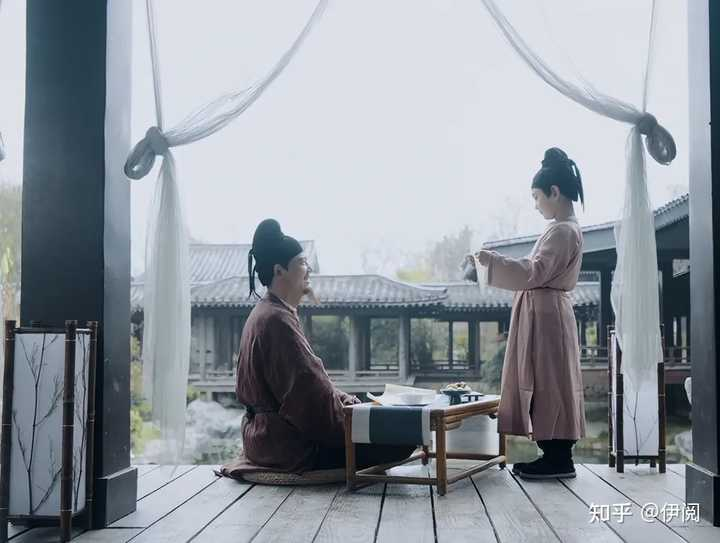

alt="Image">

李贺小时候上私塾都由小溪奴陪伴，长大一点后又由小书童作陪。

很多人都说李贺是寒门子弟，其实还真不是，就他小时候的学习环境，一般家庭根本供应不上。

尤其是在13岁左右时，李晋肃直接搬家，从昌谷移居到东都仁和里，为得就是让儿子能去国子监读书。

__国子监，那可是唐朝最高官学，其中国子学只对三品以上的官僚子弟开设。__

正常来说，李贺根本进不了国子监，之所以能进，其实有两个原因。

首先，因为“安史之乱”带来的影响，使得国家财政收支减少，国子监的生源越来越少，不及原先的六分之一，为了扩招，只能降低门槛，适当收入八品以下官员子弟，而李晋肃的官职大概在七品。

其次，是李贺太出名了，当时国家给的条件是“适当”，所以不是八品以下就全收，这还得看资质。

据说李贺7岁的时候，韩愈和皇甫湜就造访过李贺，李贺当面写了一首诗，让二人大为称赞，此后名扬京洛。

之后更是与李益齐名，在去了东都仁和里之后，很多人都去求歌篇，李贺前脚刚写完几首乐府，后脚就被人排队拿走了。

就连王参元也亲自去拜访他。

即使誉满京华，李贺依然只能是国子学的旁听生（旁听生需自备纸烛和衣衣食，还没有学籍名册），而三品以上官员子弟不仅有学籍名册，还有俸禄，参加考试时还能得到优待。

__可见教育在古代就已经被官僚垄断了。__

不仅被垄断，就连保送国子监的名单都是内定好的，电视剧《庆余年》不就上演了这一幕，这在历史上也是真实存在的。

这么一看，李贺虽然是旁听生，但对于他来讲已经很好了。

公元807年，王参元参加了河南府试，取得了举人资格，准备参加进士试。

李贺既羡慕又无奈，因为守孝还未满三年（李晋肃病逝）。

府试也叫秋试，因为总在秋天举办，府试是为了来年去长安参加进士试摸底的。

如果连府试都过不了，进士试也就别想了。

__进士试只是科举考试的一种，唐代科举分常科与制举，目的都是选拔人才。__

__区别是常科每年定期举行，如考取进士后，那真就吃香的喝辣的了，至少在唐朝是这样。__

__很多官员对新进进士都礼遇有加，他们能享受到政治和经济上的种种特权和优待，很多重要官职大多也是从新进进士里面选拔。__

__制举则是皇帝临时决定开科取士，没有固定时间，全凭皇帝个人喜好。__

对于那些文人，常科才是首选，考上则一鸣惊人。所以有的人哪怕官至宰相，若不是进士出身，终为不美。反倒是那些进士出身，哪怕还没有任职，世人也非常敬佩，“白衣公卿”说的就是这类人。

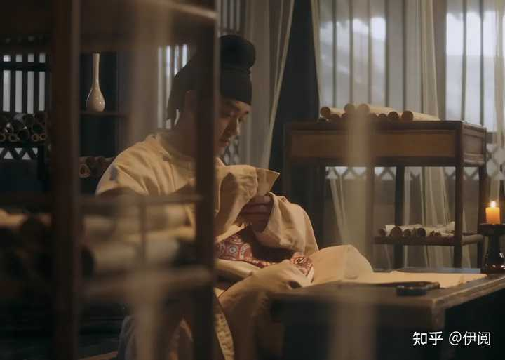

alt="Image">

送别王参元后，李贺也开始备考之后的府试，专门写《雁门太守行》谒韩愈。韩愈是文章巨公，能得到他的欣赏是诸多学子梦寐以求的事。

黑云压城城欲摧，甲光向日金鳞开。
角声满天秋色里，塞上燕脂凝夜紫。
半卷红旗临易水，霜重鼓寒声不起。
报君黄金台上意，提携玉龙为君死！

韩愈爱才，每日都拖着疲倦的身躯看学子们投来的作品，看见好的还会亲自批复。秋试在即，烈日当空，韩愈神思倦怠，昏昏欲睡，在看到李贺的《雁门太守行》后，瞬间眼前一亮，倦意全无。

河南府试如期举行，李贺以一组《十二月乐词兵闰月》，成功拿下。为此，韩愈大摆宴席，邀请了一众文坛大佬，他们一致认为李贺虽年龄最小，赢面却最大。

当年洛阳才子元稹也是15岁中第，轰动了整个洛阳，如今因昌谷李贺的参考，让整个东都科场掀起了一股热潮。

府试名单公布后，李贺不负众望，一抬头便看到了自己的名字。

按照惯例，府试通过后要领取解状，这样便可以参加进士试。

领取解状那天，意外出现了。

__02__

按理说，李贺的名字靠前，应该最先拿到解状的，直到其他人领完了，官吏才喊“昌谷李贺何在？”

__“你的举人资格被取消，本府不能给你出具解状。”__

李贺先是愣在原地，然后撕心裂肺的问缘由。

官吏一直不理他，李贺控制不住情绪，他的大喊吸引了府尹大人郑余庆。

一般这种情况，郑余庆是不会管的。但他看过李贺的诗作，惊为天人，便出来当面解释：__你父亲名为李晋肃，“晋”与进士的“进”同音，按规矩你得避讳，不能参加进士试。__

按理说这是比较隐私的事情，就好比你参加高考，同期考生怎么会知道你父亲的名字？

原因很简单，是李贺占了名额，被同乡嫉妒举报了。

府尹大人不可能为了李贺掉乌纱帽。

李贺心灰意冷，原本体弱多病的他，重重的摔倒在地。

很多人体会不到这种绝望。

__高考后你金榜题名，成为江西省高考状元，“清北复交”等都求着你去上学，不仅免学费，还提供生活补助，未来一片光明。正当你纠结选北大还是清华时，市长打电话跟你说，你的同乡竞争者举报你，说你爸的名字里有个高考的“高”字，你得避讳，不能参加高考，所以取消你的高考成绩，以后上不了大学了。__

__一般人是承受不了这种极致转变的，到手的“清华北大”就这样飞了，你不得发疯啊。__

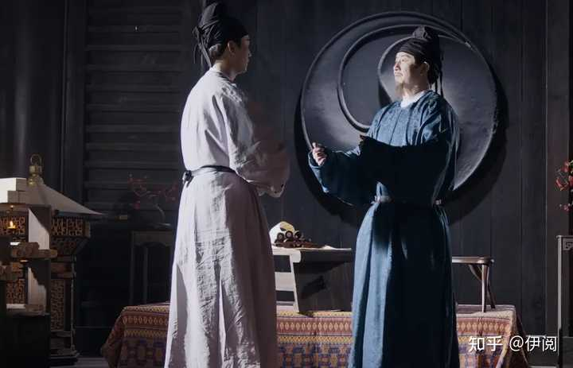

alt="Image">

韩愈得知此事后，怒言：__“昌吉家讳是违背‘二名律’还是‘嫌名律’”？__

这是唐朝的两条法律，“二名律”即：__父亲如果叫“建国”，你在说“国”字的时候就不能带“建”字，说“建”的时候不能带“国”字。__

__“嫌名律”就是要避讳同音字，李贺就是这种。__

韩愈气不过，专门写了一篇文章替李贺申辩，这就是被选入《古文观止》的《讳辩》。

里面最直击人心的一句话是：__假如父亲名“仁”，儿子就不能做人吗？为了避讳吕后的名，就要把“雉”叫做“野鸡”吗？__

韩愈这样做，一是为李贺抱不平，二是争名者把韩愈也告了，因为李贺参加进士试是韩愈推荐的，韩愈不处理这件事，自己也会受影响。

韩愈口才确实好，郑余庆不仅无言以对还觉得有道理，索性拿出解状。

李贺终于穿上只有举子才能穿的白衣“校服”，眼神里充满了希望。

这是逐梦的开始。

__03__

李贺拿着解状抵达京师，长安的钟鼓楼是真高啊，像东方明珠一样，装载着无数年轻人的梦想。

李贺找到族人十二兄李佩府邸，同为王孙（大郑王李亮）后代，李佩得到祖上庇荫，在首都有房有车还有官，不要太爽，李贺是真心羡慕。

李佩对族弟李贺说，你仅凭《十二月乐词》肯定是不够的，当年白居易曾献杂文20多篇，诗词一百多首，想惊动长安文坛，一定要有足够的文章诗词衬托。

李贺明白十二兄的意思，便将一个大书筐搬来。

真的是好大一筐。

李商隐曾在《小传》说李贺：

“恒从小奚奴，骑巨驴，背一古锦囊，遇有所得，即书投囊中，及暮归，太夫人使婢受囊出之，所见书多，辄曰：‘是儿要当呕出心乃已耳！’”

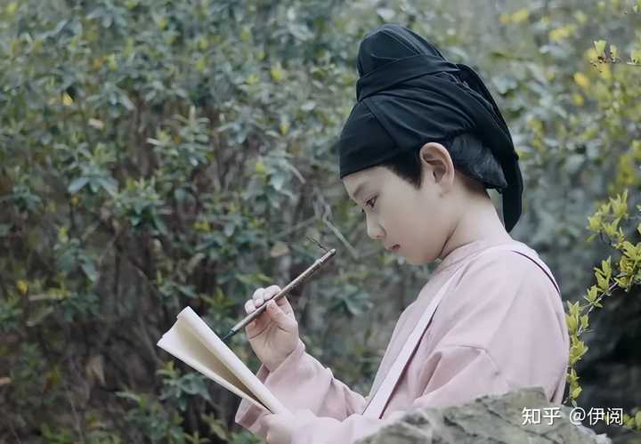

alt="Image">

意思是李贺喜欢骑驴找灵感，想到好的句子就写下来放到锦囊，然后丢进箩筐里，回家后再一一整理，母亲看了心疼不已，说“我的儿啊，你是要呕出血来才甘心”。

__这就是成语“呕心沥血”的由来。__

十二兄随手拿出一轴，便是那__“大漠沙如雪、燕山月似钩”、“男儿何不带吴钩，收取关山五十州”……。__

族弟如此才华，李佩瞬间觉得自己手里的房和车都不香了，有这才华何愁不能振翅高飞？

作为族兄，李佩同时又希望李贺能名动长安，所以给他作保（参加进士试是需要举人之间互相作保的，还需要申报在长安的住址），__如果你真是“寒门”，很可能连个作保的人都没有。__

不仅要作保，考试前还要请托投卷，就是将自己的著作投给负责主管进士试的官员看。

说是投卷，谁知道卷里有没有夹着“银行卡”。

李贺没有钱，真就带着一筐诗轴去了。

途中，李贺遇到了一生的挚友沈子明，如果没有沈子明，我们是看不到李贺这跌宕起伏的一生的，更看不到流芳百世的诗作，正是沈子明四处奔波，请求杜牧为李贺起笔作叙，记录李贺人生的每一个关键节点。

两人一见如故，随后，李贺搬去沈子明家住，期间还结识了许多好友。

元和三年（公元808年），李贺顺利参加进士试，经过半个月的等待，终于在进士榜上看到了自己的名字。

这一刻，长安的春天格外艳丽，李贺激动不已，跟着风一起跑，高呼__“今朝谁是拗花人”！__

不像我，激动的时候只会说“卧槽”。

进士试后面还有关试，一般是在放榜后半个月举行，李贺不敢回昌谷，他要守好最后一道关。

关试那天，李贺顺利通过，等待吏部发放春关，和当初在河南领取文解一样。

在其他新进进士领完春关后，李贺依旧没有听到自己的名字，他心慌的上前询问，原因还是和之前一样，进士及第后，举报他的同乡依旧不死心。

哎，同乡难同乡，两眼泪汪汪。

因为父讳，不能举进士，这比杀了他都难受。

面如死灰的李贺第一时间想到了“班主任”韩愈，可这终究是长安，不是洛阳，韩愈在真正的官场上同样人微言轻，他眼睁睁的看着一个青年才俊被摧残、被吞噬。

怀才不遇，时代不公。

李贺一倒就是半个月，期间韩愈和皇甫湜不断安慰他，__开导一个人最好的方法，就是把自己说的比对方惨，9527当初就是这样进华府的。__

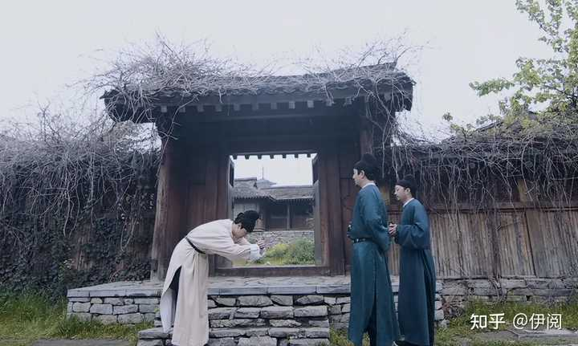

alt="Image">

__听完韩愈和皇甫湜的惨痛经历后，李贺表示也没那么难受了。__

如今再想走仕途，只有一个办法：__靠诗名得到官场权贵们提携，直接入仕。__

虽说这样也能混个一官半职，其实用途不大，看看在盛唐时期的李白，不仅没跟个好领导还差点嗝屁。

不过这也算一丝希望，谋事在人，人定胜天。

为啥说人定胜天，当时的李贺还真就是这样的性格，__他的很多诗充满了“就不”！“凭啥”！__

__“庞眉书客感秋蓬，谁知死草生华风。我今垂翅附冥鸿，他日不羞蛇作龙。”__

“附冥鸿、蛇作龙”，这是李贺的内心抱负，当下他也只能这样激励自己，如今能挽回局面的，只有自己的诗作。

李贺这种作诗天赋，一出手就是普通人的极限，世人所谓的天才也只是跟他对比的门槛。

再孤傲的性格也会被不公的时代击垮。

在长安蛰伏一段时间后，李贺的心境又发生了变化，在他的内心，仕途黑暗、凶险，只一个小小的春闱，就充满了尔虞我诈。

李贺决定离开长安，当走出护城河，回头看着巍峨的城楼高耸在自己身后，那种与梦想作告别的心情，比生吃黄连都难受。

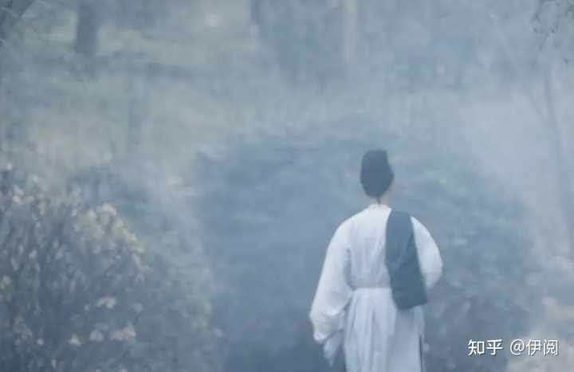

alt="Image">

李贺低头拭去眼角的泪水，消失在长安的街道。

__什么功名利禄，什么壮怀激烈，什么一腔热血，统统滚犊子吧！__

离开长安的李贺，在东都仁和里静思，刚开始还感慨仁和里风景美如画，可时间一长，他又开始焦虑了。

__04__

东都只是短暂的寄身之处，李贺的心不在此，他不想误一春，误一年，误一生。

他想起了李白，来一场说走就走的旅行。

旅行只是个好听的词，李贺真正的目的是北投幕府。

他先是在河阳做孟元阳的幕僚，后来孟元阳接朝廷诏令，去潞州担任昭仪镇节度使，诚邀李贺一同前往，但李贺因儿女私情，婉言拒绝了。

后听孟元阳遇袭，李贺当即决定北上，策马相助。

抵达潞州后，李贺亲眼目睹了战争的惨烈，残阳如血，他决定将唐军将士不畏牺牲，英勇战斗的精神写下来，所以便有了《雁门太守行》，关于这首诗的创作时间，一个是807年谒韩愈，另一个就是此时。

我个人更倾向于后者，如果没有亲临战场，是不可能描写的如此生动形象的。

战争平息后，因幕府无事，李贺决意去幽州。

之所以选择幽州，是因为与他齐名的李益，李益边塞诗写的极好，__成功虽然不能复制，但能效仿。__

抵达幽州不久，因为这里风沙肆虐，又是苦寒之地，李贺弱小的身躯根本扛不住，只能匆匆返回潞州。

时值孟元阳调回京城，郗士美接手昭仪节度使，李贺对郗士美也有所了解，便投其幕府。

有人会问，李贺为何执意在幕府？

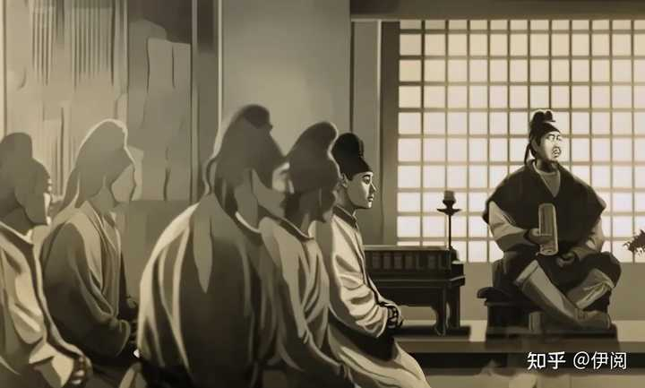

alt="Image">

因为这里也有晋升空间，__幕府里的文职官员最多见的就是记室和掌书记。__

__记室是从七品，掌书记是从六品，李贺一度认为自己做个记室还是手拿把掐，绰绰有余的。__

郗士美的确很欣赏李贺的才华，总让他写诗歌，但丝毫没有提他做记室的意思。

反倒是张彻的到来，让李贺悬着的心终于死了。

张彻曾在韩愈手下学习，韩愈欣赏他的才华，把侄女介绍给他做妻。

这次到潞州幕府担任掌书记，是因为有外戚推荐，如此看来，以后晋升自然指日可待。

所以在外面混，关系很重要，想想李贺3年幕府生涯，依旧是个籍籍无名的“摧颓客”。

李贺并不嫉妒张彻，两人反而相见恨晚，因为张彻的细心照顾，李贺的旧疾还得到了控制。

住在张彻家始终不是长久之计，李贺在十四兄的建议下，离开潞州，开始南归。

在灵州时，李贺遇到了人生中难得的机遇。

他意外得知灵盐节度使范希朝是个廉洁奉公的好干部，抱着试一试的心态，进了范希朝的幕府大门。

范希朝虽然廉洁且公正，但身在朝廷，总有些违心的事要做的。

其中就有为皇帝诞辰专门制作乐曲，专业名词叫“献圣乐”。

__如今打瞌睡遇到枕头，李贺是乐曲大能，范希朝把他当宝贝供着。__

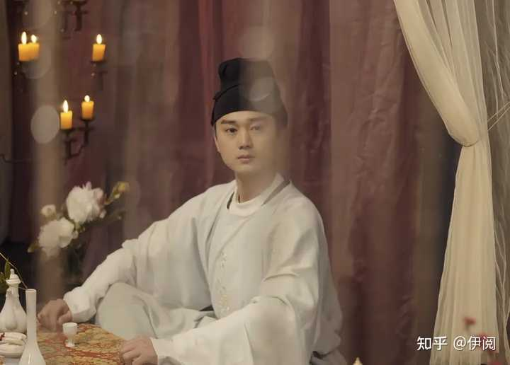

alt="Image">

音律乐曲，笙歌弦声，都是自然之音，如今让李贺刻意去迎合皇帝而制作，李贺觉得这是对音乐的侮辱。

但是范希朝太过热情，李贺为了仕途勉强答应了。

他知晓皇帝崇尚仙道，所以借神仙之事，写出了一首描绘天宫胜景的诗歌，如果交到唐宪宗手里，自己很可能会被重视，青云直上。

但李贺的内心深处对献媚虚妄之事极其排斥，一怒之下将制作好的乐稿丢进了火盆。

他不能违背自己的初衷，最终写了一篇《苦篁调啸引》。

__写的是轩辕黄帝时期的事，伶伦学习竹笔艺术二十四年，如今在昆仑采集竹用来制作笛子，黄帝升仙时，二十三支竹笛都跟着他，唯独有一支笔在人间吹奏，没有德行的人是得不到这支竹笛的，因为这支竹笛被埋在虞舜的祠堂下。__

这是极其反讽的一首诗，李贺的意思很简单，真正的好乐曲是发自内心的，你唐宪宗不配让我制圣乐。

这种内含皇帝的诗歌，范希朝看后肯定会火冒三丈，自知前途无望，李贺索性悄悄离开了灵州。

你看，从古至今，凡是被后人敬仰的大人物，从来都是人情世故的终结者。

李贺虽然失去入仕的机会，但他遵循内心始终如一的精神，激励了一代又一代人。

李贺北上的幕府生涯，最终以一篇《北中寒》结束。

从809年春到811年冬，李贺从东都北上，3年时间写下不少壮美诗篇，让后世学生“苦不堪言”，纷纷表示：表哥应该多扔点。

这又是怎么一回事？“表哥”又是谁？

__05__

事情发生在公元810年，李贺的表哥在偶然的机会见到了太子詹事李藩，李藩喜欢收集诗歌，别小看这些人，很多诗词歌赋都是这类人收集后作叙流传下来的。

那时候李藩特别喜欢李贺的作品，也收集了一些，但是他觉得不够，想做投资人，让李贺把所有的作品都交给他，只是李贺地位太低了，李藩找不到他的人，却偶然的见到了李贺的表哥。

表哥得知后，向李藩表示，自己能拿到李贺的诗歌。

李藩自然信以为真，还将自己当前收集的交给李贺表哥，希望事后他能一同交还自己。

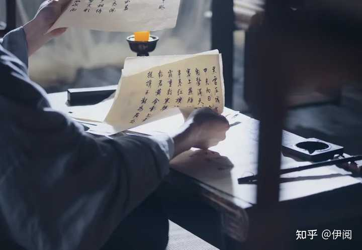

alt="Image">

他哪里知道，这个所谓的表哥从小就嫉妒李贺的才华，因为李贺，家里人很少注意到他。

当表哥说李藩要收集自己的诗歌后，李贺兴奋不已，非常爽快的答应了。

真要有大佬引荐，这些诗歌算什么，没了再写便是。

谁知表哥拿到这些诗歌书简后，并没有按照计划交给李藩，反倒丢进了长安城的一个臭水沟里。

这些李贺自然不知晓，只是久久没有等到回应。

这事就这样不了了之了。

公元811年，李贺重回洛阳，北方苦寒之地待了3年，让他成功从一个意气风发的年轻人，变成满脸沧桑的大叔。

23岁的看上去像53岁，皇甫湜愣在原地，岁月是一把杀猪刀，刀刀无情的划在脸上。

李贺诉说着这三年的苦闷，幕府无门，身体渐弱，请托投卷，受尽白眼。

皇甫湜默默听着，也试图压制自己的内心，他何尝不是一样，三年间从九品到七品，这种升迁速度完全匹配不上他的才华。

只是他知道李贺心中依旧想着步入仕途，自然不能向他吐苦水。

如果此时跟着一起抱怨，反而有显摆的嫌疑。

所以，皇甫湜极力劝李贺再入京都，谋取功名。

所以交友很重要，好的朋友受益一生。

重拾心情的李贺于公元811年冬日，再次抵达长安。

__人都会经历同样的过程，任凭你年轻时如何孤傲，不惧人情世故，在经历岁月后，总会有棱角磨平的那一天。__

__李贺这次也学乖了，为了寻求机遇，他将每一封言辞恳切、语气谦卑的信投给那些昔日不屑的权贵，只希望他们有人能看到自己的才华，拉一把。__

垂怜？指引？

不存在的。

这些权贵看不上这些，真要是有，早在3年前就让李贺上岸了。

李贺借酒消愁，可愁更愁，看着他跟个“怨妇”一样，店主人像一个智慧的长者，说出一席话，让李贺茅塞顿开，当晚提笔写下千古名句：

__我有迷魂招不得，雄鸡一声天下白。__
__少年心事当孥云，谁念幽寒坐呜呃。__

李贺放下手中的酒杯，恍然大悟。

是啊！少年就该有雄心壮志，躲在角落哭哭啼啼有何用？没有人怜惜你跌落谷底，也没有人在意你是否飞黄腾达。

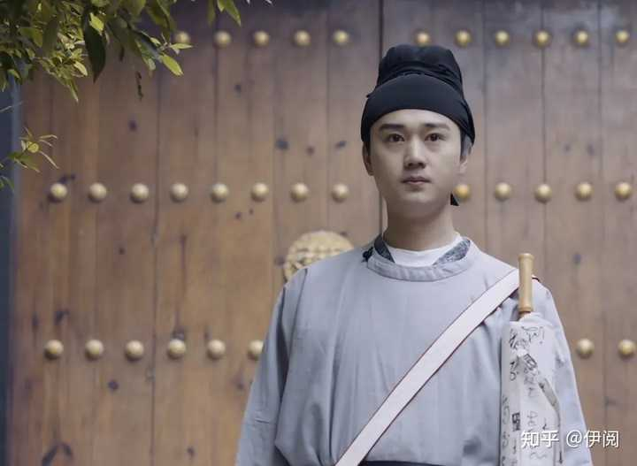

alt="Image">

公元812年，韩愈归京，再次见到李贺。

因李贺变化太大，韩愈差点没认出来，几杯抛青春下肚，韩愈步入正题。

__“长吉，参加制举吧，是拔萃科。”__

李贺愣了一下。

前面说过，唐朝选拔人才除了科举，还有制举，根据皇帝喜好设置的，恰好今年皇帝举行一回，虽然是拔萃科（为了选用县级底层官吏而设），但机会难得。

其实也有授职较高的制举，但这种可遇不可求，有时候一年一次，有时候三五年一回，甚至更久。

李贺知道这是韩愈给的机会，虽然是拔萃科，但参加的人还得有五品以上官员推荐才行，而韩愈恰好是五品。

就举荐一名士子制举的资格，还是韩愈靠仅有的人脉争取到的。

人生能遇到一个这样的老师，已是幸事。

因为这次选拔的是底层官员，所以考试的题目并不难，李贺也成功及第，入太常寺，从九品，任奉礼郎。

搞笑的是__“奉礼郎”这个官名原本叫“治礼郎”，因为与唐高宗李治的名字一样，犯讳才改成了“奉礼郎”。__

李贺因犯父讳，拒发春关，不能入仕，如今谋得的官职也犯讳，真是可悲又可笑。

芝麻官也是官，有俸禄，最主要是不用栖身客栈亦或是住在别人家。

拿俸禄就得干活，李贺天天上早八，起的比鸡早，睡的比狗晚，连摸鱼的时间都没有。

是官还是役，李贺也分不清。

不过官还是比民强，能接触到百姓接触不到的事物。

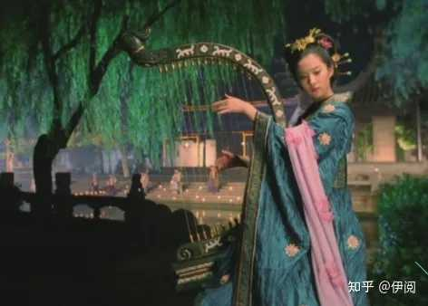

alt="Image">

最让李贺记忆犹新的是册封大典上，李凭弹箜篌，李贺不想让如此绝妙的声音流失，便绞尽脑汁写下《李凭弹箜篌》：

吴丝蜀桐张高秋，空山凝云颓不流。
江娥啼竹素女愁，李凭中国弹箜篌。
昆山玉碎凤凰叫，芙蓉泣露香兰笑。
十二门前融冷光，二十三丝动紫皇。
女娲炼石补天处，石破天惊逗秋雨。
梦入神山教神妪，老鱼跳波瘦蛟舞。
吴质不眠倚桂树，露脚斜飞湿寒兔。

能用文字就让后人感受到音乐的美妙，李贺当之无愧的“诗鬼”。

__鬼，凡人也是学不来的。__

元和八年（公元813年），长安下了几场大雨，泛滥的洪水淹没了许多低矮的府邸。

长时间的雨水，让黄河暴涨，冲溃防堤，位于河套北岸的东受降城北河水浸毁，振武节度使李光进只能寄希望于朝廷，希望朝廷派人出面。

唐代的受降城主要分为西、中、东三城，受降城只是名义上的受降，却没有受降城的责任。也就是说，受降城属于朝廷以外的驻防城，是与周边的军镇行成的军事防御体系。

说白了，随时有可能背刺唐朝。

如今东受降城据虏要冲，水草丰美，属于难得的守边利地，但如今被河水淹没，边防势必不稳。

唐宪宗此时正与官员商量对策，彼时的宰相是李吉甫，他比较节俭，不舍得修城，所以建议东受降城迁至天德故城。

天德故城距离黄河有足足200里地，自然可以避免河患，还能节省修缮城池的钱，一举两得。

这样看挺好，但也有缺点，东受降城一旦迁走，必然与其他的军镇联系减弱，如果有敌人袭击，就无法接应，失去了原有的边防要塞功能。

持这个理由的人就是李绛，言外之意，不能为了省钱就放弃边防之地的安全。

唐宪宗最终还是听了宰相的，然后借封建迷信那一套找来术士。术士观天象，说你后宫佳丽太多了，发洪水属于阴盈之象，你得出两百车宫女才行。

还别说，两百车宫女放出去后，接下来的几个月果然天气晴朗，风调雨顺。

长安城是暂时安全了， 但因为东受降城迁走，使得边防兵力减弱， 唐朝边境防线一溃再溃，战乱四起。

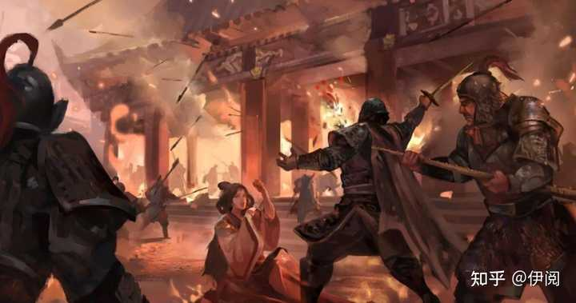

alt="Image">

唐宪宗一心求仙，在任用北征统帅方面，又犯浑。

李贺实在看不下去，只能作歌嘲讽。

好在唐宪宗最后下令让秦光禄北征，最终挽回了局面，为此，朝廷大摆庆功宴，李贺见这些人纸醉金迷，觥筹交错，便黯然退场了。

当你在职场中，得不到晋升还找不到一个可以倾诉的人，离职是必然的。

李贺就是如此，他作为九品芝麻官，又是在太常寺这种岗位，每年都有干不完的活。

刚入职时充满干劲，还积极上夜班，以为努力干活就能得到领导赏识，谁知道这些活是永远干不完的。

__干不完的活、睡不够的觉、喂不饱的钱包，交不到的朋友。__

李贺身心俱疲，但是又找不到人生的方向。

人一旦迷茫，如行尸走肉。

直到他遇见了李益。

__06__

李贺年少时就与李益齐名，要知道当时的李益已年过花甲。

这回遇见真人了，李贺像个小迷弟一样，主动打招呼。

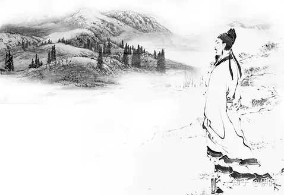

alt="Image">

得知这个年轻人是李贺，李益也相当吃惊，说前段时间还与一些文人谈你的诗。

说你风格独特，自成一体，大家都赞誉“长吉体”。

长吉体，连李贺自己都不知道，原来自己在文坛还有这样的地位。

李贺连忙请教，询问文坛那些大佬是如何评论长吉体的？

李益说贬褒不一，但褒占大多数。

__褒，是说李贺的诗歌独辟蹊径，骨劲而神秀，高深而浑厚，有气魄，也华丽，更奇诡，眼空千古，不唾拾前人片字，把你比喻成古代的屈原，当今的李白。__

就这评价，李贺早就听得心怦怦跳，灵魂快要出窍。

面对眼前的文坛大佬，他不知道应该狂傲还是惭愧？

李贺心平气和的问：那贬呢？

__贬，说你不太注重章法，对一些字用得过于刻削，不够天真自然。__

__奇过则凡，稚过则老。__

李贺一下就领悟到了其中内涵，表示以后会注意这些。

李益倒是看的很开，说年轻人就应该有自己的性格，有自己的风格，太过于注重他人的评价，似我非我，不见得是好事。

随后丢下堪称预言级别的一句话。

“某敢断言，汝之诗作，必将流传百代，磬香千古。”

这是李益对后辈的肯定，他并不希望李贺刻意改变，本我即真我。

接下来李益的一段话，彻底点醒了李贺。

李益能接触到的人与物，都是李贺的人脉盲区，毕竟年龄摆在那，身段摆在那。

他说你当初进士试受阻，拒发春关，并不是因为犯了父讳，其真实原因是你的诗名。

文人相轻是司空见惯的，但文人相嫉并不多见。

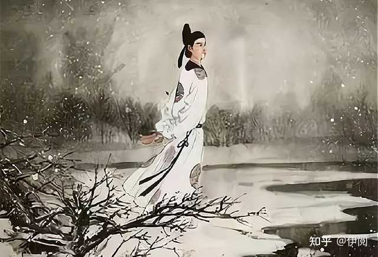

alt="Image">

隋炀帝当年已经是皇帝，但还是想在文坛有一席之地，导致那些比他厉害的文人都不敢发表作品，薛道衡、王胄就是因为“文不在帝下”，最后惨遭迫害。

成也诗名，败也诗名。

朝堂上那些文人，大多阿谀奉承，谁会举荐一个才高八斗，超出自己几个层次的人？

那些武将自古就看轻文人，怎会举荐弱不禁风的李贺？

李贺茅塞顿开，他不再迷茫，只想着将长吉体再拔高一个层次，让那些排挤他、嫉妒他、压制他的人看看，不走仕途，照样能名流千古。

两人名声相埒，看似李益拔高了李贺，千年之后，李贺不知将其拔高了几个层次。

元和十年（公元815年），太常寺人事变动，这一次依旧与李贺无关，九品的奉礼郎足足做了3年，一次升迁都没有。

这对李贺是极为不对等的，须知当年皇甫湜三年升两级，还嫌升职慢。

没有权力维持同事关系，没有财富支撑人情世故，如果不是体制内，早就被辞退了。

李贺少年负有盛名，才高气傲，硬生生被人情世故磨的没有一丁点儿脾气。

__“长安风雨夜，书客梦昌谷”。__

极度失望的他旧疾复发，睡梦中看到了弟弟和母亲。

他毅然决然的告别了虚伪的职场，回到昌谷。

__07__

也许只有昌谷，才能让他感受到人生的那一点快乐，昌谷的温和舒畅以及亲情的滋润，让李贺忘却了疲惫，创作了一些列清新、明快的诗作，最终整理成《南园十三首》。

在昌谷休息数月后，李贺不仁看见母亲操劳，也不愿看见弟弟为家奔波，决定寻找新的出路，开启了为期两年的南下游历。

他先是南下和州见了十四兄，还去湖州探望了好友沈亚之，又去杭州西湖参观了苏小小墓，写下《苏小小墓》，第一次让女鬼在读者心中具象化。

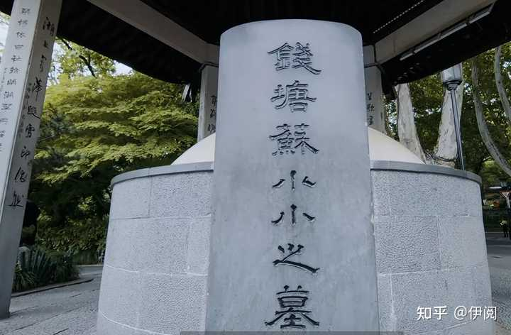

alt="Image">

李贺的游历与李白的游历看到的景象是截然不同的，__属实是一个卖家秀和一个买家秀。__

__李白到哪都说好，李贺劝你没事别出门，特意写下《公无出门》。__

里面有一句__“天迷迷，地密密。熊虺食人魂，雪霜断人骨。”__

__李贺没有瞎说，前段时间宰相武元衡被杀，裴度遇刺，就这环境谁敢出门？特朗普看了都直摇头。__

但李贺还是硬着头皮，南下游历了两年，两年的跋山涉水，耗尽了他的身体。

元和十二年（公元817年）春，李贺决定再去京城寻找机遇，这是他第三次去长安，好友沈子明再见他时完全没认出来。

满身风雪、满脸沧桑，哪里像一个27岁的年轻人？说72岁也不为过，头发蓬乱，隐约看见银白色的头发，瘦小的身躯，浓郁的眉毛，还有忧郁的眼神，沈子明很难相信眼前之人就是李贺。

__江南的山水只知道索取他的诗歌和灵感，耗尽他的身体，却不肯将秀丽的风景在他身上停留半刻。__

作为好友，沈子明心里发酸，潸然泪下，控制不住情绪的他，拉起李贺那骨节嶙峋、指爪细长的手，泣不成声，心情久久不能平静。

可能沈子明照顾到位，亦或者是春天的来临，李贺脸上有了气色，但也只顾着静静地待在书房，整理诗稿，仿佛知道生命将尽。

沈子明带他看了昔日长安的诸多好友，包括王参元，杨敬之，张又新等人。

见李贺身体有所恢复，沈子明引荐他给岐阳公主的儿子作歌，目的是希望岐阳公主能赏识李贺，举荐他做官。

在岐阳公主府邸，李贺见到了年少的杜牧，少年杜牧性格开朗，非常仰慕李贺，当即背诵出李贺所作的《过清华宫》：

春月夜啼鸦，宫帘隔御花。
云生朱络暗，石断紫钱斜。
玉碗盛残露，银灯点旧纱。
蜀王无近信，泉上有芹芽。

可能正是这种经历，多年后的杜牧也写了一首《过清华宫绝句三首》，其中的“一骑红尘妃子笑，无人知是荔枝来”更是成为千古名句。

在见到岐阳公主儿子后，李贺提笔作歌，岐阳公主甚是满意，可能是先前沈子明提过，岐阳公主当即答应举荐。

李贺满怀期待，谁知不久后，岐阳公主跟着夫君去别地赴任了，举荐这事没开始便结束了。

__人生短暂，转眼即空，何必患得患失？__

李贺将这些烦心琐碎之事化作写诗的动力，短时间就创作出多篇流传至今的作品。

其中包括《瑶华乐》、《相劝酒》等作品。

《瑶华乐》不仅流传后世，在当时也是相当炸裂的，短时间就风靡长安，这也与当时皇帝信封神仙有关，唐朝人本就是浪漫的，这样的诗歌肯定受到人们的喜爱。

这时候，李贺的表哥又出来了，他嗅到了“机遇”的味道。

表哥再一次找到李贺，索要诗歌，李贺感慨于亲情，又拿出一箩筐给他看。

在读到《瑶华乐》时，表哥眼神放光，说这诗歌要是传到皇帝那，表弟你还不得起飞喽。

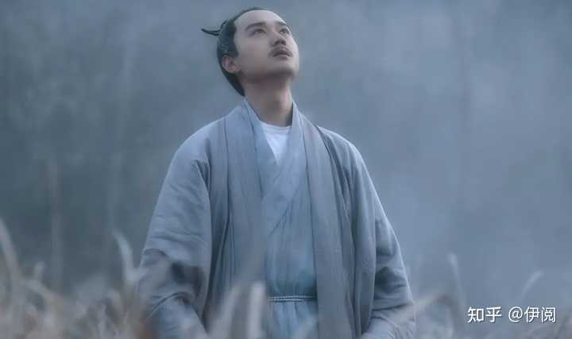

alt="Image">

李贺是孤傲，不是傻，他虽然不知道表哥干的那些事，但这次说什么也不会交给他了。

气急败坏的表哥用含妈量极高的词问候了李贺，还进行了人身攻击，甚至当着李贺的面说：__6年前，你那些诗被我全部扔到了长安城最臭最恶心的水沟去了。__

李贺表示：我就站在你眼前，看我几分像从前。

是的，经历过跌宕起伏的人生，以及伤病的折磨都没能击败他，你这几句话还能掀起什么风浪？

心寒的是，朝堂那些文人看轻自己尚能理解，怎奈亲人也如此嫉妒自己的才华，这个世界为何如此灰暗？灰暗的让李贺看不到一丝光明。

正如那那首《苦昼短》，看的韩愈都不禁潸然泪下。

飞光飞光，劝尔一杯酒。
吾不识青天高，黄地厚。
唯见月寒日暖，来煎人寿。
食熊则肥，食蛙则瘦。
神君何在？太一安有？
天东有若木，下置衔烛龙。
吾将斩龙足，嚼龙肉，使之朝不得回，夜不得伏。
自然老者不死，少者不哭。
何为服黄金、吞白玉？
谁似任公子，云中骑碧驴？
刘彻茂陵多滞骨，嬴政梓棺费鲍鱼。

这压根就不像20多岁的人能写出来的诗，真的太苦了。

全诗分为三个部分。

第一部分，李贺都向时间劝酒了，感慨时光飞逝，人寿短暂，尤其是“月寒日暖，来煎人寿”，一个“煎”字，就能看出李贺这一生过得并不快乐，反而非常痛苦。

一个人被病痛折磨就已经痛苦不堪，性格也会变得忧郁，而李贺还经历了常人经历不到的不公，两样都占齐了。

岁月蹉跎，李贺感叹还没来得及干点事业，实现心中抱负，生命就这样白白消耗了。

忧郁、恐惧和忧虑，李贺只用一个“煎”来形容此时的心境。

不仅如此，李贺还看透了李白看不透的事物现象。

李白也曾求仙问道过，也曾虚度过光阴。

李贺却说“食熊则肥，食蛙则瘦。神君何在？太一安有？”

意思是吃熊掌就胖，吃蛙腿就瘦，这是自然规律，世界上哪有不食五谷的神仙，如果真有，那神仙在哪？太乙又在哪？

第二部分是李贺的幻想，李贺很多诗都是借用了神化传说的，因为他预感寿命将至，病痛太折磨人， 他要斩断神龙的腿，吃龙肉，这样太阳不能运行，昼夜不能更替，时间凝固，人自然就能永存了。

第三部分，李贺从神话瞬间回到了现实，后面都是讽刺那些求仙问道之人的，若真能长生，秦始皇、汉武帝有偌大的成就，为什么还“多滞骨”、“费鲍鱼”？

对于《苦昼短》，韩愈自然是看懂了的，他唯一能做的就是不断的举荐他。

__一个人过得好不好，朋友圈是看不出来的，但作品是能窥探到作者情绪的。__

并不是每一首诗表达的都是作者的思乡之情，李贺的诉求，韩愈深知。

趁自己还有能力，最后拉一把吧。

就在韩愈准备再次举荐时，皇帝的一道命令，再次打断了李贺的仕途。

__08__

同年八月，皇帝下令让韩愈跟随裴度出征，韩愈还没来得及举荐，就收拾行李跟着出征了。

alt="Image">

李贺执意拖着病体为其送行。

这一幕，李贺幻想了无数次，他一直希望能跟随将军出征杀敌，“男儿何不带吴钩，收取关山五十州”。

他哽咽的向韩愈请求，希望能延引自己随军出征，这是李贺一生的夙愿。

可他也知道这一切是多么不现实，最终只能祈祷韩愈凯旋，归来时举荐自己。

可惜的是，没等到韩愈凯旋，反倒等来裴行立杀两万百姓，充当战绩，声称平定了黄家洞叛乱的消息。

唐朝已经堕落成这样，灭亡也只是时间的问题。

__出生在这个时代，李贺真是一点希望都没有。__

李白活在盛唐，还能说__“仰天大笑出门去，我辈岂是蓬蒿人”！__

李贺不行，只能是__“我当二十不得意，一心愁谢如枯兰”。__

换句话说，__盛唐沿街乞讨都能安全到家，中唐散步都可能被无辜打死。__

__所以，环境对人的影响是巨大的。__

那时的长安崇道成风，“仙人”一抓一大把，李贺再一次离开了被“仙风”裹挟的京城，回到昌谷，跟人生作最后的道别。

他停下脚步，祭拜了父亲，看到“李晋肃”三个字时莫名的悲伤，原来这些年只顾着往前走，忘记了父亲的叮嘱。

__父亲叮嘱他照顾好自己，照顾好身体……。__

再回头看看身后的巴童，这些年来，似乎只有这个书童不离不弃，始终跟着他，两人早已情同手足。

李贺深感无以为报，遂写下《昌谷读书示巴童》，也算是让巴童流芳百世了。

至少我们还记得，李贺身边始终有个书童在照顾他，不至于那么寂寞。

在昌谷的最后这段时光，被病痛折磨的李贺艰难地完成了诗集的整理，将这些沉甸甸的诗集交给了沈子明，留在昌谷的只不过是一具躯壳。

沈子明也不负李贺重托，找杜牧为其作叙。

公元817年，李贺病逝昌谷，时年27岁。

除了杜牧为其作叙，李商隐还特意走访李贺的亲姐，为其作了小传。

__09__

写在最后。

李贺被后世称“诗鬼”，最直接的原因就是他创作的诗，虽说“鬼”诗只占了他全诗的二十分之一，也就十来首，但这些诗里面的用词绝对让你后背发凉。

__哭、泣、骨、寿、坟、鬼、魂、叫、碎、蹄、煎、吊、断、枯、堕、残、愁、折、血、凄、悲。__

__这哪里是接地气，明显是接地府。__

最重要的是，这些词用的也是前无古人后无来者。

虽说只有十几首，但纵观历史，也没几个人如此执着的写关于鬼魂、神话的诗，

用汪曾祺的话：__别人写诗是在白纸上写，他是在黑纸上写。__

况且李贺写的诗，__很多立意非常明确，说话很直接，怼天怼地怼皇权贵族的。__

如“刘彻茂陵多滞骨，嬴政梓棺费鲍鱼。”

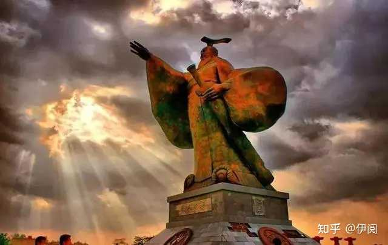

alt="Image">

言外之意是，你们谁有秦皇汉武的成就高，他们如此高的成就都感动不了上天，不能得道成仙，你们算老几，要长生？也不看看自己什么档次！

不仅仅是怼别人，怼自己也特别狠。

他说“我有迷魂招不得，雄鸡一声天下白。”

__我有迷失的魂魄，是找不回来的，唯独雄鸡叫一声才能清醒。__

虽然是说自己，但更多的是批判这个沉迷“仙气”的社会。

与其说他是诗鬼，我更愿意称他是鬼才。

如果只是写鬼诗，如何做到与李白齐名？

__天若有情天亦老、报君黄金台上意、男儿何不带吴钩、甲光向日金鳞开……。__

就这些优秀的诗句，李贺照样手拿把掐。

__如果他的人生多一些色彩，惊艳一些；__

__如果他没有病痛的折磨，少一些痛楚；__

__如果…………，可惜世间没有如果。__

除以上两点，李商隐作的小传，也给李贺抹上了神秘色彩。

《李贺小传》记录了李贺的长相：__长吉细瘦，通眉，长指爪。__

瘦不瘦先不说，重要的是两个眉毛是连通的。

连不连也无妨，重要的是手指长指甲也长。

古人没看过僵尸片，但从他整个人的气质，用何广智的话“这个货他不好看”。

还有后面李贺病逝的描述——玉楼赴召。

长吉将死时，忽昼见一绯衣人，驾赤虬，持一板，书若太古篆或霹雳石文者，云当召长吉。长吉了不能读，欻下榻叩头，言：‘阿弥老且病，贺不愿去。’绯衣人笑曰：‘帝成白玉楼，立召君为记。天上差乐，不苦也。’长吉独泣，边人尽见之。少之，长吉气绝。常所居窗中，勃勃有烟气，闻行车嘒管之声。

alt="Image">

是说李贺将死之际，忽见天上有穿着红衣服的人骑着龙接他，李贺说还有病重的母亲在，不能跟你们走，红衣人却说：白玉楼都盖好了，天帝让你来写记，天上的差事一点也不苦。

李贺听完便气绝了，然后窗户外面冒白烟，还有马蹄声响起。

这些都是李贺亲姐说给李商隐听的，所以李商隐没有瞎写。

但这样的奇诡经历，谁看完也得抓一把汗。

李贺这一生都在感叹生不逢时，怀才不遇。

__年少丧父、春关遭拒、幕府无门、塞下苦寒、奉礼官微、江南风霜、疾病缠身。__

__如果不是在文学史上留下了浓墨重彩的一笔，他的人生实在找不出有什么精彩的地方。__

最后用绯衣人的话做个结尾：__天上差乐，不苦也。__

## ——完——

萌新初来乍到，求个关注，抱拳～～。

更多深度内容，可以➕V——songleping150110（备注来源）

__首发于公众号__（转载可联系）__：伊阅；__
