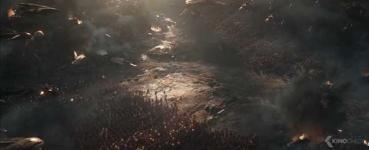
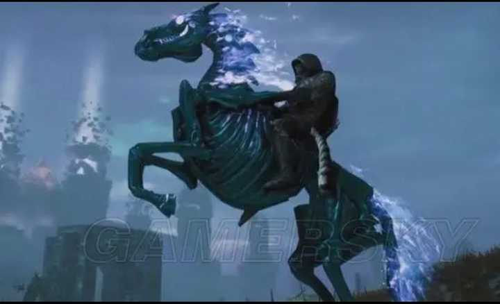

诗鬼李贺究竟鬼在哪里？ \- 朱柠檬 的回答

用字用词比较诡谲。先不看诗，罗列几个字，会让你联想到什么？

哭、骨、铜、黑、瘦、寿、坟、泣、叫、钩、鬼、酒、魂。

细细品味李贺的诗，多数用字用词给人一种冷寂凄厉的感觉。

1\.《李凭箜篌引》中这一句:昆山玉碎凤凰叫。

这个叫字，我们正常的印象中都会用鸣，比如凤鸣岐山，鸣凰这类，画面感是凤凰一飞冲天引吭高歌，这种非常积极的情感。这首诗写箜篌声音像玉碎，像凤凰叫。但玉碎为不详，凤凰是瑞鸟却在惨叫，一种凄厉的感觉扑面而来。

2\.《雁门太守行》:黑云压城城欲摧，甲光向日金鳞开。

这句诗完全可以扩写成玄幻小说。

魂殿某斗圣强者，开启神秘古老的祭坛，恶鬼骷髅一个一个从祭坛中爬出，握着凝血的古戈，举着破损的令旗，骑着骷髅战马，向人族要塞攻来。人族战士随着将军一句“列阵\!”，要塞中金光闪耀，战士们举着武器，骑着独角马，向恶灵冲去。

这画面，让我想起复联4，队长的那句Avengers Assemble，随后复联军团和灭霸军团开始冲阵。

alt="Image">

3\.《苏小小墓》幽兰露，如啼眼。

墓地兰花上的露珠，像苏小小的幽灵啼哭的眼泪。这里用眼不用泪，特么就感觉好像死去的苏小小坐在坟头在看着你一样。用泪就没这个意境。

4\.《苦昼短》唯见月寒日暖，来煎人寿。

这句主要讲寒来暑往，时光飞逝。来煎人寿这句，像不像黑白无常在你身边，等着你阳寿耗尽，领去地府报道？

5\.《致酒行》我有迷魂招不得，雄鸡一声天下白。

这句写自己本来很迷茫，别人开导之后醍醐灌顶一下想通了。写着像百鬼夜行，然后辟邪的雄鸡一声啼叫天亮了，鬼怪通通化成了灰一样。倩女幽魂里兰若寺里，一夜群鬼乱舞，然后天亮了，鬼怪都被阳光化成了脓水。

6\.《马诗》向前敲瘦骨，犹自带铜声。

写的是瘦马，这句写的传神，敲马的骨头就像敲铜器一样。这马得瘦成啥样？哪怕多层皮都不至于铜声吧。而且殉葬多用铜器，这匹马给人的观感就是一匹只剩骷髅，但仍然昂扬的地狱马，马虽然瘦但精气神十足，结合全诗一个铜字，让人联想到墓室。

alt="Image">这马够不够瘦？

我认为，可以从写秋天看出一个诗人的特点来。

杜甫

八月秋高风怒号，卷我屋上三重茅。

最后再接一个大庇天下寒士俱欢颜，就很儒家。穷则独善其身，达则兼济天下，诗圣的称号这里淋漓尽致。

李白

峨眉山月半轮秋，影入平羌江水流。

诗仙云游四海，名副其实。

白居易

暗虫唧唧夜绵绵，况是秋阴欲雨天。

文章合为时而著歌诗合为事而作，不掉书袋子，都是大白话，很白居易。

王维

空山新雨后，天气晚来秋。

一派田园的旖旎清新，田园诗人王维的代表作。

王昌龄

烽火城西百尺楼，黄昏独上海风秋。

边塞诗人一眼真。

刘禹锡 晴空一鹤排云上，便引诗情到碧霄。

诗豪这个称号单凭这一句就实至名归。

李贺

思牵今夜肠应直，雨冷香魂吊书客。

秋坟鬼唱鲍家诗，恨血千年土中碧。

秋雨绵绵的夜里，有鬼魂过来探望我这个书客，坟地里，鬼在唱着鲍照的诗歌。你说这诗鬼他鬼不鬼吧\.\.\.
