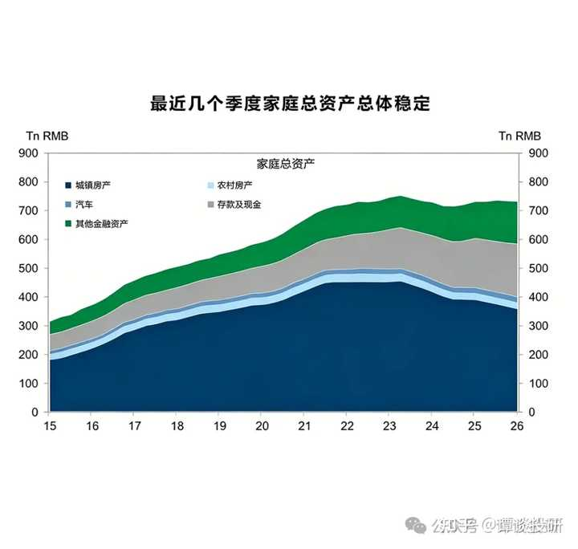

请资产千万以上的大佬们，说下你们目前的烦恼？ \- 谭谈投研 的回答

__问题描述：__

钱可以解决一切？我是不相信的，我相信有钱人都有他们的烦恼，请你们回答一下

高盛最近有份报告，里面的数据还挺有价值的，跟大家分享一下。

1992 到 2002 这十年，家庭资产年均涨 25%，差不多三年就翻一倍。

2002 到 2012 年，年均增速 20%，不到四年也能翻番。

2012 到 2022 年，增速直接砍半，降到 10%。

2022年之后的数据没有了，但是这段时间房价降得有多猛，再加上职场上降薪裁员的普遍，我估计家庭资产增速可能高不了，能否为正都不好说。

alt="Image">

过去十几年，普通家庭资产增长的方法其实特别单一，房子就占了财富的大头，家庭资产增值基本就靠房产增值。但是现在房价不再增长后，过去大家习惯的资产增长模式遭到了打击，家庭财富积累就开始变得艰难。

2026 年 6 月高盛开了个策略会，当时给出的数据是：

2021 年楼市顶峰，中国家庭的资产构成是：房子占 67%，现金和存款占 16%，股票、债券这些金融资产才占 15%。

之后楼市就进入了深度调整，到 2026 年一季度，结构已经变成：房产占 52%，现金存款占 25%，股票债券等金融资产占到 20%。

短短五年多，房产占比直接降了 15 个百分点。房价跌了，钱首先还是流去现金、存款这类安全性资产，占比提升了9个百分点。其次才是去股市、债券，占比提升5个百分点。

插一句，很多人说牛市促消费，其实还是股民把自己的力量看得太大了。居民资产大部分还是在房产上，只要房价跌，消费就很难好起来。更不要说就算是牛市，也是“八亏一平一负”，赚钱的也是少数，靠这点人根本带不起来消费。

那么问题来了，资产增速从 25% 一路跌到 5%，以后还有机会回升吗？

短期来看，大概率是很难了。

过去三十年，家庭财富增长基本就靠两样：房子涨价和存钱。2026 年一季度，咱们家庭资产里，房子加现金存款的占比高达 77%。对比一下美国：美国家庭股票和基金占了近 40%，房产只占 25%，储蓄 15%。

以前哪怕你完全不懂理财，买套房子躺着就能增值；但楼市深度调整之后，这套理论彻底被推翻了。现在绝大多数地方的房价都跌了，就算今年春节后一线和热门二线城市来了波 “小阳春”，也只是稳住不跌了，根本没怎么大涨。更别说全国大量三四线城市，今年楼市根本没回暖，甚至还在继续降温。

高盛还提到，咱们居民债务占 GDP 的比例只有 59%，比美国的 70%、日本的 62% 都低，表面看杠杆压力不大。但要是用居民债务除以可支配收入，比例高达 140%，在全球主要经济体里都算高的。根源其实是咱们居民可支配收入只占 GDP 的 45% 左右，远低于美国的 75%。说白了就是我们很多财富是集体所有的，个人能支配的占比并不高。

这也是为啥最近几年大家都在主动降负债、去杠杆。央行数据也显示：住户部门杠杆率从 2024 年底的高点 69\.8%，已经降到 2026 年一季度的 59\.0% 了。对于未来的不确定性，只能是多存钱来应对。

最后我想说的是，未来资产的分化模式将发生改变。

之前的分化模式是：高级别城市资产增速会明显低于低级别城市，因为房价涨幅更快。所以之前拉开不同家庭资产差距的，就是你什么时候买房，买了多少套房，在哪个城市买房。

但是之后的分化，将不会这样简单粗暴。未来家庭资产的增速，将取决于大家的投资能力。

现在已经有一部分家庭把钱从楼市挪出来，转去买股票、买保险这些产品了。但真正能靠股票、保险这些金融产品赚到钱的，还是少数人。

高盛报告里说，全国 90% 以上的家庭都有房子，房价下跌相当于几乎所有人都跟着缩水；但国内只有 25% 的成年人炒股，金融资产涨价的好处，天然就集中在少数人手里。

同时高盛也提醒，未来要当心踩日本和美国以前踩过的两个坑：一个是日本泡沫破了之后，老百姓长期只敢存现金，错过了资产增值的机会；另一个是美国危机后的 K 型分化 —— 有钱人靠多元的金融配置很快就赚回来了。在美国，拉开资产差距的是买了多少美股，什么时候买的美股，而不是房子。

过去三十年，中国不少家庭靠着买房，实现了财富的跨越式增长。但现在资产增值的逻辑已经彻底变了，接下来一段时间，先降杠杆、减负债、守住手里的现金流，会是很多家庭的头等大事。

往后家庭资产配置肯定会越来越多元，保险、股票、基金、黄金这些金融产品，也会被越来越多人看重。之后几十年，不同家庭的投资能力，将会决定未来所处的社会阶层。

我的知识星球《谭谈财经》，内容包括：

（1）金融、房产、时政、职场和社会思考等领域的深度思考，由于面向私域，所以并非”删减版“

（2）高价值学习资料，包括研报、电子书籍等（基本面研究，适合长线）

（3）一些我觉得有可能发酵的上市公司段子（当下热点，适合短线）

（4）每日最新各类有价值的金融数据、政策动向简评

（5）大家的问答，主要覆盖房产、投资、生活，集思广益、提升认知

alt="Image">
