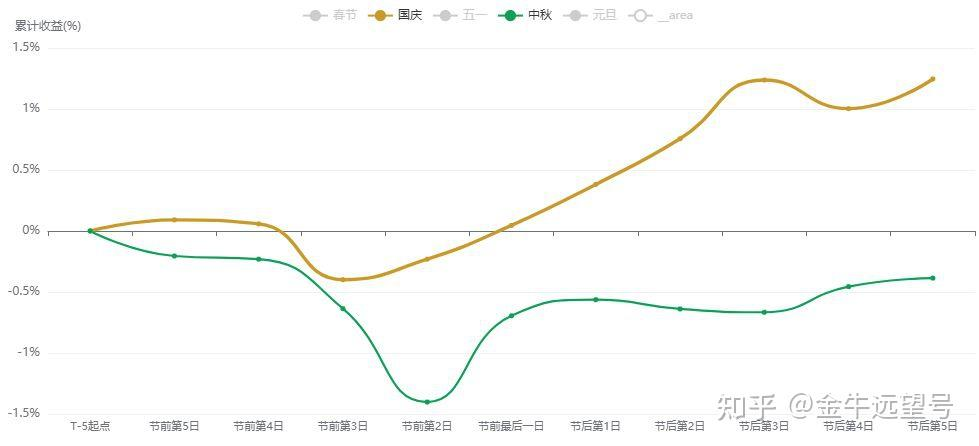

跌到崩溃了

今天跌麻了。

如果看主要宽基，A股已来到过去一年的最低点。换言之，你过去一年任何时候买入，现在都应该是亏钱的。

如果这个时候你还在反思自己的操作有问题，那我觉得你有问题。

其实今天全球股市都在下跌，但A股跌这么大，并不正常。要我说，今天的节日效应影响很大。

有朋友可能会说，节日效应难道不应该是最后一天再跌？

其实不是这样啊。

我统计了A股重大节日前后各5天的累计收益走势，时间是过去15年。结果如下图。

这里我把中秋（绿线）和国庆（黄线）都放出来了，因为中秋和国庆时常会出现合并或很接近的情况，所以二者可以相互参考。

具体而言，中秋前几天往往下跌较大，特别是节前第二天。而中秋节后，往往收益表现一般，反弹有限。

__国庆节则通常在节前第3天出现最大下跌，而今天刚好又是国庆节的节前第3天。__

对上了，兄弟们，今年全都对上了。

有朋友可能会说预判的事，但其实这跟预判没有关系。

这里面逻辑就在于，不管你是买股票还是买基金，如果想防止节日期间的幺蛾子事件，想要提现走人，就不能等到节前最后一天再跑。

比如说基金，你节前最后一天卖出是可以避开节日，但到账就是节后了。节日期间的货基或债基收益，是享受不到的。

所以至少要提前到节前的第二天、第三天甚至第四天卖出，才可以享受到节日期间收益。最终导致节前第二或第三天下跌比较大。

这就是所谓的节日效应。

但反过来也就意味着空头在前几天都释放完了。节前最后一天卖出的资金反而是最少的。

__所以根据历史数据，不管是中秋还是国庆，节前最后一天往往是上涨的。__

__总之，按照历史剧本，今天下跌很正常，只是跌幅过大。而再往后会好一些，特别是节前最后一天。__

不过我是觉得：

节前卖出是躲避节日中途意想不到的利空，逻辑上是合理的。

__但如果大家都卖出了，都躲避了，那本身就形成了利空，提前完成了对利空的定价。__

__既然如此，为什么还要去悲观呢。__

更关键的点在于，如果你卖出后这辈子都不买了，那也没问题。但问题是，你总有一天还会再买入。

还记得前几年2700点时，一堆人信誓旦旦地说，这辈子再也不买股票了。然后涨到3500点，他立马冲进来了。

对于一些争议人物，短视频弹幕和评论往往是跟着BGM走。只要BGM（背景音乐）是感人的、带有情绪化的，很多人就会变得同情起来、支持起来。

__股市同理，大部分人对股市的态度是跟着股市涨势走的——涨得好，他就会买回来，即使那会儿涨很高了，买入的性价比很低了。__

假设现在A股不是从4200跌到3800，而是一路暴涨到4800，还会是现在这番场景吗，显然不是。

一定是一呼百应，人人看好，普天同庆。但问题是，4800买入，未来亏钱的概率反而是很大的。

所以说，这个世界上大部分人是感性的，没多少理性。

更主要的是，现在的钱也出不去，或者出不太去。

而国内的投资方向无非就是存款理财、债券、楼市、黄金、实体产业和股票。这里面，

存款、理财以及债券收益率太低。

楼市收益率也低，同时还有下行的风险。

黄金过去几年已经以20%～30%的年化速度增长了，你不能指望它以这样的速度持续增长。事实上，黄金今年1月以来也套住了不少人。

而所谓的实体产业，比如说开个奶茶店、餐厅或酒店什么的，现在还能不能挣到钱，大家有目共睹。

或者说，你花几十万乃至几百万加盟一个奶茶、餐饮或酒店连锁品所获得的收益，扣除风险后，还不如直接买这些连锁品牌的股票。

因为很多消费类连锁品牌，市盈率已经跌到了10～15倍，股息率在5%～10%。这点以后我会给大家展开分析一下。

__总之，在国内资产这一块，股票或者说偏股基金其实是投资性价比最高的。__

巴菲特在2008年10月那个金融危机的至暗时刻写过一段话：「今天，拥有现金的人可能感觉良好，但他们选择了一项可怕的长期资产——没有任何回报，且肯定会贬值。」

卖出股票换现金，短期看是避险，长期看是换仓换到了最差的资产上。躲开了下跌，大概率也会躲过上涨。闪电劈下来时，你一定要在场。

最后报下格指2\.02。投资机会提升到A\-（投资机会从好到差为S、A、B、C、D）。在许久没操作后，我今天买了点。

文章纯原创，还望能点赞、点爱心、分享支持。你的支持是我更新最大的动力。
