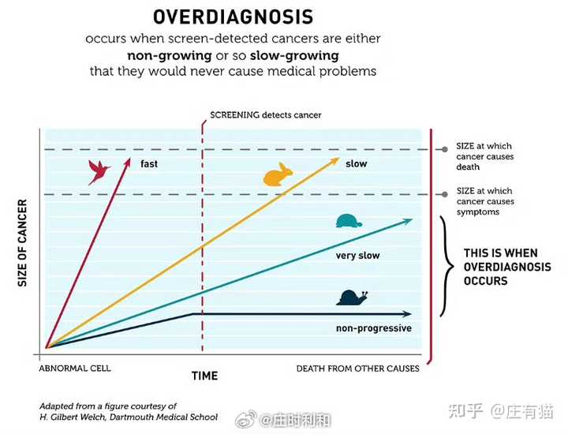

钟南山团队发现 73% 的肺癌病例来自非高危人群，为啥非高危人群占多数？传统肺癌筛查标准需要调整吗？ \- 庄有猫 的回答

不少人体检，拿到体检报告后，都查出“肺结节”。很多人第一反应都归咎于抽烟、空气质量差、工作环境里粉尘等原因。 近日，钟南山院士团队的一项最新研究，颠覆…

还是我之前写过的那篇文章：为什么一些癌症的筛查不推荐做？

国家卫健委在2022年修订的诊疗指南当中，已经不推荐一般人群做甲状腺肿瘤筛查了。说的简单一点就是，国家认为大多数人的体检没必要做甲状腺超声。

1\.这里我们用一个常用的例子——飞鸟、兔子和乌龟。

人体内不同肿瘤的发展速度是有很大差异的，有一些病死率很高，发展非常迅猛，犹如飞鸟一般；还有一些生长速度很慢，可能几十年都不会有什么变化，类似乌龟；还有一些处于这两者之间的，我们将这一类比喻为兔子。

alt="Image">

「飞鸟」的发现往往太迟了，肿瘤已经扩散了，筛查无法提高治疗效果；而「乌龟」处于另外一个极端，这类肿瘤很多是因为偶然检测发现，它们病情发展非常缓慢，过去很多患者往往是在自然死亡的尸检中才发现携带这类肿瘤。

所以在癌症筛查方面，我们最理想的就是发现「兔子」。它的生长速度既不会过于迅猛以至于错过最佳的治疗时机，也不会太慢而导致大量过度的筛查和治疗。

2\. 但问题来了：谁是兔子？

一个简单的回答是，通过常规筛查可以有效降低死亡率的肿瘤，可以算是兔子。比如50岁以上重度吸烟者的肺癌、慢性乙肝/丙肝感染者的肝癌，这些通过有效筛查（肺部CT、肝部影像\+AFP）可以降低这类人群的死亡率。

而经常被比喻为乌龟的有几种癌症，比如前列腺癌和甲状腺癌。以甲状腺癌为例，大多数（90%\+）甲状腺癌是乳头状癌，这类肿瘤生长非常缓慢，过度的超声筛查只会带来过度诊断和治疗，发病率大幅上升，但并不能降低人群的甲状腺癌死亡率。前几年发表在Lancet子刊的研究就表明，中国约87%的女性甲状腺癌病例与过度诊断相关。

由于检测费用的降低和检测方式的普及，许多人接受了甲状腺超声检查，发现了比过去多得多的甲状腺癌，但实际上每年死于甲状腺癌的人数并没有减少，反而是造成了大量的焦虑、手术并发症以及正常器官的切除。

同样的问题也出现在八十年代的日本，日本当时开展对6个月以下婴儿的神母细胞瘤筛查（尿检），直至数十年后多个国家（包括日本、德国和加拿大）的数据发现接受筛查和没接收筛查的婴儿，存活率并没有差异。在数百万儿童接受过这些过度的筛查之后，日本终于在2004年停止了儿童神母的筛查。

3\. 癌症筛查最困难的一点并不在于技术本身，而是在于需要大量的临床数据证明获益。

如果这种肿瘤是兔子，那么你接受筛查大概是合理的；但如果是乌龟或飞鸟，筛查可能会伤害你（至少会在情绪上），并且无法真正帮助你。这三者的区别不仅仅出现在不同肿瘤中，同一类肿瘤也可能同时存在飞鸟、兔子和乌龟，比如乳腺癌和肺癌。

另外一个挑战是，对于绝大多数普通人（甚至包括一些医生）而言，人们并不会本能的感受到过度筛查的弊端，相反他们通常会为早期发现而感到高兴，包括手术后被告知「你的肿瘤是良性」时也感到很高兴。这一类研究是反常识的，因为它需要漫长的时间、通过海量的数据进行论证，随着技术的进步一些筛查方式越来越普及，越来越多的肿瘤被发现，但我们还不知道这些发现到底有没有真正的帮到人们。

所以给大多数人的简单体检建议就一句话：遵循指南，不要做过度的筛查。
