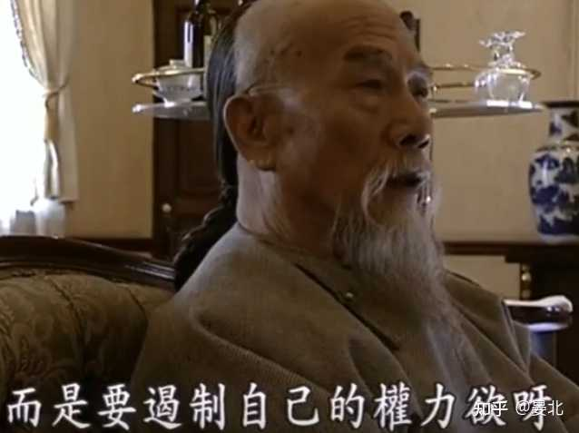

领导为什么讨厌准点下班的人? \- 晏北 的回答

当年看《走向共和》，李鸿章有段话，记忆犹新，

“倘若有了__生杀之权__，就嗜杀无忌，有了__行政之权__，就作威作福，有了__度支之权__，就为己敛财，”

“甚至有了一点__小小的权力__，比如说，县衙的差役，收税的小吏，官员的随从，__如果把权力都用得无所不用其极__，那才是国将不国，”

alt="Image">图片来源：网络

某些__出租车司机__，就是要对加油站工人指点几句，

某些商场/小区门口的__保安__，就是要没收外卖员的行头，

某些窗口的__办事员__，就是要你提供一大堆可有可无的资料证明，

……

都是类似道理。

也许是因为之前被欺负得太惨，一旦自己掌握了__某种合法伤害权__，即使是微不足道的合法伤害权，也要找准一切机会行使这权力，

除了彰显存在感、满足权力欲，这种行为往往还有另一重深层心理——__将手上的合法伤害权变现，谋取哪怕是微不足道的利益__，

若你给保安几包烟，他便转过头假装没看见你，

若你给医生一个红包，他便和颜悦色安抚病人情绪，

就算没有物质利益，__能使你战战兢兢、慌不择言，像猫捉老鼠那样观察你的无力，TA也会觉得有趣，__

平淡的生活因此丰富，空虚的精神因此获得廉价的情绪价值，

这是一种__病态的权力欲__。

社会如此，公司亦然，

“S公司缺谁都行，你离开S公司寸步难行！”

“不是你有多了不起，是__S公司平台给你机会__！”

“你们想干就好好干，不想干就滚蛋！”

“你们自己拉过客吗？还不都是__平台给你派单__！”

“别以为没你不行，换谁来干都一样！”

……

训斥过后，这位领导要求做错事的员工__做俯卧撑以示惩戒__，据说这是从部队带出来的规矩。

以上取自几年前真实发生的场景，

在北京，__某位快递员每天清晨听Z主管不知疲倦地重复这些动作__，将这些琐事整理成集，是为《我在北京送快递》。

alt="Image">图片来源：网络

__这种领导，本质上不是做事之人，而是追求掌控感、权力欲的家伙__，

假使出现一个能力超群的下属，一人搞定关键项目，产出十倍于人的成果，

他会高兴吗？

大概不会，__他会恐慌，会嫉妒，会猜忌__，会想方设法打压此人，使其对自己表示驯服，或者直接走人，

__这种领导并不在乎公司能提供多少市场价值，他只在乎自己的权力__，

逼走能力超群的家伙，领导以此为例，训斥下属，

“__别以为有点能力就觉得自己了不起，能干就干，不能干就滚蛋！__”、

“平台给你们提供了机会，你们要是不珍惜，这就是下场”，

……

他真的在乎公司收益吗？

不，__他在乎的只是自己的权力，即使损失公司利益也在所不惜__。

看着多数下属驯服的表情，少数刺头敢怒不敢言的场景，__顿时觉得自己又伟岸了起来，重拾自信__。

下班后巡视一番，所有人都还在工位，

__领导满意地点点头，我仍然掌控这片场域__。

欢迎加入理工生职场破局圈，理解职场的底层逻辑～

[理工生职场破局](https://www.zhihu.com/ring/host/1938275998073356336?share_code=gKyO558qfUNL&utm_psn=1952450963492287125)

关注 [@晏北](https://www.zhihu.com/people/2ddc134b2d6bcde89f883e4c051f1bc2) ，理解芯片与经济～
