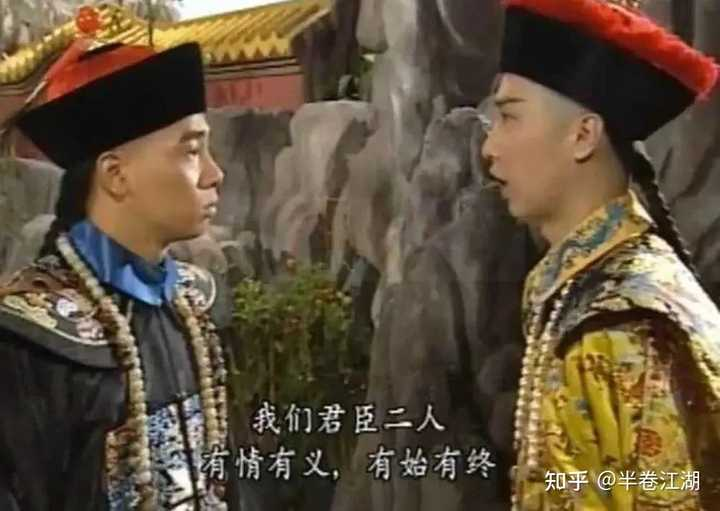

鹿鼎记之后金庸为什么不写了？ \- 半卷江湖 的回答

因为凶手作完案，不需要再补刀了。
你把金庸十五部小说的主角排一排，会看到一条非常清晰的下坠曲线。
郭靖，侠之大者，为国为民，死守襄阳，感天动地。杨过，叛逆了一点，但骨子里还是个情种英雄，最后一石头砸死蒙哥，万军丛中来去自如。乔峰，悲剧英雄，虽死犹荣。到了令狐冲，开始往后退了——别跟我谈家国天下，我就想喝酒，你们爱谁当盟主谁当去。张无忌再退一步，教主也当了，仗也打了，最后一看，算了，我给媳妇画眉去吧。

然后韦小宝出场了。
不会武功。大字不识。满嘴跑火车。一辈子靠的本事是溜须拍马、坑蒙拐骗、两头通吃。娶了七个老婆，当了伯爵，发了大财。
你告诉我，这是大侠？
这分明是大侠的反义词。
金庸用十四部书，一砖一瓦盖起了一座叫"武侠"的庙。英雄要有担当，高手要有风骨，正邪要有分野，江湖要有道义。郭靖是这座庙的正梁，乔峰是横柱，杨过令狐冲是飞檐上的瑞兽。
第十五部，他自己走进去，一把火点了。
韦小宝证明了一件事：在真实的权力世界里，郭靖活不过两集。你忠肝义胆？康熙用你的时候夸你忠肝义胆，不用你的时候这四个字就是催命符。反倒是韦小宝这种没立场、没原则、没底线的滑头，左右逢源，全身而退。
这才是历史的真相。侠客是虚构的，韦小宝才是真的。
金庸写到这一步，已经没有退路了。

alt="Image">

你想想他接下来能怎么办？再写一个郭靖式的大侠？他自己信吗？他刚刚亲手证明了那套东西是假的。再写一个韦小宝？写两遍有什么意思，观众又不傻。往更极端走？那就不是武侠小说了，那是社会批判文学，犯不着顶个武侠的名头。
有人说金庸是江郎才尽。这话说反了。不是才华不够了，是才华太多了，多到把自己逼进了死胡同。
一个作家最可怕的能力不是创造，是洞察。金庸写着写着，看穿了自己笔下那个江湖的本质——所有的快意恩仇，所有的侠骨柔肠，放到真实的历史里，一文不值。朝廷要灭你，你武功再高有什么用？天地会反清复明喊了一辈子，最后清朝是怎么亡的？不是被哪个大侠一剑挑了，是自己烂掉的。
鹿鼎记的结尾，韦小宝带着七个老婆跑路，从此不知所踪。
金庸的结尾，封笔不写，从此不问江湖。
你看，作者和主角最后做了同一个选择——
溜了溜了。

这不是什么创作瓶颈，也不是什么急流勇退的高风亮节。这是一个写了二十年武侠的人，终于对"武侠"这两个字祛魅了。你不能一边清醒地知道这是假的，一边还兴致勃勃地接着编。
古龙不一样。古龙到死都相信那个江湖，所以他能一直写，写到酒把自己灌死为止。他笔下的陆小凤、楚留香，永远潇洒，永远浪漫，因为古龙自己就活在那个幻觉里。
金庸醒了。
醒了的人，写不了梦。
