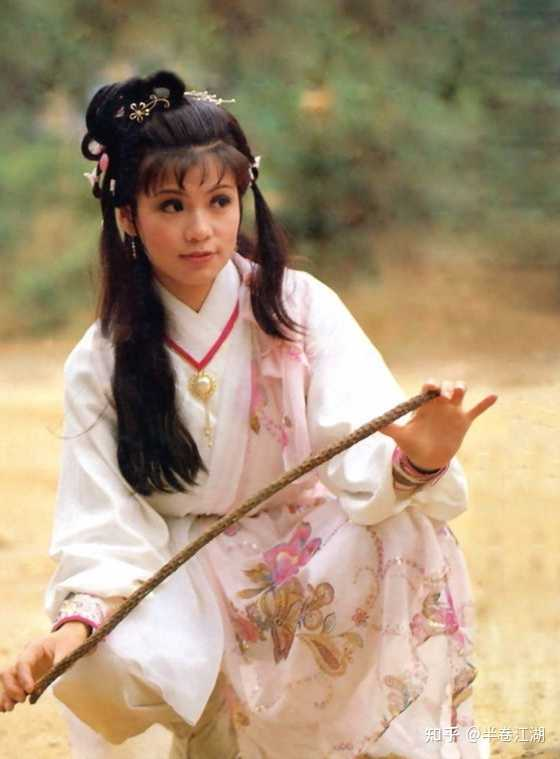
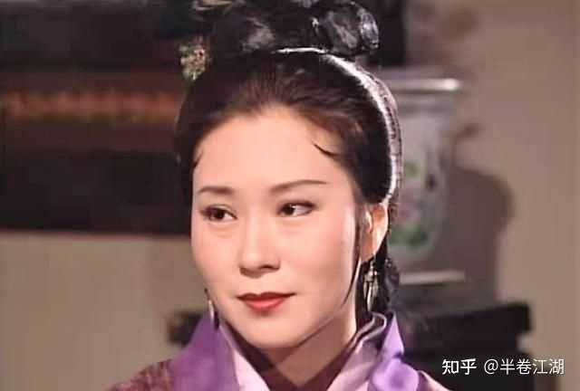
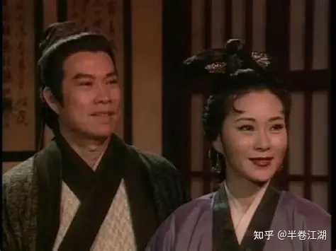

黄蓉为什么在神雕侠侣隔了一十六年，仍旧对杨过处处防备心理过不去？ \- 半卷江湖 的回答

如果说风陵渡之前，黄蓉防备杨过还是情有可原，为什么一十六年之后，襄阳祝寿时，依旧第一时间知道神雕侠是杨过后，还是处处防备着杨过？小肚鸡肠？小人心度君子…

黄蓉这辈子看谁都准。

看欧阳锋准。看杨康准。看裘千仞准。看岳不群也准——虽然那是另一本书，但黄蓉要是碰上岳不群，十分钟就能扒了他的画皮。

就杨过，她看走眼了。

不是看错了杨过是坏人。是看错了杨过是"那种人"。

什么叫"那种人"？聪明的、野的、不按规矩来的、你抓不住他的。

黄蓉给杨过贴了一个标签。这标签贴了十六年都没揭下来。

但你猜这标签原本是贴在谁身上的？

她自己。

你仔细看年轻时候的黄蓉什么样。

离家出走。跟她爹闹翻了，一个人跑到外面瞎逛。碰上郭靖之前，她女扮男装满街混，坑蒙拐骗无所不为。她骗过黄河帮的人，耍过欧阳克，把洪七公的馋虫当工具使。

聪明、野、不按规矩来。你抓不住她。

像不像一个人？

像杨过。

年轻时候的黄蓉跟杨过简直就是同一个模子刻出来的。区别只有一个——黄蓉是女的，后来嫁了郭靖，被郭靖的正直和稳重一点一点磨平了。

磨成了什么样？磨成了一个守城的妇人。精明、持重、为家庭殚精竭虑。把所有的野收起来了，全部的聪明用在替老公和孩子操心上面。

她变了。但她知道自己以前是什么样。

然后她看见杨过。

一个跟她年轻时一模一样的人。聪明到让人害怕，野到谁都管不住，从骨头缝里透着一股"老子谁也不服"的劲。

这东西她太熟了。在她自己身上见过。

alt="Image">

你知道什么人最防贼？

做过贼的人。

不是因为他们多了解贼的手法。是因为他们太知道一个贼心里在想什么了。每一步怎么算计的，每一个笑脸底下藏着什么，他们闭着眼都能画出来。

黄蓉看杨过就是这种感觉。她看到的不是杨过。是年轻时的自己。

她太知道这种人的能耐了。因为她自己就是靠这些能耐把郭靖拿捏得死死的。

郭靖怎么被她搞定的？几顿饭。她做的菜把洪七公骗来教降龙十八掌。然后一步一步把郭靖的人生重新安排了。郭靖整个后半辈子的走向，有多少是他自己选的？大部分是黄蓉帮他选的。

但郭靖知道吗？不知道。郭靖觉得这一切都是自己决定的。觉得遇到蓉儿是自己运气好。觉得守襄阳是自己的信念。

黄蓉从来没有"控制"郭靖。她只是……安排。安排到你觉得是你自己想要的。

这套本事谁还有？

杨过。

你看杨过怎么对身边人的。陆无双被他几句话就带着跑了。程英被他一个眼神就心甘情愿了。郭襄被他一场烟火烧了一辈子。连公孙绿萼都死心塌地。

这个人走到哪里，身边的人就不由自主地围着他转。他什么都没做。他就是站在那里。

跟年轻时候的黄蓉一样。人形黑洞。

alt="Image">

黄蓉防的不是杨过会害郭家。

她防的是杨过对郭家人的那种吸引力。

她怕郭芙被吸进去。怕郭襄被吸进去。甚至怕郭靖被吸进去。郭靖已经把杨过当亲儿子了。当亲儿子意味着什么？意味着杨过开口说什么，郭靖可能真去做。

一个能让郭靖言听计从的外人。这在黄蓉的安全系统里是红色警报。

不是因为杨过坏。是因为这种影响力不在她的控制范围内。

但这事最扎心的地方在哪？

黄蓉自己就是用这种影响力拴住郭靖的。

她嫌杨过用同样的方式影响她的家人。

你品品这个逻辑。

一个靠魅力拿捏住老公的女人，最怕另一个有魅力的人出现在她老公身边。不是怕老公出轨。是怕她垄断的那个位置被分走。

她是郭靖生命中唯一的"聪明人"。郭靖遇到事情第一个问的是她。有了她，郭靖不需要别的参谋。

杨过来了。杨过也聪明。杨过还比她年轻，比她能打，比她更让郭靖心疼——因为杨过是他兄弟的遗孤。

你是黄蓉你慌不慌？

不是怕失去老公的爱。是怕失去自己的位置。

alt="Image">

十六年说长不长。但够一个人把一种恐惧养成本能了。

她已经分不清自己到底在防什么了。是防杨过害郭家？是防杨过影响郭家人？还是防自己在这个比自己年轻的"同类"面前露出什么破绽？

大概全有。搅在一起。理不清了。

最聪明的女人碰上最像自己的男人，结果不是惺惺相惜。是如临大敌。

因为你太知道这种人有多厉害了。你自己就是这么厉害过来的。
