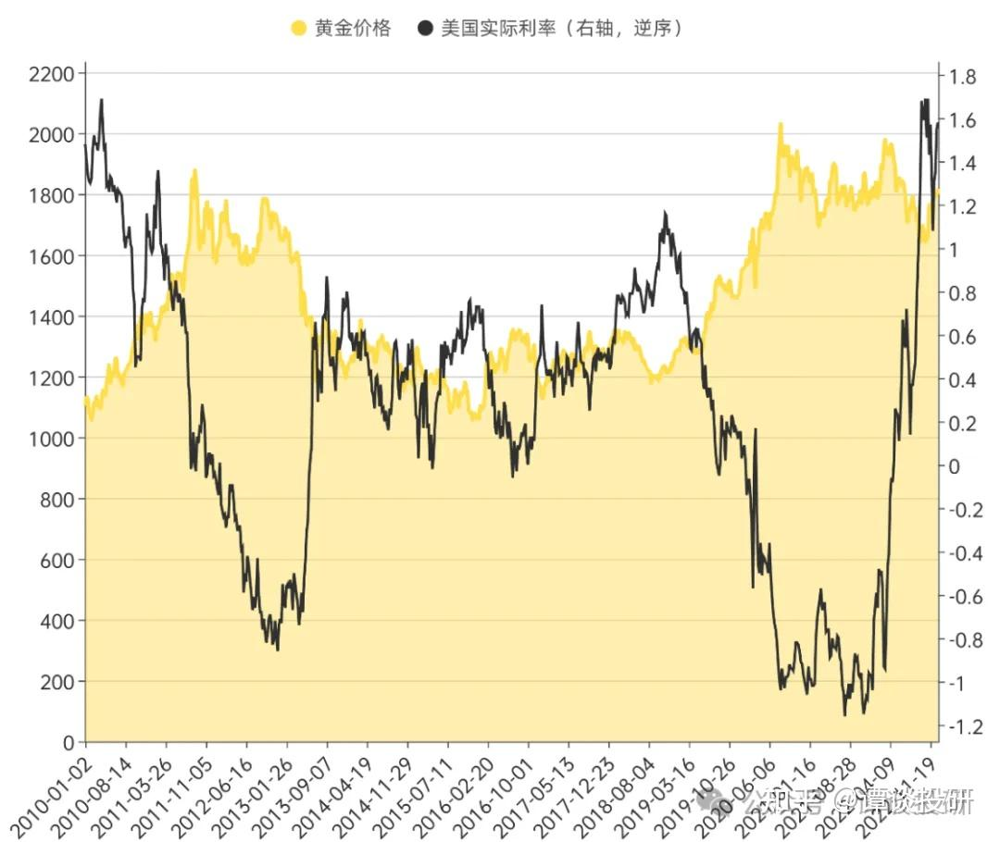
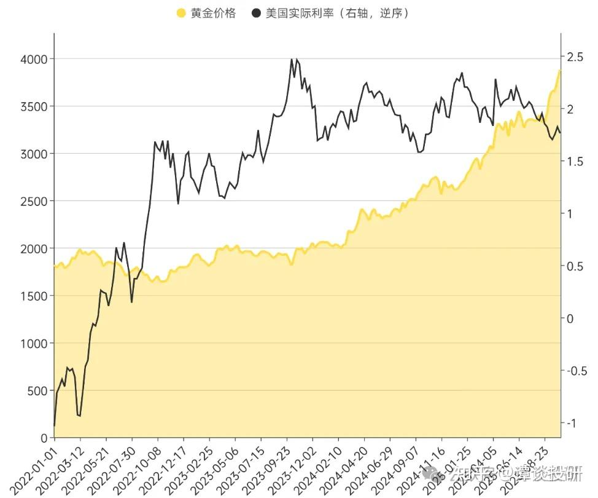
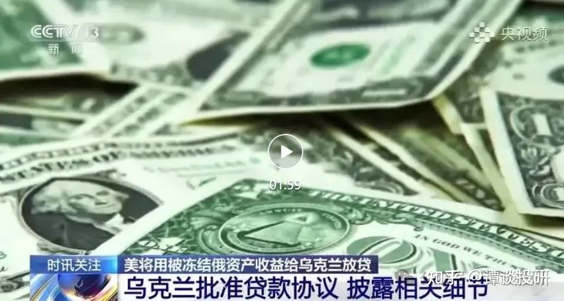
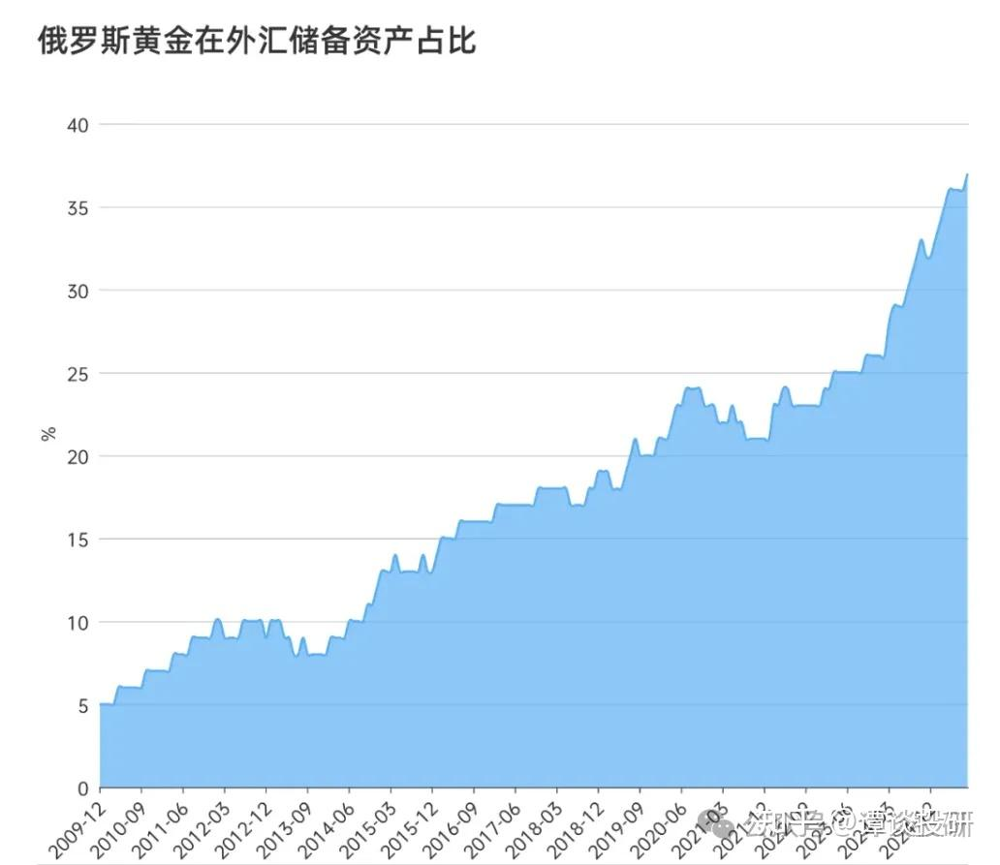
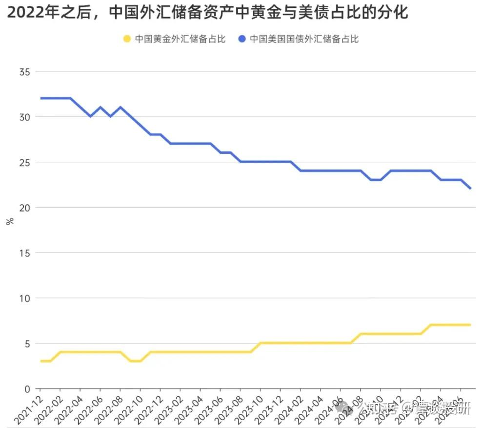
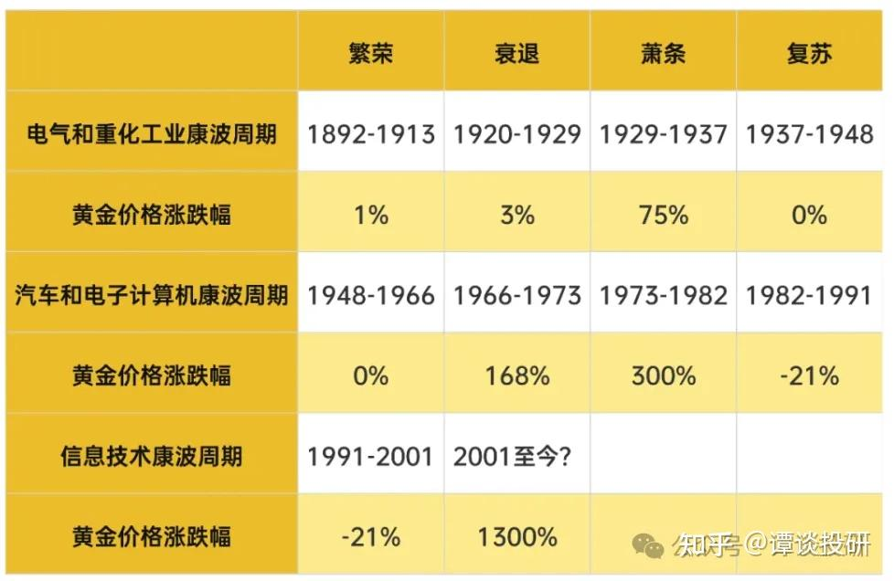

黄金的逻辑变了

黄金之前的逻辑很简单，就是避险资产，大环境越差，黄金越要涨。在这个逻辑之下，有个衍生的定理：黄金跟美联储利率是成反比的，因为环境越差，美国越要刺激经济，所以要降息；环境越好，美联储则要加息抑制泡沫的产生。至于为什么是美国的利率，不是其他国家的利率，除了美国是全球最大经济体之外，还有个重要原因是美元是国际货币，美联储的利率对全球经济的影响是非常大的。

在过去那么多年，黄金也是遵循这个走势的，跟美国的实际利率成反比。2008年金融危机后降息，黄金价格大涨；随后进入长达5年的加息周期，黄金价格也有所回落；2019年全球经济下滑，美联储再次降息，黄金又重回上涨区间。

所以过去那么多年，黄金其实没有太多研究的价值，因为太简单了没有研究价值，就是避险，跟美联储利率成反比。

但是情况在2022年发生了变化，随着美联储利率持续上涨，本该下跌的黄金价格竟然一反常态，也跟着进入上涨区间。历史经验，在2022年之后失效了。

那么2022年发生了什么大事，让黄金彻底跟美元脱钩了呢？

2022年最大的事件就是俄乌战争，战争爆发后，美国尝试冻结俄罗斯外汇储备，至此埋下了全球央行和投资者对于美元信用产生怀疑的关键伏笔。这个事件，对于主要国家来说，无疑都是一次巨大冲击，尤其是对于此前并未过多设想该路径可能的人来说。

当时很多俄罗斯富豪的海外资产直接被美国冻结，然后给乌克兰放贷。美国自然又是高举道义的大旗来干的这件事情，但是世界各国也不是傻子，如果之后自己得罪美国，那么所有的美元资产是否也有被冻结的可能？

这件事情的结果就是，大家不再像之前那样相信美元资产，转而去买更加靠得住的资产——黄金。目前世界各国的黄金储备占比都在上升，我之前也写过，最近两年，各国央行开始大幅购买黄金了。根据世界黄金协会的数据，2024年全球央行购金总量达到1045吨，占世界黄金交易量（4974吨）的21%，规模跟2019相比上涨了接近60%。

各国央行黄金购买量不仅增速快（相比疫情前涨了60%），而且体量也大（占交易总量的21%），现在已经成为黄金市场上的一股重要影响力量。央行增持黄金，对金价的抬升作用是很明显的。

美元信用在2022年被摧毁后，布雷顿森林体系写【美元\-美债\-黄金】的格局就渐渐发生改变了。俄罗斯要求欧洲用黄金结算天然气、中国与沙特推进「石油\-人民币\-黄金」闭环交易，标志着「大宗商品\-黄金」挂钩的新体系。黄金，开始慢慢独立于美元，成为独一无二的全球信用货币。

黄金，开始从避险资产，变成全球性的“货币等价物”。黄金的地位，开始上升。

美国冻结俄罗斯外汇储备，带来的是对美元信用的质疑，而货币的本质，恰恰就在于共识。当银行被挤兑时，储户会优先考虑资金安全而非利息。

这也解释了为什么2022年之后美联储利率上涨，而黄金不跌反涨的原因：当美联储一年加息 7 次，美债利率从零利率来到 5% 附近，大家想的不是这是投资机会，而是想的美债是否有暴雷的风险？当美债的利率比我们的城投债利率还高，就类似银行在发生危机时却高息揽储，大家反而认为是危机的信号。

是危机而不是机会，大家自然就会买黄金，而不是美元资产。

这件事情，跟2022年美国强行没收俄罗斯资产是相关的。正是对美国和美元的不信任，导致大家把美联储加息往坏的方向去想（是危机而不是机会），所以逻辑变了。

之前的逻辑是：美联储加息，那么买美元资产是机会，毕竟利率高，所以应该卖黄金买美元资产。

现在的逻辑是：美联储加息，那么买美元资产是风险，毕竟必须得高息揽储，所以应该卖美元资产买黄金。

金融就是这样，相同的事件，由于大家的信心不同，想的方向可能天差地别。

至于未来，黄金还会涨吗？

黄金虽然跟美联储利率脱钩了，但是依旧没有跟“避险”两个字脱钩。从历史上来看，只要是经济萧条，黄金就大涨；只要经济繁荣，黄金就涨不动。

所以黄金涨不涨这个问题，对应的是未来经济能不能好，以及全球政治环境是否能稳定，当然这两件事通常是一体的。

目前的经济已经趋向于稳定，全球的科技发展速度已经慢了下来，各国的阶级开始固化。目前来看，可能也就AI有可能作为经济突破口，但是AI是否能够突破，需要多长时间才能突破，很难说。而且AI突破之后，对于大多数人来说是好事还是坏事，也不好说。

行情总是在绝望中产生，在怀疑中上涨，在疯狂中破灭。要信早信，是我从投资中学到的一个道理。

当然除了战术之外，也得有战略：从宏观角度来看，各国都在不断印货币，黄金作为国际等价物，肯定是具备长期上涨逻辑的。不管全球经济是否能够复苏，我都相信黄金有上涨空间。区别就是，宏观经济差，黄金涨得多；宏观经济好，黄金少涨一点罢了。

__今日消息__

之后每篇文章末尾会发一些当日的资本市场消息，除了宏观框架之外，紧跟时事也是很重要的。

今天成交2万亿，缩量557亿，资金尽流出604亿。三市一共2101只股票上涨，3162只股票下跌。

1\.美股大跌，主要是AI利空。前天OpenAI暗示美国政府可以做财务担保，去建设数据中心。结果昨晚特朗普AI顾问说政府不会偏袒任何一方，导致OpenAI相关的股票都大跌（英伟达跌3\.6cm、AMD跌7\.3cm、甲骨文跌2\.6cm、微软跌2cm）。目前AI肯定是有泡沫的，很多AI应用都没有收费场景，股价就涨上天了。至于泡沫会不会崩，我觉得市场应该还会给一段时间去验证。

2\.泡泡玛特直播出事故，员工1称79元一个娃娃太贵，员工2说没事，反正有人买。这就是公司发展太快会出现的问题，员工素质没跟上公司脚步。泡泡玛特是小公司的时候，入职门槛肯定是低的。现在成长起来了，老员工也不好直接开掉，很多制度也没有完善，只能慢慢去培训了。很多老登没法理解79块钱的娃娃，就像小登没法理解1600块的茅台。就像洪灏说的，应该多了解新鲜事物，去买年轻人喜欢的资产。

3\.马斯克被授予1万亿美元的薪酬，条件是10年内特斯拉市值达到8\.5万亿美元\+交付100万台机器人\+100万辆车投入自动驾驶出租运营。论画饼，没人比得过马老师。

4\.荷兰政府让步，预计安世中国很快会恢复芯片供应，对半导体行业来说是个好消息。荷兰之所以让步，是因为美国暂停了股权穿透性管制，所以说实力才是硬道理。

我的知识星球《谭谈财经》，内容包括：

（1）金融、房产、时政、职场和社会思考等领域的深度思考，由于面向私域，所以并非”删减版“

（2）高价值学习资料，包括研报、电子书籍等（基本面研究，适合长线）

（3）一些我觉得有可能发酵的上市公司段子（当下热点，适合短线）

（4）每日最新各类有价值的金融数据、政策动向简评

（5）大家的问答，主要覆盖房产、投资、生活，集思广益、提升认知

[https://t\.zsxq\.com/Bub3J](https://t.zsxq.com/Bub3J) \(二维码自动识别\)
