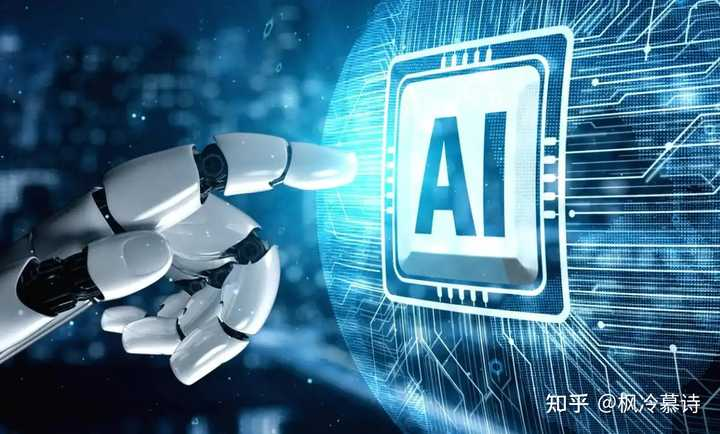
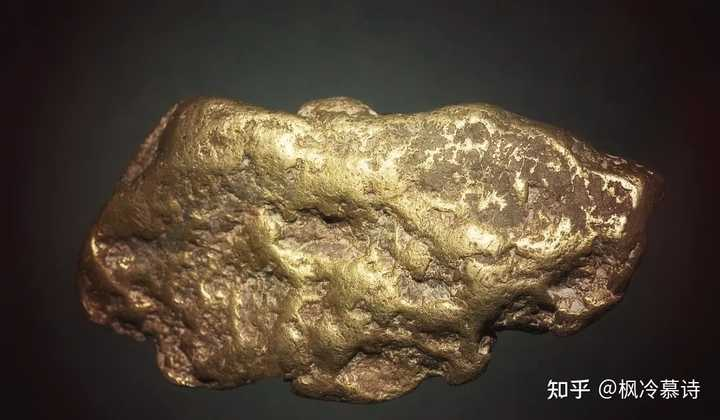

90后的第一个康波周期要来了吗？ \- 枫冷慕诗 的回答

__问题描述：__

是啥呢？

应该是的，如果有人叫你在2017年卖掉房子，在2019年购买黄金，你会怎么看待这个人？是预言家还是穿越者，还是百年一遇的神人？其实他和我们一样，只是一个有血有肉的普通人，他之所以能看懂趋势、预测未来，只不过是因为他掌握了一个经济学领域的大杀器——康波周期！

在富人圈子里流传着一个人人皆知的秘密，那就是人生发财靠康波，而不是靠机械的努力，如果努力就能赚到钱，那世界上最富有的人应该是种地的农民和搬砖的农民工兄弟。

可实际情况呢？20年前山西的煤老板，大字不识一个，只有小学文凭，但他却可以戴着999k的足金项链。

还有10年前的深圳包租公，他们只有初中文化，普通话都说不清楚，但他们却可以一个月收好几十万的租金。

这深刻的说明，踩对康波周期，远比盲目努力更有意义。

很多朋友可能不知道什么叫康波周期，我做一个简单的解释，在100年前的时候，前苏联的经济学家康德拉季耶夫在研究了人类工业革命之后的两百年历史，他发现了一个神奇的规律，那就是每隔60年时间，一个国家的经济就会走完四个完整的阶段，出现一个完美的闭环。

这四个阶段分别是——繁荣期、衰退期、萧条期和回升期，四个阶段合在一起，共同组成了一个完整的康波周期，而我们当下正处于人类第五个康波周期里。

![增
謐
長
条
旧 00 年
一 次 长 瞠
1850 年
] 900 年
第 三 次 长
四 50 年
笔 次 长 波
] 990 年
黷 德 拉 捷 夫 长 波 又 称 长 波 或 波 · 是 一 种 约 50 年 为 一 循 环 的 经 济 周 期 现 象 。
1994 年 至 今 23 年 ， 还 有 27 年 { 2044 只
康 德 拉 季 耶 夫 周 期 波 长
刂 手 @ 劐 一 ](attachments/b70acf40e23f.jpg)

alt="Image">

通过对这一理论的研究，我国著名经济学家周金涛成功预测了多个国内外大事。

比如说，他成功预测了2007年的美国次贷危机，他成功预测了中国房地产行业会在2013年之后出现拐点，他甚至还成功预测了2016年全球大宗商品的价格大反弹，他在很早以前就提出，一定要在2017年卖掉手上的房子，一定要在2019年购入黄金，因为新的周期机遇已经来临，可惜当时很多人压根就不信，所以错过了人生逆袭的机遇。

看到这里，我知道有人要说了，什么康波周期，说得像玄学一样，真的有那么准？其实你认真研究就会清楚，康波周期不是玄学，更不是算命，它是基于经济规律做出的合理推演。

不信我简单说一下大家就知道怎么回事了，为什么经济会有周期呢？

大家都知道，工业革命之后，人类社会的发展主要靠科技革命来推进，比如说蒸汽机、电力的出现，就是第一次第二次工业革命的基础，计算机及信息技术就是第三次科技革命的基石，每当科技革命来临的时候，整个世界就会出现大量的新增财富，人们有钱了，就会疯狂投资，买股票，买房子，买各种商品，这个阶段的人投资偏好都十分激进，他们坚信未来一定能赚到更多的钱，所以在这个阶段，楼市股市一般也会大涨，可问题是，没有人知道资产价格上涨的顶点在哪里，大家不断吹起泡泡就会导致资产泡沫化的局面，一栋100平米的钢筋混凝土房子，被炒到了几百万人民币，这明显超出了房子的实际价值，当这样的情况普遍出现的时候，就会出现价格虚高无人接盘的情况，于是泡沫破灭，经济快速进入到衰退和萧条期。

alt="Image">

这是非常容易理解的道理。

当一个社会开始进入经济衰退和萧条期，人们的投资消费欲望就会收紧，所有人都会捂紧钱包，导致市面上做啥生意都不赚钱，所以在这个阶段，各种经济指标就会明显遇冷，经济寒冬期也会就此来临，用一个形象点的比喻去说就是，这个阶段的人都躲在自己家里面取暖，导致外部经济活动大幅减少，社会缺乏活力。

直到社会的债务基本出清，新的科技革命来临，社会才会重新回到发展的正途，这时候就意味着社会进入到回升期了，在这个阶段，投资和消费会逐渐恢复，人们的信心也会再度出现，然后科技革命推动了生产力的大进步，新一轮的繁荣期就正式来临。

这就是康波周期四个阶段的基本逻辑。

你看完就清楚，这不是玄学，这确实是基本的经济规律，世界就是这样的，有高潮就有低谷，中国古代典籍《史记》里面写得清清楚楚：日中则移，月满则亏，物盛则衰，天地之常数也。

alt="Image">

这句话告诉我们，万事万物，只要发展到了一定的程度，那就必然会进入到一个回落调整的时期，直到下次机遇来临，高速增长才会重新开启。

那我们现在到底处于一个什么样的阶段呢？根据周金涛的研究，2016\-2025年这十年左右的时间，就是第五次康波周期的衰退和萧条期，当经济周期处于萧条期的时候，我们就会发现，整个世界几乎所有国家，都很难赚到钱，因为上一轮的科技革命红利已经吃尽，但是下一轮的科技革命还没有开启，所以整个世界都会从增量时代快速过渡到存量博弈时代。

为什么2016年会出现中美南海对峙？

为什么2018年会出现中美贸易战争？

为什么2020年\-2025年世界的局势急转直下，整个世界都处于动荡的边缘？
归根到底就是因为世界的蛋糕就那么大，在萧条期不够所有人分，所以必须用各种手段来争夺社会财富，这就是这几年全球局势动荡的根本原因。

在上一轮的康波周期就发生过类似的事情，1973年\-1982年，世界进入第四次康波周期的萧条期，在这段时间，美国陷入到了经济大滞胀，欧洲出现了能源危机，中东出现了激烈的战事，全世界到处都在动荡不堪，直到80年代美国总统里根上台，然后新一轮的技术革命兴起，这才让世界重新进入一个稳定的发展阶段。

所以，身处于2026年的我们到底位于哪个经济阶段呢？按照周金涛的分析，2026年可能是萧条期结束，回升期开始的重要转折点，再说明白点就是，我们正处于全球科技革命大爆发的前夜。

alt="Image">

其实现在全球的局势已经有很多细节在验证这个观点。

首先第一个是能源革命已经兴起，以中国为首的国家布局了大量的清洁能源，比如说光伏发电，风力发电，还有各种大型水力发电站等等，这不仅是为了增加发电量，更是在为新一轮的科技革命做铺垫。

然后第二个就是全球贵金属价格暴涨，不仅是黄金涨，甚至就连白银、铜、铝、锂、钴这些金属都在跟着涨，为什么他们的价格会上涨？因为需求量暴增，那为什么他们的需求量会暴增呢？因为新一轮的人工智能革命拼的就是电力基础，而这些金属正是和电力革命息息相关的原材料，这一点学过物理和化学的朋友应该都懂。

alt="Image">

那在这样的情况，我们作为一个普通人，如何才能抓住这个财富机遇呢？周金涛又明确指出，由于人的寿命有限，在60年一轮回的康波周期里，我们绝大多数人其实只有三次机遇：

第一次机遇是经济繁荣期，对应国内应该就是2001\-2015年这十几年的时间，在这段时间，不管是做啥生意都能赚钱，买房炒股也都能大赚一笔，这就是无数过来人的经验。

第二次机遇是经济衰退和萧条期，对应国内应该就是2016\-2025年这10左右的时间，尤其是2020年之后的时间，在这段时间，资产价格会快速下滑，会出现一个抄底的机遇。

第三次机遇是经济回升期，目前推测是2026\-2035年的这个周期，在这个阶段经济指数会快速回暖，赚钱的机会又会重新出现。

这就是普通人一辈子会遇到的三次机遇，注意，我说的时间并不是死的，比如说如果你没有踩中2001\-2015年的繁荣期，那你还可以踩中2035\-2045年的繁荣期，只要你的年龄允许，理论上一个人一生至少都有三次机遇，就看你能不能抓住机会了。

alt="Image">

如果说以前我们还看不懂未来的趋势，那经过几年的发展，和国家不停的预告，未来能赚钱的行业其实已经非常清晰了。

首先是四大支柱产业：新能源、新材料、航空航天、低空经济。

然后是六大战略产业：量子科技、生物制造、氢能与核聚变能、脑机接口、具身智能、6G。

最后是八大未来趋势：人工智能、高端装备制造、新能源汽车、集成电路、数字经济、银发经济、单身经济、新型娱乐产业。

这就是国家反复强调的，未来5年最有趋势的一些行业，我们不管是投资理财，还是找工作创业一定要瞄准这些未来产业。

我们一定要记住，要学会借助周期的力量，而不是一直被时代推着盲目前进，如果我们能在两年之前就提前押注黄金，那现在你的个人财富至少会翻一倍以上，可为什么很少有人选择这样去做呢？因为大多数人只能看到眼前，也不研究康波周期，他们的就业和投资活动，都是随着情绪的波动而不断调整，这样自然就很难踩对真正的财富节点。
