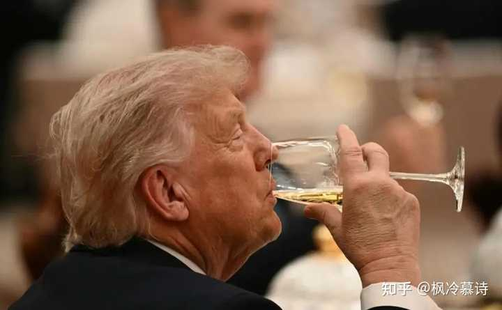
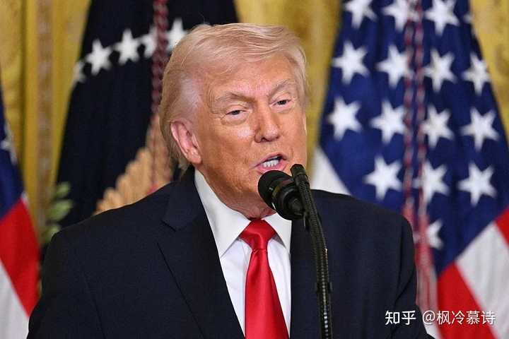

中美关系能不能修复？ \- 知乎

__问题描述：__

自从特朗普第一任期发动贸易战，中美关系每况愈下，美国两党都无意挽救，中美关系前景确实堪忧，中国也没有合适的解决方案。如果中美关系走向冷战甚至敌对，不管…

特朗普访华这件事，可能会载入历史，我们作为历史的亲历者，受限于视角限制，往往很难看清历史事件真正的影响力。

为了帮助大家理解当前的世界格局，我以一个写入了教科书的历史事件进行说明。

在104年前的1922年，英美签订了一个著名的协议，名叫《华盛顿海军条约》，里面明确规定：美、英、日、法、意五国海军的主力舰总吨位比例为5\.25:5\.25:3\.15:1\.75:1\.75。

alt="Image">

生活在那个年代的普通人，他们很难想到这会是世界历史一个重要的转折点，很多人还以为这只是无数条约中十分普通的一个，直到几十年后，后人回顾那段历史，人们才突然意识到，原来在1922年，英国的百年海上霸权就已经正式终结了，因为美国人在海军吨位上已经获得了和他们平起平坐的权力。

现在人们也普遍认为，1922年，就是英美海上霸权的交替，在那一年，美国正式登上了世界顶级强国的舞台。

我为什么要举这个案例呢？是想让大家明白特朗普这次访华，最大的成果到底是什么？其实像中美这样的大国，千亿美元规模的经贸订单真的是不值一提的小事，不管是买牛肉、大豆还是石油，或者是波音和芯片的订单合作，放在整个历史长河去看，后人压根就不会记得这些事，真正能让后人记住的，是公元2026年5月，美国总统特朗普带着谦虚的态度，和中国进行了友好的谈判，最后确认，中美两个大国将建立建设性战略稳定关系。

甚至一些文件还会专门记载，特朗普在访华的过程中十分谦虚，至于到底有多么谦虚，还是日本媒体说得最精准，他们说：特朗普在中国，那就像是高市早苗在美国一样。

当这些细节被历史记载，后人可能会突然意识到，原来2026年是21世纪一个非常重要的转折点，因为它有可能就是中美确认双方平起平坐的关键时间节点。

我之前就提到过中美关系的几个重要阶段。

2016年是一个非常关键的节点，从那一年开始，美国失去了在近海武力战胜中国的可能，中美两国正式摊牌。

然后2016年\-2020年，这是我们的战略防守时期，面对美国发起的贸易战、科技战、生物战、金融战，我们只能被动防守。

随后2021年\-2024年，当我们产业升级开始加速，当中国科技成果开始井喷，当美国被债务危机持续拖累国力不断下滑，在此消彼长的情况下，我们开始有了一些战略腾挪空间，中美关系进入到了一个战略防守和战略稳定之间的过渡阶段。

最后到了2026年的时候，随着特朗普的访华，中美关系正式进入到了战略稳定阶段，也就是双方承认我们平起平坐，两国关系进入到了战略相持。

alt="Image">

至于为什么美国人会在2026年承认这个事实？我个人判断是因为连续发生了几个历史大事。

第一个历史大事是中国六代机首飞的事情，这件事的意义不只是我们研发出了一件装备那么简单，它意味着最近200年，西方国家首次在主战装备上落后于我们，它彻底摧毁了西方在军事领域的自信，让他们意识到，地球上最先进的装备已经不再产自他们那里。

第二个历史大事是2025年5月份的印巴空战，距离现在正好是1周年时间，这件事夸张的地方在于，在实战过程中，巴基斯坦用中国的装备和中国的军事作战体系，彻底碾压了使用西方装备和西方军事作战体系的印度，它表面上是印度和巴基斯坦的事，但实际上却是中国军事作战体系的全面胜利，从那以后，西方不再怀疑中国军备的实战能力，这件事对美国人刺激很大，影响了后面的第四件大事。

第三个历史大事是2025年9月3日的大阅兵，当我们批量式的展示地面突击装备、防空反导装备、海上攻防装备和无人作战装备的时候，当我们的东风5C液体洲际导弹打击范围覆盖全球的时候，我们完整的国防工业体系，就彻底震惊了西方智库，他们终于意识到，我们领先他们的，不只是一两个军备领域那么简单。

第四个历史大事是2025年10月份美国找我们关税战停战的事，站在特朗普的角度来看，当时他认为美国对我们的优势领域已经不多，金融和贸易领域可能是美国的优势点之一，所以他想用关税来卡我们的脖子，最后他惊讶的发现，欧洲和印度不敢反抗，日韩也没有对抗美国的能力，但是中国却可以对他们进行对等的反制，甚至我们还用稀土反向卡了他们的脖子。

关税战有两个转折点。

一个是5月份印巴空战之后，特朗普首次开始服软。

另一个是10月份被我们的稀土卡得难受，特朗普正式宣布停战。

经过这次试探，美国再次确认了中国经济和产业链的韧性。

alt="Image">

第五个历史大事是2026年2月底的美伊战争，这件事美国至少确定了两个信息：

第一，美国无法战胜一个有外部援助的伊朗，既检验了美国的海外作战能力，也检验了某个国家的能力。

第二，即便世界能源通道被卡死了，中国依然不会出现能源短缺危机，我们不会工厂停工，不会拉闸限电，不会出现秩序混乱的危机。

当这两个信号得到了确认。

美国就可以得出一个基本的结论——现在的中国，是一个主战装备领先于他们、经济韧性极强、军事创新能力十分夸张、能源保障能力没有短板的超级大国。

面对这样的六边形战士，特朗普只能无奈的承认，美国一家独大的时代已经彻底结束了，所以才会有中美建设性战略稳定关系这个新提法。

它既是在告诉全世界，一个新的时代已经来临，也是在给历史划一个重要的记号，后人研究21世纪这段历史，可能会和我们看1922年英美两国签订《华盛顿海军条约》一样，都是载入史册的重要历史事件！
