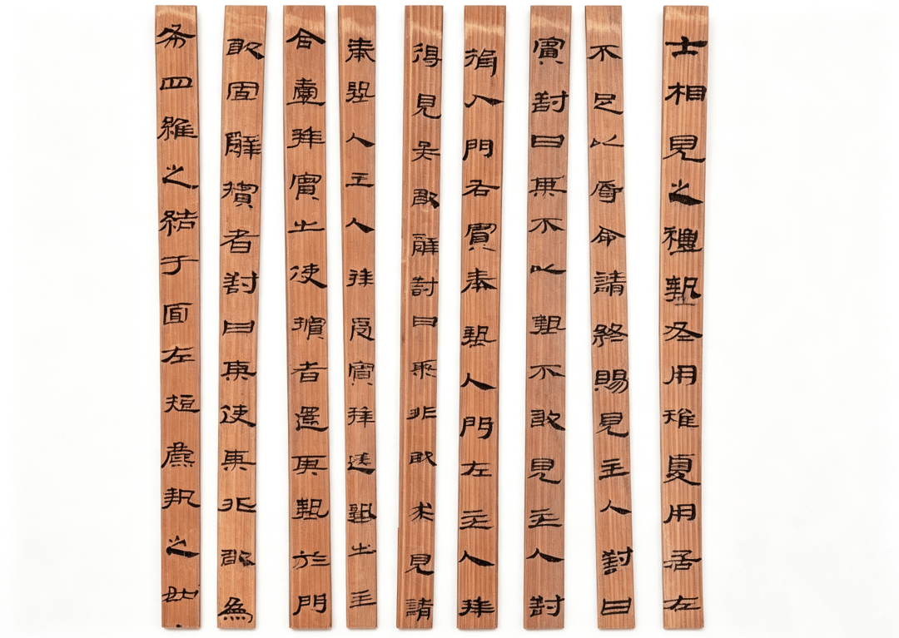

仪礼：国将亡，必多制

公众号名称：星辰尘俗

作者名称：洛神呀

发布时间：2026\-08\-26 08:03

__“ __读《仪礼》之后，有一些话想说。__”__

十多年前去宝鸡青铜器博物馆，友人说你看这晚商的器物多精美啊，反倒西周早期的东西粗糙太多，可见科学技术也是会退步的，武王伐纣果然是一场落后民族征服先进文明的战争。

我说我反倒喜欢这西周的造型，粗粝素朴，朝气蓬勃，是一个阳性的世界，是新朝的气象；而晚商的精致繁华琐碎则是一种堕落，阴郁得化不开，宜其会被后来者所取代。

人说周公制礼，仪礼三千。我说这个“周公”若有其人，亦必不是开国时的周公旦，因为这样过于繁琐复杂的礼仪制度全然是阴性气质的，是季世才有的东西，决不合乎西周初年的风格。

左传里说“国将亡，必多制”。礼仪制度跟青铜器一样，越是健康向上的时代越简洁粗略，越是衰败堕落的时代越精细繁复，时代气质使然也。

孔子说“周鉴于二代，郁郁乎文哉，吾从周”，他所见到的“郁郁乎文”的礼仪制度是西周晚期的东西，过于“文”了，一如他的“食不厌精脍不厌细”，其实并不好，与他的中庸理念相悖。

周公旦若草创周礼，那一定是如同汉高祖的命叔孙通建立汉仪，第一要求是“视吾能行”，即简洁可施行，必不至于像仪礼中所记载的这样琐屑。仪礼是随着王朝的寿数而逐步完备细致的。

司马谈说诸子出于王官，说儒家出自司徒之官，而名家出自礼官，其实不然，名家不过是儒家后来的一个分支，儒家本来就出于礼官，负责周王朝的礼仪制度。后来随着西周王朝的衰落崩塌，礼官们流落诸侯乃至民间，这便是儒家的雏形。

儒家从来就是没落的贵族礼官，他们效法周礼，在民间通过主持婚丧嫁娶等活动维持生计，逐步形成了一个专门的行当，即“儒”。左传里说“礼失而求诸野”，即是说周王朝的原本礼仪都通过礼官的沦落而散步到民间去了，后来朝廷反而因为大动乱而礼制不足，只好取法于民间遗存。

既然作为一个维持生计的行业，“儒”们就自觉要提高专业门槛，以防自己被轻易取代。最好的做法就是让仪礼细分再细分，规矩再规矩，以至于“累世不能通其学，当年不能究其礼”，外人一看就觉得好复杂啊，这个活动还是得请专业的“儒”来主持才可以，欲从事这个行当的人亦不可能轻易掌握，只好老老实实给老师傅献上束脩而求学，行业门派于是乎逐步兴起。

到东周晚期，这个行业有最杰出的人才孔丘出，广收门徒，统一了民间的礼仪市场，整理编订了相关规范指导，即是这本《仪礼》。

仪礼有周礼的成分，但更多的是儒家的造作，作为一种极其繁琐的民间仪式辞典存在着。 孔子其实亦不信这套刻板的规矩，他说：“礼云礼云，玉帛云乎哉！ ” 绘事后素，礼亦后之。 礼仪本来应该是因为内在的诚意充沛而自然形诸于外的，好比内心对一个人很尊敬，那么你自然会在言辞举止上展现出你的敬意来，这就是礼仪。 文胜质则史，《仪礼》中繁复机械的规定，过文以胜其质，其实是诚意的不足，撑不起它的外在规模，变成了孔子所不喜欢的“小人儒”了。

工具书的生命周期每每是短暂的。《仪礼》在春秋时期或尚有部分合理附着生存的土壤，至如今的时代则彼土壤已经近乎磬尽了。古人尚且多次把它叉出“十三经”的队伍，今人更没有太多必要阅读之，极少数专业的古代礼仪研究者则另当别论。

杜甫“不薄今人爱古人”，对于礼仪来说，我更喜欢现代人的简洁明媚，有一种蓬勃的阳气，对古人的繁琐的仪式诚然爱不起来。
