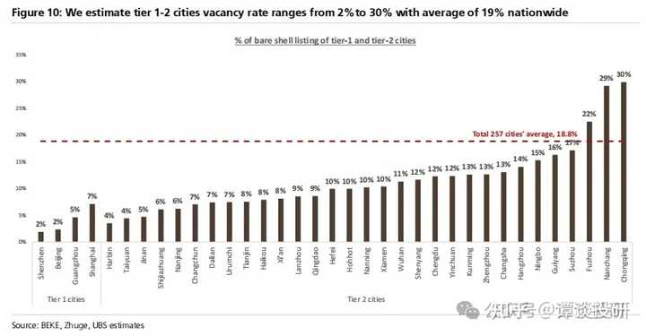

房价接下来几年会逐渐走低吗？ \- 谭谈投研 的回答

__问题描述：__

老大不小了，想买房结婚，但又怕过两年房价持续走低，买了溢价产品换了谁心里都不舒服 补充说明：2024年提问

最近瑞银出了一篇研报，结论在标题就说得明明白白：中国房价还要再跌2年。（吐槽一句，不知道为什么现在各方势力的预测这么统一，全部都预测中国房价2027年触底）

![*UBS
China Property
Another Two Years of Downcycle?
Expect another two years Of downcyele•, Sales to de-cline 10%/ 5% in 2026127E
There ate
among agents See out
mainland China, tie' 1 cilicus• 'entai yieitlof 1 8% remains lower
than rate of 3 and rents still derlined at 3% YOY ofOct 2025 Hong
Kong pose lesson learned, which was
driven b/ don
in China in the near term, •Ne expect the residential market downcy-de to
continue 'n 2026•27E. based on model (ElUuLe2) and mortgage
calculator We revise down out China national residential sales forecast
by 3-13% in 2025-26E We expect natsonal property sales 10 by GfMvaIue
in 2026E and anothot 5% in 2027E wo forecast secondary ptoperw
price in tier 1 and 2 cities todecline by in 2026Eandanother 5% in 2027E (Eigure_
_Dye horngbtyers
9,'vf202g. transaction units it;
rental prices still dec'ined by 3% YOY of Oct 2025 Thi', indirectly
suggests an rental suppiy We attnöute this to 1) soc.al rental housin
'n tier cities "00k-600/ er Cit 'n 14th Ftve• P dn see
coruels•on of c,etfindd'y listings to' sale 'o rent. clue to difficulties
r." Sri e. an
propel
rent,i a Supp y c:
Over
the peak •n 2022 (Eigute_1Z), and thus we estimate the social 'ental housing supply
(completion) decline 2026•27E Hence, if rental prices stabilize 01 increase. this
may indirectly imply improving demand-supply dynamics
Mortgage calculator and inventory model
Assumang no price appreciation. we compare the monthly cash o' buying a
vs renting a property mn asset value 0' ptoperty. assuming a
downpayment ratio. the monthly rental e.pense would only be Rrnbl .508. whilst the
monthly mo'tgage payment would be Rmb2.562 Hence. we expect
preference tot tenting Over buying Will sustain until the cash flow gap narrows If we
assume a 40bp reduction in mcMtqage •ate (see out macro team China
by end-2026E and stabilized
rental, prices may have to decline by 38%. thi:t monthly cash flow for
buying vs renting mold be the same Based inventor,' model. we estimate the
anventory level may return to avx•rage 2010) kwel% by mid-2027. taking into
account 2026•27E latest sales and new Starts forecast
policy and downside risk
We think some Ot the most effective ways to stabilize property prices could include I)
is d' pet the 15th
p In u • •r. out mav
banks' net interest downs.cle is a nse 'nortuaqe delauu 'ate. winch
salesby banks. pushing down propeny furthe'
Equities
Chi na
Real Estate
12 November 2025
John
phn•zaiamaubs com
*852-2971 6358
GO CFA
,852-2971 8950
Mark
.852.'971 8636
Ben Ho
-852-3712 2819
Harel PhD
tanaubs
3058 ](attachments/e9623df03023.jpg)

alt="Image">

瑞银首先就给出了王炸：中国房子的租售比太低了，目前一线城市只有1\.8%，远低于按揭利率的3\.1%。

alt="Image">

这里我插两件事情，第一就是解释下为什么按揭利率这么这么重要，其实租金回报率跟两个数据最相关，第一是国债利率，第二是按揭利率。

国债利率代表该国的无风险收益率，而且流动性非常高，应该是该国资产收益率的锚点，所有资产的收益率都应该比国债利率高。如果一个资产低于本国的国债利率，那证明明显被高估。

目前我国10年期国债利率差不多1\.7%，目前一线租金回报率仅仅略高于国债利率，肯定是偏低的。

第二就是按揭利率，这个数在大多数地方都应该跟租金回报率差不多，也就是说，出完首付之后，每月还贷的钱应该跟房租差不多。目前我国所有城市中，只有香港的房价稳住了，究其原因，也是因为香港是唯一一个租金回报率高于房贷利率的地方。

alt="Image">

我国房贷利率在3%左右，但大多数城市租金回报率处在1\.8%～2\.5%之间，目前看还是比较偏高的。

我想说的第二件事情就是，大家看上图的一线城市的租金回报率，仅仅从21年低点的1\.3%上升到现在的1\.8%。要知道一线房价回调已经有30～40%（北上可能只有25～30%，但是广深接近腰斩了），如果租金没变，那么租金回报率应该上涨到2%。目前只到1\.8%，证明租金也下降了10%以上。

如果一线租金回报率要到2\.5%（假设之后房贷利率也降一些到2\.5%），那么房价就还要跌30%左右。

你说房贷利率能不能降到2%左右？我想说你这是要让银行活不下去呀。现在银行压力那么大，房贷本来就是最赚钱的业务，你直接砍掉三分之一，不现实。反正都是做梦，还不如想想收入上涨30%呢。

接着瑞银就估算了，在3\.1%的房贷利率下，必须要首付60%，才能保证房租覆盖月供。很多小伙伴可能比较懵，为什么瑞银突然把房租和月供做比较，其实这是成熟房地产市场经常对比的值，也就是我上面说的，房租要等于房贷。

![Figure 6: Our sensitivity analysis shows mortgage payment can be covered by
rental income only if c%wnpayrnent ratio reaches 60%
Sensivity analysis Of monthly mortgage payment
Mortgage rate
30%
45
65%
-1.9% — 2.1% 2.3%
2,622
2.435
2,248
2.061
1,873
1,686
1,499
1.311
1,124
2.552
2,370
2,188
2,006
1,823
1,641
1.459
1,276
1,094
2,694
2,501
2.309
2,116
1.924
1,732
1.539
1,347
1.154
2.5%
2,766
2,568
2,371
2,173
1,976
1,778
1.580
1,383
1.185
2,839
2,636
2,434
2,231
2,028
1,825
1.622
1,420
1,217
2,914
2,705
2,497
2,289
2,081
1,873
1,665
1.457
1,249
3.1
2,989
2,776
2,562
2,349
2,135
1,922
1,708
1,495
1,281
Note: gæen area vålere monthly payrrent is bwer
prevbts figure. ](attachments/06597a67cb7d.jpg)

alt="Image">

然后就是房租这个数据，10月份同比还下降了3%。看这个房租走势，跌幅大头出现在23年底～24年底。今年上半年本来已经止跌了，但是下半年又开始下跌了。2022～2025年，房租每年同比变化\-3%/\-2%/\-6%/\-4%，房租的数据在国内的报道还挺少见的，大家感兴趣可以记一下。

alt="Image">

按照瑞银的说法，一线城市的房租这几年下降了15%左右。我算了算上图中上海的数据，大概下降了20%，跟我的体感是差不多的。

另外一个有趣的事实，上图中以2004年房租为基点（100），今年也就200左右，所以一线城市的房租相比2004年只翻了一倍，但是房价差不多翻了接近10倍。现在年轻人的买房难度，可以从中窥见一二。

而且瑞银还进一步预测，之后房租还会继续下跌，年均跌幅在3%左右。

理由1：保障房数量上升，2021\-2025年新增的供给可覆盖13\-16%的租房家庭，这就意味着15%的私人租房需求直接被消灭掉了。

alt="Image">

理由2：现在二手房挂牌量越来越多（全国同比增速10%，一线同比增速1\.7%），已经创下了历史新高。这么多房卖不出去，就会有很多房东边租边卖，增加租赁市场的房屋供应量。

alt="Image">

目前很多房东长时间挂牌卖不掉后，又不愿意再降价卖，所以选择把房子租出去，能卖就卖，不能卖拉倒，就当出租了。但其实我不建议各位房东这么做，因为出租的房子由于看房不方便，所以中介带看意愿会弱一些，会降低卖掉的几率。而且房价还会肉眼可见的下降，这一两年的租金还不够一个月降的，没有自住需求的房子就应该马上割肉，不要犹豫。

理由3：现在一线/二线/三线/卫星城的空置率分别是4%/11\.6%/19\.9%/22%，空置率这么高，也会影响后续房价走势。

alt="Image">

其实一线城市的空置率还好，4%属于正常范围。但是一些人口流出的二线和所有三线\+卫星城就不容乐观了，20%的空置率，风险很大。再考虑到之后中国人口是下滑的，而且肯定是越边缘的城市下滑比例越大，这也是我不看好三线城市的原因。

alt="Image">

我之前看过报告，三线城市租售比还不低，跟二线城市差不多，基本都是在2\.5～3%之间。建议所有三线城市的居民，马上卖掉房子去各自的省会买房（最好是人口流入的省会），现在租售比差不多，之后肯定会产生分化。

看了看我大成都，目前空置率在12%。然后顺便吐槽一下，重庆的兄弟，你们那边空置率有30%？你们可有3000多万人，空置率还这么高，这是造了多少房子。。。大家可以看看自己城市的空置率，超过10%其实就开始有风险了。

alt="Image">

而且，60年代婴儿潮一代的人已经老了。如果之后陆续去世，那么多老破小怎么办？就我目前的体感来看，年轻人宁愿租房、去郊区买房，也不想住市区老破小。。。

alt="Image">

最后瑞银给出结论：一线城市2026年再跌10%，2027年再跌5%。之后的事情，瑞银没说了，按照它的逻辑，估计就是进入长期阴跌状态。瑞银建了模型后表示，即使到2026年利率再降40bp，只要租金不涨，房价仍需下跌约38%，才能让买房vs租房的月度现金流持平。听这意思，之后阴跌还要跌掉10%以上。

alt="Image">

外资对房地产的报告，其实跟我的思路是类似的，因为他们跟我都非常注重一个东西：租售比。这是中国房子最大的雷，任何逻辑在租售比面前都显得非常苍白。

其实瑞银已经比较给我们面子了，至少有两个大的利空它没有讲。

第一，人口结构的变化。之后中国人口会越来越少，这是除了租售比之外，第二大直插房地产的利剑。

第二，低线城市。文中的分析很多都是以一线城市为例的，但实际上很多人口流出的三线情况更为严峻。一线城市等十几年或者几十年，房价还能重回巅峰。但是三线城市的房价，永远回不去了。

我的知识星球《谭谈财经》，内容包括：

（1）金融、房产、时政、职场和社会思考等领域的深度思考，由于面向私域，所以并非”删减版“

（2）高价值学习资料，包括研报、电子书籍等（基本面研究，适合长线）

（3）一些我觉得有可能发酵的上市公司段子（当下热点，适合短线）

（4）每日最新各类有价值的金融数据、政策动向简评

（5）大家的问答，主要覆盖房产、投资、生活，集思广益、提升认知

alt="Image">
