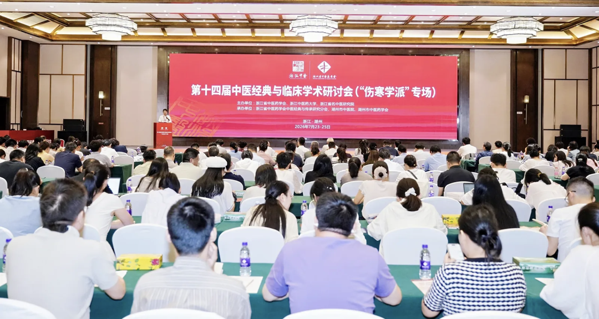

方证相应的学术魅力 \-\-整理黄煌老师的讲稿

公众号名称：陈丽娟中医工作室

作者名称：刘烨、杏林小花

发布时间：2026\-07\-28 23:18

近日，第十四届中医经典临床学术研讨会在浙江湖州举办，本次研讨会以“浙派中医，伤寒学派”传承创新为主题，汇聚了全国各地伤寒学术领域的名家学者与临床从业者，我作为一名青年中医学习者，有幸踏入这场中医学术盛宴，近距离感受中医经典传承的热度与创新的活力，而最让我心潮澎湃的一幕，莫过于黄煌老师步入会场的那个瞬间。

那天会场座无虚席，不知是谁先认出了门口的身影，紧接着，雷鸣般的掌声从第一排开始，迅速蔓延到整个会场，裹着所有参会者对黄师由衷的敬重与期待，我认真聆听恩师黄煌教授讲课《方证相应的学术魅力》并用心整理出来。

黄煌老师：各位临床医生们，刚才我听了王庆国国医大师以及范永升校长的报告，非常高兴，我们都有很多学术上的共鸣。接下来我就沿着范校长提到的朱肱、柯韵伯两位伤寒大家的基本学术思想——方证相应，或者方证相合，来谈谈我的体会，题目就是方证相应的学术魅力。

你们到成都，一定要去看一看都江堰，这是一个距今已经2282年的古代水利工程，也是目前世界上唯一仍在使用的中国古代杰出水利工程。它不像葛洲坝那样用大坝阻挡洪水，而是实现了枯水期保证川东平原灌溉、洪水期顺利泄洪的平衡，更巧妙的是它还能利用水自身的力量实现自动排沙。这个工程了不得，是世界唯一，更是我们中国人的骄傲。

讲到都江堰，我就想到《伤寒论》，二者历史差不多。《伤寒杂病论》距今1800多年，但里面的经方，历史恐怕要两三千年甚至更久远。这本书也是一本奇书，至今依然是每个中医人必读的书，现在还有专门研究伤寒论的教授、硕士和博士。我的临床也离不开这本书，刚才我还在手机APP上翻看《伤寒论》和《金匮要略》，这两部杰作，都诞生于距今2000年前。

我今天讲的经方方证相应，内容都源于这本千年奇书《伤寒论》。方证，是经方医学的灵魂，我是这么认识的：一棵草，有证就是药物，无证只能叫植物；几味药，有证就是方，没有证只能是一堆药。所以方必有证，有证才能成方，经方就是有方证的古方。

朱肱对方证相应有杰出贡献，他首先提出了“药证”的概念，其实药证就是方证，所谓“药症者，药方前有证也，如某方治某病是也”。他把方证相应总结为药和证相应、药和病相应，对应准确，临床使用自然就有疗效。

柯韵伯则把方证相应说得更明白透彻，他在《伤寒来苏集》中说“仲景之方，因证而设，见此症便与此方，是仲景活法”，这是对张仲景灵活辨证论治方法的精准概括。但我们不要把辨证论治看得灵活无边，恰恰是“没有规矩不成方圆”，临床变化虽多，用药可以灵活，但核心底层的方证相应非常严谨，讲究一一对应。

清代无锡名医王旭高说“有是证，则用是方，为千古心法”，这句话和朱肱、柯韵伯一脉相承。胡希恕先生的话大家也非常熟悉，他说“辨方证是辨证的尖端”，辨八纲、辨六经还没有到底，最后一定要辨到方证才行。刘渡舟先生晚年写了《方证相对论》，里面有一句话振聋发聩：“要想穿入伤寒论这堵墙，必须从方证的大门而入”，作为伤寒论研究大家，他给我们指明了学习伤寒论的底层逻辑，方证就是我们进入伤寒论世界的大门。

我们每个临床医生都知道，中医临床经常有同病异治和异病同治，这是非常奇特的现象，很多西医大夫可能不大理解，其实同病异治和异病同治的背后核心，就是方证相应这个灵魂和根本。同样的病，见到不同的方证，当然要用不同的治疗；不同的病，但出现相同的方证，我们自然用同一张方治疗，在经方医学的逻辑下，这是非常简单的道理。下面我想通过具体例子来说明方证相应的魅力和重要性，先说说同病异治。

我拿更年期综合征举例，这是社区临床工作者经常碰到的常见病多发病，同病异治在更年期综合征上有充分体现，既不是像西医那样简单用雌激素替补，也不是一概用黄连阿胶汤加味一张方解决。

在经方医学看来，我临床治疗更年期综合征的选方非常多，核心不是看病，而是看这个人：__桂枝加龙骨牡蛎汤__，我经常用来治疗更年期综合征患者，他们的特征是烘热出汗、睡眠障碍、乱梦纷纭，甚至经常出现性梦；这类患者往往皮肤白、消瘦，大多数是女性，触摸腹部会发现脐跳明显，也就是腹主动脉搏动感明显，脉象浮，张仲景用“失精家”来描述这种体质，失精家不止见于男性，很多更年期女性也属于这一类型。

__黄连阿胶汤__我也常用，多用于红唇美女，出现月经紊乱稀发，伴随严重睡眠障碍、烦躁不安，月经量少、皮肤干燥，嘴唇血红甚至开裂，反复口腔溃疡，多发皮疹皮炎，属于阴虚火旺证，我用黄连阿胶汤原方，或加生地、甘草。

__酸枣仁汤__治疗“虚劳虚烦不得眠”，这种情况在更年期综合征中也比较多见，多见于常年操劳的中老年女性，表现为絮絮叨叨、恍恍惚惚、睡不好觉，全身多处不适但查不出器质性病变，嘴唇干红，可以用酸枣仁汤，甚至合上甘麦大枣汤。我常说，如果祥林嫂患上更年期综合征，甘麦大枣汤恐怕就是最合适的选择。

__温经汤__是张仲景《金匮要略》中用来治疗50岁左右更年期女性病症的方剂，原文条文中张仲景清晰描绘了这类患者的形象，抓住两个核心点：一是手掌发热，同时干燥开裂、经常起毛刺；二是唇口干燥，嘴唇干瘪没有血色，部分患者还会出现反复下利，日久导致体型消瘦憔悴、脂肪减少，少腹不适，也就是“少腹里急”，可伴随小腹胀坠、阴道干涩、肛门下坠等表现，这种情况就应该用温经汤治疗。

__真武汤 __我也用来治疗更年期综合征，多见于合并甲减的患者，不少更年期女性突然发胖、停经，脸变大，精神困顿不想活动，下肢容易水肿，舌头胖大，伴随头晕，这就是阳虚水泛证，可以用真武汤治疗，有时候我还会将真武汤和桂枝龙骨牡蛎汤合用。

__柴胡桂枝干姜汤 __是一张好的抗焦虑方，我经常用来治疗有严重焦虑症状的更年期女性，这类患者外表看上去没有大问题，但特别容易激惹，一点小事就脸红心慌出汗，一紧张就拉肚子，经常口干但喝水不解渴，属于交感神经兴奋的焦虑状态，多见面红、脐跳明显、心跳偏快，补补不得、攻攻不得，用柴胡桂枝干姜汤就是不错的选择。

当然还有大柴胡汤、柴胡加龙骨牡蛎汤、麻黄附子细辛汤等等都有应用的机会，没有一张专方，关键是看患有更年期综合征这个人是什么证。我给大家举几个具体案例：

第一例，一位女性绝经两年后出现烘热出汗，每1小时发作一次，每次持续2～3分钟，出汗后浑身发冷，属于汗出不分的自汗证，同时夜间多梦乱梦，患者明显焦虑，眨眼频繁，脐跳明显，脉象空弦，我用桂枝加龙骨牡蛎汤，加茯苓定悸抗焦虑，因为患者容易哭泣、喜悲伤欲哭，合甘麦大枣汤加百合，用药后烘热出汗明显好转，整体状况改善，患者告诉我又重新喜欢吹葫芦丝了，情绪得到很好调整，加味是需要的，但一定要小心，按照张仲景的原方加减方法，我们用起来就比较轻松。

第二例是温经汤的患者，这位女性40岁就停经了，到50岁以后消瘦更严重，出现阴道干涩、房事不适，同时有原文提到的“下利数十日不止”、反复腹泻、夜尿频，符合少腹拘急的表现，患者整体非常憔悴干枯，就像一朵蔫了的玫瑰，我用《金匮要略》原方温经汤，仅加了一味红枣改善口感，用药没多久患者体重就开始增加，脸色逐渐红润，夜尿从原来的6～7次明显减少，食欲增加，仅出现轻度小腹疼痛，我让她继续原方服用三个月，三个月后患者复诊，兴奋地说体重从原来的44kg增加到52kg，恢复了正常的脂肪量，阴道干涩的情况明显改善，原本像枯草一样的头发也恢复了光泽。

第三例真武汤的应用，阳虚型更年期多表现为肥胖、脸变大、有浮肿貌、体型胖大、脉搏沉缓，核心特点是体重总是减不下来，虽然控制饮食、坚持运动，依然没有效果，这就是阳虚水停，我用真武汤原方，只有五味药，经方大多药味在12味以下，不要小看五味药，五药相合如握指为拳，力量集中。没有生姜可以用干姜替代，用药后患者疲劳感减轻，能爬楼了，腿有力了，头不晕了，体重还下降了7～8斤。所以减肥不是一定要吃荷叶、山楂，有的需要温阳利水，水湿排出去了，人自然就轻松了。

酸枣仁汤合百合地黄汤、甘麦大枣汤，我也经常用来治疗情绪失常的更年期患者，这几个方子合用味道很好，甘麦大枣汤甚至可以做成面包，做成食疗产品，经方很多都是从厨房走出来的，口感很不错。

还有一个最新的案例，一位更年期焦虑的女性患者，用的是柴胡桂枝干姜汤，患者月经期紊乱一年多，紧张不安心慌，严重到不喜欢去人多的地方，坐高铁都会紧张，一紧张就能听到自己轰隆的心跳声，不能见光，到商场看到反光就觉得脑子轰的一声，还一紧张就拉肚子，属于肠易激综合征，口干是交感神经兴奋导致唾液分泌减少，容易出汗，特征是脸发红，这种红不是实火，是紧张焦虑导致的，我用柴胡桂枝干姜汤加百合知母汤、茯苓，用药后症状明显缓解，能够安心做事，手麻也消失了。

讲完成同病异治，再讲讲异病同治，这也是临床上非常多见的现象，相关案例非常多，大柴胡汤、五苓散、肾气丸都是非常典型的能够异病同治的经方，今天我就以柴胡桂枝汤为主来讲讲我的经验，刚才王庆国大师也讲了柴胡桂枝汤，用得非常好，我也谈谈我的使用体会。

柴胡桂枝汤主治的病症范围非常广，很多疾病在西医看来完全不相关，但只要方证对应，我们都能用同一张方治疗。 首先它可以用来治疗发热性疾病、感染性疾病以及病毒性疾病，比如流感，南方多见的登革热，欧美夏季多见的莱姆病，我国野外垂钓、户外工作者容易碰到的恙虫病，还有疟疾等，都可以用柴胡桂枝汤作为基础方治疗。 这类疾病多出现发热、头痛，有的出现疱疹、皮损，有的出现腹腔淋巴结肿大或者肝脾肿大，都可以使用，流行性出血热早期也可以用。

现在发热性疾病我们临床碰得不多，但一些自身免疫性疾病，比如风湿性关节炎、系统性红斑狼疮、SAPHO综合征，这种既有皮损又有关节骨损害的西医综合征，用这张方效果也不错。还有一些以腹痛为主诉的疾病，比如肠易激综合征、胆石症、小儿不明原因腹痛，用柴胡桂枝汤也有非常不错的效果，甚至抽搐型的腹型癫痫，柴胡桂枝汤也有不错的效果，因为张仲景在《金匮要略》中说得非常明白，“心腹卒中痛”，就是突然发作的心腹间疼痛，本方就能治疗。我们还可以把它用来治疗很多神经痛，比如带状疱疹后遗症神经痛、女性常见偏头痛、肋间神经痛等等，都可以考虑使用。

这张方还能够治疗过敏性疾病，比如比较难缠的花粉症、过敏性鼻炎、过敏性紫癜，甚至一些原因不明的皮肤病，都可以考虑使用，所以这首方的使用范围非常广，适用患者的特征是病程较长，因为小柴胡汤本来就治疗往来寒热，适合反复发作的疾病，而且体表症状比较多，也就是外证未去，表现为各种皮损，患者一般多有抑郁倾向。

我也举几个具体案例：第一个案例是2024年11月份我接诊的一位年轻姑娘，反复发烧，用了抗生素、激素仍然反复发作，长期用抗生素导致免疫功能更差，用激素后体型也改变了，最后诊断是慢性多发灶性骨髓炎，属于涉及免疫机制的模糊诊断，患者除了发烧，还有胃痛、皮疹，根据张仲景原文的记载，我用柴胡桂枝汤原方，参用生晒参，柴胡用量15g。服药以后患者情况就好转，发烧次数减少，服药期间只发作两次，体温不超过38℃，还能自然退烧，关节痛也明显减轻，泼尼松逐步减量，到2025年来复诊的时候一直没有再发烧，泼尼松已经完全停掉了，我用的就是原方9味药，原方本身就是一个完美组合，小柴胡汤和桂枝汤主治都非常宽泛，所以这张方是强强联合，我们中医人一定要学会用这张方。按照南京中医药大学老一辈胡翘武先生的说法，这两张方合用不一定受六经的制约，只要见到对应方证就可以用。

第二个案例是以疼痛为表现，一位男性患者臀部疼痛不能坐下，一坐就痛，不是坐骨神经痛，检查下来是双侧髋关节少量积液，诊断为抗磷脂抗体综合征，这种病一般女性多见，患者当时疼痛难忍，体重下降消瘦，我看患者消瘦贫血，身体疼痛久治不愈，就用了柴胡桂枝汤原方9味药，用药以后情况明显好转，这张方对于久治不愈的身痛，包括关节痛、神经痛、肌肉痛，患者又消瘦的，效果很好。

第三个是皮损型的案例，柴胡桂枝汤能治疗很多皮肤病，尤其是病毒性或者免疫性、感染性的皮肤病，效果非常好，一个小孩子患者用了柴胡桂枝汤以后好得非常快，因为孩子大便干结，我把白芍用量翻倍，实际上变成了柴胡桂枝汤加麦芽糖，类似小建中汤的结构，对于消瘦、经常肚子痛、大便秘结的免疫性皮肤病，柴胡桂枝汤是不错的选择。

《伤寒论》对柴胡桂枝汤的描述比较简单，只是描绘了发热性疾病过程中柴胡桂枝汤证的表现，但实际上我们从原文可以推导，患者除了发热，还可以出现关节疼痛，“心下支结”就是腹腔内淋巴结肿大或者肝脾肿大，“外证未去”就是有皮疹，可能是红斑、疱疹等各种皮损；《金匮要略》则提到了它治疗慢性病慢性腹痛的应用，所以柴胡桂枝汤本身就是“一证多型”，这是经方方证中常见的类型，桂枝汤、小柴胡汤、真武汤等很多经方都有这个特点，所以这些方子非常重要，我们要好好理解。

一般来说，这首方的使用还要考虑体质问题，异病同治很多时候就是因为体质相同，柴胡桂枝汤适用的体质，一般是面黄体瘦、有抑郁倾向，脸上没有光泽，因为长期疾病消耗大多消瘦，甚至有轻度贫血，表情很重要，这类患者多表情淡漠疲倦、情绪低落，很多食欲不振，有抑郁倾向，同时怕风怕冷、喜欢厚衣，经常有神经痛、肌肉痛、关节痛，或者有淋巴结肿大，符合这些特征，不管是什么病都可以用，所以它有很多类型：身痛型、腹痛型、皮损型、发热型、过敏型等等，在我们看来其实就是一种病，就是柴胡桂枝汤综合征，这是我们中医总结的综合征，有这个综合征我们就有对应的治疗办法，很多西医说的综合征没有好的治疗方法，我们用经方往往能取得不错的效果。

因为今天时间关系，最后我再给大家强调一下关于方证相应的几个核心问题：

首先，方证是什么？经方的方证不属于某种特定疾病，而是疾病加上个体差异形成的独立临床诊疗单元，是经方医学特有的概念。我们苏南有句老话说得好：“方对症，喝口汤，不对症，用船装”，意思就是方药对症，哪怕喝一口汤都有效，不对症，哪怕用船装来也没用，只有方证对应，才能保证用药的有效与安全，这是中医精准用药的体现，方是钥匙，证是锁，方证必须相应，这是中医独有的核心要点。

第二，方证相应是什么？方证是在疾病过程中出现的、稍纵即逝的、有利于扭转病势促进康复的关键性时间窗口，方证就是时机，严格来讲就是病机，就像战场上的战机，见机行事，机不可失，时不再来；就像烹饪大师眼中的火候，和我们说的方证是一回事，它是动态的，不是凝固的，因为疾病在变化，体质在变化，方证自然也会变化。

第三，我们今天倡言的经方，绝不仅仅是一张张千古名方，而是一套根植于《伤寒论》《金匮要略》这两部汉唐经典的经方医学体系，这个问题现在越来越引起大家的关注。我们提倡经方，也不是要在中医学之外另起炉灶，而是对中医学中那部分最古老、最规范、最富含临床智慧的学术内容，做溯源和深根，重视经方方证，就是对前人实践经验的重视。

我们的经方从哪里来？不是靠头脑拍出来的，也不是靠理论推导出来的，是无数前人在人体身上试出来的特定药物组合，所以遵从经方，是中医人起码的科学态度。现在很多方子随意组合，我不否认你的思路可能正确，但问题是这些方子没有经过长时间的临床验证，安全性有效性都打折扣。

在这里我还希望大家记住叶橘泉老先生，他是湖州人，是江苏省中医院的创始者，也是南京中医学院第一任副校长，是著名的经方大家，他对方证学提出了很多精辟的认识，但很多人没有把他的观点放在心上。他说：“方证学是仲景学术的核心，仲景之所以以方明证，是便于后人学习辨证论治的捷径。”我们一直讲辨证论治，但很多人学得并不好，其实从方证入手，就是学习辨证论治的捷径，就是进入中医临床的大门。“方证相合，既便于青年人学习，又便于推广普及，群众对振兴中医不无裨益”，说的非常清楚了，老先生这句话是上个世纪70年代说的，如果整个中医学那时候就按照他的思路走，我们中医可能会更加辉煌。

好，谢谢大家！

